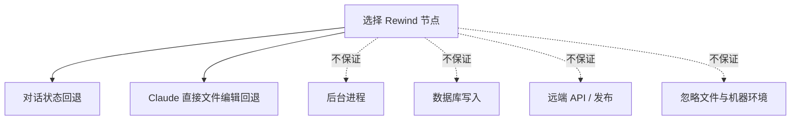

# Claude Code /powerup：命令状态、上下文与可恢复执行

- 原文：[Claude Code /powerup 教程：18 个官方互动课程全解析](https://xiaolinnote.com/claudecode/basics/cc_powerup.html)
- 一句话结论：交互命令真正难的不是记住快捷键，而是判断它改变了哪一层状态，以及 Rewind、Resume、Git 和补偿机制分别能恢复什么。
- 版本/证据边界：产品行为按原网页（2026-09-11 读取）整理；原文称 `/powerup` 自 Claude Code v2.1.90 起提供，但本文未在本机验证版本、套餐或界面。当前仓库没有证据表明安装或运行了 Claude CLI；代码结论只来自两份离线参考实现及其单测。

## 1. 先把产品行为与工程原理拆开

| 层次 | 本文讨论对象 | 证据 | 边界 |
| --- | --- | --- | --- |
| Claude Code 产品行为 | `/powerup`、`/rewind`、`/tasks`、`/compact`、Resume 等 | 原网页 | 需按实际安装版本复核 |
| 可迁移原理 | 显式状态、最小权限、Checkpoint、幂等、补偿 | 通用 Agent/Harness 设计 | 不依赖某个 CLI 名称 |
| 仓库已实现 | 工具审批、Call ID 幂等、预算、Gate、原子替换式 Checkpoint | Python 代码与单测 | 单进程离线教学实现 |
| 仓库未实现 | Claude 会话时间线、后台任务管理器、Git 事务、外部补偿 | 代码中不存在 | 不能从文章反推已具备 |

原文的课程还覆盖 `@` 文件引用、工作模式、CLAUDE.md、MCP、Skill、Hook、Subagent、远程控制以及模型/effort。本文不逐项复述，而是追踪命令对状态的影响；基础循环可对照 [01_claude_code_basics.md](01_claude_code_basics.md)。

## 2. 命令不是一类东西：状态影响矩阵

| 操作 | 主要读取/改变 | 是否触碰工作区 | 是否可能产生外部副作用 |
| --- | --- | --- | --- |
| `/context` | 读取上下文占用 | 否 | 否 |
| `/compact` | 用摘要替换部分会话历史 | 通常否 | 否，但信息可能丢失 |
| `/clear` | 清空当前对话上下文 | 否 | 不会撤销既有动作 |
| `/rewind` 或双击 Esc | 按原文回退对话与 Claude 直接编辑 | 是 | 不能假定会撤销命令副作用 |
| 后台执行、`/tasks` | 创建/观察进程任务状态 | 可能 | 构建、安装、迁移都可能写入环境 |
| `--resume`、`--continue` | 恢复已保存的产品会话 | 不等于恢复环境 | 旧任务的外部状态可能已变化 |
| `/model`、`/effort` | 改变模型或推理配置 | 否 | 改变延迟、成本与输出分布 |

因此，“撤销上一轮”至少要追问：撤销聊天、文件、Git 索引、进程、数据库，还是远端 API？只说“回滚”没有可验证语义。

## 3. 上下文维护：观察、压缩、清空

原文将 `/context` 用于观察占用，`/compact` 用于继续同一任务时压缩历史，`/clear` 用于切换无关任务。可迁移的决策规则是：

- **观察不改状态**：先看上下文和任务进度，再决定是否压缩。
- **压缩是有损编码**：摘要应保留目标、禁止项、已改文件、失败证据、未决副作用和下一条验证命令。
- **清空不是回滚**：它只移除模型可见历史；文件、进程和远端写入仍然存在。
- **稳定事实外置**：规则放版本化文件，运行进度放结构化 Checkpoint，测试结果可复现，不把聊天记录当唯一事实源。

```mermaid
flowchart LR
	A[完整会话] --> B{/context 观察}
	B -->|同一目标且信息过多| C[/compact 摘要]
	B -->|目标完全变化| D[/clear 新上下文]
	C --> E[核对目标 diff 测试 副作用]
	D --> E
	E --> F[继续执行]
```

`/compact` 后最危险的不是“忘了闲聊”，而是把未完成动作压成“基本完成”。恢复工作前应重新读取真实代码、`git diff` 和测试输出。

## 4. Rewind 的边界：时间线不是事务

按原文，双击 Esc 或 `/rewind` 可选择较早节点，并同时回退对话上下文与 Claude 直接创建或编辑的文件。原文也明确提醒：命令生成的依赖、锁文件等不一定纳入该回退。



这揭示了两个不同概念：**历史导航**恢复产品掌握的状态，**事务回滚**恢复一个明确定义的资源集合。没有资源清单、提交协议和补偿动作，就不能把前者称为后者。

## 5. Git 是重要边界，但不是万能撤销

Git 能可靠比较和恢复已跟踪文件，也能用提交建立人工可审查的里程碑；它看不到数据库行、云资源、已发消息、正在运行的进程，也通常不追踪 `.gitignore` 中的产物。

| 副作用 | Git 可恢复？ | 更合适的保障 |
| --- | --- | --- |
| 已跟踪源码修改 | 通常可以 | 小提交、分支、diff 审查 |
| 未跟踪/忽略的构建产物 | 不完整 | 清理脚本、可重建环境 |
| 依赖安装和系统配置 | 不完整 | 锁文件、容器/虚拟环境 |
| 数据库写入 | 不可以 | 事务、迁移回滚、备份 |
| 发布、邮件、工单评论 | 不可以 | 幂等键、审批、补偿 API |
| 长运行进程 | 不可以 | PID/任务句柄、取消与超时 |

不要把原文示例中的丢弃命令机械复制到有未提交工作的仓库。先检查状态和 diff，再选择恢复目标；破坏性 Git 命令本身也是副作用。

## 6. 后台任务：并发扩大了状态空间

原文称可让命令在后台执行并用 `/tasks` 查看状态；页面同时出现自然语言请求后台运行和命令末尾 `&` 的描述，具体输入形式应以实际版本帮助为准。本文不声称后台任务能跨终端关闭继续存活。

后台化只是不阻塞对话，并没有让任务更安全：

1. 记录命令、工作目录、环境摘要、开始时间和任务 ID。
2. 区分“已启动”“进程退出”“产物验证通过”，不能把启动成功当完成。
3. 为可取消任务保留句柄，为不可取消副作用配置审批和补偿。
4. 并发任务若写同一目录、锁文件或数据库，必须串行化或隔离。
5. 恢复会话时重新查询任务与产物，不依赖旧聊天里的“仍在运行”。

[tooling_capabilities_reference.py](../xiaolinnote_tools_analysis/examples/tooling_capabilities_reference.py) 的 `ToolRuntime` 已实现参数 Schema、危险工具审批、超时返回和独立调用的并行执行。测试 `test_timeout_returns_without_waiting_for_worker_shutdown` 只证明调用方快速得到超时结果；它没有证明已经运行的函数被终止，因此“超时”也不等于“副作用取消”。

## 7. Resume 与 Checkpoint：恢复前必须重新校验

原文称 `claude --resume` 可选择历史会话，`claude --continue`/`-c` 直接继续最近会话。产品会话恢复与运行时 Checkpoint 不是一回事：前者恢复交流历史，后者应恢复结构化目标、进度和观察。

[agent_engineering_reference.py](../xiaolinnote_agent_engineering_analysis/examples/agent_engineering_reference.py) 中：

- `LoopState` 显式保存 `run_id`、`goal`、迭代、失败、预算、观察、Gate 证据和停止原因。
- `AtomicCheckpointStore.save` 先写 `.tmp`，再以 `Path.replace` 替换目标 JSON。
- `LoopHarness.run` 恢复时校验 `run_id` 与 `goal`；终结状态不会被偷偷重跑。
- `budget_exhausted` 可用新预算继续；`completed/failed/blocked/escalated` 被视为终结状态。

单测 `test_checkpoint_can_resume_in_a_fresh_context` 证明一轮预算耗尽后能从观察继续并在第二轮通过 Gate。它没有证明代码版本、依赖、Git 分支或外部资源与保存时一致，也没有文件锁、`fsync`、Schema 迁移和分布式一致性。

## 8. 副作用控制的最小实现

下面直接使用仓库类展示“审批 + Call ID 幂等”，不连接 Claude 服务：

```python
from xiaolinnote_agent_engineering_analysis.examples.agent_engineering_reference import (
    ControlledToolRegistry, ToolDefinition,
)

published = []
tools = ControlledToolRegistry()
tools.register(
    ToolDefinition("publish", dangerous=True, idempotent=True),
    lambda version: published.append(version) or {"version": version},
)

denied = tools.execute(call_id="release-42", name="publish", arguments={"version": "1.2.0"})
first = tools.execute(
    call_id="release-42", name="publish", arguments={"version": "1.2.0"},
    approved_tools={"publish"},
)
again = tools.execute(
    call_id="release-42", name="publish", arguments={"version": "9.9.9"},
    approved_tools={"publish"},
)
assert not denied.ok and first == again and published == ["1.2.0"]
```

`test_dangerous_tool_requires_approval_and_call_id_is_idempotent` 覆盖了同样行为。限制也要写清：缓存只按 Call ID，不绑定工具名和参数摘要；进程重启后缓存丢失；非幂等外部系统仍需自身的幂等键、状态查询和补偿动作。

## 9. 面试问答

**Q1：`/compact` 与 `/clear` 的核心差异？**  
A：前者为同一目标有损压缩历史，后者开始新的对话上下文；两者都不会撤销环境副作用。

**Q2：为什么 Rewind 不能等同事务回滚？**  
A：它按产品掌握的时间线恢复对话和直接编辑，未必覆盖命令、数据库、远端 API 与后台进程。

**Q3：Resume 后第一件事应该做什么？**  
A：核对目标、分支、diff、依赖、后台任务、外部资源和最窄验证命令，而不是直接相信旧摘要。

**Q4：Git 能覆盖哪些恢复边界？**  
A：主要覆盖仓库中已跟踪内容；机器环境、忽略产物、数据库和远端系统需要各自机制。

**Q5：后台任务“超时返回”为什么不等于“已取消”？**  
A：调用方可以停止等待，但工作线程或外部进程可能继续运行并产生副作用，必须有真实取消协议和状态查询。

**Q6：Call ID 幂等解决什么问题？**  
A：避免因重试重复执行同一逻辑动作；生产实现还应持久化并绑定参数摘要及业务结果。

**Q7：仓库中的 Checkpoint 与 Claude Code Resume 相同吗？**  
A：不同。前者是教学 Harness 的 JSON 运行状态，后者是原文描述的产品会话恢复；仓库没有实现 Claude 会话存档。

## 10. 复习清单

- 能把命令归入会话、文件、进程、仓库、外部系统五类状态。
- 能说明 `/context`、`/compact`、`/clear` 各自改变什么、不改变什么。
- 能画出 Rewind、Git、事务、幂等键和补偿动作的恢复边界。
- 能解释后台任务的启动、退出、验收与取消为何是四个不同状态。
- 能用两项真实测试说明 Checkpoint 恢复与工具超时已经证明和尚未证明的内容。
