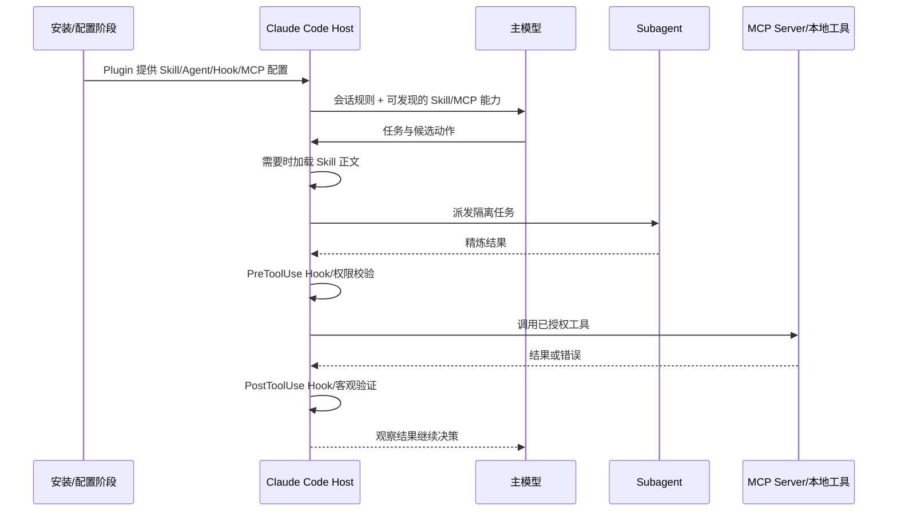

# Claude Code 工程化：六件套的选择、生命周期与信任边界

- 原文：[Claude Code 工程化指南：CLAUDE.md、Skills、Subagents、MCP、Hooks、Plugins 一篇讲透](https://xiaolinnote.com/claudecode/basics/cc_engineering.html)
- 一句话结论：六件套不是六种“更强提示词”，而是常驻规则、按需知识、隔离执行、外部能力、确定性事件和分发治理六个不同控制面。
- 版本/证据边界：Claude Code 的目录、命令和加载行为按原网页（2026-09-11 读取）概括，可能随产品版本变化；仓库没有证明安装 Claude CLI。本文只把两份 Python 参考实现及 23 项相关单测覆盖到的行为写成“已实现”，其余均标为产品描述或可迁移设计。

## 1. 先建立三层事实模型

| 层次 | 可以下的结论 | 不可以下的结论 |
| --- | --- | --- |
| 产品行为 | 原文描述 Claude Code 如何加载 CLAUDE.md、Skill、Subagent、MCP、Hook、Plugin | 不能据此声称本机已安装或当前版本完全一致 |
| 可迁移原理 | 常驻与按需上下文分离、执行最小权限、强制 Gate、包供应链治理 | 不能把某个文件名当跨产品标准 |
| 当前仓库 | 离线实现 Skill 渐进加载、MCP 形状、工具审批、状态循环与测试 | 没有 Claude Plugin、Hook 或 Subagent 运行时 |

六件套解决的是不同问题。若选错机制，常见结果是：把流程全塞进 CLAUDE.md、把硬安全要求写成自然语言、把简单工具调用拆成昂贵 Subagent，或为了一个现成 CLI 额外引入 MCP。

## 2. 六件套选择矩阵

| 机制 | 主要问题 | 何时进入运行时 | 提供什么 | 不提供什么 |
| --- | --- | --- | --- | --- |
| CLAUDE.md | 每次会话都要知道的项目约束 | 根规则随会话，子目录规则按原文在相关路径触发 | 默认背景与约定 | 确定性强制、外部能力 |
| Skill | 专项知识或 SOP 不应常驻 | 先暴露元数据，匹配任务后加载正文/资源 | 方法、模板、参考材料 | 独立上下文、额外权限 |
| Subagent | 搜索过程重、主上下文易污染 | 主 Agent 派发边界清晰的任务时 | 独立上下文、受限工具、汇总结果 | 自动正确、免费并行 |
| MCP | 需要发现并调用外部工具/资源 | Client 连接 Server 并发现能力时 | 标准化能力通道 | 业务流程、天然可信 |
| Hook | 某动作前后必须执行检查 | 生命周期事件匹配时 | 模型外的命令、拦截或后处理 | 语义理解、跨系统事务 |
| Plugin | 多项目/多人分发上述配置 | 安装、更新、启用时 | 打包、版本与分发 | 新的模型能力、自动安全审计 |

快速判断：要“每轮都知道”选 CLAUDE.md；要“用时再学”选 Skill；要“隔离上下文做事”选 Subagent；要“伸手访问系统”选 MCP；要“无论模型记不记得都执行”选 Hook；要“成套交付”选 Plugin。

## 3. 加载与执行生命周期

下面是按原文抽象的生命周期，不是对 Claude Code 内部源码的复刻：



这里有三条关键边界：**加载文本不等于授权执行**；**发现工具不等于允许调用**；**Subagent 返回结论不等于验证通过**。最终权限、超时、预算、审计和 Gate 都应由宿主控制。

## 4. CLAUDE.md 与 Skill：常驻规则对按需知识

CLAUDE.md 适合短而稳定的项目事实：真实命令、目录边界、硬约束和高价值坑点。Skill 适合 code review 清单、发布流程、迁移手册等“不是每次需要，但用时必须完整”的材料。

[tooling_capabilities_reference.py](../xiaolinnote_tools_analysis/examples/tooling_capabilities_reference.py) 的 `SkillCatalog` 精确体现三段式加载：

1. `scan()` 只解析每个 `SKILL.md` 的 `name`、`description` 和目录。
2. `load_instructions(name)` 被显式调用后才读取正文。
3. `read_asset` 读取辅助文件，并拒绝逃出 Skill 目录的路径。

```python
from pathlib import Path
from xiaolinnote_tools_analysis.examples.tooling_capabilities_reference import SkillCatalog

catalog = SkillCatalog(Path(".claude/skills"))
metadata = catalog.scan()                 # 发现阶段：只拿元数据
review_steps = catalog.load_instructions("code-review")  # 执行阶段：加载正文
template = catalog.read_asset("code-review", "report.md")
```

`test_skill_is_loaded_progressively_and_blocks_path_escape` 证明了元数据、正文、资源三步和路径逃逸阻断。它没有实现模型按语义自动选 Skill、YAML 完整规范、脚本执行或签名校验。

## 5. Subagent：隔离上下文，不是“多开一定更强”

原文把 Subagent 描述为独立上下文中的执行实例，适合全仓搜索、日志分析、专项审查等“过程重、结论轻”的任务。主会话只接收压缩结果，可降低中间输出污染，也允许互不依赖的任务并行。

不适合拆出的任务包括：高度依赖当前讨论隐含信息、需要频繁来回协商、共享同一可写资源，或结果无法独立验收。多个 Agent 还会引入重复上下文、冲突写入、路由错误和额外成本。

当前仓库**没有 Claude Code Subagent 实现**。[tooling_capabilities_reference.py](../xiaolinnote_tools_analysis/examples/tooling_capabilities_reference.py) 中 `AgentDirectory`、`AgentCard` 与 `A2ATaskStore` 演示的是 Agent 发现及 `submitted -> working -> completed/failed` 任务状态，不等同于产品 Subagent。

`test_agent_card_discovery_and_task_lifecycle` 证明按 Skill ID 发现、合法状态迁移和非法二次启动被拒；它没有证明上下文隔离、模型调用、并行写入控制或 Claude `/agents` 配置。

## 6. MCP：能力协议与权限控制必须分层

MCP 解决 Host/Client 如何发现并调用 Server 提供的 Tools、Resources、Prompts。Skill 说明“怎样做”，MCP 提供“能调用什么”；两者经常组合，但职责不能混淆。


仓库的 `McpServer` 是内存 JSON-RPC 2.0 形状骨架，处理 `tools/list`、`tools/call`、`resources/list/read`、`prompts/list/get`；`McpClient.discover_function_schemas` 把工具转成模型函数 Schema。`ToolRuntime` 在实际调用前做白名单、参数子集校验、危险操作审批和超时。

两项 MCP 测试证明工具发现/调用以及 Resource 与 Prompt 分离；四项 ToolRuntime 测试证明缺参拒绝、危险工具审批、并行结果保持输入顺序和超时快速返回。它们不证明官方 MCP 全协议兼容、网络传输、OAuth、租户隔离或运行中任务真正取消。

## 7. Hook：把“请记得”升级为确定性事件

自然语言规则由概率模型解释，不能承诺每次执行。原文将 Hook 放在工具调用前后等生命周期事件：调用前可拒绝危险路径，调用后可格式化或跑测试；事件命中时由宿主执行命令，而不是等模型主动想起。

Hook 仍不是绝对安全边界：脚本可能超时、解析错误、泄露 stdin 中的数据、被路径注入，多个 Hook 还可能互相改写产物。工程上至少要有：

- 精确 matcher 与最小输入，不把整段会话无条件传给脚本。
- 固定可审计的命令和依赖版本，避免运行临时下载的代码。
- 超时、输出上限、脱敏日志和明确的 fail-open/fail-closed 策略。
- Hook 后仍跑 CI/Gate；格式化成功不代表功能正确。

当前两份参考实现没有 Hook 注册或事件分发类。`ControlledToolRegistry` 和 `ToolRuntime` 的审批是相邻的确定性控制思想，但不能冒充产品 Hook。

## 8. Plugin、冲突与供应链

按原文，Plugin 是 Skills、Subagents、Hooks、MCP 配置等组件的分发容器，本身不增加推理能力。风险也随打包放大：Skill 可注入恶意指令，Subagent 可获过宽工具，Hook 可执行命令，MCP 可连接外部服务，更新还可能替换其中任一组件。

| 冲突/风险 | 典型表现 | 确定性治理 |
| --- | --- | --- |
| 规则冲突 | 全局与项目约定相反 | 单一事实源、冲突测试、定期删除旧规则 |
| Skill 冲突 | 描述重叠，加载了错误流程 | 唯一名称、清晰触发条件、显式选择 |
| Subagent 冲突 | 并行修改同一文件 | 只读优先、所有权分区、串行合并 |
| MCP 冲突 | 同名工具或权限过宽 | 命名空间、Schema、白名单、单次审批 |
| Hook 冲突 | 顺序依赖、反复改写 | 固定顺序、幂等脚本、事件测试 |
| Plugin 供应链 | 来源或更新含恶意命令 | 审查来源、固定版本/提交、隔离试装、最小权限 |

仓库当前状态必须精确描述：`SkillCatalog`、`McpServer/McpClient`、`ToolRuntime`、`ControlledToolRegistry`、`LoopHarness` 和 23 项相关测试真实存在；Claude CLAUDE.md 加载器、Subagent、Hook、Plugin/Marketplace、真实网络 MCP 与签名验证均未实现。

## 9. 面试问答

**Q1：CLAUDE.md 与 Skill 如何选择？**  
A：每次任务都需要的稳定约束放前者；低频、专项、正文较长的知识放后者按需加载。

**Q2：Skill 与 Subagent 的核心差异？**  
A：Skill 给执行者补充方法和材料；Subagent 另开执行上下文并返回结果，前者不天然隔离状态。

**Q3：MCP 与 Function Calling/工具运行时是什么关系？**  
A：MCP负责能力发现和传输形状；宿主仍需把能力暴露给模型，并完成 Schema、授权和实际执行。

**Q4：为什么硬约束不只写在 CLAUDE.md？**  
A：文本遵循是概率性的；安全边界应落到权限、Hook、类型、测试或 CI Gate。

**Q5：Plugin 为什么是供应链入口？**  
A：它能成套引入指令、可执行 Hook、外部连接和 Agent 权限，更新范围比单个提示文件更大。

**Q6：仓库的 A2A 任务能否证明 Claude Subagent？**  
A：不能；它只证明参考类的发现和状态迁移，二者协议、上下文与产品生命周期不同。

**Q7：如何处理六件套之间的冲突？**  
A：建立组件清单和单一事实源，用命名空间、最小权限、幂等事件与自动测试把冲突变成可观察失败。

## 10. 复习清单

- 能在六件套矩阵中为一个需求选择唯一主机制，并说明其他机制为何只是配合。
- 能画出安装、发现、按需加载、派发、调用、Hook 和 Gate 的生命周期。
- 能准确说出 `SkillCatalog`、`McpServer/McpClient`、`ToolRuntime` 及对应测试证明了什么。
- 能区分 Claude Subagent 与仓库 A2A Task，产品 Hook 与工具审批。
- 能列出 Plugin 引入的指令、执行、权限、外连和更新五类供应链风险。
