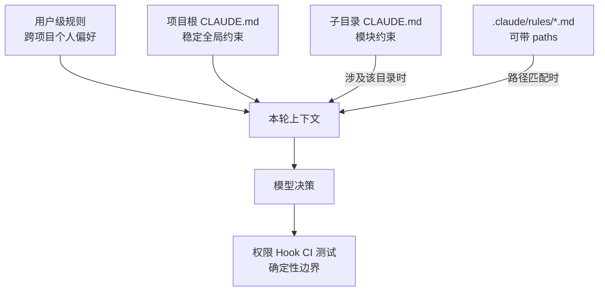
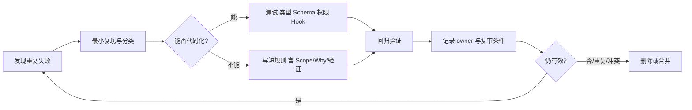

# CLAUDE.md 项目记忆：规则层级、作用域与维护工程

- 原文：[CLAUDE.md 指南：Claude Code 的项目记忆该怎么写？](https://xiaolinnote.com/claudecode/playbook/cc_claude_md.html)
- 一句话结论：CLAUDE.md 不是越长越好的知识库，而是进入模型上下文的高优先级规则索引；每条规则都应有明确作用域、Why、验证方式和退出生命周期。
- 版本/证据边界：Claude Code 的文件发现、路径规则和命令按原网页（2026-09-11 读取）整理，未在本机 Claude CLI 验证；原文引用的行数与遵循率数据属于第三方经验，不是当前仓库实验。仓库只实现了另一套离线 Markdown 工作区，不实现 CLAUDE.md 加载器。

## 1. “项目记忆”不是数据库记忆

CLAUDE.md 是普通 Markdown，但按原文会被 Claude Code 自动加入任务上下文。它更像 Agent 的入职手册：提供当前项目默认成立的事实和约束，而不是保存任意历史、保证永久记住，或替代 README、设计文档和密钥系统。

| 载体 | 主要读者 | 加载方式 | 适合内容 |
| --- | --- | --- | --- |
| README | 人类开发者 | 主动浏览 | 介绍、上手、贡献指南 |
| CLAUDE.md | 编程 Agent | 产品按作用域注入 | 稳定命令、边界、约定、坑点 |
| 专题文档 | 人与 Agent | 需要时读取 | 架构、API、长流程 |
| Checkpoint | 运行时 | 恢复时读取 | 目标、进度、观察、停止原因 |
| Secret Store | 授权进程 | 运行时按需取值 | Token、密码、证书私钥 |

产品行为是“Claude Code 识别这个文件”；可迁移原理是“为 Agent 提供短、版本化、可审查的默认上下文”。换一个工具，文件名和加载规则可能完全不同。

## 2. 规则层级与加载边界

原文描述了用户级、项目级、子目录级以及 `.claude/rules/` 模块化规则。不要简单记成“越深优先级越高”：同一上下文中的矛盾自然语言可能让模型任意取舍，可靠做法是消除冲突，而不是赌模型裁决。



- **用户级**：只放跨项目且真正稳定的个人偏好，不应覆盖团队安全规则。
- **项目根**：放全项目都需要的命令、目录地图和硬约束，适合纳入版本控制。
- **子目录**：前端、后端或遗留模块的局部规则，避免污染无关任务。
- **路径规则**：按 glob 为某类文件注入专题约束；语法与匹配行为需按实际版本验证。

## 3. 路径作用域：让相关规则在正确时间出现

原文给出的 `.claude/rules/` 文件可用 `paths` frontmatter 限定匹配路径。下面是产品配置示意，不代表当前仓库已经存在该文件：

```yaml
---
paths:
  - "tests/test_*reference.py"
---
# Reference tests
- 修改 reference 实现时同步更新对应 unittest。
- 先运行最窄测试文件；Why：更快定位行为回归，避免全套输出掩盖根因。
- 不用网络服务；Why：这些 reference 测试被设计为离线、可重复执行。
```

| 规则类型 | 推荐作用域 | 不推荐做法 |
| --- | --- | --- |
| 回复语言、个人格式偏好 | 用户级 | 在每个项目复制一遍 |
| 构建命令、仓库边界 | 项目根 | 散落在聊天历史 |
| 某模块框架约定 | 子目录 | 让全仓任务都加载 |
| 测试文件断言风格 | `paths` 规则 | 写成全局绝对禁令 |
| 长发布手册 | Skill/专题文档 | 全文塞进 CLAUDE.md |

作用域缩小能降低 token 和冲突，但 glob 写错会造成规则缺席或误加载。应准备代表性路径样例，检查哪些命中、哪些不命中。

## 4. 有效规则公式：动作、范围、Why、验证

一条可执行规则可以写成：

$$
Rule = Action + Scope + Why + Verification
$$

- **Action**：使用或禁止什么，避免“保持优雅”“注意质量”。
- **Scope**：适用于哪些目录、文件和任务，列出例外。
- **Why**：说明要保护的真实不变量，让模型遇到新情况时判断边界。
- **Verification**：给出可复制命令或可观察条件，避免自报完成。

例如：“不要修改已合入的 migration”仍可能过宽。更好的版本是：“`migrations/applied/` 只读；已执行 migration 的校验和被生产环境记录，修改会破坏升级一致性。新增变更请创建下一序号文件，并运行 migration 校验测试。”

Why 不是故事装饰，而是边界信息；但也不应粘贴事故报告。保留一行因果关系，详情链接到仓库中真实存在且受维护的文档。

## 5. 反例改写：从愿望变成可验证约束

| 反例 | 问题 | 改写 |
| --- | --- | --- |
| “代码要高质量” | 无判断标准 | “改动后运行对应 unittest；失败不得声称完成” |
| “尽量别动 core” | 范围与例外模糊 | “`core/` 只读；Why：冻结待下线。确需修改先请求批准” |
| “测试覆盖率希望 90%” | 愿望不等于现状 | “新增分支需测试；CI coverage gate 不得下降” |
| 复制 100 行架构说明 | 易过时、常驻成本高 | 写三行目录地图，详情指向受维护文档 |
| “使用合适命名” | 依赖猜测 | “测试名采用 `test_<behavior>`，表达被验证行为” |
| “不要泄露密钥” | 没有执行边界 | “禁止读取/提交密钥路径；扫描和权限 Gate 必须通过” |

原文提到 200 行与遵循率数字，应当作“规则膨胀需要测量”的信号，而不是跨项目硬阈值。更可靠指标是规则命中率、冲突数、上下文成本、重复违规和维护陈旧度。

## 6. 敏感信息：规则文件不是保险箱

CLAUDE.md 会进入模型上下文，项目级文件还可能被提交、Review、日志记录或分发。以下内容不应写入：API Token、密码、私钥、Cookie、真实客户数据、可直接访问的临时凭据，以及把多个公开片段组合后可越权的信息。

安全写法只保留接口，不保留值：

- 写“凭据来自环境变量 `SERVICE_TOKEN`”，不要写变量值。
- 写“生产操作必须走审批工具”，不要嵌入生产连接串。
- Secret Store 负责取值，权限层限制谁能取，日志层负责脱敏。
- `.gitignore` 只阻止 Git 跟踪，不阻止 Agent 读取；仍需文件权限、读取 deny 规则或沙箱。
- 示例、测试夹具和错误输出也要用假数据，避免“为了说明规则”复制真实秘密。

当前仓库的 `MarkdownAgentWorkspace._safe_file` 能阻止相对路径逃出工作区，但没有 Secret Store、内容脱敏、敏感路径 deny 或模型数据边界，不能据此声称敏感信息已受保护。

## 7. 维护生命周期：规则必须能出生也能退役

“Agent 错两次就加规则”是原文转述的实用启发，不是机械标准。先判断错误能否稳定复现，再选择最便宜且最确定的控制层。



维护 Review 至少检查：命令是否仍存在、目录是否改名、规则是否被 CI 取代、例外是否变成主流、两个层级是否冲突、规则是否夹带秘密。错误规则比缺失规则更危险，因为它会稳定诱导错误行为。

## 8. 当前仓库的精确映射

[agent_engineering_reference.py](../xiaolinnote_agent_engineering_analysis/examples/agent_engineering_reference.py) 的 `MarkdownAgentWorkspace` 是可迁移原理示例，不是 CLAUDE.md 实现：

- `CORE_FILES` 固定为 `SOUL.md`、`AGENTS.md`、`TOOLS.md`、`HEARTBEAT.md`、`MEMORY.md`。
- `build_context` 全量组合四个核心文件，按词项交集选相关 memory，并取最近 session。
- `max_characters` 超限时按固定比例截断且丢弃 session；这不是语义压缩。
- `_safe_file` 用解析后的父目录关系阻止逃逸；`remember` 去重完全相同行。

`test_context_uses_relevant_memory_and_recent_sessions` 证明查询 “Alice Python” 只选对应记忆并保留最近会话；`test_workspace_blocks_path_escape_and_deduplicates_memory` 证明去重与 `../secret.txt` 被拒。

[tooling_capabilities_reference.py](../xiaolinnote_tools_analysis/examples/tooling_capabilities_reference.py) 的 `SkillCatalog` 则证明“元数据常驻、正文/资源按需”的渐进披露。仓库没有用户/项目/子目录 CLAUDE.md 合并、`paths` glob、`@` import、`/init`、`/memory` 或规则冲突解析；这些只能作为产品行为讨论。

## 9. 面试问答

**Q1：CLAUDE.md 与 README 的本质差异？**  
A：README 面向人类主动浏览；CLAUDE.md 按产品规则进入 Agent 上下文，因此更短、更稳定且必须控制作用域。

**Q2：为什么规则要写 Why？**  
A：Why 暴露要保护的不变量，使模型能处理未枚举例外，而不是机械扩大禁令范围。

**Q3：路径作用域解决什么问题？**  
A：只为相关文件加载规则，减少 token、注意力稀释和跨模块冲突；代价是 glob 也需要测试。

**Q4：自然语言规则能否承担安全强制？**  
A：不能单独承担；应由权限、Schema、Hook、Secret Store、测试和 CI 提供确定性边界。

**Q5：什么时候应该删除规则？**  
A：约束失效、目录/命令变化、被确定性 Gate 替代、与上层重复或已产生冲突时。

**Q6：为什么 `.gitignore` 不能保护秘密不被 Agent 读取？**  
A：它只控制 Git 跟踪，不是文件访问控制；Agent 若有读取权限仍可能把内容带入上下文。

**Q7：`MarkdownAgentWorkspace` 是否证明仓库支持 CLAUDE.md？**  
A：不证明。它有自己的固定文件协议，只用于展示文件型上下文、相关记忆、截断和路径保护。

## 10. 复习清单

- 能区分用户级、项目级、子目录级和路径规则的作用域与加载成本。
- 能把模糊愿望改写为 Action、Scope、Why、Verification 四段规则。
- 能解释规则何时应升级为测试、权限、Hook 或 CI Gate。
- 能列出不应进入规则文件的敏感数据，并说明 `.gitignore` 的边界。
- 能准确复述 `MarkdownAgentWorkspace` 两项测试证明与未证明的行为。
