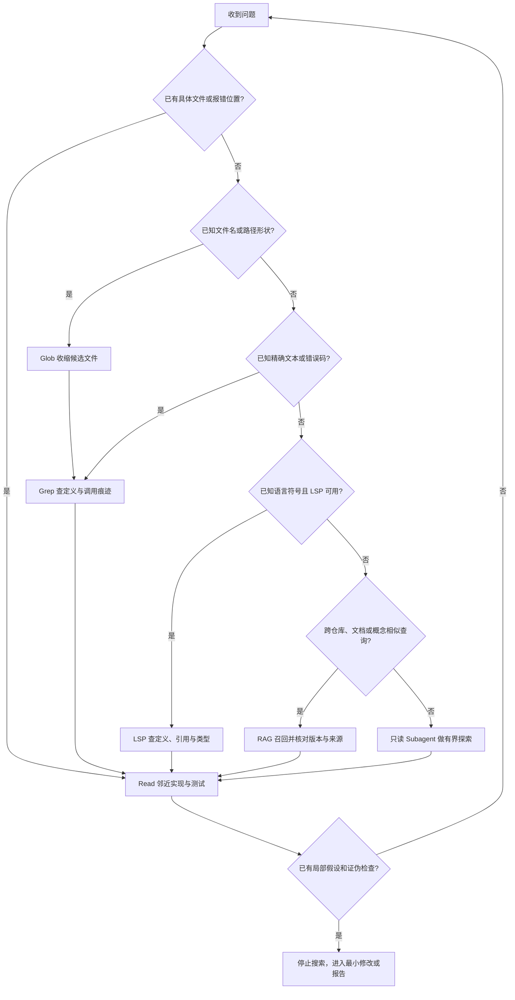

# Claude Code 大型代码库：Agentic Search 的决策、成本与边界

- 原文：[Claude Code 大型代码库实战：百万行代码怎么扛得住？](https://xiaolinnote.com/claudecode/playbook/cc_large_codebase.html)
- 一句话结论：大仓库搜索的关键不是把全库塞进上下文，而是从可验证锚点出发，在 Glob、Grep、Read、LSP、RAG 与 Subagent 之间逐级路由，并为每次扩展设停止条件。
- 证据/版本边界：Claude Code 产品行为按原文页面（2026-09-11 读取）整理，未在本仓库安装验证；搜索决策树属于本文归纳的方法；仓库事实只来自指定 Python 参考实现，当前仓库没有通用代码 LSP、代码向量索引或 Agentic Search 编排器。

## 1. 先分清产品、方法、仓库与未实现项

| 层次 | 本文陈述 | 证据 | 边界 |
| --- | --- | --- | --- |
| 产品 | 原文称 Claude Code 以实时文件搜索、LSP 和 Subagent 处理大仓库 | 原网页 | 版本与插件能力需现场复核 |
| 方法 | 先窄后宽、每轮用新证据决定下一步 | 本文决策模型 | 不是 Claude Code 私有算法 |
| 仓库事实 | 有 BM25、RRF、CRAG 与有界 Agentic RAG 参考实现 | `rag_capabilities_reference.py` | 面向文本 Chunk，不是代码搜索产品 |
| 未实现 | Glob/Grep/Read 统一调度、代码 LSP、向量库、Subagent 搜索 | 指定代码中不存在 | 不得由文章标题推断已经具备 |

原文关于“不开代码 RAG”的描述是产品路线说明，不等于 RAG 对代码永远无效；同样，本文的工具边界是工程建议，不是产品 API 保证。

## 2. 大仓库真正消耗的是什么

上下文窗口只决定一次能看多少，搜索策略决定先看什么。没有好起点时，目录扫描、宽泛关键字和重复读文件会共同制造三种浪费：工具往返、输入 Token 和错误路径上的推理。

一个有效起点至少包含以下一项：具体文件、符号、报错文本、失败测试、调用入口或业务模块。若用户只给“登录坏了”，第一轮目标应是找到控制登录结果的代码与最窄验证，而不是理解整个认证系统。

Agentic Search 的基本循环是 `定位 -> 读取 -> 形成假设 -> 用下一次查询证伪`。它的优势是读取当前工作树、冷启动低、命中可解释；代价是每轮选择都可能错，若没有预算和停止条件，就会退化为漫游。

## 3. 搜索决策树



树不是固定流水线。若调用点已知，LSP 可以先于 Grep；若 LSP 不支持当前语言，就降级到精确 Grep，再通过 Read 验证语义。

## 4. 六类能力的职责边界

| 能力 | 最适合的问题 | 不应承担 | 典型失败 |
| --- | --- | --- | --- |
| Glob | 哪些路径可能包含目标 | 判断代码语义 | 模式过宽，生成目录淹没结果 |
| Grep | 精确字面量、错误码、配置键、声明痕迹 | 区分同名符号身份 | 常见词产生海量假阳性 |
| Read | 核实控制流、类型、测试与局部上下文 | 一次吞下整仓库 | 读得太早或范围太大 |
| LSP | 定义、引用、实现、类型与重命名影响 | 搜索未被语言服务建模的文本 | 索引未就绪、生成代码或动态调用漏报 |
| RAG | 跨仓库语义、文档与历史知识召回 | 代替当前文件的最终核验 | 索引陈旧、Chunk 断裂、相似但非同一符号 |
| Subagent | 多模块调查、并行假设、隔离探索上下文 | 替代简单精确查询或最终证据 | 摘要丢失限制条件、重复调查、成本放大 |

Read 是落地证据层：无论候选来自哪种检索，最终结论都要回到当前版本的源码、配置或测试。Subagent 返回的是压缩过的发现，不是天然可信的事实。

## 5. Agentic Search 与 RAG 不是二选一

[rag_capabilities_reference.py](../xiaolinnote_rag_analysis/examples/rag_capabilities_reference.py) 精确实现了四块可复用思想：`BM25Index` 做词法检索，`reciprocal_rank_fusion` 融合排名，`CorrectiveRAG.retrieve` 按质量门选择本地、混合或回退源，`run_agentic_rag` 允许 Planner 逐轮产生新查询。

`run_agentic_rag` 还设置 `max_iterations`、重复查询阻断和 Chunk ID 去重。这证明“动态检索必须有界”，但它的 Retriever 只接收字符串并返回 `Chunk`；没有 AST、Git 版本、符号表、权限过滤或代码修改能力，不能写成“仓库已经实现 Claude Code 搜索”。

合理组合是：Grep/LSP 定位当前代码，RAG 补充跨仓库文档或历史背景，再用 Read 回到当前文件核验。代码高频变化时，RAG 结果还应携带提交版本和索引时间。

## 6. 建议的搜索请求契约

下面是方法级 Schema，不是仓库现有文件或产品接口：

```json
{
    "mode": "grep | glob | read | lsp | rag | subagent",
    "root": "调用方批准的搜索根目录",
    "query": "精确文本、符号或自然语言问题",
    "include": ["受限路径模式"],
    "max_results": 40,
    "max_bytes": 60000,
    "stop_when": "得到控制路径、邻近测试和可证伪假设",
    "evidence": ["path", "line", "revision", "reason"]
}
```

宿主应校验根目录、限制结果数与读取字节，并记录查询和命中。模型负责选择下一步，运行时负责权限、预算和审计；两者不能混成“模型想搜哪里就搜哪里”。

## 7. 成本模型与停止条件

可以把一次调查的成本近似写成：

$$C = C_{calls} + C_{context} + C_{index} + C_{review} + C_{wrong\ path}$$

| 成本 | 主要来源 | 控制手段 |
| --- | --- | --- |
| 调用成本 | 多轮搜索和子代理 | 合并同类查询、并行独立读取 |
| 上下文成本 | 大段文件与冗余命中 | 先路径/行号，后局部 Read |
| 索引成本 | Embedding、刷新、存储 | 增量版本、只索引适合语义检索的数据 |
| 复核成本 | 人工检查摘要与改动 | 每个结论保留源码位置和验证命令 |
| 错路成本 | 错起点导致连续误判 | 每轮都写可证伪假设和退出条件 |

便宜的停止条件是：已找到直接控制行为的实现、至少一个调用点或邻近测试、一个可能推翻当前理解的检查。继续“多看一点”若不会改变下一步，就应停止。

## 8. 常见失败案例与恢复

| 失败 | 可观察信号 | 恢复动作 |
| --- | --- | --- |
| 从仓库根目录漫游 | 连续读取互不相关模块 | 回到用户给出的报错、文件或业务入口 |
| Grep 查询太泛 | 数百个同名命中 | 加路径、语言、调用形状或精确字符串 |
| 把 Glob 当语义搜索 | 文件名像目标但内容无关 | 读取少量样本后改用 Grep/LSP |
| 盲信 LSP | 动态注册或生成代码没有引用 | 用文本搜索、构建产物和运行测试交叉验证 |
| 盲信 RAG | 命中旧名称或旧接口 | 核对 revision，再读当前工作树 |
| 过早派 Subagent | 简单定位却返回长摘要 | 主 Agent 直接做一到两次确定性查询 |
| Subagent 摘要失真 | 没有路径、范围或反例 | 要求 findings 携带证据和未决问题 |
| 搜索没有终点 | 查询不断改写但假设不变 | 命中迭代、结果或 Token 上限并升级 |

## 9. 面试问答

**Q1：为什么更大的上下文窗口不能根治大仓库问题？**  
A：仓库可能仍大于窗口，而且无差别注入会放大噪声、费用与注意力竞争；先找对证据比多装内容更重要。

**Q2：Grep 与 LSP 的本质差别是什么？**  
A：Grep 匹配文本，LSP 解析语言符号关系；前者覆盖广且透明，后者对定义和引用更精确但依赖语言服务质量。

**Q3：什么时候优先 RAG？**  
A：跨仓库、文档混合、概念相似或需要历史知识时；对正在修改的当前源码，仍要核对版本和原文件。

**Q4：什么时候值得派 Subagent？**  
A：调查跨多个模块、可并行验证多个假设，且探索输出能压缩为带路径证据的 findings 时。

**Q5：Agentic Search 最大风险是什么？**  
A：错误起点会让每轮决策继续扩散，工具调用和上下文同时增长，因此必须有预算与证伪检查。

**Q6：当前 RAG 参考实现证明了什么？**  
A：证明 BM25、RRF、三级路由和有界动态查询的控制逻辑可运行，不证明已建立代码向量库或 Claude Code 集成。

**Q7：如何判断搜索可以结束？**  
A：能指出控制行为的代码、相关调用或测试，并能说出一个会推翻假设的最窄检查时，就应转入修改或结论验证。

## 10. 复习清单

- 能从文件、符号、字面量、概念问题中选择第一种搜索能力。
- 能解释 Glob、Grep、Read、LSP、RAG 与 Subagent 的互补关系。
- 所有跨仓库或索引结论都携带版本、来源和当前文件复核。
- 搜索请求有根目录、结果数、字节数、迭代数和停止条件。
- Subagent 只回传带路径证据、反例和未决问题的 findings。
- 不把原文产品描述写成当前仓库已经实现的能力。
- 能用 `run_agentic_rag` 的循环上限和去重解释“动态但有界”。
- 找到局部可证伪假设后停止探索，进入最窄验证。
