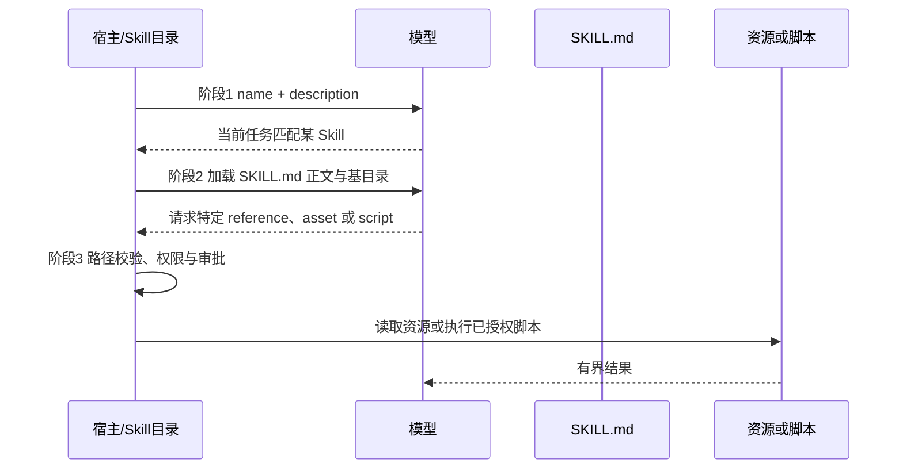

# Claude Code Skill：三阶段渐进披露、触发契约与资源沙箱

- 原文：[Claude Code Skill 揭秘：Skill 真的只是一份 markdown 吗？](https://xiaolinnote.com/claudecode/playbook/cc_skills.html)
- 一句话结论：Skill 的核心不是“多写一份 Markdown”，而是用 description 负责发现、用 `SKILL.md` 负责主流程、用资源和脚本承载低频细节，并把读取与执行关进宿主控制的边界。
- 证据/版本边界：Claude Code 的预算、Hook、Plugin 与数据目录行为按原文页面（2026-09-11 读取）整理，可能随版本变化；当前仓库的真实实现只有指定文件中的 `SkillCatalog` 及其单测，不存在可据此声称的根目录 `skills/`，也没有脚本执行器、Plugin marketplace 或埋点服务。

## 1. 四类陈述必须分开

| 层次 | 本文含义 | 证据 | 不应外推 |
| --- | --- | --- | --- |
| 产品行为 | Claude Code 如何发现、触发和装载 Skill | 原网页与产品文档转述 | 当前版本需实机核验 |
| 设计方法 | 三阶段披露、Gotchas、验证优先、度量触发 | 可迁移工程原则 | 不等于固定目录或 API |
| 仓库事实 | `SkillCatalog` 扫描、加载正文、读取资源并阻断越界 | Python 代码和单测 | 不是完整 Claude Code 实现 |
| 未实现 | 脚本沙箱、Hook 生命周期、Plugin 分发、遥测 | 指定代码中不存在 | 不能靠文档示例冒充已有能力 |

原文称 description 列表受 1% 上下文预算、单项约 250 字符限制；这属于页面引用的特定产品源码结论。当前 `SkillCatalog` 没有预算、截断或自动触发逻辑。

## 2. Skill 是目录契约，不只是提示词

一个 Skill 可以把说明、参考资料、模板和确定性代码放在同一能力边界中。下面只是产品方法示意，不代表当前仓库存在该目录：

```text
example-skill/
├── SKILL.md
├── references/
│   └── edge-cases.md
├── scripts/
│   └── validate.sh
└── assets/
	└── report-template.md
```

| 载体 | 主要职责 | 何时进入上下文或执行 |
| --- | --- | --- |
| `name` / `description` | 被发现与匹配 | 会话列出能力时 |
| `SKILL.md` 正文 | 主流程、边界、Gotchas | Skill 命中后 |
| `references` / `assets` | 低频知识和输出模板 | 正文明确需要时 |
| `scripts` | 确定性转换、检查、采集 | 通过宿主授权后执行 |

目录只是封装；真正的安全性仍来自运行时的路径、命令、网络、密钥和审批策略。

## 3. 三阶段渐进披露



阶段 1 降低常驻成本，阶段 2 保证主流程完整，阶段 3 避免把所有附录提前塞入上下文。渐进披露优化的是加载时机，不会自动保证内容正确或脚本安全。

## 4. Frontmatter 是发现契约

下面是最小方法示例；当前 `SkillCatalog._parse` 只识别单行 `key: value`，并强制 `name` 与 `description` 非空：

```yaml
---
name: dependency-review
description: 当用户要求检查依赖升级、兼容性破坏或锁文件变化时使用；不要用于普通代码风格审查。
---
```

一个可治理的 Frontmatter 契约至少要回答：稳定标识是什么、什么输入触发、哪些相邻场景不触发、能力版本是什么、允许读取或执行什么。后几项属于建议 Schema，当前解析器没有实现。

| description 写法 | 触发效果 |
| --- | --- |
| “帮助处理依赖” | 范围模糊，容易漏触发或误触发 |
| “升级 npm 包时使用” | 有动作，但缺少失败与排除场景 |
| “升级 npm 包、解决 peer conflict 或锁文件回归时使用；不处理 Python 包” | 正向场景与负边界都可判定 |

description 是路由条件，不是宣传摘要。关键触发词应放在前面，但不要把页面中的 250 字符数字当成所有运行时永恒不变的协议。

## 5. 正文只保留高增量信息

`SKILL.md` 应说明输入、输出、主流程、决策点、失败升级、验证方式和 Gotchas。最有价值的往往是模型无法从通用知识推断的事实，例如内部字段别名、环境假成功、历史兼容限制和必须由人审批的动作。

应删除“写完要测试”这类常识，改成具体可执行契约：“修改解析器后运行哪个测试、通过条件是什么、哪类 Snapshot 不能自动更新”。同时避免把每一步写死；固定且确定的动作交给脚本，模型保留处理未覆盖分支的空间。

验证型 Skill 通常优先级最高，因为它把“模型认为完成”转成测试、截图、Schema 校验或可观察行为。验证命令本身也要有限时、作用域和退出码解释。

## 6. 脚本与资源必须经过沙箱边界

[tooling_capabilities_reference.py](../xiaolinnote_tools_analysis/examples/tooling_capabilities_reference.py) 中的 `SkillCatalog.read_asset` 会先把目标解析为绝对路径，再确认目标仍位于 Skill 目录且是文件；`../secret.txt` 或解析到目录外的符号链接会被拒绝。

```python
catalog = SkillCatalog(host_selected_root)  # 根目录由宿主选择，不假定仓库结构
metadata = catalog.scan()                   # 阶段1：只取 name/description/directory
instructions = catalog.load_instructions("review")
template = catalog.read_asset("review", "assets/report.md")
```

这段实现只做 UTF-8 文本读取，不会执行 `scripts/`。生产脚本执行器还应补齐：命令白名单、参数 Schema、工作目录隔离、环境变量白名单、网络策略、超时、输出上限、密钥注入、危险动作审批和审计日志。

| 风险 | 只做路径校验是否足够 | 还需要什么 |
| --- | --- | --- |
| 资源越界读取 | 当前参考已做基础阻断 | 文件大小、类型和敏感路径策略 |
| 恶意脚本 | 不够 | 禁止默认执行、沙箱与人工审批 |
| Prompt Injection | 不够 | 把资源标成不可信数据并限制指令优先级 |
| 凭据泄漏 | 不够 | 最小权限密钥、输出脱敏和网络限制 |
| 资源耗尽 | 不够 | CPU、内存、时间和输出配额 |

## 7. 从个人 Skill 到团队资产

原文给出的演进路线是先在小范围试用，再通过仓库或 Plugin 分发，并用调用埋点识别高价值、误触发和触发不足。这里的方法重点是版本、所有者、测试和退出机制，而不是 Skill 数量。

建议为每个 Skill 记录：Owner、版本、适用项目、触发样例、反例、成功率、人工接管率、平均成本和最近复核时间。调用量低不一定没价值，也可能是 description 写错；调用量高也不代表输出可靠，必须结合 Gate 通过率。

Skill 之间若只有自然语言依赖，安装缺失会在运行时才暴露。团队实现可增加显式依赖清单和启动检查；这是治理建议，原文称产品并无原生依赖管理，当前仓库也未实现。

## 8. 与第 16 篇的分工及代码映射

| 文档 | 负责回答 | 不重复承担 |
| --- | --- | --- |
| 本篇 06 | Skill 怎么设计、触发、分层、沙箱化、度量和治理 | 不声称还原 Claude Code 内部源码 |
| [第 16 篇](16_claude_code_skill_source.md) | 产品侧发现、加载、动态扩展等源码机制 | 不替代团队 Skill 设计与安全清单 |
| Python 参考实现 | `scan -> load_instructions -> read_asset` 最小三段逻辑 | 不实现自动匹配、预算、脚本、Hook 或 Plugin |

`SkillCatalog.scan` 只扫描调用方所给根目录的直接子目录 `*/SKILL.md`；`_parse` 不是完整 YAML 解析器。对应单测只证明 metadata、正文和资源可分步读取，以及 `../secret.txt` 被拒绝。它没有证明 Claude Code 会自动触发这个 Skill。

因此，本篇用参考实现解释可迁移契约，第 16 篇讨论产品内部机制；两篇都应把页面观察与本仓库事实分开。

## 9. 面试问答

**Q1：渐进式披露为什么是三阶段而不是两阶段？**  
A：除了 metadata 和正文，低频参考资料与脚本还应在正文命中后继续按需读取或执行，避免附录再次挤满上下文。

**Q2：description 为什么决定触发？**  
A：模型在未加载正文前只能看到能力目录；若路由信息不在 description，正文再完整也无法帮助首次选择。

**Q3：Frontmatter 越长越好吗？**  
A：不是。常驻 metadata 有预算，应保留可判定的触发和排除条件；治理字段可由宿主读取，不必全部注入模型。

**Q4：Skill 中为什么要放脚本？**  
A：把重复、确定、可测试的转换交给代码，模型专注于选择和解释；但脚本必须经过独立执行授权。

**Q5：`read_asset` 已经是完整沙箱吗？**  
A：不是。它只限制文本资源路径，还没有命令、网络、资源、密钥、输出和审批隔离。

**Q6：当前单测证明了自动触发吗？**  
A：没有，只证明三段 API 可分别调用且路径逃逸被阻断。

**Q7：06 与 16 如何避免内容重复？**  
A：06 聚焦使用契约和治理，16 聚焦产品源码中的发现与加载机制；仓库映射只作为两者共同的最小对照。

## 10. 复习清单

- 能画出 metadata、正文、资源/脚本三阶段加载图。
- description 同时包含触发动作、故障场景和明确排除项。
- `SKILL.md` 只保留主流程、决策点、验证和不可推断的 Gotchas。
- 资源读取限制在 Skill 目录，脚本执行另走白名单、审批与配额。
- 不把原文的预算常量写成当前仓库 `SkillCatalog` 的能力。
- 不虚构仓库根目录 `skills/`、Plugin marketplace 或 Hook 服务。
- 用调用率、Gate 通过率、误触发和人工接管共同评价 Skill。
- 能准确说明本篇与第 16 篇的主题分工。
