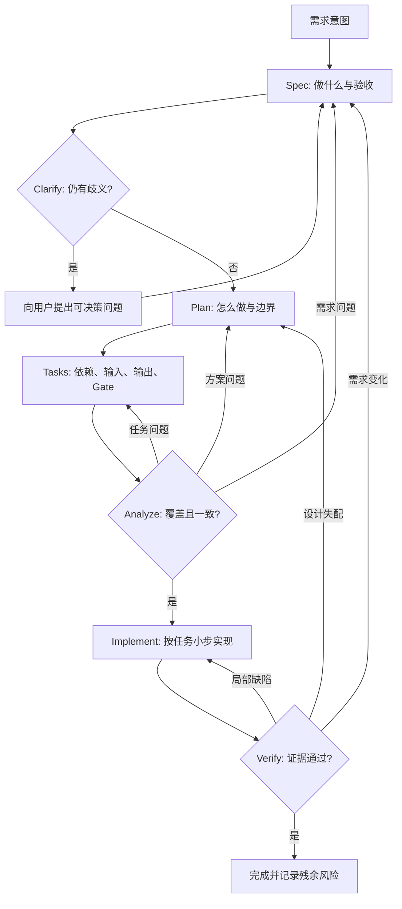

# SDD 规约驱动开发：产物契约、追踪矩阵与质量 Gate

- 原文：[SDD 规约驱动开发实战：在 Claude Code 里跑通先规约后编码](https://xiaolinnote.com/claudecode/playbook/spec_driven_dev.html)
- 一句话结论：SDD 的价值不在多写几份文档，而在让 `spec -> plan -> tasks -> implement -> verify` 每一步都有可消费的产物契约、双向追踪和失败回路，使需求变化先更新共识再更新代码。
- 证据/版本边界：spec-kit 命令与示例文件按原文页面（2026-09-11 读取）整理，未在本仓库安装或执行；本文的五阶段 Gate 与追踪矩阵是可迁移方法；当前仓库只在指定 Agent 参考代码中实现通用 DAG、绑定、验收和 Checkpoint，没有现成 `spec.md`、`plan.md`、`tasks.json` 或 `/speckit-*` 工作流可供声称。

## 1. SDD 解决的是连续对齐问题

聊天式开发把需求、技术选择、拆分、编码与验收混在同一对话里。短任务可能很快，长期任务则容易出现隐含假设、后续指令覆盖前序决策和“完成”没有证据。

| 方式 | 共识载体 | 变更方式 | 适用范围 | 主要风险 |
| --- | --- | --- | --- | --- |
| Vibe Coding | 会话中的临时文字 | 继续补一句 | 一次性脚本、低风险原型 | 漂移、遗漏、难审计 |
| 传统瀑布 | 阶段文档与审批 | 正式变更流程 | 强治理、稳定需求 | 文档冻结、反馈慢 |
| SDD | 可版本化且可重生成的产物 | 回到受影响上游再向下传播 | 长期维护、多人或 Agent 协作 | 形式化过度、产物失同步 |

原文强调“规约是活的”。因此，阶段顺序不是只能向前的流水线，而是让错误在成本较低的产物层被发现并回退。

## 2. 五阶段产物契约

| 阶段 | 输入 | 必须产出 | 下游消费条件 | Gate |
| --- | --- | --- | --- | --- |
| Spec | 目标、用户、约束、非目标 | 带 ID 的需求与可观察验收标准 | 歧义已澄清 | 完整、可测、无技术偷渡 |
| Plan | 已批准 Spec、仓库事实 | 架构、边界、接口、风险、验证策略 | 每个设计决定可追溯到需求 | 可行、范围受控 |
| Tasks | Plan 与需求 ID | 小而可验收的任务 DAG | 依赖完整、无环、覆盖需求 | 可执行、可并行、可回滚 |
| Implement | 已批准任务与代码基线 | 代码、迁移、测试及变更记录 | 未越过任务范围 | 编译/测试与局部验收通过 |
| Verify | 所有产物和运行环境 | 证据、缺陷、残余风险、最终判定 | 每条需求都有证据 | 独立 Gate 通过 |

产物名可以是 Markdown、YAML、数据库记录或工单；契约比文件名重要。原文里的 `spec.md` 等是 spec-kit 示例，不代表本仓库已经存在这些文件。

## 3. 主流程与 clarify/analyze 回路



`clarify` 应在技术方案固化前解决“一个任务能否多人负责”这类产品歧义；`analyze` 应在编码前交叉检查 Spec、Plan 和 Tasks，而不是只做文档语法检查。

## 4. Spec 的最小 Schema

下面是建议产物 Schema，不是仓库已有文件：

```yaml
requirement_id: REQ-001
statement: 用户可以把任务移动到允许的下一状态
rationale: 保持看板工作流可追踪
acceptance:
	- id: AC-001
		given: 任务处于 todo
		when: 用户移动到 doing
		then: 状态持久化且刷新后仍为 doing
non_goals:
	- 第一版不支持自定义状态机
open_questions: []
status: approved
```

需求语句描述用户可观察结果，不指定 React、SQLite 等实现。验收项要能映射到测试、日志、截图或人工检查；“体验良好”“性能快”若没有阈值，不是可执行 Gate。

## 5. Plan 与 Tasks 如何映射到真实 DAG 代码

[agent_capabilities_reference.py](../xiaolinnote_agent_analysis/examples/agent_capabilities_reference.py) 中的 `PlanStep` 具有 `step_id`、`goal`、`worker`、`payload`、`depends_on`、`success_criteria` 与 `on_failure`，可以承载 Tasks 阶段的执行契约：

```python
steps = [
		PlanStep(
				step_id="T-001",
				goal="实现 REQ-001 的合法状态迁移",
				worker="implementer",
				payload={"requirement_ids": ["REQ-001"]},
				depends_on=(),
				success_criteria={"tests.passed": True},
				on_failure="replan",
		)
]
validate_plan(steps)
```

`validate_plan` 检查重复 ID、缺失依赖和依赖环；`resolve_bindings` 支持 `${steps.<id>.output.<path>}` 将上游输出绑定到下游输入；`DAGOrchestrator` 只调度依赖已验收的步骤，并可在预算内 Replan。

这些类没有 `requirement_id` 专用字段，上例只是把 ID 放进 payload 的方法映射。代码也不会生成 Spec 或追踪矩阵，因此它是执行层参考，不是完整 SDD 引擎。

## 6. 追踪矩阵让产物不失联

| Requirement | Plan 决策 | Task | 实现位置 | 验证证据 | 状态 |
| --- | --- | --- | --- | --- | --- |
| REQ-001 / AC-001 | DEC-003 状态迁移服务 | T-001 | 待实现，不预填虚构路径 | TEST-001 | planned |
| REQ-002 / AC-003 | DEC-005 幂等写入 | T-004 | 待实现，不预填虚构路径 | TEST-004、LOG-002 | planned |

矩阵要支持双向提问：每条需求由哪些任务实现？每个任务为何存在？每个代码改动服务哪条需求？每个 Gate 的证据覆盖哪条验收标准？孤儿需求意味着漏实现，孤儿任务意味着范围蔓延。

实现位置必须在代码落地后填写真实路径，不能在规划阶段编造。证据也不能只写“测试通过”，应记录命令、用例 ID、环境、时间与关键输出。

## 7. Clarify 与 Analyze 的判定规则

Clarify 处理无法从仓库事实推导、且不同答案会改变验收或设计的问题。问题应给出选项、默认值的影响和截止点；能通过读取现有代码确定的事实，应先分析仓库而不是询问用户。

Analyze 至少检查五类不一致：需求无验收、Plan 无需求来源、任务无依赖或输出、需求无任务覆盖、任务 Gate 无法验证。检查结果应指向应回退的阶段，而不是静默替用户选择。

| 发现 | 回到哪里 | 原因 |
| --- | --- | --- |
| 用户角色或边界不清 | Spec/Clarify | 技术层不能替产品做决定 |
| 非功能指标无方案 | Plan | 需求明确但设计缺失 |
| 某需求没有任务 | Tasks | 方案存在但分解漏项 |
| 任务依赖成环 | Tasks/Plan | DAG 不可执行，可能是边界错误 |
| 实现后验收失败 | Implement，必要时 Plan | 先区分局部缺陷与设计失配 |

## 8. 变更控制与 Gate

活规约不等于随意覆盖。每次变更应记录 Change ID、原因、发起者、受影响需求、旧值/新值、批准状态和生效基线，然后执行影响分析：更新上游产物、标记下游产物失效、重建矩阵、重新 Analyze，再继续实现。

| Gate | 最低通过条件 | 失败后动作 |
| --- | --- | --- |
| Spec Gate | 无关键歧义，验收可观察，非目标明确 | Clarify 或重写 Spec |
| Plan Gate | 设计覆盖需求，风险和验证策略明确 | 修改 Plan，必要时回 Spec |
| Task Gate | ID 唯一、依赖无环、覆盖矩阵完整 | 重拆 Tasks |
| Implement Gate | 最窄构建/测试通过且无越界改动 | 修复当前任务或申请变更 |
| Verify Gate | 所有 AC 有独立证据，残余风险被接受 | 回到对应阶段，不伪报完成 |

仓库中的 `check_acceptance` 只按点路径做值相等检查，`StepResult` 也明确区分 `ok` 与 `accepted`；这很好地表达“执行成功不等于业务通过”。它未实现复杂断言、人工审批或需求级覆盖率。

## 9. 面试问答

**Q1：SDD 与多写文档有什么区别？**  
A：每份产物都有输入、输出、消费者和 Gate，并通过 ID 追踪到代码与证据；没有消费关系的文档只是旁路说明。

**Q2：为什么流程需要 Verify，而不止 Implement？**  
A：实现者报告成功是主张，测试和运行证据才是验收；两者分开可避免模型自报完成。

**Q3：Clarify 和 Analyze 有什么差别？**  
A：Clarify 解决需求语义中的待决问题，Analyze 检查已生成产物之间的覆盖、一致性和可执行性。

**Q4：SDD 是瀑布模型吗？**  
A：阶段外形相似，但 SDD 允许依据证据回到上游并重新生成下游；关键是可逆反馈，不是一次冻结。

**Q5：追踪矩阵如何防止范围蔓延？**  
A：每个任务和改动都必须指向需求或获批 Change；找不到来源的工作就是待删除或待审批的孤儿项。

**Q6：当前 DAG 代码实现了哪些 SDD 能力？**  
A：实现任务依赖校验、结果绑定、就绪调度、业务验收、有限 Replan 与 Checkpoint；没有生成 Spec、Plan 或需求矩阵。

**Q7：需求变化后为什么不能只改代码？**  
A：旧 Spec、Plan、Tasks 和测试会继续表达旧共识；应先更新源需求并使受影响下游重新通过 Gate。

## 10. 复习清单

- 每条需求有稳定 ID、理由、非目标和可观察验收标准。
- Plan 的每个关键决策可追溯到需求或约束。
- Tasks 足够小，依赖完整无环，并定义输入、输出和失败策略。
- 追踪矩阵能从需求走到代码与证据，也能反向解释任务来源。
- Spec 后先 Clarify，Tasks 后先 Analyze，再进入 Implement。
- 变更有 Change ID、影响分析、下游失效标记和重新 Gate。
- 区分 Worker 执行成功、业务验收通过与最终独立验证通过。
- 不把原文 spec-kit 示例文件或命令写成当前仓库事实。
