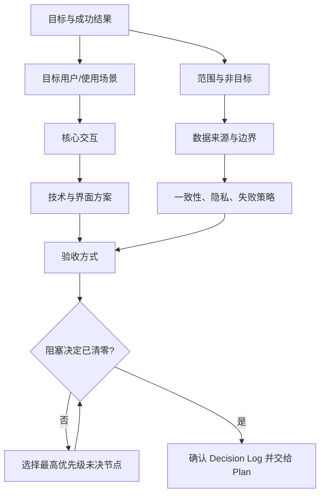

# grill-me：把模糊需求沿设计树问成可执行决定

- 原文：[grill-me 使用指南：写代码前，先让 Claude Code 审问你的需求](https://xiaolinnote.com/claudecode/playbook/grill_me.html)
- 一句话结论：高返工成本任务应先探索代码，再按上游影响逐次只问一个真正需要人拍板的问题，并把答案写成有停止条件的 Decision Log。
- 证据/版本边界：产品描述与案例数字来自原网页（2026-09-11 读取）；本文未验证本机安装了 grill-me、Claude Code 或相关插件，也不把网页中的一次案例当作稳定产品规格。优先级公式、Decision Log Schema 和代码均为可迁移设计；仓库类只是教学参考实现，不是 grill-me 内部代码。

## 1. 原文到底证明了什么
原文展示的 skill 正文只有三组核心约束：沿设计树持续访谈并给推荐答案；一次只问一个且等待反馈；代码库能回答的事实先自行探索。

| 陈述 | 证据层次 | 可以得出的结论 | 不能得出的结论 |
| --- | --- | --- | --- |
| 三组英文指令 | 原文引用的 skill 内容 | 定义了一种访谈姿态 | 不证明有独立状态机或数据库 |
| 热点助手被问 10+ 轮 | 作者单次实操 | 逐问能暴露去重等遗漏 | 不保证每个任务都问相同数量 |
| 第九轮开始跑第一版 | 个案过程 | 访谈可与试运行交错 | 不构成统一停止协议 |
| 与 Plan Mode 配合 | 作者工作方法 | 澄清与实施计划可以分阶段 | 不证明两者必须绑定 |

因此，本文把 grill-me 当作“需求访谈协议”，而不是声称它自带计划持久化、测试、回滚或多 Agent 编排。

## 2. 设计树不是问题清单
设计树的节点是“决定”，边表示“上游答案约束下游可选项”。先问低层 UI 颜色，再问目标用户，前面的答案很可能全部失效。



树不是预先一次性展开的问卷。每个答案都可能剪枝、增加风险节点或让某个问题变成可由代码检索回答的事实。

## 3. 为什么必须一次只问一个
一次一问不是单纯降低阅读负担，而是维持清晰的因果链：当前回答写入状态后，才重新计算下一问。批量问题会让用户同时假设多条尚未确定的上游分支。

每轮应遵守五步：读取已确认决定；探索可查事实；选一个最高优先级未决节点；给推荐与代价；等待回答并记录。

| 信息类型 | 正确动作 | 例子 |
| --- | --- | --- |
| 仓库事实 | 先搜索或运行检查 | “项目用哪个测试框架？” |
| 产品取舍 | 只问一个并等待 | “首版更重召回率还是精确率？” |
| 高风险授权 | 明确列出影响再问 | “是否允许迁移生产数据？” |
| 可逆低风险细节 | 采用默认值并记假设 | “日志字段排序” |

用户回答“都可以”不等于已决定。面试官应缩小差异，说明默认项及其改变条件，再请求确认。

## 4. 问题优先级与推荐答案
下面是本文提出的启发式，不是 grill-me 产品算法。各因子取 0 到 3：下游分叉数 $D$、歧义 $A$、返工成本 $C$、风险 $R$、可直接取得的代码证据 $E$。

$$P = 3D + 2A + 2C + R - 2E$$

优先问 $P$ 高的节点；若 $E$ 高，先探索代码而不是询问。相同分数时，先处理不可逆、安全或外部副作用相关决定。

推荐答案至少包含五项：推荐选项、依据、主要代价、何时应换选项、当前置信度。好的表达是“建议 A，因为现有约束 X；代价是 Y；若 Z 成立则改选 B”，而不是只给一个看似权威的答案。

## 5. 停止条件：问到哪里才算够
“直到达成共识”仍然太主观。可执行的停止 Gate 应同时满足：

1. 目标用户、成功结果、范围和非目标已有记录。
2. 所有高优先级节点均为 `accepted`、`rejected` 或显式 `deferred`。
3. 验收标准可由测试、命令或人工步骤观察。
4. 数据、安全、权限和不可逆动作已有负责人及处理策略。
5. 未决项不阻塞首版，且默认值和变更触发器已写明。
6. 用户确认共识摘要，Decision Log 已落盘。

还需设置轮次、时间或成本上限；达到上限仍有阻塞问题时，应停止并升级给人，而不是偷偷补默认值。预算属于本文的工程扩展，不是原文三条指令的一部分。

## 6. Decision Log Schema
聊天记录不适合充当唯一事实源。每个决定应有稳定 ID、状态、上下游关系和证据，推荐使用版本化 JSON/YAML：

```json
{
  "$schema": "https://json-schema.org/draft/2020-12/schema",
  "type": "object",
  "required": ["id", "question", "status", "chosen", "rationale", "affects"],
  "properties": {
    "id": {"type": "string", "pattern": "^D-[0-9]{3}$"},
    "question": {"type": "string", "minLength": 1},
    "options": {"type": "array", "items": {"type": "string"}},
    "recommended": {"type": "string"},
    "chosen": {"type": ["string", "null"]},
    "rationale": {"type": "string"},
    "status": {"enum": ["open", "accepted", "rejected", "deferred", "superseded"]},
    "depends_on": {"type": "array", "items": {"type": "string"}},
    "affects": {"type": "array", "items": {"type": "string"}},
    "evidence": {"type": "array", "items": {"type": "string"}}
  }
}
```

生产实践还应记录 `owner`、时间、版本/提交、替代方案和 supersede 链；敏感原始对话不要直接写入仓库。

## 7. 一段可迁移的选问实现
这段代码只实现优先级与停止判定，不调用模型，也不冒充 grill-me：

```python
from dataclasses import dataclass

@dataclass(frozen=True)
class Decision:
	id: str
	question: str
	downstream: int
	ambiguity: int
	rework_cost: int
	risk: int
	code_evidence: int = 0
	status: str = "open"

	@property
	def priority(self) -> int:
		return 3 * self.downstream + 2 * self.ambiguity + 2 * self.rework_cost + self.risk - 2 * self.code_evidence

def next_question(decisions: list[Decision]) -> Decision | None:
	open_items = [item for item in decisions if item.status == "open" and item.code_evidence < 3]
	return max(open_items, key=lambda item: (item.priority, item.risk), default=None)

def ready_for_plan(decisions: list[Decision], acceptance: list[str], non_goals: list[str]) -> bool:
	return all(item.status != "open" for item in decisions) and bool(acceptance) and bool(non_goals)
```

调用方仍需先把 `code_evidence == 3` 的节点交给检索器查证，再把结果写回日志，不能直接把它们当作已解决。

## 8. 完整案例：每日知识摘要
以下是演示案例，不描述当前仓库现状。假设代码探索已确认：已有 `search()` 与 `send_message()`，没有跨日去重存储，也没有外部平台抓取器。

| 顺序 | 单个问题 | 推荐答案 | 用户决定 | 被剪掉的分支 |
| --- | --- | --- | --- | --- |
| D-001 | 首版服务谁、成功是什么？ | 工作日 9 点给编辑推 5 条可采用选题 | 接受 | 面向公众、多时区 |
| D-002 | 内容从哪里来？ | 只用现有知识库，首版不抓公网 | 接受 | 爬虫、账号与反爬 |
| D-003 | 怎样避免重复？ | 按规范化 URL 保留 7 天指纹 | 接受 | 无状态执行 |
| D-004 | 推送失败怎么办？ | 同一幂等键重试 2 次，再告警 | 接受 | 无限重试、重复发送 |
| D-005 | 首版明确不做什么？ | 不做个性化、后台 UI、自动发布 | 接受 | 三条产品支线 |

共识落盘可写成：

```yaml
feature: daily-knowledge-digest
status: ready-for-plan
accepted: [D-001, D-002, D-003, D-004, D-005]
acceptance:
  - 固定样本生成恰好 5 条且无 7 日内重复
  - 相同幂等键重复调用只产生一次推送
  - 连续失败 2 次后停止并产生可观察告警
non_goals: [公网抓取, 个性化排序, 自动发布]
unresolved: []
```

到这里访谈停止，Plan 再拆“指纹存储→筛选→推送→失败测试”。若 D-002 改成公网抓取，应回到设计树新增认证、限流、版权和失败隔离节点，而不是只改一个任务名。

## 9. 与当前仓库的准确映射
| 仓库构件 | 可借鉴之处 | 明确边界 |
| --- | --- | --- |
| [`validate_plan`](../xiaolinnote_agent_analysis/examples/agent_capabilities_reference.py) | 在访谈结束后校验实施步骤 ID、依赖存在性和依赖环 | 不校验问题质量、共识或 Decision Log 完整性 |
| [`DAGOrchestrator`](../xiaolinnote_agent_analysis/examples/agent_capabilities_reference.py) | 只执行依赖已验收的 ready 步骤，失败时允许有界 replan | 是 Worker 编排器，不会一次一问，也没有 grill-me 状态 |
| [`ReflectionEngine`](../xiaolinnote_agent_analysis/examples/agent_capabilities_reference.py) | 可按 rubric 评价共识摘要，低提升或轮次耗尽即停 | evaluator 不是用户，不能替人做产品取舍 |
| [`LoopHarness`](../xiaolinnote_agent_engineering_analysis/examples/agent_engineering_reference.py) | 提供迭代、失败、Token、费用、重复动作、Gate 与 checkpoint | 当前动作只有工具、完成、升级，没有访谈问题动作 |

相关单测只证明环拒绝、有界 replan、反思轮次、预算和 Gate 等离线行为；没有测试启动 grill-me 或 Claude Code。

## 10. 常见失败与 Plan Mode 边界
| 失败模式 | 后果 | 修正 |
| --- | --- | --- |
| 先问实现细节 | 上游变化导致整串答案失效 | 按依赖和返工成本重排 |
| 一次列十问 | 回答互相矛盾且无法追因 | 严格一次一问 |
| 推荐没有代价 | 用户把建议误当事实 | 同时报依据、代价与换挡条件 |
| 只留聊天记录 | 新会话无法恢复决定 | 写 Decision Log 与共识摘要 |
| 永不停止 | 交互成本超过返工收益 | 使用完成 Gate 与硬预算 |

grill-me 解决“要做什么、为何这样取舍”；Plan Mode 解决“按什么步骤实现和验证”。两者可串联，但计划仍是待验证假设，不能代替测试。

## 11. 面试问答
**Q1：设计树与普通需求清单的区别是什么？**  
A：设计树显式表示决定依赖；上游答案会剪枝并改变下游问题，清单通常没有这种因果关系。

**Q2：为什么一次只问一个会更有效？**  
A：它让每个回答先进入状态，再重算下一问，避免用户同时基于互相冲突的假设作答。

**Q3：什么问题不该问用户？**  
A：能从代码、配置、测试或文档可靠查出的事实；应先探索，并把证据而非猜测写入日志。

**Q4：推荐答案怎样避免诱导？**  
A：同时提供依据、代价、替代项、改变条件和置信度，把决策权留给用户。

**Q5：如何判断访谈可以停止？**  
A：阻塞决定清零、验收和非目标可观察、风险有策略、未决项不阻塞，并由用户确认落盘摘要。

**Q6：`validate_plan` 能校验设计树吗？**  
A：不能；它只检查 `PlanStep` 的 ID 唯一性、依赖存在性和环，需另写 Decision Log 校验器。

**Q7：`ReflectionEngine` 能代替用户确认吗？**  
A：不能；它只能按给定 rubric 评价文本，无法替用户承担偏好、风险和业务责任。

## 12. 复习清单
- 能区分网页事实、单次案例、可迁移设计与仓库实现。
- 能画出目标、范围、交互、数据、风险、验收之间的设计树。
- 能用优先级解释为什么先问上游高返工决定。
- 能写出包含状态、依据、依赖、影响和证据的 Decision Log。
- 能列出完成 Gate、硬预算和升级条件。
- 能复述每日摘要案例从代码探索、五次单问到 Plan 交接的全过程。
- 能准确说明四个仓库构件都不是 grill-me 产品实现。
