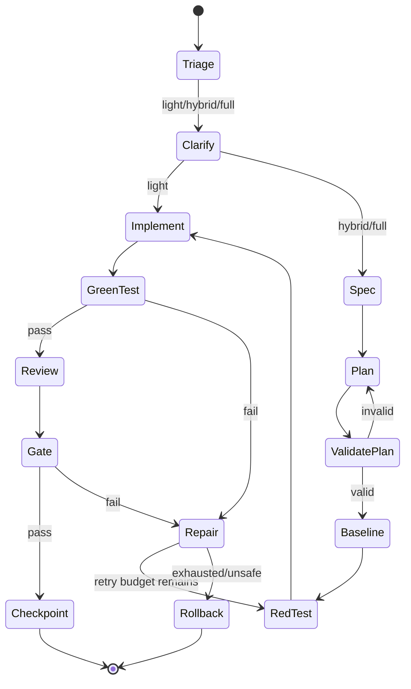
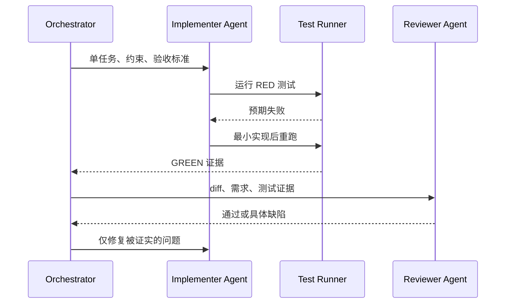

# superpowers vs grill-me：量化选择澄清深度与工程流水线
- 原文：[superpowers vs grill-me：同一个需求实测，差距到底在哪？](https://xiaolinnote.com/claudecode/playbook/superpowers_vs_grillme.html)
- 一句话结论：grill-me 优化“把关键决定交给人”，完整流水线优化“让实现过程可验证、可追踪、可恢复”，应按返工风险与流程成本量化选型，而不是默认谁更强。
- 证据/版本边界：文中的 12 问、4 问、24 个子 Agent、55 个通过用例和 14 次提交均为原作者一次对比实验的报告，不是 SLA 或普遍基准；本文未验证当前机器安装了 grill-me、superpowers 或 Claude Code。量化模型与状态机是可迁移方案，仓库代码也不是这两个产品的实现。
## 1. 两者不是同一层能力
原文把 grill-me 描述为轻量需求访谈 skill：沿设计树一次一问，结束后控制权回到用户。文中的 superpowers 则从 brainstorming 延伸到 spec、plan、TDD、子 Agent、审查和提交记录。

| 维度 | 轻量澄清路径 | 完整工程路径 |
| --- | --- | --- |
| 首要目标 | 消除高价值歧义 | 控制从设计到交付的全过程 |
| 人的角色 | 逐项拍板关键决定 | 审批设计、计划与最终 Gate |
| 默认产物 | 共识摘要；需主动落盘 | spec、plan、测试、审查与历史 |
| 固定成本 | 低到中 | 高 |
| 适合任务 | 可逆、小范围、单人短期 | 跨模块、高风险、长期维护、多人交接 |
| 主要风险 | 决定只留在对话中 | 小任务被流程淹没，Agent 链路放大延迟 |

公平对比应是 grill-me 与 brainstorming 的澄清能力，以及“轻量路径”与“完整流水线”的总成本，不能把一个访谈 skill 与整套流程简单排名。
## 2. 原实验能支持的观察
| 指标 | grill-me 路径 | superpowers 路径 | 解释边界 |
| --- | --- | --- | --- |
| 提问 | 12 问，一次一问 | 4 问，选项卡片 | 只代表该游戏需求 |
| 人工拍板 | 13 次 | 8 次 | 统计口径来自原文 |
| 用时 | 32 分钟 | 约 2 小时，不含卡死一晚 | 非受控性能基准 |
| 产物 | 单个约 51 KB HTML | 模块、文档、测试、提交 | 实验产物，不是默认保证 |
| 测试/Agent/提交 | 未报告 | 55 个用例、24 个子 Agent、14 次提交 | 作者观察值，版本可能变化 |

最有解释力的细节是美术风格：grill-me 单独询问且用户推翻推荐；另一条路径把“Canvas 程序绘制”折叠进技术选项，替用户采用默认值。差异来自“什么值得打断用户”，不等于模型能力高低。

## 3. 量化选型：先算流程是否值得
下面是本文提出的路由分，不是任何插件规则。每项取 0 到 4：影响范围 $R$、未决程度 $U$、验证强度 $V$、交接/寿命 $H$、不可逆副作用 $X$。

$$S = 2R + U + 2V + H + 2X$$

| 分数/条件 | 建议路径 | 最低产物 |
| --- | --- | --- |
| $S \le 8$ 且无硬触发器 | 轻量 | 单问澄清、最窄验证、变更摘要 |
| $9 \le S \le 17$ | 混合 | Decision Log、短计划、测试、一次审查 |
| $S \ge 18$ | 完整 | spec、DAG 计划、TDD、分步审查、checkpoint |
| 数据迁移、权限边界、发布或不可补偿写入 | 强制完整/人工审批 | 与分数无关 |

文件数只能作弱信号。一个单文件权限错误可能高风险，二十个机械重命名也可能低风险；应以副作用、验证难度和未来交接为主。

## 4. 一段可迁移的路由实现
```python
from dataclasses import dataclass
from enum import Enum

class Track(str, Enum):
	LIGHT = "light"
	HYBRID = "hybrid"
	FULL = "full"

@dataclass(frozen=True)
class WorkProfile:
	blast_radius: int
	uncertainty: int
	verification: int
	handoff: int
	irreversibility: int
	hard_trigger: bool = False

	@property
	def score(self) -> int:
		return 2 * self.blast_radius + self.uncertainty + 2 * self.verification + self.handoff + 2 * self.irreversibility

def choose_track(profile: WorkProfile) -> Track:
	if profile.hard_trigger or profile.score >= 18:
		return Track.FULL
	if profile.score >= 9:
		return Track.HYBRID
	return Track.LIGHT
```

调用前应校验各字段在 0 到 4；阈值要用团队历史数据校准。路由结果决定流程强度，不得绕过生产权限、合规或人工审批。

## 5. 完整流水线状态图


轻量路径也不能跳过验收，只是省略 spec、DAG、子 Agent 和多轮审查。完整路径的价值来自阶段边界与证据，而不是状态数量。

## 6. TDD：把“完成”改成可反驳命题
原实验报告的计划把任务写成“失败测试→实现→通过”的循环。可迁移的 TDD 步骤是：

1. 冻结现有行为或建立最小基线，避免把旧缺陷误算成回归。
2. 为一个需求写能稳定失败的测试，并确认失败原因正确。
3. 写最小实现使测试变绿，不顺手扩范围。
4. 重构后重跑局部测试，再跑受影响套件。
5. 独立审查需求覆盖、错误路径和测试有效性。
6. 最终 Gate 保存命令、退出码与关键运行证据。

“先写测试”本身不保证质量：测试可能断言错行为、只测 Mock、存在偶发性或漏掉浏览器/外部系统。人工验证清单与集成测试仍可能必要。

## 7. 子 Agent、并行度与上下文隔离
完整路径可把角色拆成 planner、implementer、reviewer、repairer；reviewer 不应只复述 implementer 的自评。并行只适用于依赖已满足且写集不冲突的任务。



每多一个 Agent 都增加上下文装载、Token、调度、冲突和失败面。小任务让同一 Agent 实现并由测试验收，常比创建角色链更快。

## 8. 与当前仓库的准确映射
| 构件 | 可映射的流水线职责 | 当前未实现 |
| --- | --- | --- |
| [`validate_plan`](../xiaolinnote_agent_analysis/examples/agent_capabilities_reference.py) | 执行前拒绝重复 ID、缺失依赖和依赖环 | 不评估 spec 完整性、任务粒度或成本 |
| [`DAGOrchestrator`](../xiaolinnote_agent_analysis/examples/agent_capabilities_reference.py) | 运行依赖已验收的 ready batch，绑定前序输出，失败时有界 replan | Worker 只是回调；没有真实子 Agent、超时、取消或 checkpoint 加载恢复 |
| [`ReflectionEngine`](../xiaolinnote_agent_analysis/examples/agent_capabilities_reference.py) | 对 spec/plan 草案执行 evaluator→improver，按通过、轮次或低提升停止 | 不做 TDD、不执行 Git，也不保证 evaluator 正确 |
| [`LoopHarness`](../xiaolinnote_agent_engineering_analysis/examples/agent_engineering_reference.py) | 记录 Token/费用/失败，检测重复动作，Gate 后完成，并可从匹配 checkpoint 恢复 | 单进程同步循环；没有 DAG 并行、真实模型、Shell 沙箱或 Git 回滚 |

测试证明的是参考类在构造输入下的环拒绝、结果绑定、有界 replan、反思停止、预算、重复动作和恢复行为。它们不是 grill-me/superpowers 集成测试。

## 9. 成本与延迟不能只数 Token
完整流程的临界路径近似为：

$$T_{full}=T_{clarify}+T_{spec}+T_{plan}+\sum_b\max_{i\in b}(T_i+T_{review,i})+T_{gate}+T_{recovery}$$

其中 $b$ 是按依赖形成的 ready batch；并发缩短的是 batch 内独立任务，不会消除最长步骤、限流和审查延迟。

总成本应包含模型、工具、人工审查和返工：

$$C_{total}=C_{model}+C_{tools}+C_{review}+C_{rework}$$

当流程新增成本小于“失败概率下降带来的预期返工损失 + 可追踪性价值”时，完整路径才经济。团队应记录每类任务的首轮通过率、接受变更数、审查分钟、重试次数与恢复时间，而不是套用原文两次用时。

## 10. 失败、恢复与回滚
| 失败点 | 首要控制 | 恢复动作 | 回滚边界 |
| --- | --- | --- | --- |
| spec 前后矛盾 | rubric + 人工确认 | 修订并重新确认 | 尚未执行，成本最低 |
| 计划缺依赖/有环 | `validate_plan` | 修计划后再校验 | 不应启动 Worker |
| 子 Agent 卡住 | 超时、heartbeat、checkpoint | 取消并以同一验收标准重派 | 当前 `DAGOrchestrator` 未实现超时/恢复 |
| 测试失败 | 有界 repair/replan | 保留失败证据后重试 | 只追加未执行步骤，不覆盖已执行结果 |
| Token/费用耗尽 | `LoopHarness` limits | 人工评审后扩预算并恢复 | checkpoint 必须匹配 run ID 与目标 |
| 外部写入失败 | 幂等键、事务、补偿动作 | 重试或执行补偿 | Git 不能撤销邮件、数据库或远端 API |

原文中的第 5 个任务卡住、API 中断、次日重新派 Agent 后继续，是恢复案例，不证明所有中断都可自动恢复。完整系统还需持久化任务租约、输入版本、幂等键和副作用账本。

## 11. 三类任务的选型演算
| 任务 | $(R,U,V,H,X)$ | 得分 | 建议 |
| --- | --- | --- | --- |
| 改文案错字 | (0,0,1,0,0) | 2 | 轻量：直接改并检查 |
| 新增跨三模块筛选器 | (2,2,3,2,1) | 16 | 混合：短 spec、计划、测试、审查 |
| 生产权限与数据迁移 | (4,3,4,4,4) | 31，且硬触发 | 完整：审批、基线、DAG、TDD、回滚演练 |

分数不是精确科学，而是强迫团队显式讨论风险。若缺少可靠 Gate，即使任务分数低，也不应无人值守执行。

## 12. 面试问答
**Q1：为什么不能直接比较 grill-me 和 superpowers 谁更强？**  
A：前者主要是访谈协议，后者在原文中是一整条工程流程，层级和产出不同。

**Q2：原文 12 问对 4 问说明了什么？**  
A：只说明该案例中一个路径把更多设计决定交给用户，另一个采用更多默认值；不构成通用效率排名。

**Q3：完整流程何时反而更慢？**  
A：任务可逆且范围小时，spec、角色切换、审查和上下文装载成本可能高于预期返工损失。

**Q4：TDD 为什么仍需独立 Gate？**  
A：测试可能写错或覆盖不足；Gate 要结合需求、退出码、集成行为和必要的人工验证。

**Q5：`DAGOrchestrator` 如何限制乱序执行？**  
A：只选择所有依赖已有结果且 `accepted=True` 的 pending 步骤进入 ready batch。

**Q6：`ReflectionEngine` 的停止条件是什么？**  
A：评价通过、达到最大轮次，或连续提升低于阈值；最终只返回真正被 evaluator 评价过的最佳候选。

**Q7：为什么 Git 回滚不够？**  
A：它只能恢复版本化文件，无法撤销已发送消息、远端 API、数据库写入或泄露的密钥。

## 13. 复习清单
- 能区分需求访谈、brainstorming 与完整交付流水线。
- 能解释原实验数字的样本、版本和外推边界。
- 能用五因子得分和硬触发器选择轻量、混合或完整路径。
- 能画出 spec、plan、RED、GREEN、review、Gate、checkpoint 与 rollback 状态。
- 能说明子 Agent 并行只发生在依赖满足且写集不冲突时。
- 能计算临界路径延迟与包含人工审查的总成本。
- 能为计划错误、Agent 卡住、测试失败、预算耗尽和外部副作用给出恢复策略。
- 能准确说明四个仓库构件均不是 grill-me 或 superpowers 产品实现。
