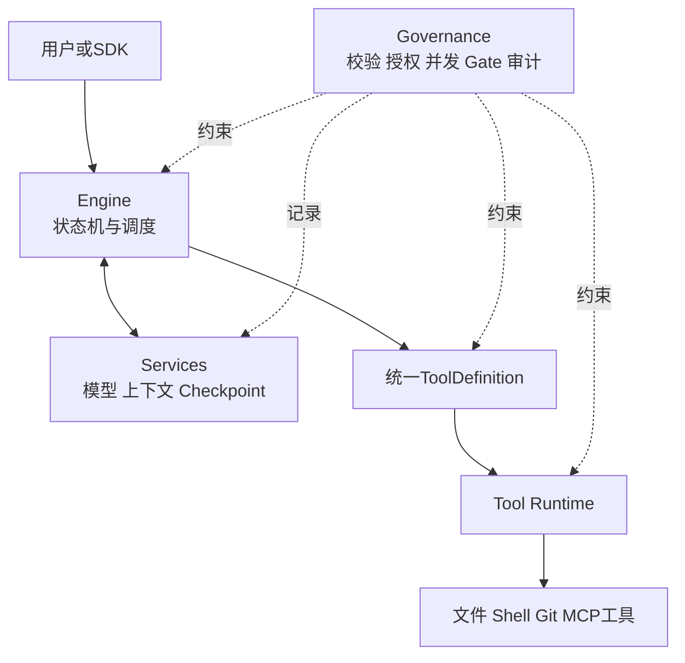
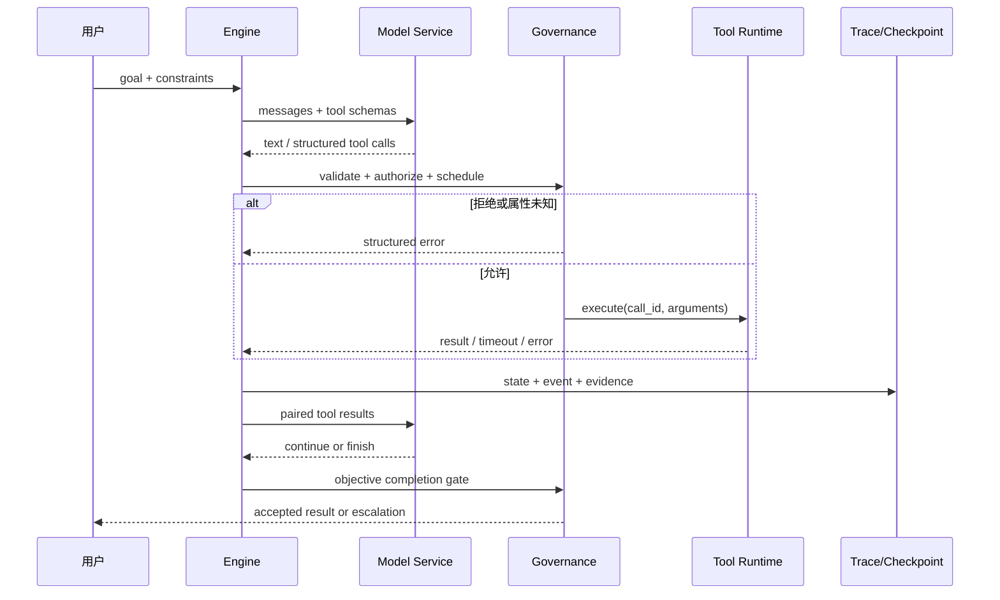
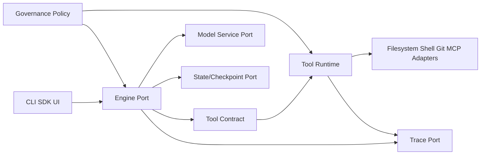

# Claude Code 源码架构：Engine、Tools、Services 与 Governance

- 原文：[Claude Code 源码拆解：51 万行泄漏代码里的架构设计](https://xiaolinnote.com/claudecode/source/cc_source.html)
- 一句话结论：可迁移的重点不是某份未授权源码的目录名，而是让 Engine 只编排统一工具契约，由 Services 提供基础设施，并让 Governance 在每条执行路径上默认拒绝、审计和止损。
- 源码可信度和版本边界：原网页于 2026-09-11 读取，其中关于 Claude Code 内部函数、属性和层次的描述均标为**二手材料**；本文没有获取、复制或声称持有未授权 Claude Code 源码。可执行证据仅来自本仓库 Python 参考实现与单测，它们是教学 Harness，不代表、复刻或验证任何版本的真实 Claude Code。

## 1. 先给结论标证据等级

本地证据锚点包括 [Harness 长文](../xiaolinnote_agent_engineering_analysis/5_harness_engineering_agent_runtime_reliability.md)、[Agent/Harness 实现](../xiaolinnote_agent_engineering_analysis/examples/agent_engineering_reference.py)、[ToolRuntime 实现](../xiaolinnote_tools_analysis/examples/tooling_capabilities_reference.py) 及其两份测试。

| 结论类型 | 本文依据 | 可信边界 |
| --- | --- | --- |
| Claude Code 的四层、工具属性与循环 | 原网页的作者观察 | 二手材料，产品升级后可能失效 |
| Harness 的通用分层原则 | 本仓库 Harness 长文 | 架构方法，不是产品源码事实 |
| Registry、Loop、Trace、Runtime 行为 | 当前 Python 文件与单测 | 可在本仓库复现，只证明参考实现 |
| 统一工具契约与 fail-closed 调度 | 本文设计建议 | 尚未在仓库完整实现 |

阅读时应始终问：这是产品观察、可迁移原则、已实现行为，还是待实现设计？四者不能互相冒充。

## 2. 四层不是目录树，而是责任边界

| 层 | 只负责什么 | 不应负责什么 |
| --- | --- | --- |
| Engine | 组装状态、请求模型、解释动作、推进状态机 | 文件、Shell、Git 的业务实现 |
| Tools | 暴露窄能力并返回结构化结果 | 自行绕过权限、预算或审计 |
| Services | 模型客户端、上下文、Checkpoint、MCP、遥测 | 替模型决定业务目标 |
| Governance | Schema、授权、并发、预算、Hook、Gate、升级 | 只写提示词而没有确定性执行点 |



治理不是“第五个业务模块”，而是横切控制面；任何新增工具若能绕开它，分层就只是画图。

## 3. 一次请求的端到端时序

下面是可迁移的 Harness 时序，不是对 Claude Code 私有实现的逐行还原：



关键不变量是：模型提出动作，宿主批准和执行；模型自报“完成”也必须经过外部 Gate。

## 4. 模块依赖必须单向



Engine 可以依赖抽象契约，具体工具适配器不能反向导入 Engine。否则每增加一个工具都要改循环，测试也无法隔离。

## 5. 统一 `ToolDefinition` 应表达执行语义

仓库当前有两个同名但不兼容的 `ToolDefinition`：Agent 参考版含 `dangerous/idempotent`，Tools 参考版含 `description/input_schema/dangerous`。下面只是建议的统一契约：

```python
@dataclass(frozen=True)
class UnifiedToolDefinition:
    name: str
    description: str
    input_schema: dict[str, object]
    side_effect: Literal["none", "local_write", "external_write"]
    concurrency: Literal["parallel_safe", "serial"] = "serial"
    dangerous: bool = True
    idempotent: bool = False
    timeout_seconds: float = 5.0
```

危险、幂等和并发默认值都应保守。Schema 只约束输入形状，不能代替路径隔离、凭据控制和用户授权。

## 6. 并发属性要和副作用一起判断

| 调用关系 | 推荐调度 | 原因 |
| --- | --- | --- |
| 多个独立 Read/Grep | 并行 | 无共享写入，结果可按 Call ID 归并 |
| Edit 后运行测试 | 串行 | 测试依赖编辑后的状态 |
| 两个外部写入 | 串行或显式事务 | 顺序、幂等与补偿都需确认 |
| 属性缺失或相互依赖未知 | 串行并要求审查 | fail-closed，宁可慢而不是产生竞态 |

原网页称真实产品工具带并发属性，这只是二手观察。仓库 `ToolRuntime.execute_many` 会并行所有传入调用，没有读写分类；它验证了并行结果保持输入顺序，却**没有**实现并发 fail-closed。

## 7. fail-closed 必须覆盖完整失败路径

```python
def governed_execute(call, definition, context):
    if definition is None:
        return error(call.id, "unknown_tool")
    if not validate(definition.input_schema, call.arguments):
        return error(call.id, "invalid_arguments")
    if definition.dangerous and not context.approved(call):
        return error(call.id, "approval_required")
    if definition.concurrency != "parallel_safe":
        context.serial_queue.put(call)
    else:
        context.parallel_queue.put(call)
    return context.collect_with_timeout(call.id)
```

治理失败也要形成结构化结果并进入 Trace。未知工具、非法参数、缺少审批不能降级为“先执行再说”；超时后若副作用状态未知，也不能自动重试非幂等调用。

## 8. 四个参考对象的精确映射

| 仓库对象 | 最接近的层 | 已有能力 | 明确缺口 |
| --- | --- | --- | --- |
| `ControlledToolRegistry` | Tools + Governance | 白名单、危险审批、Call ID 幂等、异常转结果 | 无 Schema、超时、并发属性、沙箱 |
| `LoopHarness` | Engine + Governance | 显式状态、预算、重复检测、Gate、升级、Checkpoint | 无模型 API、流式事件、异步调度、工具协议配对 |
| `TraceRecorder` | Services + Governance | 内存有序事件：动作、结果、Gate、停止 | 无持久化、关联 ID、脱敏、指标后端 |
| `ToolRuntime` | Tools + Services | Schema 子集、审批、线程超时、批量并行 | 无幂等、读写分类；线程超时不能终止函数 |

尤其要注意：`LoopHarness` 实际接收的是 `ControlledToolRegistry`，并未接入另一个模块的 `ToolRuntime`；两套定义不能假装已经统一。

## 9. 测试证据与未证明事项

以下断言可回到 [Harness 测试](../tests/test_agent_engineering_reference.py) 和 [ToolRuntime 测试](../tests/test_tooling_capabilities_reference.py) 复核：

| 测试 | 证明了什么 | 没有证明什么 |
| --- | --- | --- |
| `test_dangerous_tool_requires_approval_and_call_id_is_idempotent` | 拒绝未审批危险工具；同 Call ID 不重复执行 | 参数变化绑定、跨进程幂等 |
| `test_loop_completes_only_after_independent_gate_passes` | Gate 失败后继续，只有通过才完成 | Gate 一定正确或真正独立 |
| `test_repeated_action_detection_blocks_a_stuck_loop` | 连续相同指纹可止损 | 语义重复检测 |
| `test_arguments_are_validated_before_execution` | Schema 子集在执行前拦截缺参 | 完整 JSON Schema 与沙箱 |
| `test_parallel_results_keep_call_order` | 并发结果可按输入顺序返回 | 写工具可安全并发 |
| `test_timeout_returns_without_waiting_for_worker_shutdown` | 调用方快速得到超时结果 | 后台函数已被强制停止 |

## 10. 与真实 Claude Code 不等价

参考实现是同步、单进程、纯标准库教学代码。它没有 `ask/query/queryLoop` 产品调用链、模型流、MCP 网络、Shell 隔离、Hook 生态、持久遥测或生产权限系统；网页中的函数名、数量和阈值也未由本仓库验证。

因此正确表述是“这些类演示了相似责任”，而不是“它们就是 Claude Code 的模块”。这种边界比一张看似精确但不可验证的源码图更重要。

## 11. 面试问答

**Q1：为什么 Engine 不直接实现 Read 或 Bash？**  
A：Engine 应只依赖工具契约；业务实现下沉后才能独立测试、替换并统一治理。

**Q2：统一工具定义为什么要包含并发属性？**  
A：调度器必须在执行前确定是否可重叠；靠调用点临时猜测会把漏配变成竞态。

**Q3：`dangerous=False` 是否等于安全？**  
A：不是。参数、路径、环境和组合调用仍可能危险，必须继续校验与隔离。

**Q4：当前哪一处真正做到 fail-closed？**  
A：两个 Runtime 都拒绝未知工具，危险工具缺少批准也拒绝；并发策略尚未做到。

**Q5：`TraceRecorder` 为什么算治理的一部分？**  
A：没有可关联的动作、结果、Gate 和停止原因，就无法审计策略是否生效。

**Q6：线程 Future 超时为什么不是强制取消？**  
A：调用方停止等待不代表 Python 工作线程停止，副作用可能仍在发生。

**Q7：为什么模型不能决定自己是否完成？**  
A：生成者会共享自身盲点；编译、测试或业务断言等客观 Gate 才是验收依据。

**Q8：这套映射能证明 Claude Code 内部实现吗？**  
A：不能。它只帮助理解责任边界，产品细节仍是有版本限制的二手材料。

## 12. 复习清单

- 能区分 Engine、Tools、Services 与横切 Governance 的责任。
- 能画出模型提议、宿主授权、工具执行、结果回灌和 Gate 的时序。
- 能解释模块依赖为何应指向统一工具契约。
- 能指出两套 `ToolDefinition` 尚未统一，以及并发 fail-closed 的缺口。
- 能逐项说明 `ControlledToolRegistry`、`LoopHarness`、`TraceRecorder`、`ToolRuntime` 的证据边界。
- 能从单测说清“已证明什么”和“仍未证明什么”。
