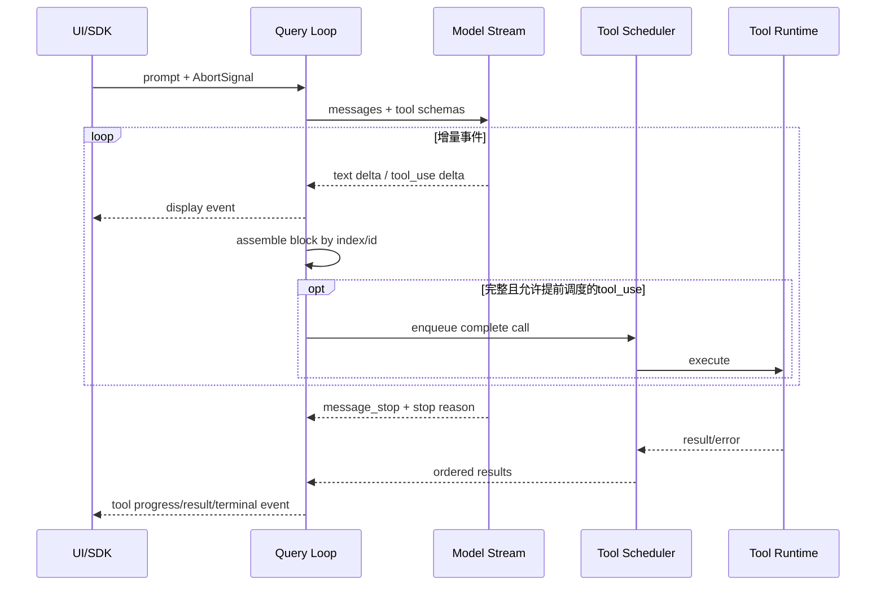
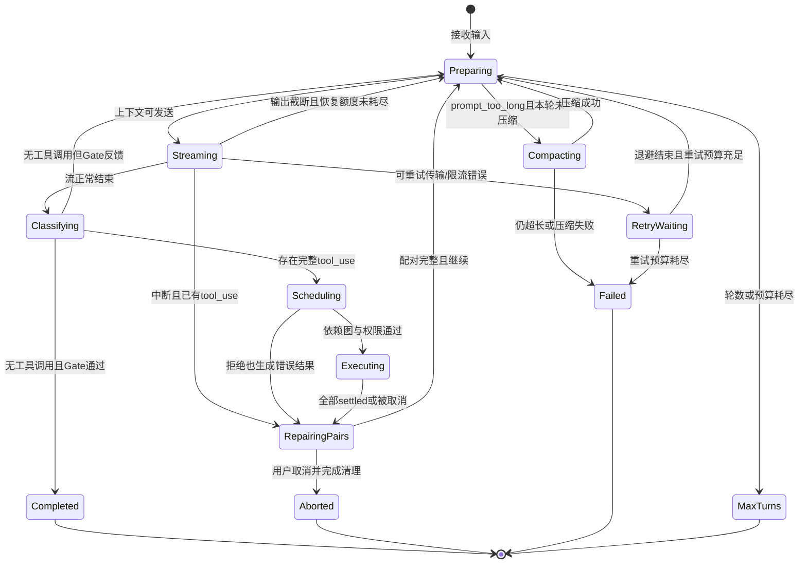

# Claude Code Query Loop：流式事件、工具配对与完整状态机

- 原文：[Claude Code 主循环 Query 图解：一轮对话是怎么跑起来的？](https://xiaolinnote.com/claudecode/source/cc_query_loop.html)
- 一句话结论：生产 Query Loop 的核心不是 `while true`，而是维护事件顺序和 `tool_use/tool_result` 配对，在副作用、重试、压缩、中断与预算之间做可恢复且有界的状态转换。
- 源码可信度和版本边界：原网页于 2026-09-11 读取；其中 `ask`、`QueryEngine.submitMessage`、`query`、`queryLoop`、退出原因和恢复阈值均是**二手材料**。本文不持有、不复制未授权 Claude Code 源码；仓库中的 `LoopHarness` 等真实 Python 代码只用于验证通用机制，与真实 Claude Code 不等价。

## 1. 正常路径只占问题的一小部分

最小循环确实是“请求模型、执行工具、回灌结果、再次请求”。生产实现还必须回答：流尚未结束时能否启动工具、取消后如何补齐协议、哪些错误能重试、超长上下文如何只压一次，以及何时停止烧钱。

| 路径 | 最小 Demo | 生产 Harness |
| --- | --- | --- |
| 模型输出 | 一次性字符串 | 增量事件、组装、取消与背压 |
| 工具调用 | 顺序执行函数 | Schema、授权、依赖、并发、超时、幂等 |
| 历史消息 | 直接追加 | 配对不变量、截断、压缩、持久状态 |
| 失败处理 | 抛异常 | 分类重试、结构化错误、清理、止损 |
| 完成判断 | 模型说完成 | 终止原因 + 客观 Gate |

## 2. `ask -> query -> queryLoop` 的职责链

原网页二手观察给出的链路是 `ask -> QueryEngine.submitMessage -> query -> queryLoop`。可迁移理解如下，不能据此断言当前产品仍使用同名函数：

```typescript
async function* ask(input) {                 // SDK/一次调用入口
  const engine = new QueryEngine(config)
  yield* engine.submitMessage(input)
}
async function* query(request) {             // 生命周期与事件包装
  const terminal = yield* queryLoop(request)
  return finalize(terminal)
}
async function* queryLoop(request) {          // 状态转换与工具回灌
  while (!request.state.terminal) yield* runTurn(request)
}
```

`yield*` 的架构价值是把内层事件接力给外层，同时让入口、会话和循环各自拥有清理责任。仓库参考实现没有这些函数，也不是异步生成器。

## 3. 流式事件必须区分“片段”和“已提交事实”



文字 delta 可以立即展示，但半个 JSON 参数不能执行。只有块完整、Schema 校验通过且调度策略允许时，才可把调用视为已提交动作。

## 4. 完整状态机：每个恢复动作都有上限



状态至少要显式保存消息、轮数、待配对 Call ID、压缩标志、输出恢复次数、分类重试次数、预算和取消信号；隐藏在闭包里的计数器很难恢复和审计。

## 5. `tool_use/tool_result` 是协议不变量

每个已提交的 `tool_use.id` 必须恰好对应一个 `tool_result.tool_use_id`。成功、参数错误、权限拒绝、超时和 Ctrl+C 都要给出结果；区别只是 `is_error` 与内容。

```python
def close_open_calls(tool_uses, settled_results, reason):
    by_id = {result.tool_use_id: result for result in settled_results}
    return [
        by_id.get(call.id) or {
            "type": "tool_result",
            "tool_use_id": call.id,
            "is_error": True,
            "content": f"not executed: {reason}",
        }
        for call in tool_uses
    ]
```

这段是协议修复伪代码，不是 Claude Code 源码。错误结果不是伪装成功，而是让下一轮消息仍合法，并明确告诉模型该动作没有完成。

## 6. 串行与并行要看依赖和副作用

| 情况 | 调度 | 必要保护 |
| --- | --- | --- |
| 多个独立只读调用 | 并行 | 每个 Call ID 独立归并，结果顺序稳定 |
| 模型流中已完成的只读块 | 可提前启动 | 参数块完整、允许取消、无后续依赖 |
| Edit 后 Test | 串行 | Test 必须观察 Edit 后状态 |
| 多个写调用 | 默认串行 | 锁、事务、幂等键或补偿策略 |
| 并发属性缺失 | 串行 | fail-closed，不从工具名猜安全性 |

仓库 `ToolRuntime.execute_many` 用线程池并行并按输入顺序返回，但不会区分读写；`ControlledToolRegistry` 也没有并发字段。因此它们不能证明“串并行调度已完成”。

## 7. 异常与重试必须先分类

| 失败类型 | 默认动作 | 可重试条件 |
| --- | --- | --- |
| 未知工具、Schema 错、缺审批 | 结构化错误回灌 | 不原样重试；先修参数或取得授权 |
| 网络断开、429、短暂 5xx | 指数退避加抖动 | 请求未产生不确定副作用且预算允许 |
| 工具超时 | 标记未知/失败并配对 | 只有确认幂等或能查询执行状态时 |
| `prompt_too_long` | 本轮压缩一次后重发 | 压缩后仍超长则停止，不循环压缩 |
| `max_output_tokens` | 提高上限或追加续写提示 | 有严格恢复次数；耗尽后终止 |
| Gate 失败 | 将证据反馈给下一轮 | 失败预算和无进展检测未触发 |
| Ctrl+C | 取消、收集 settled、补齐配对 | 不自动恢复副作用；由用户重新决定 |
| 最大轮数/Token/费用 | 结构化停止 | 只有调用方显式扩大预算后恢复 |

“重试”不是一个布尔值。至少要区分请求是否送达、工具是否开始、副作用是否提交，以及同一 Call ID 重放是否幂等。

## 8. 截断、中断与超长上下文

输出截断和输入超长是相反方向的问题：前者是响应没说完，后者是请求进不去。二手网页描述了升高输出上限、续写提示、反应式压缩和有限次数；具体阈值不能当成稳定 API。

Ctrl+C 也不是简单 `raise KeyboardInterrupt`：应传播取消信号，停止继续调度，等待或标记已启动调用，给所有开放 Call ID 补错误结果，写 Trace/Checkpoint，再返回 `aborted`。对于可能已写入外部系统的工具，状态应是“结果未知”，不能谎称已回滚。

## 9. 仓库四个对象怎样映射

映射依据是 [Agent/Harness 实现](../xiaolinnote_agent_engineering_analysis/examples/agent_engineering_reference.py) 与 [ToolRuntime 实现](../xiaolinnote_tools_analysis/examples/tooling_capabilities_reference.py)，不是 Claude Code 私有源码。

| 对象 | 对 Query Loop 的贡献 | 与产品级循环的差距 |
| --- | --- | --- |
| `LoopHarness` | `LoopState`、预算、重复检测、Gate、恢复、终止状态 | 同步 Policy；无流式、取消、消息协议和并发 |
| `ControlledToolRegistry` | 白名单、审批、Call ID 幂等、异常转结果 | 无 Schema、超时、`tool_result` 块和依赖调度 |
| `TraceRecorder` | 记录 start/resume、action、tool、gate、stop | 内存事件；无 token delta、流序号和持久后端 |
| `ToolRuntime` | 参数校验、超时、批量并行、调用结果 | 未接入 `LoopHarness`，无幂等和副作用分类 |

`LoopHarness` 的观察记录不是 Anthropic 消息，`ToolOutcome/ToolResult` 也不是 API 的 `tool_result`。只有语义相似，类型和协议均不等价。

## 10. 测试给出的真实证据

测试入口是 [test_agent_engineering_reference.py](../tests/test_agent_engineering_reference.py) 和 [test_tooling_capabilities_reference.py](../tests/test_tooling_capabilities_reference.py)：

- `test_loop_completes_only_after_independent_gate_passes`：Gate 失败会反馈并继续，第二次通过才完成。
- `test_token_budget_stops_before_unbounded_work`：Token 超限返回 `budget_exhausted`。
- `test_repeated_action_detection_blocks_a_stuck_loop`：连续第三次同指纹动作被阻断。
- `test_checkpoint_can_resume_in_a_fresh_context`：非终结的预算状态可从 JSON 恢复。
- `test_explicit_escalation_stops_without_claiming_completion`：升级不会冒充成功。
- `test_arguments_are_validated_before_execution`：缺少必填参数时函数不执行。
- `test_parallel_results_keep_call_order`：并发结果保持 Call ID 输入顺序。
- `test_timeout_returns_without_waiting_for_worker_shutdown`：超时快速返回，但没有证明线程已停止。

这些测试没有覆盖流式事件、Ctrl+C、消息配对、输出续写、上下文压缩或真实模型重试；文档不能把缺失测试写成已实现事实。

## 11. 面试问答

**Q1：为什么 `queryLoop` 适合异步生成器？**  
A：它能在最终结果前持续暴露文本、工具进度和终止事件，同时支持外层统一消费。

**Q2：收到 `tool_use` 的第一个 delta 就能执行吗？**  
A：不能；必须等 ID、名称和参数块完整，并通过 Schema、授权与调度检查。

**Q3：工具被拒绝为什么仍要 `tool_result`？**  
A：拒绝也是该 Call ID 的确定结果；配对后协议合法，模型才能调整方案。

**Q4：所有只读工具都能并行吗？**  
A：还要确认调用之间没有数据依赖、资源锁或一致性快照要求。

**Q5：工具超时后为什么不能总是自动重试？**  
A：调用可能已经提交副作用；非幂等重试会重复写入或发布。

**Q6：`prompt_too_long` 为什么只压缩一次？**  
A：防止压缩仍无效时进入昂贵死循环，并保留明确失败原因。

**Q7：Ctrl+C 后最重要的清理是什么？**  
A：停止新调度、处理已启动任务、补齐开放 Call ID、持久化真实的未知副作用状态。

**Q8：`LoopHarness` 就是 Claude Code 的 Query Loop 吗？**  
A：不是。它验证有界循环、Gate 和恢复思想，不含产品协议、流式模型或同名调用链。

## 12. 复习清单

- 能解释 `ask/query/queryLoop` 的职责链，同时标明它来自二手材料。
- 能区分流式 delta、完整内容块、已提交工具动作和终结事件。
- 能维护“每个 `tool_use` 恰好一个 `tool_result`”的不变量。
- 能按依赖、副作用、幂等和并发属性选择串行或并行。
- 能分别处理 Ctrl+C、输出截断、超长上下文、瞬时错误与预算耗尽。
- 能画出带 Compact、Retry、Repair、Abort 和 Gate 的完整状态机。
- 能准确说出四个仓库对象及八项测试的能力边界。
