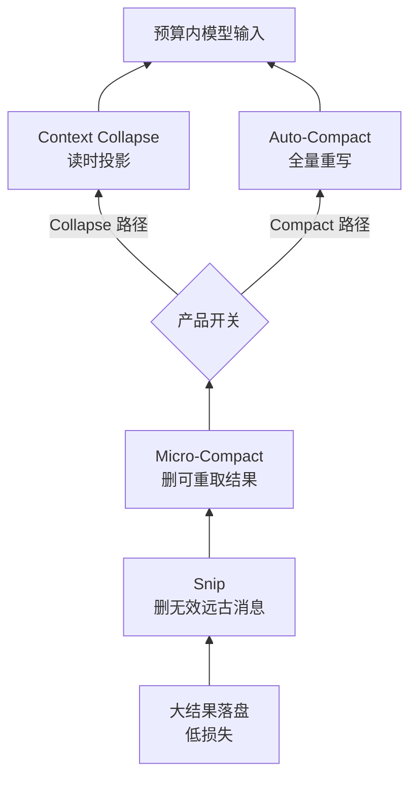
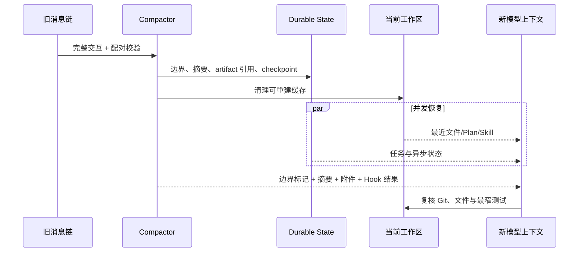

# Claude Code Compact：五层降载、协议不变量与可验证恢复

- 原文：[Claude Code 上下文管理图解：Compact 压缩机制怎么实现？](https://xiaolinnote.com/claudecode/source/cc_compact.html)
- 一句话结论：可靠的 Compact 不是粗暴删历史，而是按可恢复性从落盘、裁剪、投影升级到全量摘要，同时用工具配对、结构化状态和恢复测试守住接续能力。
- 源码材料与版本边界：原网页于 2026-09-11 读取；五层名称、阈值、内部函数名与产品行为均是原作者对特定时期 Claude Code 的二手观察，可能随版本或灰度开关变化。本文只提炼可迁移机制；本仓库 Python 代码与单测是离线教学参考，**不是 Claude Code 源码复刻，也不能验证其私有实现**。

## 1. 上下文压力不是“消息太多”这么简单

一轮 Agent 请求会携带系统规则、工具 Schema、用户消息、模型回复，以及成对出现的 `tool_use/tool_result`。真正迅速膨胀的通常是文件、日志和搜索结果；它们不仅首次返回时收费，后续每轮还会再次进入输入。

扩大窗口只能推迟问题：输入成本和 TTFT 上升，长序列还会出现注意力稀释与 Lost in the Middle。滑动窗口会误删早期约束，固定轮数摘要不理解信息价值，按相似度召回历史又可能破坏时序和工具配对。

因此压缩目标应写成两个可测条件：在预算内构造下一轮输入；压缩后仍能复述目标、约束、已完成工作、失败教训与下一步，并能从真实工作区恢复精确状态。

## 2. 五层不是五种摘要，而是损失逐级升级

| 层级 | 主要动作 | API 代价 | 活跃上下文的信息损失 | 恢复通道 |
| --- | --- | --- | --- | --- |
| 大结果落盘 | 完整结果写文件，只留预览和路径 | 无额外模型调用 | 模型暂时看不到全文 | 按路径再次 Read |
| Snip | 按消息 ID 删除已无用的远古片段 | 搭正常回合标记 | 被删语义不再可见 | transcript 或重新调查 |
| Micro-Compact | 清空较老、可重取的工具结果 | 本地处理 | 原观察值消失 | 重新执行只读工具 |
| Context Collapse | API 调用时生成压缩视图 | 依实现而定 | 模型只见投影，本地历史仍在 | 下一次重新投影 |
| Auto-Compact | 全量摘要并重组消息链 | 一次重型模型调用 | 原活跃历史被替换 | 摘要、附件、缓存重载 |



原网页特别指出 Collapse 与 Auto-Compact 是互斥路径，不应理解成必然叠加的第 4、5 步；公开构建也未必包含灰度中的 Collapse。

## 3. 大结果落盘与 Snip：先处理明显冗余

网页给出的观察是：单个工具结果超过约 50 KB 时，完整内容写到磁盘，消息只保留约 2 KB 预览；同一消息的工具结果总量还有约 200 KB 上限。这些数字不是稳定 API，但“内容寻址或文件落盘 + 小预览 + 可重读路径”很值得复用。

落盘并非零损失：字节仍在，但模型当前看不到被截部分；若文件会变化，恢复时还要保存内容哈希、版本或不可变快照，不能只留一个会漂移的路径。

Snip 更主动。二手材料称模型在正常回答回合中通过专用工具标记消息 ID，本地再删除并插入边界标记；它不另发摘要请求，但也不是完全不消耗模型注意力。删除单位必须是完整语义片段，不能从工具调用中间下刀。

## 4. Micro-Compact 与 Collapse：重取和投影的边界

原网页称 Micro-Compact 在距离上次 API 调用约 60 分钟时可独立触发，并在 Auto-Compact 前充当预处理：对 Read、Bash、Grep、Glob、WebSearch、Edit、Write 等可再次获取的旧结果，只保留最近约 5 个；子 Agent 输出、任务状态等不可重复信息不裁。

“可重取”必须按语义判定，而不是按工具名硬编码。Read 当前文件可能已被改写，Bash 可能读到变化的环境，Edit/Write 更有副作用；生产系统应保存调用参数、revision 和结果哈希，写工具结果默认不可重放。

Context Collapse 则不改本地原消息，只在发请求时构造投影。网页描述其约在窗口 90% 开始、95% 升级；这类阈值和功能可用性均需按实际版本复核。它的优势是可重新计算，风险是模型看到的因果链已不完整。

## 5. Auto-Compact：触发、互斥与信息损失

二手源码解读给出的计算是：有效窗口先为摘要输出预留约 20K token，再减 13K 安全缓冲，因此触发点距原始上限约 33K。20K 据称来自摘要输出 p99.99 的 17,387 token 再向上取整；13K 是独立保护，不应混为一个统计结论。

自动模式还应有三道止损：摘要来源为 `compact/session_memory` 时禁止递归触发；连续失败达到上限后熔断；同一轮只允许一次重型压缩。手动 `/compact` 可接受关注重点，自动压缩则应避免在摘要里生成会打断执行的新问题。

| 触发方案 | 可预测性 | 主要问题 | 适用判断 |
| --- | --- | --- | --- |
| 每 N 轮 | 高 | 空轮也压、关键轮也压 | 仅适合简单聊天基线 |
| 窗口百分比 | 中 | 窗口越大预留越浪费 | 输出预算随窗口同比增长时 |
| 固定剩余预算 | 高 | 需持续校准摘要尾部风险 | 摘要输出分布较稳定时 |
| 手动触发 | 由用户决定 | 可能太晚或频繁 | 任务里程碑、方向切换 |

Auto-Compact 是破坏性重写：语义进入摘要，精确状态走附件，永久规则下轮重载，系统提示重新构建。没有 transcript 或外部状态时，摘要遗漏通常无法从活跃消息链恢复。

## 6. `tool_use/tool_result` 是不能压坏的协议不变量

每个已提交的 `tool_use.id` 必须恰好有一个同 ID 的 `tool_result.tool_use_id`。成功、失败、拒绝、超时和外部化预览都是结果；压缩器不能保留调用却删除结果，也不能留下无来源的结果。

```python
def compact_tool_blocks(blocks, externalize):
	pairs = pair_by_call_id(blocks)  # 缺失、重复或乱序先报错
	compacted = []
	for tool_use, tool_result in pairs:
		if tool_result.size > RESULT_LIMIT:
			artifact = externalize(tool_result.content)
			tool_result = tool_result.with_content(
				f"full result: {artifact.path}; sha256={artifact.sha256}"
			)
		compacted.extend([tool_use, tool_result])
	assert every_tool_use_has_exactly_one_result(compacted)
	return compacted
```

这段是可迁移伪代码，不是 Claude Code 源码。压缩前后都应运行配对校验；若重读失败，返回结构化错误结果，也不要静默拼出非法历史。

## 7. 摘要 Schema：把“接着干”变成契约

原网页描述的摘要使用 XML 外壳和九部分清单，并特别强调枚举所有非工具用户消息、细粒度记录 Current Work。工程上可转成可校验 Schema：

```json
{
  "schema_version": 1,
  "primary_request": "用户最终目标与成功标准",
  "constraints": ["用户明确限制及后续变更"],
  "technical_concepts": ["关键设计与理由"],
  "files": [{"path": "src/a.py", "symbols": ["run"], "state": "modified"}],
  "errors_and_fixes": [{"error": "原错误", "fix": "已验证修复", "evidence": "test id"}],
  "user_messages": ["按时间顺序枚举非工具用户意图"],
  "pending_tasks": ["尚未完成且可验收的任务"],
  "current_work": {"location": "file:symbol", "last_action": "...", "next_check": "..."},
  "optional_next_step": "不引入新范围的下一步"
}
```

摘要器只能输出文本或结构化数据，不应借摘要机会调用工具。`files` 和 `errors_and_fixes.evidence` 要引用真实路径、测试或 artifact；“已修好”若无证据，只能记为待验证。

## 8. 消息重组与四条恢复通道



网页把压后消息概括为边界标记、摘要、附件和 Hook 结果。最近文件据称受“最多 5 个、每文件 5K token、总预算 50K”三重上限约束；它们是独立预算，不能由乘法反推出产品一定会注入 25K。

永久规则不应复制进易漂移摘要。网页称 `CLAUDE.md` 通过清空用户上下文缓存，在下一轮从磁盘重载；system prompt 也重新构造。通用原则是：规则、语义、运行状态和大 artifact 分别走重载、摘要、Checkpoint 和引用通道。

## 9. 精确映射当前仓库，而不是冒充产品实现

| 仓库对象 | 真实行为 | 对 Compact 的启发 | 明确不是 |
| --- | --- | --- | --- |
| `MarkdownAgentWorkspace.build_context` | 相关记忆排序、最近会话、字符预算；超限时截核心文件并丢最近会话 | 选择性装配和预算降级 | 五层压缩器、token 计数器、Claude 记忆加载器 |
| `AtomicCheckpointStore.save/load` | `LoopState` 写 `.tmp` 后 `Path.replace`，再从 JSON 恢复 | 精确进度应脱离聊天摘要持久化 | transcript、分布式事务、摘要生成器 |
| `LoopHarness.run` | 校验 `run_id/goal`，非终结状态可续跑 | 恢复先验证身份和状态 | Claude 会话 Resume 或 Auto-Compact |

源码锚点是 [agent_engineering_reference.py](../xiaolinnote_agent_engineering_analysis/examples/agent_engineering_reference.py)，方法背景见 [Harness 长文](../xiaolinnote_agent_engineering_analysis/5_harness_engineering_agent_runtime_reliability.md)。`MarkdownAgentWorkspace` 的预算单位是字符而非 token；`AtomicCheckpointStore` 也缺少锁、`fsync`、Schema 迁移、校验和及代码版本绑定。

## 10. 恢复测试：先证明能接力，再评摘要质量

[test_agent_engineering_reference.py](../tests/test_agent_engineering_reference.py) 提供三条真实证据：

| 测试 | 已证明 | 未证明 |
| --- | --- | --- |
| `test_checkpoint_can_resume_in_a_fresh_context` | 第一次一轮耗尽后，新 `LoopHarness` 读取观察并在第 2 轮完成 | 摘要保真、崩溃一致性、Claude 会话恢复 |
| `test_context_uses_relevant_memory_and_recent_sessions` | 命中 Alice/Python 记忆，只取最近一次会话，并保留指令 | token 级预算、五层策略、语义摘要质量 |
| `test_workspace_blocks_path_escape_and_deduplicates_memory` | 阻止 `../secret.txt`，重复记忆不追加 | 敏感信息脱敏、并发写、多租户隔离 |

真正的 Compact 契约还应新增：随机生成工具块验证配对不变量；在每个压缩边界后重放“当前任务下一步”；注入需求反转、失败修复和未完成副作用，测 Schema 字段召回；修改被引用文件后确认 hash/revision 漂移被发现。当前测试没有这些用例，本文不把建议写成已完成。

## 11. Compact 与 Clean Context 不是一回事

| 维度 | Compact | Clean Context + Durable Handoff |
| --- | --- | --- |
| 连续性来源 | 同一会话的摘要与附件 | 新会话读取版本化状态、代码和证据 |
| 适合 | 短中任务临近预算、当前方向仍可信 | 长任务里程碑、上下文污染或人员/Agent 交接 |
| 主要风险 | 摘要遗漏并被后续放大 | Handoff 陈旧、环境已变化 |
| 恢复动作 | 重组消息后继续 | 重新读规则、Checkpoint、Git diff、测试 |
| 验证重点 | 摘要保真和工具配对 | 工作区身份、版本、副作用和基线 |

Clean Context 不是 `/clear` 后凭记忆重来。正确流程是先原子写目标、约束、产物、失败、下一步和验证命令；新上下文再从真实仓库与测试反证交接内容。短任务用 Compact 保持流畅，长任务在稳定里程碑做干净交接，两者可以协作而不是互斥口号。

## 12. 面试问答

**Q1：为什么不能只扩大上下文窗口？**  A：成本、TTFT 和注意力稀释仍在，且工具结果会跨轮重复占用输入。

**Q2：五层的共同设计原则是什么？**  A：先处理可外部化、可删除、可重取的信息，最后才用有损全量摘要。

**Q3：Snip 和 Auto-Compact 的主要差别？**  A：Snip 搭正常回合按 ID 删除局部旧消息；Auto-Compact 另起重型摘要并重组整条活跃消息链。

**Q4：Collapse 和 Auto-Compact 会同时运行吗？**  A：按原网页二手材料，它们由开关选择且互斥；实际版本必须现场确认。

**Q5：为什么工具结果不能随便裁？**  A：`tool_use/tool_result` 是按 Call ID 配对的协议单元，断对会让下一轮历史非法或因果缺失。

**Q6：摘要最容易漏什么？**  A：用户中途改变的约束、刚失败的方案、精确文件/符号、未完成副作用和下一条验证命令。

**Q7：Checkpoint 能替代摘要吗？**  A：不能；Checkpoint 保存精确运行状态，摘要保存语义脉络，二者解决不同问题。

**Q8：怎样证明压缩后真的能恢复？**  A：用配对属性测试、状态重放、需求反转样本、artifact 漂移检测和真实测试 Gate，而不是只看摘要读起来顺。

## 13. 复习清单

- 能按损失成本解释大结果落盘、Snip、Micro、Collapse、Auto-Compact 五层。
- 能说明固定剩余预算、递归守卫、熔断和手动/自动触发的版本边界。
- 能维护每个 `tool_use` 恰好一个 `tool_result`，包括拒绝、超时和外部化结果。
- 能写出包含目标、约束、文件、错误、用户消息、待办和 Current Work 的摘要 Schema。
- 能区分摘要、附件、规则重载、artifact 与 Checkpoint 五类恢复来源。
- 能准确复述 `MarkdownAgentWorkspace`、`AtomicCheckpointStore` 及三项测试证明和未证明的内容。
- 能根据任务长度与污染程度选择 Compact 或 Clean Context，并在恢复后重新验证真实环境。
- 始终明确本文是机制分析与教学映射，不是 Claude Code 源码复刻。
