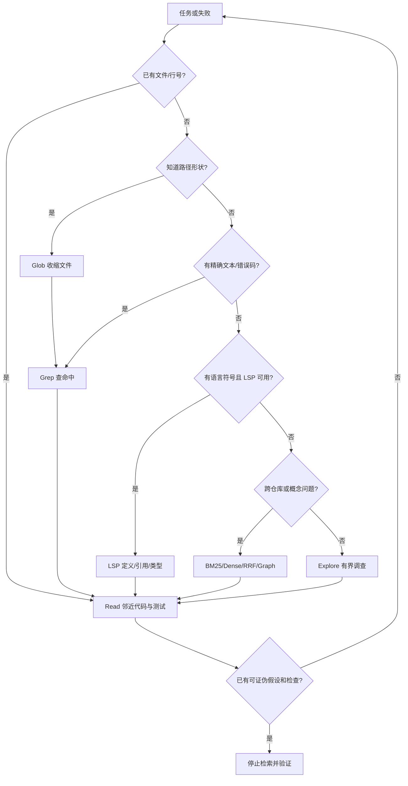
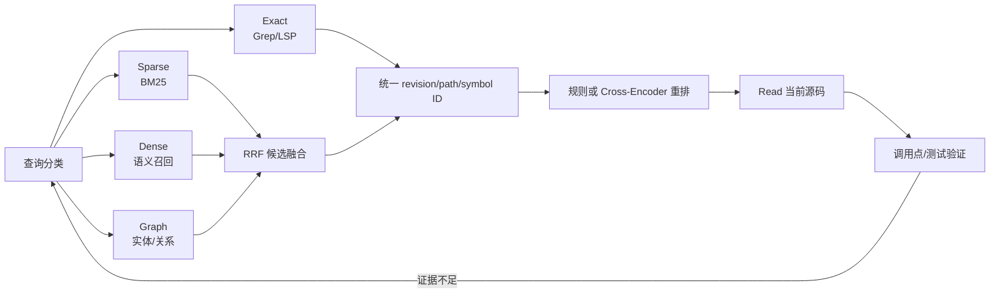

# Claude Code 代码检索：实时搜索、语义索引与有界探索

- 原文：[Claude Code 代码检索图解：为什么用 grep 而不用 RAG？](https://xiaolinnote.com/claudecode/source/cc_grep.html)
- 一句话结论：代码搜索没有单一银弹；精确锚点优先走 Glob/Grep/LSP/Read，开放式调查交给有界 Explore，跨仓库语义与历史知识再引入 BM25、Dense、RRF 或图检索，最终都回到当前源码和测试核验。
- 源码材料与版本边界：原网页于 2026-09-11 读取；其中工具限制、默认行数、结果上限、Explore 提示和内部路径均是原作者对特定时期 Claude Code 的二手观察。本文加入的 LSP、混合检索与评测是可迁移工程设计；本仓库参考类是离线教学代码，**不是 Claude Code 源码复刻，也不证明产品采用相同实现**。

## 1. 代码检索先问“要找哪种关系”

“登录逻辑在哪”可能包含五种不同问题：文件名像什么、哪个文本出现过、某符号定义在哪里、谁调用它、哪个模块在语义上负责认证。把它们都塞给向量 Top-K，或都交给一个宽泛 Grep，都会制造假阳性。

可靠搜索从具体锚点开始：文件、符号、报错原文、失败测试、配置键或业务入口。每轮只获取足以形成一个局部假设的证据，并明确下一次查询怎样推翻它；找到控制行为的实现和最窄验证后就停止搜索。

代码库还持续变化。任何索引命中都应携带 repository、revision、path、symbol/range 和 indexed_at；缺少版本的“相关代码”只能算候选，不能直接成为编辑依据。

## 2. 从便宜确定性工具逐级升级



这不是固定流水线。已知符号时 LSP 可先于 Grep；语言服务未就绪时退回文本搜索；RAG 或 Explore 给出的路径仍必须 Read 当前工作树。

## 3. Glob、Grep、Read 各自只做一件事

| 工具 | 最适合 | 输出应包含 | 不能证明 |
| --- | --- | --- | --- |
| Glob | 文件名、扩展名、目录形状 | 路径、截断标记、排序依据 | 文件内容与业务语义 |
| Grep | 字面量、正则、错误码、配置键 | 文件、行号、上下文、匹配总数 | 同名符号身份与调用关系 |
| Read | 核实控制流、类型、注释和邻近测试 | 明确 offset/limit、剩余范围 | 未读取区间没有相关内容 |

原网页称 Glob 结果按修改时间倒序且最多约 100 个；Grep 基于 ripgrep，支持内容、仅文件和计数模式；Read 默认最多约 2000 行并可用 offset/limit 分段。这些是版本化产品观察，不是应写死到所有实现的常量。

三件套的价值在组合：Glob 先降低文件候选数，Grep 将候选收缩到行，Read 只读命中附近及所属定义。若一开始就 Read 整个大文件，会把“定位问题”错误地变成“消耗上下文”。

## 4. 忽略与截断是安全契约，不是性能小项

尊重 `.gitignore` 能避开依赖、构建产物和大二进制，但 `.gitignore` 不是安全策略，也不是事实边界：被忽略的本地配置、生成代码或 fixture 可能正是故障来源。搜索被忽略内容必须显式请求、受路径授权，并在结果中标记来源。

宿主至少要限制根目录、解析符号链接后再次校验、默认拒绝秘密目录、限制文件类型/字节/匹配数/时间，并把工具输出视为不可信数据。命中的注释或 README 可能包含提示注入，不能覆盖系统权限。

截断必须可见。返回“前 100 项”时同时给出 `truncated=true`、总数或下页游标；否则模型会把不完整结果误判为全量事实。宽查询被截断后应收紧路径/模式，而不是偷偷提高上限直至上下文爆满。

```json
{
  "root": "approved/repository/root",
  "query": "AuthService|E4012",
  "include": ["src/**/*.py"],
  "include_ignored": false,
  "max_results": 40,
  "max_bytes": 60000,
  "revision": "working-tree+HEAD",
  "response": {"matches": [], "truncated": false, "next_cursor": null}
}
```

这是建议的搜索契约，不是当前仓库或 Claude Code 的 Schema。

## 5. LSP 负责符号语义，Grep 负责文本事实

LSP 能用解析器和类型系统回答定义、引用、实现、类型层级、重命名影响和调用层级。对“所有 `parse_config` 调用点是否兼容新签名”，语义引用通常比文本抽样更可靠，也能跟随 import alias。

它仍会漏报：反射、字符串注册、模板、宏、生成代码、条件导入和语言服务未纳入的目录都可能不在符号图中；索引也可能尚未刷新。Grep 可找配置键和动态名字，构建/测试可观察运行事实，三者应交叉验证。

原网页的主线是 Glob/Grep/Read 和 Explore；本文把 LSP 加入路由，不代表特定 Claude Code 版本必然内置某种 LSP。当前仓库的 Python 参考文件也没有实现语言服务器、AST 索引或语义重命名。

## 6. Explore 与 Agentic Search：隔离过程，不隔离证据责任

简单定向查询由主 Agent 直接完成；开放式问题需要跨多个模块、比较多个假设时，Explore 子 Agent 可拥有独立上下文和只读工具池，把大量中间命中压缩成 findings。原网页提到“预计超过 3 次查询再派 Explore”，应视为提示词启发式，而非稳定协议阈值。

Explore 返回值至少包含：结论、文件/符号位置、使用的 revision、反例、未决问题和建议验证。只给“认证模块大概在 service 层”的摘要无法审计。子 Agent 也不应默认拥有写权限或无限递归派生能力。

Agentic Search 的强项是闭环修正：空结果就换词，读到 import 就追定义，发现假设不符就回退。它的风险同样来自循环：错误起点会连续放大调用、Token 和时间，因此必须限制迭代、重复查询、累计读取字节和无进展轮数。

```python
for step in range(max_steps):
	action = planner(goal, evidence, unresolved)
	if repeated(action) or budget_exhausted():
		return escalate(evidence, unresolved)
	result = execute_read_only(action)
	evidence = deduplicate_by_revision_path_range(evidence, result)
	if has_controlling_code(evidence) and has_disconfirming_check(evidence):
		return findings_with_citations(evidence)
return incomplete_findings(evidence)
```

这是有界搜索伪代码，不是 Claude Code Query Loop。

## 7. RAG 不是禁用项，而是有适用边界

| 场景 | 首选路线 | 原因 |
| --- | --- | --- |
| 当前工作树里的精确符号/错误码 | Grep + LSP + Read | 实时、确定、可解释 |
| 动态注册或配置驱动行为 | Grep + 运行验证 | 语义索引可能看不到字符串关系 |
| 跨仓库概念、设计文档、历史 ADR | BM25 + Dense + RRF | 词法与语义错误模式互补 |
| 多跳依赖、实体关系问题 | 图检索 + Read | 显式扩展关系，再回链源码 |
| 不知道关键词的开放调查 | Explore/Agentic Search | 多轮改写查询并隔离上下文 |

RAG 的典型风险是 chunk 切断结构、索引陈旧、近似命中替代精确身份、权限过滤不一致和冷启动。它适合相对稳定、带版本和出处的知识层；对刚修改的文件，索引结果只能引路，不能替代磁盘读取。

“不用 RAG”也不能被升格为哲学口号。巨型多仓库、自然语言概念查询、代码加 Wiki 混合检索时，纯 Grep 的召回和延迟都可能更差；选择应由查询分布和评测决定。

## 8. 一套可落地的混合检索策略



Dense 与 BM25 原始分数不可直接相加；RRF 只融合各路线名次：

$$RRF(d)=\sum_{r\in routes}\frac{w_r}{k+rank_r(d)}$$

精确命中可单独设置 must-include，而不是让它与模糊召回竞争。融合前统一稳定 ID、revision 和 ACL，路线内部先去重；融合后用 Read 核验当前文件，再由测试决定是否找到真正控制路径。

## 9. 五个仓库对象的精确映射

| 对象 | 当前真实行为 | 在搜索系统中的位置 | 关键缺口 |
| --- | --- | --- | --- |
| `BM25Index` | 统计词频、文档频率、长度归一化，以 $k_1=1.5,b=0.75$ 默认值排序 `Chunk` | Sparse 候选召回 | 非代码 tokenizer；无 revision、ACL、增量和短语语义 |
| `reciprocal_rank_fusion` | 默认 $k=60$，按排名累加并以 ID 稳定排序 | 多路线候选融合 | 无权重、ACL、路线内去重和重排 |
| `DualLevelGraphIndex` | 实体 Local、关系 Global、Hybrid 去重；无向 BFS 受 `max_depth/max_nodes` 限制 | 关系候选与多跳扩展 | 仅子串词法；无 AST、Embedding、实体抽取和删除 |
| `MarkdownAgentWorkspace` | 相关记忆和最近会话按字符预算装配 | 可承载搜索摘要 | 不是代码索引、Glob/Grep 或 LSP |
| `AtomicCheckpointStore` | `LoopState` 经临时 JSON 原子替换后恢复 | 可借鉴长调查的进度接力 | 当前状态无搜索 frontier/revision；不是搜索引擎 |

实现分别位于 [rag_capabilities_reference.py](../xiaolinnote_rag_analysis/examples/rag_capabilities_reference.py) 与 [agent_engineering_reference.py](../xiaolinnote_agent_engineering_analysis/examples/agent_engineering_reference.py)。尤其要注意：`DualLevelGraphIndex` 的 Local 命中实体后附带相邻关系并给关系半分，Global 只按关系文本子串计分；它不是 GraphRAG/LightRAG 或代码知识图谱。

`run_agentic_rag` 还演示了动态查询、最大迭代、重复查询停止和按 `chunk_id` 去重；它接收普通 `Chunk` Retriever，没有调用 Glob/Grep/LSP，也不能修改代码，因此只能映射“有界多轮检索”这个控制形状。

## 10. 真实测试证据与未证明事项

| 测试 | 可复现断言 | 没有证明 |
| --- | --- | --- |
| `test_bm25_prefers_exact_rare_term` | 查询 RTX 4090 功耗时，包含精确稀有词的 `b` 排首位 | 大代码库性能、中文分词通用性 |
| `test_rrf_rewards_cross_route_hits` | 两路都靠前的 `b` 融合后第一 | 加权路线、重复 ID、业务相关性 |
| `test_local_and_global_retrieval_use_entities_and_relations` | Local 首项是实体；Global 能命中 `Vendor A->PII` | 语义向量、真实代码调用图 |
| `test_entity_upsert_preserves_provenance_and_multi_hop_is_bounded` | 同实体合并两来源；`max_depth=1` 只给两条一跳路径 | Alias 消歧、删除、并发更新 |
| `test_agentic_rag_is_bounded_and_deduplicates_context` | 查询 `first/second` 后完成，重复 Chunk `a` 被去重 | Explore 隔离、工具安全、搜索最优性 |
| `test_hit_rate_and_mrr_separate_recall_from_rank` | 固定样本 Hit@2 为 $2/3$、MRR 为 $0.5$ | 线上任务成功率和延迟 |

测试入口是 [test_rag_capabilities_reference.py](../tests/test_rag_capabilities_reference.py) 和 [test_agent_engineering_reference.py](../tests/test_agent_engineering_reference.py)。它们证明小样本控制逻辑可运行，不证明仓库存在代码向量库、Claude Code 集成或生产级混合检索。

## 11. 评测：从“搜到了”走到“改对了”

离线集应按问题类型分层：精确符号、错误文本、同名符号、动态注册、跨文件调用、概念查询、多跳关系、刚修改文件、被忽略文件和恶意搜索结果。每个样本冻结 revision，并标注控制代码、必要上下文和允许的替代路径。

检索层记录 Recall/Hit@K、MRR、NDCG、stale-hit rate、ACL/ignore 违规、截断率；过程层记录首次正确锚点时间、工具轮数、读取字节、Token 和 Explore 次数；任务层记录补丁正确率、最窄测试通过率、无关编辑和人工复核时间。

至少对比 Grep-only、LSP-only、BM25、Dense、RRF Hybrid、Graph Expansion 和 Agentic/Explore。评测查询不能泄漏文件名答案；同一时间预算下比较，并单列“无答案时正确停止”，否则宽召回会靠多读文件虚增命中。

## 12. 面试问答

**Q1：为什么代码搜索优先 Grep/LSP 而非默认 Dense？**  A：符号、错误码和当前工作树要求精确、实时且可解释；Dense 更适合概念相似召回。

**Q2：Glob、Grep、Read 的正确顺序固定吗？**  A：不固定；按已知锚点选择最便宜工具，目标是尽快收缩到局部源码。

**Q3：Grep 和 LSP 谁更可靠？**  A：前者覆盖文本与动态字符串，后者理解符号身份；两者都有盲区，应由 Read 和测试收口。

**Q4：尊重 `.gitignore` 就安全吗？**  A：不是；它只表达版本控制意图，安全还需根目录、路径、秘密、字节和权限限制。

**Q5：何时值得派 Explore？**  A：问题开放、跨模块且需要多轮调查时；简单精确查询直接搜索更快、更易审计。

**Q6：RRF 为什么不用原始分数？**  A：BM25、Dense 和图路线分数尺度不同，按名次融合避免未经校准的直接相加。

**Q7：`DualLevelGraphIndex` 是代码知识图谱吗？**  A：不是；它是实体/关系的词法教学索引，没有 AST 调用图或官方 GraphRAG/LightRAG 能力。

**Q8：搜索系统最终应优化什么？**  A：不是单看 Recall，而是在预算内找到控制路径、完成正确修改并通过客观测试。

## 13. 复习清单

- 能按文件形状、精确文本、语言符号、概念和关系问题选择首个工具。
- 能解释 Glob/Grep/Read 的输出上限、显式截断、忽略规则与路径安全。
- 能用 LSP 查语义关系，也知道反射、生成代码和陈旧索引的盲区。
- Explore findings 必须带 revision、路径、反例和未决问题，Agentic Search 必须有预算与停止条件。
- 能说明 RAG 适合跨仓库语义与知识层，当前源码仍要 Read 和测试核验。
- 能写出 BM25/Dense/Graph 候选经 RRF、重排、Read、测试收口的混合策略。
- 能精确映射五个仓库对象，并复述六项真实测试的证据边界。
- 能设计同时覆盖召回、过程成本、陈旧/权限风险和任务成功的评测集。
- 始终明确本文是可迁移方法与教学映射，不是 Claude Code 源码复刻。
