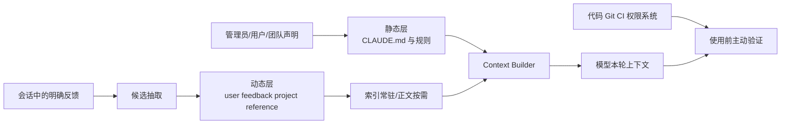
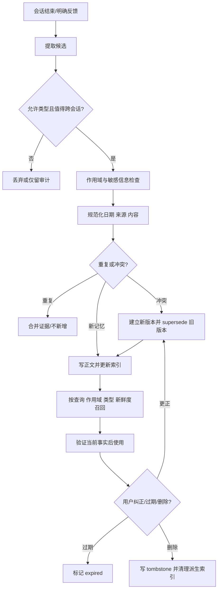

# Claude Code 记忆机制：CLAUDE.md、动态记忆与生命周期治理

- 原文：[Claude Code 记忆机制图解：为什么不用向量数据库？](https://xiaolinnote.com/claudecode/source/cc_memory.html)
- 一句话结论：可靠的 Agent 记忆不是“把历史都存起来”，而是把声明式规则与学习式记忆分层，并用类型、作用域、索引、召回、去重、纠错、删除、新鲜度和隐私边界约束完整生命周期。
- 二手源码及版本边界：原网页于 2026-09-11 读取；其中 Claude Code 的六层加载、自动抽取、Top-5、截断阈值和 stale 提示均是作者对特定版本的二手观察，本文未持有或验证其私有源码。可执行结论只来自本仓库 Python 参考实现与测试，两者不是 Claude Code 复刻。

## 1. 先区分四种证据

| 陈述 | 依据 | 可以证明 | 不能证明 |
| --- | --- | --- | --- |
| Claude Code 产品机制 | 原网页 | 作者观察到的行为与内部命名 | 当前版本仍保持相同阈值或函数 |
| 可迁移设计 | 本文分析 | 一套可审查的 Memory Service 方案 | 产品已经如此实现 |
| 仓库文件工作区 | `MarkdownAgentWorkspace` 与两项测试 | 文件加载、词法筛选、去重、路径边界 | CLAUDE.md 或自动记忆已实现 |
| 仓库长期记忆 | `SQLiteMemoryStore` 与测试 | 用户作用域、更新、检索、过期、软删除 | Claude 四类型或模型抽取已实现 |

LLM 每次调用仍是无状态计算；当前会话历史属于短期上下文，跨会话可复用信息才进入长期记忆。二者混写会让压缩、恢复和遗忘语义失真。

## 2. 两层记忆的责任边界



| 维度 | CLAUDE.md 静态层 | 自动记忆动态层 |
| --- | --- | --- |
| 来源 | 人或组织显式维护 | Agent 从交互中提炼 |
| 内容 | 稳定命令、约束、协作方式 | 用户画像、反馈、项目动态、外部指针 |
| 加载 | 按层级或路径注入 | 索引可见，正文按需召回 |
| 权威性 | 仍需消除冲突并用 Gate 强制 | 只是历史快照，必须检查新鲜度 |
| 删除责任 | Git/文件 Review | 用户可见、可纠正、可遗忘、可审计 |

边界原则是：静态层回答“默认应怎样做”，动态层回答“过去学到了什么”；代码、权限、库存和部署状态仍以实时事实源为准。

## 3. CLAUDE.md 是声明层，不是自动学习层

原网页二手描述 Managed、User、Project、Local、AutoMem、TeamMem 六个加载来源；前四类主要是显式规则，后两类承载自动记忆入口。它们是叠加关系，不应依赖模型猜测冲突优先级。

`@include` 可减少规则复制，`.claude/rules/` 的 `paths` 可按文件范围加载；但循环引用、路径逃逸、错误 glob 和超长内容都要由宿主治理。网页所述 `MEMORY.md` 最多 200 行且最多 25,000 字节是版本化二手阈值，不是通用常量。

规则应写 Action、Scope、Why、Verification。能用类型、权限、Hook、测试或 CI 强制的约束，不应只靠 Markdown 劝模型遵守；密钥和客户数据更不应进入规则文件。

## 4. 动态记忆只允许四种语义

| 类型 | 回答的问题 | 合适示例 | 主要失效方式 |
| --- | --- | --- | --- |
| `user` | 用户是谁、具备什么背景 | 熟悉 Go，初学 React | 身份或能力变化 |
| `feedback` | 用户确认什么做法好或坏 | 集成测试不要用 mock | 偏好被撤回或存在例外 |
| `project` | 项目近期发生什么 | 2026-09-18 前冻结合并 | 截止日经过、计划变化 |
| `reference` | 去哪里查询权威信息 | 故障在 Linear 项目中跟踪 | 链接、系统或权限变化 |

`feedback` 和 `project` 应保留 Why 与 How to apply；相对日期要转为带时区的绝对时间。代码结构、Git 历史、一次性工具输出和当前待办不应重复保存，因为仓库或运行状态才是权威来源。

```yaml
id: mem_0182
type: feedback
name: integration-tests-use-real-db
description: 数据迁移集成测试使用真实数据库
scope: tenant-a/user-7/project-x
source: conversation:turn-42
created_at: 2026-09-11T08:30:00Z
valid_until: null
supersedes: null
status: active
content: |
	规则：迁移集成测试连接真实数据库。
	Why：mock 曾掩盖生产迁移失败。
	How to apply：仅适用于数据库集成测试，纯函数单测除外。
```

这是一份可迁移 Schema，不是 Claude Code 文件格式的逐字段还原；`id/scope/supersedes/status` 是为纠错、租户隔离和删除补上的治理字段。

## 5. 从候选到遗忘的完整生命周期



原网页称抽取发生在 Query Loop 结束后的后台 Fork Agent，并复用 Prompt Cache；这是产品二手观察。生产实现还应记录抽取模型/版本、原始证据、同意依据和每次变更事件。

## 6. 索引与召回：先缩小候选，再加载正文

网页描述每条记忆一个 Markdown 文件，`MEMORY.md` 只列 `name + description` 并常驻上下文；选择器读取候选头部后挑少量文件，再加载完整正文。Top-5、前 30 行和 Sonnet 都是可变化的实现选择。

可迁移的检索顺序应是：先做 `tenant/user/project` 强过滤，再过滤 `status/type/valid_until`，随后按相关性、重要度和新鲜度排序，最后受 Token 预算截断。权限过滤绝不能放在向量或模型选择之后。

小候选集适合让模型做可解释选择；规模扩大后可用 BM25/向量做候选生成，再由规则或模型重排。是否使用向量库是容量与延迟决策，不是记忆系统是否可靠的分界线。

## 7. 去重、更正与删除不能只改正文

写入前至少比较规范化类型、作用域、实体键和内容指纹。原网页提到 `hasMemoryWritesSince` 避免重复抽取，但没有证明完整的跨会话冲突合并协议。

更正不应静默覆盖审计历史：新记录引用 `supersedes`，旧记录变为 `superseded`；实体事实可保留稳定 ID 并更新当前值。删除应写作用域内 tombstone，正文、索引、缓存、备份保留策略和派生 embedding 都要同步处理。

```sql
BEGIN;
UPDATE memories
SET status = 'superseded'
WHERE tenant_id = :tenant AND user_id = :user
	AND memory_id = :old_id AND status = 'active';
INSERT INTO memories(memory_id, tenant_id, user_id, status, supersedes, content)
VALUES (:new_id, :tenant, :user, 'active', :old_id, :corrected_content);
DELETE FROM memory_index
WHERE tenant_id = :tenant AND user_id = :user AND memory_id = :old_id;
COMMIT;
```

这是事务语义示意；真实删除还要满足法规、备份和审计策略，不能承诺普通 `DELETE` 已擦除所有副本。

## 8. 新鲜度：记忆是快照，不是事实

网页描述两天前的记忆会附 stale 提醒，并要求涉及文件、函数或 flag 时先检查。具体两天阈值不是普适标准；`project` 应更短，稳定 `user` 偏好可更长，`reference` 则要做链接健康检查。

推荐同时使用 `created_at`、`last_confirmed_at`、`valid_until` 和来源版本。召回分数可以含时间衰减，但衰减不能替代硬过期；当记忆与代码、Git、数据库或用户当前陈述冲突时，后者优先，并触发更正流程。

## 9. 租户与隐私边界必须先于相关性

项目目录隔离不等于多租户隔离。共享机器、符号链接、备份、日志、模型供应商和跨项目索引都可能泄漏记忆；任何外部网页内容也不能自动晋升为长期规则。

生产边界至少包括：租户与用户复合键、服务端强制过滤、最小权限、静态/传输加密、敏感类型 denylist、保留期限、导出/纠正/遗忘接口、审计日志和派生索引清理。不要把密钥、认证材料、健康或财务等敏感信息默认写入。

## 10. 两个仓库实现的精确映射

| 对象 | 当前真实能力 | 与 Claude Code 主题的边界 |
| --- | --- | --- |
| [`MarkdownAgentWorkspace`](../xiaolinnote_agent_engineering_analysis/examples/agent_engineering_reference.py#L67) | 固定五个核心文件；安全相对路径；相同文本去重；词项交集选记忆；最近会话；字符上限 | 不是 CLAUDE.md Loader；无四类型、frontmatter、时间、租户、更正或删除 |
| [`SQLiteMemoryStore`](../xiaolinnote_agent_analysis/examples/agent_capabilities_reference.py#L160) | `tenant_id + user_id` 过滤；实体事实 UPSERT；三类追加记忆；有效期；软删除；相关度/重要度/新鲜度排序 | 类型是 entity/episodic/semantic/procedural，不是 user/feedback/project/reference；无自动抽取、`MEMORY.md` 索引或模型重排 |

两者彼此独立，没有被接成“文件源数据 + SQLite 派生索引”。因此不能把各自能力相加后声称仓库已有完整 Memory Service。

## 11. 测试证据与剩余缺口

[工作区测试](../tests/test_agent_engineering_reference.py#L22) 证明查询只选词项相关行、只保留最近 session、阻止 `../secret.txt`，并对完全相同的记忆去重。它没有覆盖符号链接竞态、并发写、语义重复或敏感内容。

[记忆库测试](../tests/test_agent_capabilities_reference.py#L20) 证明 Alice 搜索不到 Bob 的记录，Bob 无法忘记 Alice 的记录，Alice 软删除后不再召回；实体 `language` 更新保持同一 ID，且不覆盖 Bob。测试没有覆盖跨租户同名用户、TTL 边界、排序质量、事务并发或物理擦除。

[LangGraph 记忆测试](../tests/test_agent_capabilities_langgraph.py#L20) 进一步证明召回按用户作用域，`MemorySaver` 的两个 `thread_id` 状态分开；线程隔离仍不等于租户安全，因为安全边界来自 Store 查询参数而不是 Checkpointer 名称。

## 12. 面试问答

**Q1：CLAUDE.md 与动态记忆最根本的区别？**  
A：前者是显式维护的声明式默认规则，后者是从交互提炼的可过期历史快照。

**Q2：四种动态记忆分别解决什么问题？**  
A：`user` 管画像，`feedback` 管行为偏好，`project` 管时效性动态，`reference` 管权威信息入口。

**Q3：为什么索引常驻而正文按需？**  
A：让模型知道“有什么”而不承担全部正文 Token，只展开本轮确定相关的少量内容。

**Q4：为什么权限过滤必须早于语义召回？**  
A：未授权候选即使最后未展示，也可能进入模型、日志或缓存，构成跨租户泄漏。

**Q5：怎样处理用户纠正旧偏好？**  
A：写新版本、关联被替代记录、停用旧版本并同步索引，保留可审计来源。

**Q6：stale 警告能否保证正确？**  
A：不能；它只改变模型姿态，仍要查询代码、Git、数据库或用户当前陈述。

**Q7：`SQLiteMemoryStore` 是否实现 Claude 四类型？**  
A：没有；它使用另一套教学分类，只验证作用域和生命周期控制的部分原则。

**Q8：为什么“已从召回消失”不等于彻底删除？**  
A：软删除、缓存、索引、日志和备份仍可能保留副本，擦除必须覆盖完整数据链。

## 13. 复习清单

- 能区分短期上下文、CLAUDE.md 声明层与动态记忆层。
- 能解释 user、feedback、project、reference 的写入条件和失效方式。
- 能画出抽取、过滤、去重、写入、索引、召回、验证、更正与删除闭环。
- 能说明索引常驻、正文按需与行数/字节双预算的原因。
- 能把新鲜度提示与权威事实验证分开。
- 能设计租户、用户、项目作用域和隐私删除链路。
- 能逐项说清两个参考类及三组测试证明和未证明的行为。
