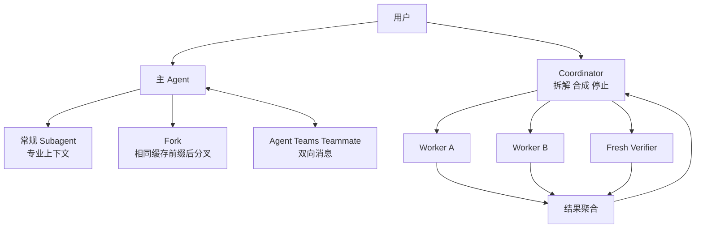

# Claude Code Multi-Agent：Subagent、Fork、Agent Teams 与 Coordinator

- 原文：[Claude Code 多 Agent 图解：SubAgent 实现机制怎么做？](https://xiaolinnote.com/claudecode/source/cc_multi_agent.html)
- 一句话结论：Multi-Agent 的难点不是“多调几次模型”，而是为每种拓扑定义隔离、缓存、消息、取消、失败、深度、预算、终止和独立验收协议，并由 Coordinator 对全局结果负责。
- 二手源码及版本边界：原网页于 2026-09-11 读取；其中工具黑名单、`createSubagentContext`、Fork 缓存参数、Agent Teams 信箱、自动后台阈值和 Coordinator 开关均是特定版本的二手观察。本文未持有或验证 Claude Code 私有源码；本仓库只有单进程 Python 控制面参考，编辑器环境存在某个工具也不构成项目代码实现证据。

## 1. 先把四种拓扑拆开

| 形态 | 父/协调者角色 | 子任务上下文 | 通信 | 适用场景 |
| --- | --- | --- | --- | --- |
| 常规 Subagent | 主 Agent 仍做主任务 | 专用 prompt 与工具、独立历史 | 派发后返回结果；后台时完成通知 | 搜索、调研、专项分析 |
| Fork Subagent | 主 Agent 分出另一条尝试 | 继承父前缀与工具以命中缓存 | 分叉后独立运行并回传 | 需要完整父上下文的旁路任务 |
| Agent Teams | Lead 管理可持续 Teammate | 独立上下文与可恢复 transcript | 父到子信箱 + 子到父通知 | 运行中追加指令、长期协作 |
| Coordinator | 主 Agent 只拆解、派发、合成 | 扁平 Worker，各自局部上下文 | 异步派发、收集、续派或停止 | 大任务并行扇出/汇聚 |

Agent Teams 与 Coordinator 不是同义词：前者补充持续双向通信，后者改变主 Agent 的职责。Fork 也不是“更轻的任意 Subagent”，它受缓存前缀一致性约束。

## 2. 拓扑决定控制权与故障域



父子树适合临时委派，扁平 Coordinator 适合并行。P2P 网状协作会放大路由环、权限扩散和终止判定，除非业务确实需要自治协商，否则生产系统宜先保持中心化。

## 3. 默认 Subagent 与 Agent Teams 的通信边界

按原网页，默认 Subagent 更像重型工具调用：父给一次任务，子独立执行，完成后以结果返回；长任务可转后台并向父发送完成通知。父在子运行中不能自然追加指令。

Agent Teams 打开后，父可将消息追加到目标任务的 `pendingMessages`，子在循环边界取走并作为新输入；已停止的子可从 transcript 恢复。这个双向信箱不能外推为所有 Subagent 的默认能力。

完成通知使用文本/XML 包装是网页二手观察。可迁移重点不是 XML，而是消息必须带身份、关联、状态和资源使用，且只能由宿主生成可信字段。

## 4. 上下文隔离要按字段决策

隔离不是全复制或全清空。网页描述的策略是：读文件缓存克隆以免污染父视图，全局 UI 写入关闭，后台任务登记通路保留，Agent ID 独立且深度递增。

工程上应把状态分为四类：不可变配置可共享；局部缓存复制；全局可变状态通过窄接口更新；密钥与高风险工具按最小权限重新授权。子 Agent 不应自动继承“派生更多 Agent、询问用户、停止他人任务”等控制权。

上下文隔离也不是安全沙箱。相同进程、文件系统、环境变量和网络仍可能共享；真正隔离需要进程/容器、凭据作用域、路径和网络策略。

## 5. Fork 的缓存契约与失效条件

网页称 Fork 要复用父 Agent 已渲染的 system prompt、用户上下文、系统上下文、工具定义顺序和消息前缀；任何影响缓存键的字节差异都可能失配。具体缓存价格、TTL 和命中规则以模型供应商当前文档为准。

Fork 适合“保留全部上下文，另试一条路”，不适合需要更小工具集或不同角色 prompt 的专家任务。缓存命中只能降低前缀成本，不能降低后续输出、工具调用和重复劳动；也不能让父子共享可变状态。

缓存遥测至少记录 `prefix_hash`、命中状态、缓存读写 Token、分叉点和总成本。不要记录原始秘密来换取可观测性。

## 6. Coordinator 必须理解，而不是转发

Coordinator 的职责是拆分依赖、选择 Worker、并行派发、吸收发现、形成下一批具体规格、聚合失败并最终验收。它不应把 Worker 原话无脑拼接，也不应把所有工作重新做一遍。

Continue 还是 Spawn 取决于上下文相关性：紧接同一证据链可续用原 Worker；任务无关、旧路径已偏或需要独立审查时应创建干净 Worker。实现者不能担任唯一验收者。

并行收益只来自独立任务。若三个步骤耗时 $t_1,t_2,t_3$，理想并行关键路径接近 $\max(t_i)$，但实际还要加派发、排队、汇总和重试开销；强依赖步骤强行并行只会制造竞态。

## 7. 消息协议要可关联、幂等和演进

```json
{
  "message_id": "msg_123",
  "run_id": "run_42",
  "task_id": "task_auth_review",
  "parent_task_id": "task_release",
  "sender": "coordinator",
  "recipient": "reviewer-2",
  "type": "task.assigned",
  "attempt": 1,
  "depth": 1,
  "deadline": "2026-09-11T12:00:00Z",
  "budget": {"max_tokens": 12000, "max_tool_calls": 30},
  "payload_ref": "artifact://spec/auth-review-v2",
  "reply_to": "mailbox://run_42/coordinator",
  "schema_version": 1
}
```

大产物用引用而不是反复复制正文。消费者按 `message_id + attempt` 幂等处理；未知 Schema 版本 fail-closed；状态转换采用 `pending -> running -> completed|failed|cancelled|timed_out`，终态不可被迟到成功消息覆盖。

## 8. 取消传播与失败聚合

```python
async def run_batch(tasks, cancel_scope):
    outcomes = await gather_settled(tasks, cancel_scope)
    if cancel_scope.cancelled:
        await stop_new_dispatches()
        await request_cooperative_cancel(tasks)
    report = aggregate(outcomes)  # success, failed, cancelled, timed_out, unknown
    await persist(report)
    return report
```

这是协议伪代码，不是仓库实现。取消应从用户/Coordinator 向所有后代传播：停止新派发、通知正在运行的 Worker、等待宽限期、强制终止可控进程，并把可能已提交副作用的任务标为 `unknown` 而非假称回滚。

聚合不能只抛“第一个异常”。应保存每个任务的终态、错误类别、证据、消耗和产物；策略再决定 fail-fast、等待全部、接受部分结果还是启动补偿。Sibling 失败是否取消其他 Worker，取决于它们的结果是否仍有价值和副作用是否可停止。

## 9. 深度、预算与死锁防护

深度限制阻止递归派生，预算限制总 Token、费用、工具调用、并发数、墙钟时间、失败和 Handoff。预算应由父任务向子任务分配并守恒，不能让每个 Worker 都重新获得完整上限。

死锁不仅是线程锁：A 等 B 的消息、B 等 A 的批准；所有 Worker 都等待 Coordinator，而 Coordinator 等“全部完成”；任务占满并发槽后又同步创建子任务，都会形成等待环。

防护包括：DAG 环检测、等待图与 deadline、邮箱非阻塞发送、有界队列、保留调度容量、heartbeat/lease、无进展检测和可升级人工接管。超时是一种失败分类，不等于底层工作已停止。

## 10. 四个仓库控制面的精确映射

| 对象 | 已实现 | 明确未实现 |
| --- | --- | --- |
| [`HybridRouter`](../xiaolinnote_agent_analysis/examples/agent_capabilities_reference.py#L646) | 静态规则优先；动态结果必须在 allowlist；越权走 fallback | 不调用真实 LLM；无置信度、预算、权限上下文或路由解释 |
| [`HandoffGuard`](../xiaolinnote_agent_analysis/examples/agent_capabilities_reference.py#L692) | 目标白名单、最大 Handoff、连续同目标环检测、路由事件 | 无 Agent 深度、状态指纹、deadline；A/B 循环主要靠预算终止 |
| [`DAGOrchestrator`](../xiaolinnote_agent_analysis/examples/agent_capabilities_reference.py#L827) | 校验依赖环；只执行依赖已验收的 ready batch；线程并行；绑定输出；有界 Replan；原子写快照 | 无真实 Agent 上下文/工具隔离、取消、超时、全局 Token 预算；Checkpoint 无加载恢复；失败只抛一个主错误 |
| [`LangGraphMultiAgentRouter`](../xiaolinnote_agent_analysis/examples/agent_capabilities_langgraph.py#L617) | `Command(goto=...)` 路由；Worker 回调；受 Guard 保护的 Handoff；事件、终态和 `MemorySaver` | 顺序路由而非并行团队；无消息信箱、Fork、Prompt Cache、取消传播或独立模型 Worker |

`WorkerRegistry` 中的 Worker 是可注入 Python 回调，不因命名为 researcher/writer 就自动成为独立 Agent。仓库也没有项目级 `runSubagent` 实现；编辑器宿主提供同名或相似工具，与仓库源代码是两个证据域。

## 11. 测试证据、失败语义与独立验收

[参考实现测试](../tests/test_agent_capabilities_reference.py#L104) 证明 DAG 在执行前拒绝环、绑定上游输出、写 Checkpoint，并在一次预算内对验收失败 Replan；路由测试证明动态越权回退和 Handoff 预算终止。

[LangGraph 测试](../tests/test_agent_capabilities_langgraph.py#L188) 证明越权动态路由落到 allowlisted Worker，researcher 可显式 Handoff 给 writer，A/B 循环在预算耗尽后返回 `failed`。这些测试没有创建模型会话、进程或消息队列。

`DAGOrchestrator.check_acceptance` 用确定性路径和值检查区分“执行成功”和“业务通过”，这是有效 Gate；但它不是独立 Agent。独立验收应让全新上下文读取规格、diff 和真实测试结果，且不能继承实现者的未验证结论。单独的 Reflection 工作流虽接受 evaluator，也没有自动接入 DAG 或 Router。

同一 ready batch 中一个 Worker 失败时，其余已启动 Worker仍会完成；结果都写入状态后，Orchestrator 选择首个失败应用策略。这是批次收集，不是完整的取消传播或多错误报告 API。

## 12. 面试问答

**Q1：常规 Subagent、Fork 和 Agent Teams 的关键差别？**  
A：分别强调专业隔离、缓存前缀继承和运行中双向消息，不能混成一种机制。

**Q2：Agent Teams 与 Coordinator 相同吗？**  
A：不同；Teams 提供持续协作通路，Coordinator 则让主 Agent 专职拆解、调度与合成。

**Q3：为什么上下文隔离要按字段做？**  
A：全共享会污染父状态，全清空会丢失取消和任务登记等必要通路。

**Q4：Fork 为什么可能命中 Prompt Cache？**  
A：它复用父请求的稳定前缀；任一影响缓存键的内容或顺序变化都可能失配。

**Q5：取消后为什么要保留 `unknown` 状态？**  
A：调用方停止等待不代表外部副作用停止，贸然标记 cancelled/rolled_back 会制造错误事实。

**Q6：如何防止 Agent 递归和死锁？**  
A：收回派生权限，限制深度与总预算，并用 DAG、deadline、等待图和无进展检测终止等待环。

**Q7：`DAGOrchestrator` 是否已经是生产 Multi-Agent？**  
A：不是；它是单进程 Worker 控制面，缺少独立模型上下文、消息、取消、超时和权限隔离。

**Q8：怎样做到独立验收？**  
A：让未参与实现的干净上下文按原规格检查真实产物，并以测试/运行行为等客观 Gate 为主。

## 13. 复习清单

- 能画出 Subagent、Fork、Agent Teams 和 Coordinator 四种拓扑。
- 能说清默认完成通知与 Teams 双向信箱的版本边界。
- 能按共享、克隆、屏蔽、窄接口四类设计上下文状态。
- 能解释缓存前缀、分叉点及命中遥测。
- 能设计可关联、幂等、可演进的任务消息 Schema。
- 能定义取消传播、部分失败、未知副作用与失败聚合策略。
- 能用深度、预算、deadline、DAG 和无进展检测防递归与死锁。
- 能逐项说明四个仓库类及相关测试证明和未证明的行为。
- 能明确区分编辑器工具能力与项目源码实现。
