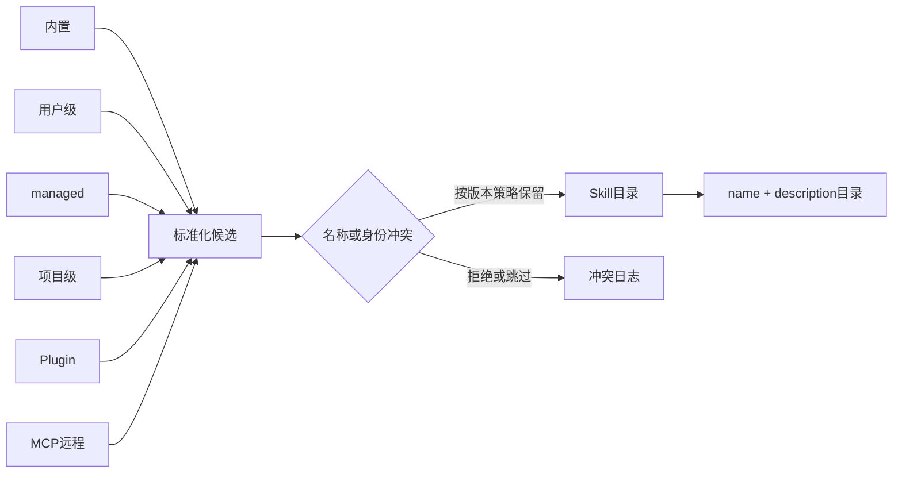
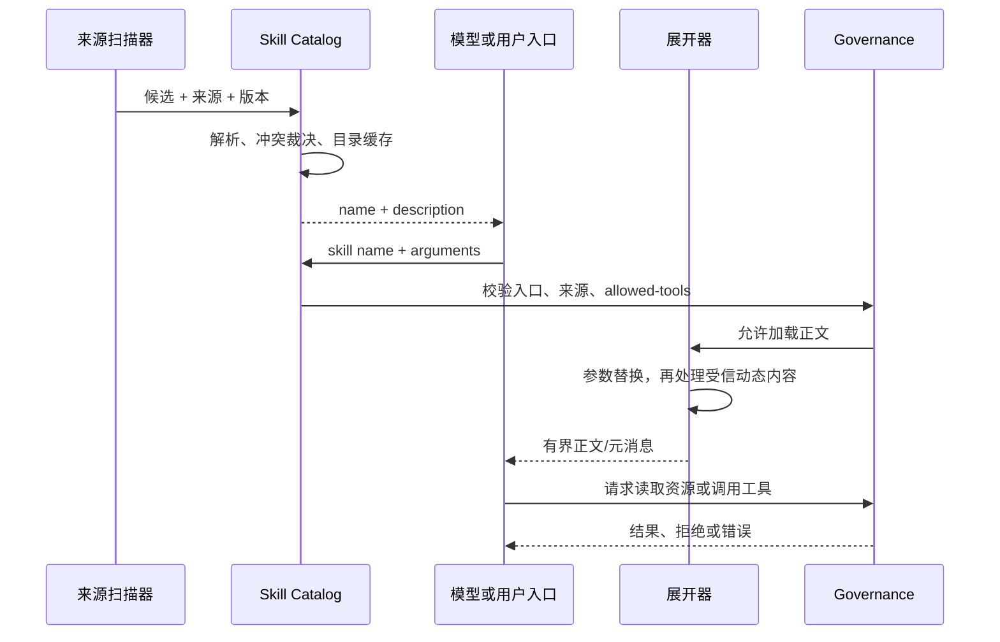
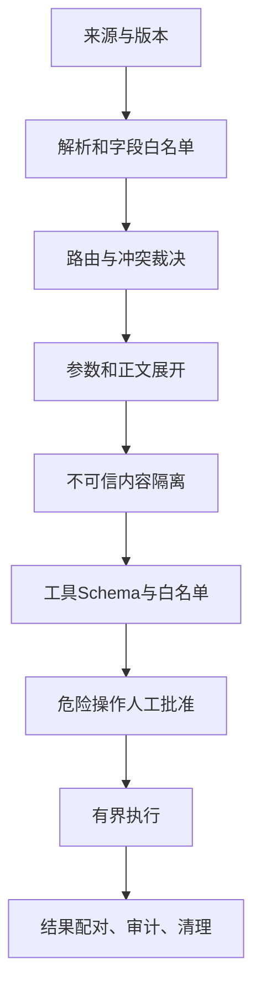

# Claude Code Skill 运行时：扫描、展开、缓存与信任链

- 原文：[Claude Code Skill 原理图解：几个 Markdown 文件，怎么做到按需加载？](https://xiaolinnote.com/claudecode/source/cc_skill.html)
- 一句话结论：Skill 运行时不是“读取一个 Markdown”，而是把来源发现、冲突裁决、元数据路由、参数与正文展开、作用域清理、缓存保护和工具授权串成一条受控加载链。
- 来源可信度与版本边界：原网页于 2026-09-11 读取，其 Claude Code 内部路径、常量、顺序和消息形状来自作者对非官方材料的二手分析，不能当成当前产品 API；本文不复制相关源码。可执行结论只来自本仓库 Python 参考实现与单测，它们不是 Claude Code 的复刻。

## 1. 本篇与第 06 篇怎样分工

[第 06 篇](06_agent_skills_progressive_disclosure.md) 站在 Skill 作者视角，回答 description 怎样写、正文怎样拆、脚本怎样治理、团队怎样度量。
本篇站在宿主运行时视角，追踪一个 Skill 从“在哪里被发现”到“何时退出作用域”的完整生命周期。

| 文档 | 主问题 | 明确不承担 |
| --- | --- | --- |
| 06 | 作者如何设计可触发、可维护、可验证的 Skill | 不还原产品内部扫描和注入 |
| 16 | 宿主如何扫描、裁决、展开、注入、授权和清理 | 不重复写作教程或把二手常量当标准 |
| 当前仓库 | 验证最小 Catalog、Runtime 与 Registry 行为 | 不证明 Claude Code 产品实现 |

因此，“三阶段披露”是两篇的交点；06 解释内容怎么分层，16 解释运行时什么时候搬运哪一层。

## 2. 先把证据分成四级

| 等级 | 本文中的例子 | 可下结论 |
| --- | --- | --- |
| A：本地代码加测试 | `SkillCatalog`、`ToolRuntime`、`ControlledToolRegistry` | 可复现其具体行为 |
| B：本地代码未覆盖测试 | 题目标注后端生产配置门禁 | 可说明实现，不夸大回归保障 |
| C：原网页二手观察 | 多来源顺序、提示缓存、元消息注入 | 只能带版本边界转述 |
| D：本文设计建议 | 临时 Hook 的 `finally` 清理、来源签名 | 只能写“应该”，不能写“产品已经” |

这一级别表能防止最常见的错误：拿本地教学类去“佐证”未授权产品源码，或把网页示意目录写成仓库事实。

## 3. 扫描来源、优先级与冲突

原网页的正文列出内置、用户、项目、Plugin、MCP 五类来源；其代码片段又出现 managed 目录，因此材料本身没有证明“恰好只有五类”。
可安全转述的路径只有网页明确给出的用户级 `~/.claude/skills/` 与项目级 `.claude/skills/`；不要虚构仓库根目录 `skills/`。

| 来源 | 信任起点 | 网页给出的运行时观察 | 应有治理 |
| --- | --- | --- | --- |
| 内置 | 产品发行物 | 随版本注册 | 版本清单、发布签名 |
| 用户级 | 本机用户配置 | 早于项目级参与冲突裁决 | 文件所有者、变更审计 |
| managed | 组织策略路径 | 只在网页片段出现，分类未讲清 | 管理员来源、只读挂载 |
| 项目级 | 当前仓库 `.claude/skills/` | 可沿项目范围发现 | 代码评审、固定提交 |
| Plugin | 已安装分发包 | 随插件提供 | 固定版本、权限清单 |
| MCP | 远程 Server | 动态提供内容 | 默认不信任、禁止本地命令展开 |

网页声称冲突按固定扫描顺序“先到先得”，后到重名项跳过并记录日志，并明确举例用户级先于项目级。
这只是该页面对应版本的观察，不应推广为永久优先级；可靠宿主应把最终来源、版本和冲突决定暴露给审计。



## 4. Frontmatter 是运行时契约

网页把 `name`、`description` 视为主要发现字段，并提到 `when_to_use`、`allowed-tools`、`model`、`disable-model-invocation`、`user-invocable` 等版本相关字段。
它们分别影响路由、执行能力和人工/模型入口，但网页没有给出稳定、完整的 Schema，不能据此接受任意键。

```yaml
---
name: dependency-review
description: 检查依赖升级、锁文件变化与兼容性风险；不处理普通代码风格。
disable-model-invocation: true
allowed-tools: [Read, Grep]
---
```

这只是安全写法示意，不表示当前仓库解析后三个可选字段。
本地 `SkillCatalog._parse` 只解析单行 `key: value`，要求 `name`、`description` 非空，其他字段会进入临时字典后被忽略；它不是 YAML 解析器。

## 5. 从触发到正文注入的生命周期

网页把手动 `/name args` 与模型自主选择描述为同一 Command/Skill 的两个入口。
模型自主选择依赖可见目录中的描述，不等于向量检索；匹配是否正确仍是概率判断，宿主必须再次校验入口开关和权限。



正文进入上下文只增加知识，不自动增加权限；`allowed-tools` 即使存在，也应被解释为权限上限而不是绕过宿主审批的通行证。

## 6. 参数生命周期与正文展开

按原网页观察，参数先进入 Skill 调用，再替换正文中的 `$ARGUMENTS`，之后本地受信来源才可能执行嵌入命令并把输出写回正文。
这个顺序意味着参数既可能进入命令，也可能进入模型上下文，必须同时防 Shell 注入、路径越界、超大输出和秘密回显。

```python
def expand_skill(skill, arguments, policy):
	body = substitute_arguments(skill.body, arguments)
	if policy.may_expand_commands(skill.provenance):
		body = run_bounded_commands(body, cwd=skill.directory)
	return inject_as_incremental_context(body)
```

这是可迁移伪代码，不是 Claude Code 源码。
安全实现还应把原始参数、规范化参数、命令、退出码、截断信息和最终正文摘要关联到同一 Call ID；任何一步失败都不能退化为执行未展开的危险文本。

## 7. 缓存的是稳定前缀，不是权限决定

网页称目录元数据可位于稳定上下文，而命中后的完整正文以增量元消息追加，以减少系统提示词变化造成的 Prompt Cache 失效。
缓存优化只回答“哪些 token 可复用”，不回答“内容是否仍可信”。Skill 文件、Plugin 版本、MCP 会话或策略变化后，目录缓存必须按来源指纹失效。

建议缓存键至少包含：规范化路径或 Server 身份、内容哈希、解析器版本、策略版本和模型可见字段。
不要缓存审批结果、临时凭据或“这个远程来源上次可信”的判断；这些必须在每次调用边界重新计算。

## 8. 临时 Hook 必须绑定调用作用域

原网页没有给出临时 Hook 注册与清理的可核验源码，本地参考实现也没有 Hook 分发器；以下只能作为运行时设计要求。
若某版本允许 Skill 声明 Hook，宿主应在 Skill 激活后注册，在对应 Tool Use/任务作用域内生效，并在成功、拒绝、异常、取消时统一清理。

```python
handle = hook_runtime.register(scoped_hooks, scope=tool_use_id)
try:
	return execute_skill()
finally:
	hook_runtime.unregister(handle)
```

缺少 `finally` 会让临时策略泄漏到后续任务；复用全局 Hook 名称会造成并发会话串扰。
Hook 输入还需最小化、脱敏、限时，并明确失败时 fail-open 还是 fail-closed；它不能因为来自 Skill 就继承更高权限。

## 9. 从内容来源到工具副作用的信任链



网页提出“远程 MCP Skill 不执行嵌入命令”是重要边界，但“本地”也不天然可信：项目文件可能来自未审查分支，Plugin 可能被更新，符号链接可能逃逸。
完整信任链应把来源可信度与动作能力分开：内容可以被阅读，不代表其中的指令可以调用 Shell、读取密钥或联网。

## 10. 精确映射当前仓库与测试

[SkillCatalog 实现](../xiaolinnote_tools_analysis/examples/tooling_capabilities_reference.py) 的真实链路是 `scan -> load_instructions -> read_asset`。
它只扫描调用方传入根目录的直接子目录 `*/SKILL.md`，按名字排序；同一次扫描的重复 `name` 会抛错，不存在多来源优先级、描述预算、参数替换、命令展开、缓存或 Hook。

[ToolRuntime 实现](../xiaolinnote_tools_analysis/examples/tooling_capabilities_reference.py) 提供工具白名单、参数 Schema 子集、危险审批、线程超时和批量并行；超时不会保证工作线程或副作用已停止。
[ControlledToolRegistry 实现](../xiaolinnote_agent_engineering_analysis/examples/agent_engineering_reference.py) 提供工具白名单、危险审批和幂等 Call ID 缓存，但没有参数 Schema、超时、来源信任或 Hook。

| 测试 | 真正证明 | 没有证明 |
| --- | --- | --- |
| [SkillCatalog 测试](../tests/test_tooling_capabilities_reference.py) `test_skill_is_loaded_progressively_and_blocks_path_escape` | 元数据/正文/资源分步读取，`../secret.txt` 被拒 | 自动触发、多来源优先级、脚本沙箱 |
| 同文件四项 `ToolRuntimeTests` | 缺参拒绝、危险审批、并行顺序、快速超时 | 幂等、写操作并发安全、强制取消 |
| [Registry 测试](../tests/test_agent_engineering_reference.py) `test_dangerous_tool_requires_approval_and_call_id_is_idempotent` | 未批准发布被拒，同 Call ID 不重复执行 | 参数与 Call ID 绑定、跨进程幂等 |

## 11. 面试问答

**Q1：扫描到 Skill 就会加载正文吗？**  
A：不会。目录发现只应暴露路由元数据，命中后才读取正文，附属资源再按需读取。

**Q2：项目级一定覆盖用户级吗？**  
A：不能这么说；原网页对应版本反而描述用户级先到先得，而本地 `SkillCatalog` 根本没有跨来源覆盖。

**Q3：为什么正文追加比改系统提示词更利于缓存？**  
A：稳定前缀可复用，命中内容作为增量进入；这是成本优化，不是安全隔离。

**Q4：`$ARGUMENTS` 替换为什么是安全边界？**  
A：参数可能进入命令和上下文，需做类型、路径、长度、转义和脱敏控制。

**Q5：远程 Skill 为什么不能直接展开命令？**  
A：远程文本跨越供应链边界；允许其驱动本地 Shell 会把内容注入升级为代码执行。

**Q6：临时 Hook 最重要的不变量是什么？**  
A：只在当前调用作用域生效，并在所有退出路径确定性注销。

**Q7：`SkillCatalog` 有缓存吗？**  
A：只有扫描后的内存 metadata 字典；它没有内容哈希、TTL、文件监听或多来源失效协议。

**Q8：两个 Runtime 为什么不能假装已统一？**  
A：`ToolRuntime` 有 Schema/超时，`ControlledToolRegistry` 有 Call ID 幂等，类型和调用方也不同。

## 12. 复习清单

- 能区分 06 的作者设计视角与 16 的宿主生命周期视角。
- 能列出网页提及的来源，同时指出 managed 分类与“五类”叙述并不完全一致。
- 不虚构仓库根目录 `skills/`，只写产品路径或调用方传入的 Catalog 根目录。
- 能解释冲突裁决、目录缓存、Prompt Cache 和权限缓存是四个不同问题。
- 能画出参数替换、受信展开、增量注入、资源读取和工具审批顺序。
- 临时 Hook 有作用域、超时、脱敏、失败策略和 `finally` 清理。
- 能准确说出三个本地类与三组测试分别证明及未证明什么。
- 所有产品内部细节都标为 2026-09-11 网页二手观察，不复制未授权源码。
