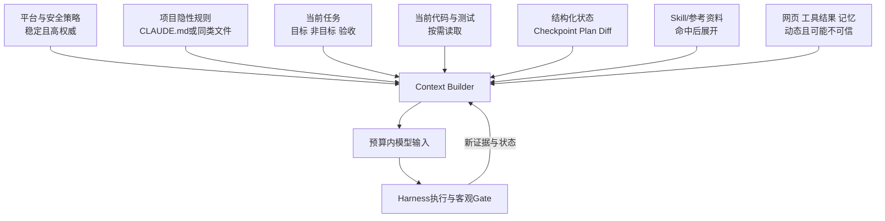
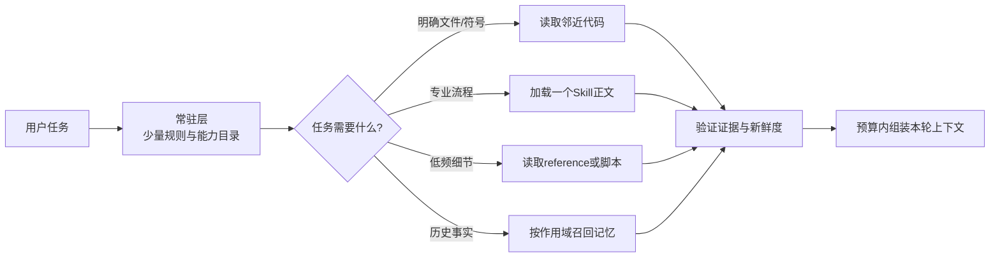

# Claude 5 上下文工程：规则减法、信息路由与质量评测

- 原文：[Claude 5 上下文工程：为什么提示词越写越少？](https://xiaolinnote.com/claudecode/insights/claude5_context_engineering.html)
- 一句话结论：上下文工程不是把资料尽量塞满，而是在每轮调用前选择最相关、最权威、最新且能被验证的信息；模型变强后可以删掉重复流程和可从代码推断的规则，但安全边界、项目隐性事实和验收标准不能删。
- 证据与版本边界：原网页于 2026-09-11 读取，其中 Claude 5、GPT-5.6 Sol、系统提示词缩减比例及评测收益属于特定产品、模型和资料来源，本文没有独立复现实验，不把数字当普遍规律。当前仓库没有 Claude Code 的系统提示词、根目录 `CLAUDE.md` 或产品 Skill 运行时；本地 Python 代码只用于演示可迁移机制。

## 1. Prompt、Context、Harness 不是同一层

Prompt 是本轮怎样表达目标；Context 是模型本轮实际能看到的全部信息；Harness 则决定如何选择上下文、调用模型、执行工具、验证、止损和恢复。

$$
Context_t = Policy + ProjectRules + Task_t + Evidence_t + State_t + ToolContracts
$$

这些部分的权威性不同：平台安全策略高于项目文档，项目文档高于外部网页；当前代码和测试通常比几天前的记忆更新。把所有文本拼成一个大字符串，却不标来源和时效，会让模型自己解决本应由宿主解决的冲突。



## 2. 规则越多为什么可能越差

规则膨胀常从“模型错一次，加一句永远禁止”开始。半年后会出现四类成本：

1. **冲突成本**：项目要求复杂模块写文档，旧规则却禁止创建 Markdown。
2. **注意力成本**：真正关键的生产禁令埋在大量风格偏好中。
3. **维护成本**：同一要求在规则、Skill 和工具描述重复，修改时容易漂移。
4. **机会成本**：固定步骤阻止模型读取附近实现后作出更合适的局部判断。

Token 多不等于信息多。可以用一个启发式优先级表示上下文价值：

$$
Priority(i)=\frac{Relevance(i)\times Authority(i)\times Freshness(i)\times RiskImpact(i)}{TokenCost(i)}
$$

它不是模型质量的精确公式，而是提醒工程师：高相关、高权威、高风险的信息应先保留；低频、可重取、重复内容应延迟加载。

## 3. 五类信息应该去哪里

| 信息 | 例子 | 最合适的位置 | 原因 |
| --- | --- | --- | --- |
| 每轮都必须知道 | 构建命令、禁止访问生产、关键兼容约束 | 精简项目规则 | 模型无法稳定从代码推断 |
| 可由环境强制 | 权限、路径范围、发布审批、格式检查 | Runtime、Hook、CI、类型系统 | 确定性机制比自然语言可靠 |
| 低频专业流程 | 发布、迁移、代码审查清单 | Skill/按需文档 | 不占每轮预算 |
| 实时事实 | 当前函数、测试输出、Git diff | 工具读取 | 避免静态规则过期 |
| 临时进度 | 已完成、阻塞、下一步、失败证据 | Checkpoint/任务状态 | 可跨压缩和新会话恢复 |
| 可删除噪声 | 技术栈一眼可见、重复规则、已失效补丁 | 不注入 | 代码或工具可直接回答 |

“删规则”不是把控制交给概率模型。能用权限、Schema、测试和事务表达的硬边界，应从 Prompt 下沉到代码；仍需要语义判断的项目知识才留在上下文。

## 4. 从动作禁令改成判断标准

网页用注释规则说明范式变化。旧写法规定“永远不写多行注释”，新写法要求先观察当前模块的注释密度和复杂度，再保持一致。

判断标准适合风格、命名、抽象程度和解释密度，因为代码库本身提供了证据。绝对规则仍适合密钥、生产写入、数据删除、许可证和合规边界，因为误判代价远高于灵活性收益。

| 低质量规则 | 更好的上下文或控制 |
| --- | --- |
| 永远不要写注释 | 遵循邻近模块；复杂不变量无法从代码表达时补短注释 |
| 修改后一定写分析文档 | 用户要求文档或公共契约改变时更新对应文档 |
| 永远运行全部测试 | 先运行最窄测试；共享契约变化后扩大到完整回归 |
| 不得执行危险命令 | Runtime 白名单、审批和沙箱直接拒绝 |
| 总是按十个步骤规划 | 按风险、范围和可验证性决定流程深度 |

## 5. 渐进式披露是一条信息路由链



常驻层只告诉模型“有什么、何时展开”，不放全部正文。Skill、记忆和代码搜索是不同路由：Skill 提供做事方法，记忆提供历史偏好，搜索提供当前事实。三者都不能自动授予工具权限。

渐进加载也有失败模式：目录描述太模糊会漏触发，命中错误会注入噪声，按需文件已过期会产生“权威错误”。所以目录要短而可判别，正文要有来源和版本，使用前仍需读取当前代码或执行测试。

## 6. 一个有预算的 Context Builder

下面是接近可执行的选择器骨架。它先保留强制项，再按价值密度选择可选项；生产实现还要做 Token 计数、来源隔离、去重和秘密脱敏。

```python
from dataclasses import dataclass

@dataclass(frozen=True)
class ContextItem:
	key: str
	text: str
	tokens: int
	relevance: float
	authority: float
	freshness: float
	required: bool = False

def select_context(items: list[ContextItem], budget: int) -> list[ContextItem]:
	required = [item for item in items if item.required]
	if sum(item.tokens for item in required) > budget:
		raise ValueError("required context exceeds the model budget")
	chosen = list(required)
	remaining = budget - sum(item.tokens for item in chosen)
	optional = sorted(
		(item for item in items if not item.required),
		key=lambda item: -(item.relevance * item.authority * item.freshness / max(item.tokens, 1)),
	)
	for item in optional:
		if item.tokens <= remaining:
			chosen.append(item)
			remaining -= item.tokens
	return chosen
```

简单贪心不理解依赖：某段错误日志可能必须与对应命令一起出现，Tool Use 必须与 Tool Result 配对。真正的 Builder 要以语义块为选择单位，而不是逐字符串裁剪。

## 7. 怎样给一份旧项目规则做减法

1. 为每条规则标记来源、创建原因、作用域和最后验证日期。
2. 搜索重复、冲突和“永远/必须/任何情况下”等绝对词。
3. 删除能从依赖文件、代码风格或目录结构直接推断的内容。
4. 将权限、格式和发布 Gate 下沉到代码、Hook 或 CI。
5. 将低频长流程拆到 Skill，将当前进度移到 Checkpoint。
6. 把剩余风格禁令改成可观察的判断标准，同时保留安全硬边界。
7. 在固定任务集上比较迁移前后成功率、Token、工具轮数和人工返工。

不要一次删光后凭感觉宣布成功。规则减法是一项可回滚实验：每次删一组，保留版本，若某类失败显著上升，就判断是模型缺知识、工具缺能力还是 Gate 缺失，再补到正确层。

## 8. 规格不一定是长篇 Markdown

网页指出测试、参考实现、HTML 原型和评价 Rubric 都可以承担规格作用。它们往往比散文更可执行：测试明确输入输出，类型明确结构，原型明确布局，Rubric 明确接受条件。

但可执行规格也不完整。测试只覆盖已写场景，参考代码可能继承旧缺陷，原型不表达性能和权限。最佳上下文通常由短目标、少量关键约束和可运行证据组成，而不是在“只写文档”和“只给测试”之间二选一。

## 9. 模型越强，流程越少是条件结论

网页主张强模型已经具备搜索、规划、工具调用和验证能力，重复脚手架可能使小任务过度流程化。这一方向值得实验，但不能推导出“新模型不需要 Skill、规划或规则”。

是否保留流程应看它是否新增了模型无法推断的价值：

- 新增项目知识、专用工具、权限边界、检查方法：保留。
- 只是重复模型已经稳定完成的通用步骤：考虑删除或改成按风险触发。
- 高风险迁移、安全审查、跨团队发布：即使模型很强，也需要显式阶段和人工 Gate。
- 小范围、可逆、有窄测试的修改：允许模型在边界内自主选择最短路径。

模型升级时应重新跑自己的 Eval，而不是照搬厂商或文章的百分比。任务分布、工具质量和代码库约束不同，结果可能相反。

## 10. 当前仓库的真实映射

[agent_engineering_reference.py](../xiaolinnote_agent_engineering_analysis/examples/agent_engineering_reference.py) 中的 `MarkdownAgentWorkspace.build_context` 是一个透明的教学骨架：

- 固定读取 `SOUL.md`、`AGENTS.md`、`TOOLS.md`、`HEARTBEAT.md` 和 `MEMORY.md`。
- 用查询词项交集对记忆行排序，受 `memory_limit` 限制。
- 只取按文件名排序后的最近若干 session。
- 使用 `max_characters` 而非真实 Token 预算；超限时按固定比例截核心文件并丢弃 recent sessions。
- `_safe_file` 解析路径后阻止逃出工作区。

它没有优先级图、权威性标签、时效、语义去重、Skill 路由、Prompt Cache 或工具消息配对。`max_characters` 的固定比例降级也可能截断一句关键规则，因此只能说明“Context Builder 应显式管理预算”，不能当生产算法。

[test_agent_engineering_reference.py](../tests/test_agent_engineering_reference.py) 的 `test_context_uses_relevant_memory_and_recent_sessions` 证明查询只选相关记忆并保留最近 session；`test_workspace_blocks_path_escape_and_deduplicates_memory` 证明路径逃逸被拒且完全重复的记忆不追加。它们没有证明强模型下删规则会提升效果。

## 11. 怎样评测上下文质量

至少建立四组任务：常见小修改、跨模块功能、高风险操作、需要低频专业知识的任务。对每组比较不同上下文配置：全量规则、精简规则、精简加按需 Skill、精简加外部状态。

| 指标 | 说明 |
| --- | --- |
| 任务成功率 | 客观测试或业务 Rubric 是否通过 |
| 约束违反率 | 是否越权、改错范围或漏掉硬要求 |
| Context Token | 首轮与全程输入成本 |
| 首个有效动作时间 | 是否被长规则拖慢或误导 |
| 工具轮数与重复率 | 是否反复搜索、重复读取或重做计划 |
| 人工返工时间 | 输出被接受前还需要多少修正 |
| 路由命中率 | 需要某 Skill/记忆时是否加载，反之是否保持安静 |

只有 Token 下降而失败率上升，不叫优化；成功率不变但人工 Review 翻倍，也不叫优化。上下文工程的目标是单位成本下的可靠交付。

## 12. 面试问答

**Q1：Prompt Engineering 与 Context Engineering 的区别？**  
A：Prompt 管本轮表达，Context 管模型实际看到的规则、证据、状态、工具合同和历史。

**Q2：为什么规则越多可能越差？**  
A：规则会冲突、重复、过期并争夺注意力，关键约束反而更难被识别。

**Q3：模型变强后哪些内容可以删？**  
A：可从代码推断、重复描述或只规定通用步骤的内容；删除前后必须用固定任务集验证。

**Q4：哪些内容不能因为模型变强就删？**  
A：安全边界、生产禁令、项目隐性事实、真实构建命令和客观验收条件。

**Q5：渐进式披露只是在省 Token 吗？**  
A：不是；它还减少无关规则干扰，并让低频知识拥有独立版本和作用域。

**Q6：硬约束为什么要下沉到 Runtime 或 CI？**  
A：自然语言遵循是概率性的，权限、Schema 和测试可确定性拒绝违规动作。

**Q7：`MarkdownAgentWorkspace` 已实现完整上下文工程吗？**  
A：没有；它只展示文件来源、简单相关性和字符预算，没有生产级路由和评测。

**Q8：怎样证明提示词精简有效？**  
A：在分层 Eval 上同时比较成功、约束违规、Token、延迟、工具重复和人工返工，而不是只看长度。

## 13. 复习清单

- 能区分 Prompt、Context、Harness 和 Durable State。
- 能按相关性、权威性、新鲜度、风险影响与成本解释上下文取舍。
- 能把信息路由到常驻规则、Runtime/CI、Skill、实时工具或 Checkpoint。
- 能区分适合判断标准的风格问题与必须硬编码的安全问题。
- 能画出目录常驻、正文按需、参考再展开的渐进披露链路。
- 能说明强模型减少脚手架是需要本地 Eval 的条件结论。
- 能精确描述 `MarkdownAgentWorkspace.build_context` 已实现和未实现的能力。
- 能设计同时覆盖质量、成本、风险和人工返工的上下文评测。
