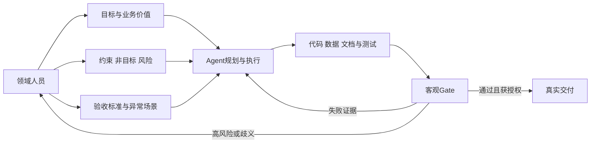

# AI 编程与领域专业度：从“做什么”到可验证交付

- 原文：[Anthropic 40 万次会话研究：用好 AI 编程的关键不是会写代码](https://xiaolinnote.com/claudecode/insights/expertise_over_coding.html)
- 一手研究：[Agentic coding and persistent returns to expertise](https://www.anthropic.com/research/claude-code-expertise)
- 一句话结论：Coding Agent 正在吸收大量“怎么实现”的执行工作，但目标、约束、风险和完成标准仍主要由人提供；领域专业度的价值不只是写出更好的 Prompt，而是能发现错误、设计验证并决定结果能否进入真实业务。
- 研究边界：一手研究分析约 23.5 万人、40 万次 2025-10 至 2026-04 的交互会话，结论来自隐私保护的模型分类器和遥测关联。它排除了第三方 IDE、SDK 与 headless 会话，无法观察代码之后是否真正上线或产生经济价值，也不能仅凭相关性证明专业度导致成功。

## 1. 先读懂研究到底测了什么

研究将会话按工作模式、决策归属、任务专业度和成功证据分类。所谓 verified success 不是用户真实业务结果，而是“分类器认为目标完成，并且 transcript 中至少有测试通过、匹配的 Git 活动或用户确认等硬信号”。

| 研究观察 | 文章中的代表数字 | 正确解释 | 不能推出 |
| --- | --- | --- | --- |
| 决策分工 | 人约作出 70% 规划决策，Claude 约作出 80% 执行决策 | 当前样本中常见协作形态 | 人不需要理解实现 |
| 每条指令撬动工作 | 新手约 5 个动作/600 词，专家约 12 个动作/3200 词 | 专业表达与更长执行链相关 | 输出越长质量越高 |
| 专业度与成功 | novice verified success 约 15%，intermediate/expert 约 28%–33% | 最大提升集中在新手到中级 | 专业度是唯一因果因素 |
| 职业差异 | 产出代码会话中软件职业约 34%，其他职业约 29% | 编码职业并非唯一入场券 | 所有领域、风险和人群完全相同 |
| 遇阻后的放弃 | novice 约 19%，其他等级约 5%–7% | 领域知识与恢复能力相关 | 专家不会失败 |

数字受任务选择、模型分类误差和可见成功信号影响。管理者可能更常明确确认“完成”，这本身会提高研究使用的成功信号；研究也明确把结论称为 preliminary。

## 2. 人负责“做什么”，Agent 负责“怎么做”



这不是把所有 Planning 永久留给人。Agent 可以提出方案、拆任务和发现约束，但业务方要确认目标是否值得做、风险是否可接受、什么证据足以发布。模型输出“完成”属于候选判断，不是授权。

## 3. 专业度是任务特定的

研究按“指令是否精确、要求什么验证、谁纠正谁”等信号估计专业度。资深 Java 工程师第一次处理税务申报仍可能是该任务的新手；不会 Python 的会计师若清楚月末对账规则和异常条件，则可能是这个自动化任务的领域专家。

从新手到“够用的中级”通常要掌握四件事：

1. 正常结果应该长什么样。
2. 哪些边界和失败模式最危险。
3. 哪个事实源拥有最终权威。
4. 用什么测试、样本或人工流程证明完成。

这解释了为什么专业度在 Agent 时代仍有回报：它提供的是模型训练语料无法替代的本地目标函数。

## 4. 好的任务描述不是越长越专业

专业任务合同至少包含目标、非目标、输入输出、约束、风险、证据和升级条件。下面是一份题目标注任务示意：

```json
{
	"goal": "为新增数学填空题给出可审计的预标注建议",
	"non_goals": ["不自动提交最终标签", "不允许创建标签字典外的编码"],
	"constraints": ["高风险标签必须人工确认", "RAG或LLM故障时允许受控降级"],
	"authoritative_sources": ["版本化标签字典", "历史人工标注", "当前题目"],
	"acceptance": ["未知标签被过滤", "证据ID可追溯", "requires_human_review=true"],
	"release_gates": ["micro_f1达标", "exact_match达标", "人工修改率不超阈值"]
}
```

若领域人员只说“给题目打标签”，Agent 可能优化一个错误目标；合同写得再长，如果没有真正的标签定义和反馈数据，也只是详细的猜测。

## 5. 人与 Agent 的责任矩阵

| 决策 | 领域人员 | Agent/Harness | 客观系统 |
| --- | --- | --- | --- |
| 业务目标和非目标 | 最终负责 | 提问、整理、找矛盾 | 保存版本 |
| 标签定义与风险 | 批准语义和边界 | 读取字典，不得创造新标签 | Schema/allowlist 强制 |
| 实现方案 | 提供关键约束 | 搜索、规划、编码、运行工具 | 权限与预算限制 |
| 结果解释 | 判断业务是否合理 | 汇总信号和证据 | 保留来源与版本 |
| 功能正确性 | 选择代表性场景 | 写并运行测试 | CI/测试退出码 |
| 发布 | 承担业务责任 | 提供 diff、风险和证据 | Gate 与审批决定是否放行 |

责任不能因为 Agent 自主执行很多动作而消失。动作数衡量委派深度，不衡量业务正确性。

## 6. 贯穿案例：题目标注为什么需要领域知识

当前仓库的题目标注系统处理语文、数学、英语填空题。对“计算 2+3=____”打 `calculation_required` 很简单；但“单位是否必须”“等价表达式是否接受”“多空顺序是否敏感”会直接影响学生得分，属于需要教育测评知识的高风险语义。


领域专家的主要贡献在图的两端：前端定义标签及高风险边界，后端审查误报/漏报并设发布门禁。Agent 与模型负责中间的检索、计算和解释，但不能自行决定最终评分政策。

## 7. 当前实现怎样把专业判断编码进系统

[taxonomy.py](../question_labeling_system/backend/app/domain/taxonomy.py) 定义稳定 `code`、中文名称、说明、适用学科和 `high_risk`。`tags_for_subject` 限定当前学科候选，`require_known_tag` 拒绝未知编码。标签字典是领域合同，不由 LLM 临时创造。

[labeling_workflow.py](../question_labeling_system/backend/app/services/labeling_workflow.py) 的 `QuestionLabelingWorkflow` 使用真实 LangGraph 串联：

- `rule_based_scores` 编码可解释的空位、上下文、学科规则。
- `_validate_scores` 过滤未知标签、拒绝 NaN/Infinity，并裁剪分数。
- `_retrieve` 在 RAG 故障时返回空证据和可见警告。
- `_reason` 在 LLM 故障时降级为空结构化输出。
- `_ensemble` 只融合当前存在的信号，保留来源分数和证据 ID。
- `predict` 始终返回 `requires_human_review=True` 和完整模型链版本。

这里的“专业度”不是藏在一条大 Prompt 里，而是分散在受控字典、规则、历史人工数据、证据来源、融合权重和人工终审中。

## 8. 高风险任务不能只优化平均准确率

`unit_required`、`answer_not_unique`、`blank_order_matters` 和 `semantic_equivalence` 被标为高风险，是因为误判会改变评分口径。对这些标签，应分别报告 Precision/Recall、人工改动和典型错误，而不是让常见低风险标签掩盖问题。

例如“必须带单位”的假阴性会放过一个需要人工确认的题，假阳性则增加审核负担。哪个更贵由业务决定，不能只用统一阈值。专业人员要把损失函数说清，模型才能优化正确方向。

## 9. 验收来自人工反馈与发布 Gate

[evaluate_feedback.py](../question_labeling_system/backend/app/evaluation/evaluate_feedback.py) 把模型默认选中集合与人工最终集合比较，计算 micro Precision/Recall/F1、Macro F1、完全匹配率、人工修改率、人工新增/移除标签，以及逐学科和逐标签指标。

发布命令只有在三项 Gate 同时通过时返回 `GO`：最低 micro F1、最低 exact match、最高 human change rate；否则以退出码 2 阻断流水线。阈值是可配置策略，不是模型自评。

[test_evaluation.py](../question_labeling_system/backend/tests/test_evaluation.py) 用一条全对、一条误报和一条漏报证明集合指标与人工修改语义一致，并拒绝空评测集。测试只覆盖小样本纯函数，不证明当前模型已达到生产门槛。

## 10. 主流程测试证明了哪些行为

[test_labeling_workflow.py](../question_labeling_system/backend/tests/test_labeling_workflow.py) 的第一项测试同时提供历史模型、人工 RAG 证据和结构化 Reasoner，断言：

- `answer_not_unique` 被默认选中。
- 结果保留 `ev-1` 证据和来源。
- 模型给出的 `unknown_tag` 不进入页面。
- 最终仍要求人工审核。

第二项测试让 RAG 与 LLM 同时超时，证明数学规则与历史模型仍可产生建议，并留下两个降级警告。它没有证明真实网络、数据库、模型质量、并发负载或终审 UI。

## 11. Maker/Checker、经济性与人的最终责任

[LoopHarness](../xiaolinnote_agent_engineering_analysis/examples/agent_engineering_reference.py) 展示 Maker 产出后必须通过独立 `GateResult` 才能完成；预算、重复动作和显式升级阻止无限修复。[LoopEconomics](../xiaolinnote_agent_engineering_analysis/examples/agent_engineering_reference.py) 则把模型费用和人工 Review 时间都计入成本：

$$
C_{accepted}=\frac{C_{model+compute}+\frac{minutes_{review}}{60}\times rate_{reviewer}}{N_{accepted}}
$$

若没有被接受的改动，单位成本为无穷而不是零。专业 Review 不是“AI 之外的低效环节”，而是总成本和质量系统的一部分。只有当接受率、风险和人工时间优于基线时，自动化才产生业务价值。

## 12. 常见误读与风险

- **误读：不会编程也能安全发布任何软件。** 研究显示职业差距有限，不代表高风险系统无需工程和安全专业知识。
- **误读：专家 Prompt 更长，所以要写得更长。** 真正差异是任务特定约束和验证，不是字数。
- **误读：模型执行 100 个动作说明生产力高。** 也可能是循环、返工或方向错误，必须结合结果和成本。
- **误读：verified success 等于真实业务成功。** 研究无法观察之后是否采用、上线或产生价值。
- **风险：自动化偏差被规模放大。** 错误标签字典或融合策略会稳定地产生同一种错误。
- **风险：人只看最终摘要。** 不理解关键决策会形成认知债，事故时无人能接管。

## 13. 面试问答

**Q1：研究中人与 Agent 的典型分工是什么？**  
A：人更常决定目标、方案和完成标准，Agent 更常决定文件、代码和命令等执行细节。

**Q2：为什么这不能证明编码能力不重要？**  
A：样本、任务和成功测量有限，高风险设计、调试和验收仍需要技术知识；结论是职业背景差距缩小，不是能力归零。

**Q3：领域专业度为什么能提高 Agent 效果？**  
A：它提供具体约束、危险边界、权威事实源和验证方法，并帮助遇错后重新定向。

**Q4：专业度是职位属性吗？**  
A：不是，是任务特定的；工程师在陌生税务任务上可能是新手，会计师在对账自动化上可能是专家。

**Q5：题目标注系统怎样防 LLM 创造标签？**  
A：候选来自版本化 taxonomy，历史分数和 Reasoner 输出都按当前学科 allowlist 过滤。

**Q6：为什么模型建议不能直接提交？**  
A：高风险标签涉及评分政策，系统始终要求人工 Review，并用人工最终结果形成评测真值。

**Q7：怎样评价 Agent 是否真的提高生产力？**  
A：比较被接受产物、客观质量、风险、总费用和人工 Review/返工时间，而不是只看生成速度。

**Q8：研究最大的证据限制是什么？**  
A：依赖模型对 transcript 的分类，排除大量非交互使用，也看不到会话后的真实采用和经济结果。

## 14. 复习清单

- 能说明研究样本、时间、包含/排除范围和 verified success 的定义。
- 能区分统计相关、调整后的关联和因果结论。
- 能画出人定义目标/约束/Gate、Agent 执行、系统提供证据的责任链。
- 能把任务写成目标、非目标、权威来源、风险、验收和升级条件。
- 能用题目标注案例解释 taxonomy、规则、RAG、历史模型、LLM 和人工终审。
- 能说清两个工作流测试与评测测试证明和未证明的内容。
- 能按逐标签、逐学科、人工修改率和高风险损失设计发布 Gate。
- 能把模型费用、Review 时间、接受率和认知债纳入自动化经济性。
