# Claude Code 19 篇深度分析总知识图谱

这张图汇总 19 篇专题，不是 Claude Code 的实际部署拓扑。整理日期：2026-09-11。产品命令、阈值、模型名和实验能力会变化；源码专题来自网页的二手观察，当前仓库只提供可迁移的 Agent、RAG、Tool Runtime、Harness 与题目标注参考实现，不声称复刻 Claude Code。

先记住总分工：**人定义目标、风险和验收，模型提出下一步，Context 提供本轮证据，Harness 校验并执行工具，State 支持跨轮恢复，客观 Gate 和人工 Review 决定是否交付。**

## 读图约定

- `[01]` 到 `[19]` 对应 19 篇网页分析；本文件是第 `20` 个汇总文件。
- 实线表示调用、数据流或执行顺序；虚线表示约束、复用、影响或反馈。
- **连线颜色按同一节点的出边序号**：同一节点的第 1 条出口为蓝色，第 2 条为青色，第 3 条为绿色，后续依次使用橙、红、紫、靛蓝等颜色。这样一眼能区分同一节点发出的不同路线。
- 跨分区关系使用更粗的 3px 线；节点底色表示所属主题分区。

## 总图

```mermaid
flowchart TB
	ROOT["Claude Code Agent Engineering<br/>模型负责判断，Harness 负责边界，工具负责动作，Gate 负责验收"]

	subgraph USE["A. 使用入口、权限与工程扩展  [01-03, 06]"]
		U01["01 基础使用<br/>会话 / 模式 / @引用<br/>回滚 / 后台 / resume"]
		U02["02 /powerup<br/>交互式课程与维护命令<br/>context / compact / clear / tasks"]
		U03["03 工程化六件套<br/>CLAUDE.md / Skill / Subagent<br/>MCP / Hook / Plugin"]
		U06["06 Skill 作者设计<br/>description / 主流程<br/>scripts / references / 测试"]
		U01A["授权模式<br/>Normal / Plan / Auto-accept<br/>按可逆性和影响范围选择"]
		U01B["上下文操作<br/>精确引用 / context / compact / clear<br/>会话与任务边界"]
		U01C["恢复边界<br/>Rewind / Resume / Git<br/>外部副作用不能假装回滚"]
		U02A["维护命令<br/>查看预算 / 清理历史 / 回退<br/>产品命令按版本复核"]
		U02B["长任务体验<br/>后台任务 / 通知 / 远程控制<br/>状态必须持久化"]
		U03A["CLAUDE.md<br/>稳定项目规则"]
		U03B["Skill<br/>低频方法与资源"]
		U03C["Subagent<br/>上下文隔离与委派"]
		U03D["MCP<br/>外部工具与数据接入"]
		U03E["Hook<br/>确定性事件约束"]
		U03F["Plugin<br/>能力打包与供应链"]
		U06A["发现层<br/>name + description<br/>触发质量来自可判别描述"]
		U06B["披露层<br/>目录 -> SKILL.md -> references<br/>正文只在需要时加载"]
		U06C["执行层<br/>固定劳动写脚本<br/>工具权限仍由宿主管理"]
	end

	subgraph PROJECT["B. 项目知识与需求工程  [04-09]"]
		P04["04 CLAUDE.md<br/>规则层级 / Why / 可验证<br/>路径规则 / 精简 / 持续维护"]
		P05["05 大型代码库<br/>agentic search / LSP<br/>子目录启动 / 分阶段会话"]
		P07["07 SDD<br/>specify -> plan -> tasks<br/>implement -> verify"]
		P08["08 grill-me<br/>设计树 / 一次一问<br/>需求澄清 / 推荐答案"]
		P09["09 superpowers vs grill-me<br/>轻量澄清 vs 完整流水线<br/>TDD / 子 Agent / paper trail"]
		P04A["规则层级<br/>Managed / User / Project / Local<br/>叠加、冲突与来源"]
		P04B["作用域<br/>根目录 / 子目录 / paths<br/>只加载当前任务相关规则"]
		P04C["维护闭环<br/>Why / 反例 / 测试 / 删除过期规则"]
		P05A["局部锚点<br/>文件 / 符号 / 报错 / 失败测试"]
		P05B["语义导航<br/>LSP 定义 / 引用 / 类型<br/>Grep 补动态字符串盲区"]
		P05C["分阶段会话<br/>探索 -> 实现 -> 验证<br/>持久状态而非聊天接力"]
		P07A["Spec<br/>目标 非目标 场景 接受条件"]
		P07B["Plan<br/>架构路径 风险 验证策略"]
		P07C["Tasks<br/>依赖 输入输出 独立验收"]
		P07D["Traceability<br/>REQ -> Task -> Test -> Evidence"]
		P08A["设计树<br/>高影响未知项优先<br/>事实可查就先查代码"]
		P08B["Decision Log<br/>问题 选择 理由 影响<br/>停止条件与未决项"]
		P09A["轻量路径<br/>少量关键问题后进入 Plan"]
		P09B["完整路径<br/>Brainstorm / Spec / TDD<br/>实现与独立 Review"]
		P09C["选型条件<br/>风险 范围 歧义 可逆性<br/>流程成本与认知收益"]
	end

	subgraph RUNTIME["C. 源码运行时与上下文  [10-16]"]
		R10["10 分层架构<br/>Engine / Tools / Services<br/>Governance / 权限与 Hook"]
		R11["11 Query Loop<br/>ask -> query -> queryLoop<br/>流式 tool_use / tool_result"]
		R12["12 Compact<br/>大结果落盘 / Snip / Micro<br/>Projection / Auto-Compact / 恢复"]
		R13["13 Code Search<br/>Glob / Grep / Read<br/>探索 Agent / 实时精确检索"]
		R14["14 Memory<br/>CLAUDE.md 静态层<br/>user / feedback / project / reference"]
		R15["15 Multi-Agent<br/>Subagent / Fork / Teams<br/>Coordinator / 隔离 / 消息 / 并行"]
		R16["16 Skill Runtime<br/>扫描来源 / frontmatter<br/>按需正文 / 动态展开 / 安全边界"]
		R10A["Engine<br/>组装输入 调模型 分发事件<br/>不内嵌业务工具"]
		R10B["Tool Layer<br/>Schema 属性 执行结果<br/>只读/写入/并发/幂等"]
		R10C["Services<br/>模型 API / MCP / 缓存<br/>压缩与外部基础设施"]
		R10D["Governance<br/>认证 授权 审批 Hook<br/>沙箱 审计 fail-closed"]
		R11A["消息协议<br/>system / user / assistant / tool<br/>Call ID 与顺序"]
		R11B["流式事件<br/>文本 delta / tool_use<br/>usage / stop / error"]
		R11C["工具配对不变量<br/>每个 tool_use 恰好一个 result<br/>成功 失败 拒绝 超时都返回"]
		R11D["异常路径<br/>重试分类 / Ctrl+C / 截断<br/>预算 / 重复 / 升级"]
		R12A["大结果外部化<br/>artifact + preview + hash<br/>需要时重新读取"]
		R12B["轻量清理<br/>Snip 旧消息<br/>Micro 清可重取结果"]
		R12C["Context Collapse<br/>读时投影不改原历史<br/>实验能力按版本复核"]
		R12D["Auto-Compact<br/>全量语义摘要<br/>边界 + 摘要 + 附件 + Hook"]
		R12E["恢复通道<br/>规则重载 / 最近文件<br/>任务状态 / Checkpoint / transcript"]
		R13A["Glob<br/>按路径收缩候选"]
		R13B["Grep<br/>精确文本 正则 错误码"]
		R13C["Read<br/>按 offset/limit 核实当前源码"]
		R13D["LSP<br/>定义 引用 实现 类型关系"]
		R13E["Explore<br/>隔离多轮搜索<br/>只回传带引用的 findings"]
		R13F["RAG/Graph<br/>跨仓库语义与关系候选<br/>仍回到当前源码验证"]
		R14A["静态声明层<br/>项目规则与条件规则<br/>显式维护"]
		R14B["动态记忆层<br/>user / feedback / project / reference<br/>从交互提炼"]
		R14C["索引与召回<br/>目录常驻 正文按需<br/>作用域先于相关性"]
		R14D["生命周期<br/>去重 更正 supersede 删除<br/>新鲜度警告与主动验证"]
		R15A["常规 Subagent<br/>专业 Prompt 与工具池<br/>完成后返回结果"]
		R15B["Fork<br/>复用稳定缓存前缀<br/>完整父上下文后分叉"]
		R15C["Agent Teams<br/>信箱 + 完成通知<br/>运行中双向消息"]
		R15D["Coordinator<br/>扁平 Worker 并行<br/>理解、合成、取消、验收"]
		R16A["来源扫描<br/>内置 用户 managed 项目<br/>Plugin / MCP 与冲突裁决"]
		R16B["Frontmatter<br/>路由字段 / 入口开关<br/>allowed-tools 只是上限"]
		R16C["展开与注入<br/>参数替换 / 受信动态内容<br/>增量上下文保护缓存"]
		R16D["信任链<br/>来源 -> 解析 -> 权限 -> 执行<br/>临时 Hook 必须确定性清理"]
	end

	subgraph PROMPT["D. Prompt、安全、上下文与领域验收  [17-19]"]
		P17["17 System Prompt<br/>工具说明 / WHEN NOT USE<br/>可逆性 / 影响范围 / 安全原则"]
		P18["18 Context Engineering<br/>删重复规则 / 判断标准<br/>渐进披露 / 信息路由"]
		P19["19 领域专业度<br/>人定目标与约束<br/>Agent 执行 / 专业判断 / 验收"]
		P17A["提示词分层<br/>平台策略 / 工具手册<br/>动态环境 / 不可信数据"]
		P17B["工具合同<br/>WHEN TO USE / NOT USE<br/>参数来源 / 结束和失败语义"]
		P17C["动作决策<br/>可逆性 x 影响范围<br/>执行 / 预览 / 确认 / 拒绝"]
		P17D["注入与泄漏治理<br/>控制流数据流分离<br/>最小上下文 / 出口限制 / 脱敏"]
		P18A["上下文预算<br/>相关性 x 权威性 x 新鲜度<br/>风险影响 / Token 成本"]
		P18B["规则减法<br/>删可推断 重复 过期<br/>硬约束下沉 Runtime/CI"]
		P18C["判断标准<br/>遵循邻近实现<br/>安全边界仍用绝对约束"]
		P18D["质量评测<br/>成功 违规 Token 延迟<br/>工具重复 / 人工返工"]
		P19A["研究证据<br/>约40万交互会话<br/>分类器指标不是现实因果"]
		P19B["人的职责<br/>目标 非目标 风险<br/>权威事实源与接受条件"]
		P19C["领域合同<br/>Schema / Taxonomy / 高风险标签<br/>模型不得自由创造"]
		P19D["验收与经济性<br/>逐类指标 / 人工终审 / 发布Gate<br/>每个接受产物总成本"]
	end

	MODEL["LLM<br/>规划候选与生成 tool_use<br/>不直接拥有权限"]
	TOOLS["受控工具层<br/>Read / Grep / Bash / Edit<br/>MCP / 外部 API"]
	STATE["显式状态<br/>messages / turn / 预算<br/>checkpoint / trace / memory"]
	VERIFY["独立验收<br/>测试 / lint / build / 浏览器<br/>Gate / 人工 Review / 证据"]
	SAFETY["安全与止损<br/>审批 / allowlist / timeout<br/>retry / idempotency / audit"]
	CONTEXT["本轮上下文<br/>规则 / 任务 / 当前代码<br/>Skill / Memory / 工具结果"]
	OBSERVE["环境观察<br/>工具结果 / 退出码 / diff<br/>外部状态可能已变化"]
	ARTIFACT["持久产物<br/>源码 / Spec / Plan / Test<br/>Checkpoint / Trace / 评测报告"]
	HUMAN["人类责任<br/>领域目标 / 风险接受<br/>高影响审批 / 最终 Review"]
	ECON["经济性<br/>模型与算力 + Review + 返工<br/>每个被接受产物总成本"]

	ROOT --> U01
	ROOT --> U03
	ROOT --> P07
	ROOT --> R10
	ROOT --> P17

	U01 --> U02
	U01 --> P04
	U01 --> P08
	U02 --> U03
	U03 --> U06
	U03 --> R10
	U03 --> SAFETY
	U06 --> P18
	U06 --> R16
	U01 --> U01A
	U01 --> U01B
	U01 --> U01C
	U02 --> U02A
	U02 --> U02B
	U03 --> U03A
	U03 --> U03B
	U03 --> U03C
	U03 --> U03D
	U03 --> U03E
	U03 --> U03F
	U06 --> U06A
	U06 --> U06B
	U06 --> U06C

	P04 --> P05
	P04 --> R14
	P04 --> P18
	P05 --> R13
	P05 --> R15
	P07 --> P09
	P07 --> VERIFY
	P08 --> P07
	P08 --> P09
	P09 --> VERIFY
	P04 --> P04A
	P04 --> P04B
	P04 --> P04C
	P05 --> P05A
	P05 --> P05B
	P05 --> P05C
	P07 --> P07A
	P07A --> P07B
	P07B --> P07C
	P07C --> P07D
	P07D --> VERIFY
	P08 --> P08A
	P08 --> P08B
	P09 --> P09A
	P09 --> P09B
	P09 --> P09C

	R10 --> R11
	R10 --> TOOLS
	R10 --> SAFETY
	R11 --> MODEL
	R11 --> TOOLS
	R11 --> STATE
	R11 --> R12
	R11 --> R15
	R12 --> STATE
	R12 --> P18
	R13 --> MODEL
	R13 --> P05
	R14 --> STATE
	R14 --> P04
	R15 --> STATE
	R15 --> VERIFY
	R15 --> SAFETY
	R16 --> U06
	R16 --> TOOLS
	R10 --> R10A
	R10 --> R10B
	R10 --> R10C
	R10 --> R10D
	R11 --> R11A
	R11 --> R11B
	R11 --> R11C
	R11 --> R11D
	R12 --> R12A
	R12 --> R12B
	R12 --> R12C
	R12 --> R12D
	R12D --> R12E
	R13 --> R13A
	R13 --> R13B
	R13 --> R13C
	R13 --> R13D
	R13 --> R13E
	R13 --> R13F
	R14 --> R14A
	R14 --> R14B
	R14 --> R14C
	R14 --> R14D
	R15 --> R15A
	R15 --> R15B
	R15 --> R15C
	R15 --> R15D
	R16 --> R16A
	R16 --> R16B
	R16 --> R16C
	R16 --> R16D

	P17 --> MODEL
	P17 --> SAFETY
	P17 --> TOOLS
	P18 --> P04
	P18 --> U06
	P18 --> R12
	P19 --> P08
	P19 --> P07
	P19 --> VERIFY
	P19 --> MODEL
	P17 --> P17A
	P17 --> P17B
	P17 --> P17C
	P17 --> P17D
	P18 --> P18A
	P18 --> P18B
	P18 --> P18C
	P18 --> P18D
	P19 --> P19A
	P19 --> P19B
	P19 --> P19C
	P19 --> P19D

	MODEL -->|"产生下一步意图"| R11
	TOOLS -->|"执行并返回观察"| R11
	STATE -.->|"跨轮传递与恢复"| R11
	SAFETY -.->|"拦截高风险动作"| TOOLS
	VERIFY -->|"失败反馈"| P04
	VERIFY -->|"失败反馈"| P07
	VERIFY -->|"独立证据"| P19
	R12 -.->|"恢复关键文件与计划"| STATE
	R15 -.->|"隔离上下文后汇报"| R11
	R13 -.->|"精确代码上下文"| MODEL
	R14 -.->|"按需记忆注入"| MODEL
	P17 -.->|"安全边界与工具合同"| R10
	P18 -.->|"减少上下文噪声"| R11
	P19 -.->|"决定做什么和如何验收"| MODEL
	HUMAN -->|"定义目标和风险"| P08
	HUMAN -->|"批准高影响动作"| SAFETY
	CONTEXT -->|"组装本轮输入"| MODEL
	MODEL -->|"提出候选动作"| TOOLS
	TOOLS -->|"受控执行"| OBSERVE
	OBSERVE -->|"反馈环境事实"| R11
	STATE -->|"跨轮恢复"| CONTEXT
	ARTIFACT -->|"提供可复核事实"| CONTEXT
	VERIFY -->|"保存通过证据"| ARTIFACT
	ECON -.->|"评估是否值得自动化"| P19D
	R12E -->|"恢复状态与附件"| CONTEXT
	R14C -->|"按作用域召回"| CONTEXT
	R16C -->|"按需展开Skill"| CONTEXT
	P17D -.->|"限制不可信内容"| CONTEXT
	P18D -.->|"评估上下文配置"| CONTEXT
	P19C -.->|"提供业务Schema"| VERIFY

	%% 同一来源节点的第 1、2、3... 条出边使用不同颜色；跨分区关系使用 3px。
	linkStyle 5,8,9,28,33,35,45,46,47,54,85,129,142,147 stroke:#2563eb,stroke-width:2px;
	linkStyle 17,36,51,141,143,144,146 stroke:#0f766e,stroke-width:2px;
	linkStyle 18,25,41,44,49,52,81,86,92,100 stroke:#16a34a,stroke-width:2px;
	linkStyle 3,14,19,26,38,42,50,53,60,73,82,87,93,96,101,114,118,148 stroke:#ca8a04,stroke-width:2px;
	linkStyle 15,20,27,39,43,61,74,83,88,94,97,102,115,119,122 stroke:#ea580c,stroke-width:2px;
	linkStyle 16,21,40,75,77,84,89,95,98,103,116,120,123 stroke:#dc2626,stroke-width:2px;
	linkStyle 22,76,78,90,99,117,121,124 stroke:#c026d3,stroke-width:2px;
	linkStyle 23,79,91,125,134 stroke:#7c3aed,stroke-width:2px;
	linkStyle 24,80 stroke:#0891b2,stroke-width:2px;
	linkStyle 0,12,31,37,48,57,62,64,66,68,71,104,107,110,126,127,128,130,140,145,149,150,151,152,153,154,155 stroke:#2563eb,stroke-width:3px;
	linkStyle 1,6,10,13,29,32,34,55,58,63,65,67,69,72,105,108,111,131 stroke:#0f766e,stroke-width:3px;
	linkStyle 2,7,11,30,56,59,70,106,109,112,132 stroke:#16a34a,stroke-width:3px;
	linkStyle 113 stroke:#ca8a04,stroke-width:3px;
	linkStyle 4 stroke:#ea580c,stroke-width:3px;
	linkStyle 133,136 stroke:#c026d3,stroke-width:3px;
	linkStyle 137,138 stroke:#7c3aed,stroke-width:3px;
	linkStyle 135,139 stroke:#0891b2,stroke-width:3px;

	classDef rootLayer fill:#fff4bf,stroke:#8b7500,color:#302900,stroke-width:2px;
	classDef useLayer fill:#eaf3ff,stroke:#34699a,color:#13293d;
	classDef projectLayer fill:#e9f7f7,stroke:#347d7d,color:#153838;
	classDef runtimeLayer fill:#eaf8ee,stroke:#3f7d4e,color:#173c22;
	classDef promptLayer fill:#fff1e6,stroke:#a65f26,color:#4a2811;
	classDef systemLayer fill:#fcecef,stroke:#a64c62,color:#4a1e2a;
	classDef verifyLayer fill:#f1f1f1,stroke:#666666,color:#252525;

	class ROOT rootLayer;
	class U01,U02,U03,U06 useLayer;
	class P04,P05,P07,P08,P09 projectLayer;
	class R10,R11,R12,R13,R14,R15,R16 runtimeLayer;
	class U01A,U01B,U01C,U02A,U02B,U03A,U03B,U03C,U03D,U03E,U03F,U06A,U06B,U06C useLayer;
	class P04A,P04B,P04C,P05A,P05B,P05C,P07A,P07B,P07C,P07D,P08A,P08B,P09A,P09B,P09C projectLayer;
	class R10A,R10B,R10C,R10D,R11A,R11B,R11C,R11D,R12A,R12B,R12C,R12D,R12E,R13A,R13B,R13C,R13D,R13E,R13F,R14A,R14B,R14C,R14D,R15A,R15B,R15C,R15D,R16A,R16B,R16C,R16D runtimeLayer;
	class P17,P18,P19,P17A,P17B,P17C,P17D,P18A,P18B,P18C,P18D,P19A,P19B,P19C,P19D promptLayer;
	class MODEL,TOOLS,STATE,SAFETY,CONTEXT,OBSERVE,ARTIFACT,HUMAN,ECON systemLayer;
	class VERIFY verifyLayer;
```

## 五条复习路线

1. **使用与权限线**：从 `[01]` 的会话和授权模式出发，经 `[02]` 的上下文维护，到 `[03]` 的六件套。重点解释为什么模型提出动作不等于拥有权限，以及 Rewind、Resume、Git 和外部副作用不是同一种恢复。
2. **需求与项目知识线**：从 `[08]` 的逐问澄清进入 `[07]` 的 Spec、Plan、Tasks 和 Traceability，再用 `[09]` 按风险选择轻量或完整流程；`[04]` 提供稳定项目规则，`[06]` 提供按需专业方法。
3. **代码探索线**：先用 `[05]` 建立大仓搜索策略，再用 `[13]` 区分 Glob、Grep、Read、LSP、Explore 与 RAG。所有候选都要回到当前 revision 的源码和测试，索引不能替代事实源。
4. **运行时线**：沿 `[10]` 的 Engine、Tools、Services、Governance 进入 `[11]` Query Loop；长任务再接 `[12]` Compact、`[14]` Memory、`[15]` Multi-Agent 和 `[16]` Skill Runtime。
5. **可靠交付线**：用 `[17]` 设计工具合同与安全边界，用 `[18]` 决定每轮看什么，最后由 `[19]` 的领域目标、人工 Review、客观 Gate 和经济性决定是否交付。

## 一例贯穿十九篇

假设要给当前仓库的“填空题标签系统”增加一个高风险标签“答案单位可换算”，整条链可以这样走：

`[01]` 先把读取、编辑、测试和发布分成不同授权等级；`[02]` 在长任务中观察 Context、保存状态，任务无关时开启新会话；`[03]` 选择 CLAUDE.md 保存稳定约束、Skill 保存标注评审流程、Subagent 做只读调研、Hook/CI 强制检查，外部标签服务才考虑 MCP。

`[04]` 记录“标签编码不能由模型自由创造”以及原因；`[05]` 从 `taxonomy.py`、`labeling_workflow.py` 和对应测试建立局部锚点；`[06]` 把人工评审方法写成短主流程加低频案例；`[07]` 形成 Spec、Plan、Tasks 和 `REQ -> Test` 追踪；`[08]` 一次只澄清“哪些换算可接受、谁最终批准”等高影响未知项；`[09]` 因为它会改变评分口径，选择完整流程而非轻量直改。

`[10]` 把标签字典、融合流程、模型适配器和授权分层；`[11]` 保证每个工具调用都有结果，失败能回到下一轮；`[12]` 长调研把精确进度写入 Checkpoint，而不是只信摘要；`[13]` 用精确搜索找所有标签消费方；`[14]` 只记“团队确认的评分偏好”，不记会过期的代码行号；`[15]` 可并行派出教育规则、后端影响和测试覆盖三个只读 Worker，由协调者合成。

`[16]` 运行时只在需要标注评审时展开对应 Skill，并限制动态脚本；`[17]` 把网页、历史题和模型解释视为数据，不允许它们扩大权限；`[18]` 只注入当前标签定义、必要代码和失败测试；`[19]` 由教育领域人员决定高风险边界，系统用逐标签 Precision/Recall、人工修改率和发布 Gate 验收。

这个案例用于串联机制，不表示仓库已经拥有 Claude Code、官方 Skill Runtime 或自动 Multi-Agent 团队。当前题目标注代码仍以真实文件和测试为准。

## 容易混淆的关系

| 对比 | 必须保留的边界 |
| --- | --- |
| 模型、Agent、Harness | 模型生成候选；Agent 组织目标和循环；Harness 控制上下文、工具、状态、预算、验证与恢复。 |
| Normal、Plan、Auto-accept | 主要差异是执行节奏与授权，不是换了一个更聪明的模型；高风险动作仍需模型外审批。 |
| Rewind、Git 回滚、外部补偿 | Rewind 管产品时间线，Git 管版本文件，数据库/API 副作用要靠幂等、事务或补偿。 |
| CLAUDE.md、动态记忆、Checkpoint | 分别保存稳定规则、可过期历史偏好、精确运行进度；三者不能互相冒充。 |
| Skill、Hook、MCP、Plugin、Subagent | 分别是按需方法、事件约束、外部能力协议、分发单元和独立执行上下文；都不自动授予权限。 |
| Prompt、Context、Harness | 分别处理任务表达、本轮可见信息和模型外运行控制；Prompt 不是安全边界。 |
| Glob、Grep、Read、LSP | 分别按路径、文本、文件内容和符号语义定位；最终由当前代码与测试确认。 |
| Grep/Agentic Search 与 RAG | 前者实时多轮探索当前工作树；后者适合跨仓库语义或知识候选。二者可组合。 |
| Spec、Plan、Tasks、Tests | 分别说明做什么、怎么走、谁先做什么、怎样证明；一份长文不能自动承担全部契约。 |
| grill-me 与完整工程流水线 | 前者优先消除关键歧义；后者增加设计、TDD、子 Agent 和 Review。按风险选择，不按流行度。 |
| `tool_use` 与 `tool_result` | 它们按 Call ID 成对构成协议单元；失败、拒绝和超时也必须有结果。 |
| Compact、Clear、Resume | Compact 有损重写当前历史，Clear 开新上下文，Resume 恢复会话；精确进度仍应外部持久化。 |
| 静态规则与动态记忆 | 静态规则由人声明并维护；动态记忆从交互提炼且会过期，使用前必须主动验证。 |
| Subagent、Fork、Agent Teams、Coordinator | 分别强调专业隔离、缓存前缀继承、持续双向消息和扁平并行编排，不是同一个功能的四个名字。 |
| System Prompt 与 Runtime Guard | 前者指导概率性判断，后者用 Schema、授权、沙箱和审批确定性拒绝违规动作。 |
| 模型自评与客观 Gate | “我完成了”只是声明；测试、构建、运行行为、业务真值和获授权人工才提供接受证据。 |
| Verified success 与真实业务成功 | 研究中的验证来自 transcript 可见信号，不等于产物后来上线、被采用或创造经济价值。 |
| Worktree 与安全沙箱 | Worktree 只隔离文件工作目录，不隔离密钥、网络、数据库和远端副作用。 |
| Prompt Cache 与状态共享 | 缓存复用稳定字节前缀，不等于父子 Agent 共享可变状态或旧权限继续有效。 |

## 工程落地的两笔账

第一笔是上下文价值。不要只最小化 Token，而要让预算优先承载相关、权威、最新且影响风险的信息：

$$
Priority(i)=\frac{Relevance(i)\times Authority(i)\times Freshness(i)\times RiskImpact(i)}{TokenCost(i)}
$$

第二笔是交付经济性。只计算模型单价会漏掉拒收产物和人工 Review：

$$
C_{accepted}=\frac{C_{model}+C_{compute}+C_{review}+C_{rework}}{N_{accepted}}
$$

当没有产物被接受时，单位成本不能写成零，应报告投入成本和零接受结果。还要同时观察成功率、约束违规、P95 延迟、风险损失和人工基线。

## 当前仓库能力边界

| 能力 | 当前真实锚点 | 仍缺什么 |
| --- | --- | --- |
| 受控工具与 Loop | [agent_engineering_reference.py](../xiaolinnote_agent_engineering_analysis/examples/agent_engineering_reference.py) | 真实模型、Shell 沙箱、墙钟超时、分布式一致性 |
| Tool/MCP/Skill 教学运行时 | [tooling_capabilities_reference.py](../xiaolinnote_tools_analysis/examples/tooling_capabilities_reference.py) | 官方 Claude Runtime、完整 JSON Schema、OAuth、供应链签名 |
| 记忆、DAG、路由与反思 | [agent_capabilities_reference.py](../xiaolinnote_agent_analysis/examples/agent_capabilities_reference.py) | 生产队列、多 Agent 消息、取消传播和跨进程恢复 |
| BM25、RRF 与图检索 | [rag_capabilities_reference.py](../xiaolinnote_rag_analysis/examples/rag_capabilities_reference.py) | 代码 AST/LSP 索引、向量服务、真实 GraphRAG/LightRAG |
| 领域工作流与人工 Gate | [labeling_workflow.py](../question_labeling_system/backend/app/services/labeling_workflow.py) | 真实线上模型质量、生产负载和完整业务验收证据 |

## 面试速答

**Q1：Claude Code 的核心是什么？**  
A：不是单个大模型，而是 Context、Query Loop、工具运行时、状态、权限、恢复和 Gate 的组合。

**Q2：为什么模型不能直接执行工具？**  
A：模型输出是非确定候选，宿主必须做 Schema、身份、授权、审批、超时、幂等和审计。

**Q3：大仓搜索为什么不默认全部做 RAG？**  
A：当前源码需要实时、精确和可解释；语义索引适合补跨仓库概念召回，命中后仍要 Read 和测试。

**Q4：Compact 的本质是什么？**  
A：按可恢复性逐级降载，并把语义摘要、精确状态、永久规则和大 Artifact 分通道保存。

**Q5：Skill 与普通 Prompt 的本质差异？**  
A：内容都可能是文本，Skill 额外提供发现、触发、按需加载、资源组织和运行治理。

**Q6：多 Agent 何时比单 Agent 更好？**  
A：任务可并行或需要上下文隔离且收益高于通信成本时；否则单 Agent 加确定性 Workflow 更简单。

**Q7：强模型时代为什么要做规则减法？**  
A：删除可推断、重复和过期指令可降低冲突；项目隐性事实、安全边界和验收条件仍必须保留。

**Q8：领域专业度在 AI 编程中体现在哪里？**  
A：定义正确目标、识别高损失边界、选择权威事实源、设计验证并判断结果能否交付。

**Q9：模型自评通过算完成吗？**  
A：不算。完成需要测试、构建、真实环境行为、业务 Rubric 或获授权人工提供独立证据。

**Q10：怎样评价 Agent 的真实生产力？**  
A：比较被接受产物的质量、总成本、风险和 Review 时间，而不是只看 Token、动作数或生成速度。

## 十九篇来源与图中位置

| 编号 | 图中重点 | 原文 | 本地分析 |
| --- | --- | --- | --- |
| 01 | 会话、授权模式、恢复与副作用 | [基础使用](https://xiaolinnote.com/claudecode/basics/cc_use.html) | [01_claude_code_basics.md](01_claude_code_basics.md) |
| 02 | `/powerup`、维护命令与长任务体验 | [Powerup](https://xiaolinnote.com/claudecode/basics/cc_powerup.html) | [02_claude_code_powerup.md](02_claude_code_powerup.md) |
| 03 | CLAUDE.md、Skill、Subagent、MCP、Hook、Plugin | [工程化指南](https://xiaolinnote.com/claudecode/basics/cc_engineering.html) | [03_claude_code_engineering.md](03_claude_code_engineering.md) |
| 04 | 项目规则层级、作用域与维护 | [CLAUDE.md 指南](https://xiaolinnote.com/claudecode/playbook/cc_claude_md.html) | [04_claude_md_project_memory.md](04_claude_md_project_memory.md) |
| 05 | 大仓锚点、LSP、分阶段会话 | [大型代码库](https://xiaolinnote.com/claudecode/playbook/cc_large_codebase.html) | [05_large_codebase_agentic_search.md](05_large_codebase_agentic_search.md) |
| 06 | Skill 作者设计与三层披露 | [Skill 揭秘](https://xiaolinnote.com/claudecode/playbook/cc_skills.html) | [06_agent_skills_progressive_disclosure.md](06_agent_skills_progressive_disclosure.md) |
| 07 | SDD 产物与需求追踪 | [规约驱动开发](https://xiaolinnote.com/claudecode/playbook/spec_driven_dev.html) | [07_spec_driven_development.md](07_spec_driven_development.md) |
| 08 | 设计树、逐问澄清与 Decision Log | [grill-me](https://xiaolinnote.com/claudecode/playbook/grill_me.html) | [08_grill_me_requirement_interview.md](08_grill_me_requirement_interview.md) |
| 09 | 轻量澄清与完整流水线选型 | [superpowers vs grill-me](https://xiaolinnote.com/claudecode/playbook/superpowers_vs_grillme.html) | [09_superpowers_vs_grill_me.md](09_superpowers_vs_grill_me.md) |
| 10 | Engine、Tools、Services、Governance | [源码架构](https://xiaolinnote.com/claudecode/source/cc_source.html) | [10_claude_code_source_architecture.md](10_claude_code_source_architecture.md) |
| 11 | Query Loop、流式事件与工具配对 | [Query 主循环](https://xiaolinnote.com/claudecode/source/cc_query_loop.html) | [11_claude_code_query_loop.md](11_claude_code_query_loop.md) |
| 12 | 五层压缩、摘要和恢复通道 | [Compact](https://xiaolinnote.com/claudecode/source/cc_compact.html) | [12_claude_code_context_compaction.md](12_claude_code_context_compaction.md) |
| 13 | Glob、Grep、Read、LSP、Explore、RAG | [代码检索](https://xiaolinnote.com/claudecode/source/cc_grep.html) | [13_claude_code_code_search.md](13_claude_code_code_search.md) |
| 14 | 静态规则、动态记忆和生命周期 | [记忆机制](https://xiaolinnote.com/claudecode/source/cc_memory.html) | [14_claude_code_memory.md](14_claude_code_memory.md) |
| 15 | Subagent、Fork、Teams、Coordinator | [Multi-Agent](https://xiaolinnote.com/claudecode/source/cc_multi_agent.html) | [15_claude_code_multi_agent.md](15_claude_code_multi_agent.md) |
| 16 | Skill 扫描、展开、缓存与信任链 | [Skill Runtime](https://xiaolinnote.com/claudecode/source/cc_skill.html) | [16_claude_code_skill_source.md](16_claude_code_skill_source.md) |
| 17 | System Prompt、工具合同与安全 | [Fable Prompt](https://xiaolinnote.com/claudecode/prompt/fable5_prompt_leak_cl4.html) | [17_claude_fable_system_prompt.md](17_claude_fable_system_prompt.md) |
| 18 | 规则减法、信息路由和质量评测 | [上下文工程](https://xiaolinnote.com/claudecode/insights/claude5_context_engineering.html) | [18_claude_code_context_engineering.md](18_claude_code_context_engineering.md) |
| 19 | 领域专业度、责任和客观验收 | [40 万次会话研究](https://xiaolinnote.com/claudecode/insights/expertise_over_coding.html) | [19_claude_code_expertise.md](19_claude_code_expertise.md) |

继续逐篇阅读：[README.md](README.md)。
