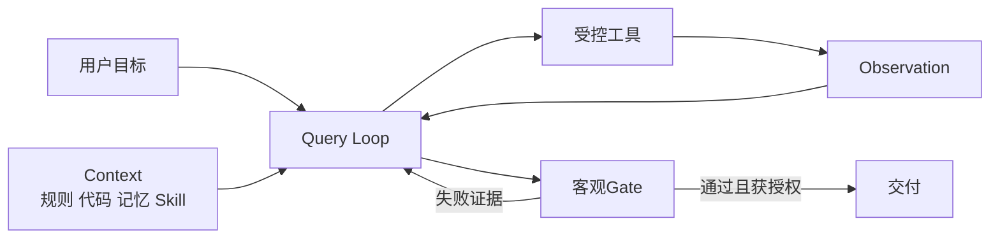

# Xiaolinnote Claude Code：19 篇深度分析与总知识图谱

本目录逐页分析 Xiaolinnote「图解 Claude Code」中的 19 篇正文，并用第 20 个文件汇总总知识图谱。每篇都采用与 `xiaolinnote_agent_engineering_analysis` 相同的证据结构：

1. **网页主张**：保留原文知识主线，同时标明产品版本、二手源码和统计研究的适用边界。
2. **可迁移原理**：把产品细节抽象成 Context、Tool、Query Loop、Memory、Skill、Multi-Agent、Gate 等工程机制。
3. **项目事实**：只描述当前仓库确实存在的代码与测试，并写清它们没有实现什么。
4. **补充设计**：对仓库尚未实现的上下文路由、消息协议、摘要 Schema 和安全治理给出代码或结构化示例，不冒充产品源码。

> 当前仓库没有证明已安装或运行 Claude CLI，也没有复刻 Claude Code。文中命令、阈值、模型名、价格和实验特性应以使用时的官方文档与本机版本为准。

## 总知识图谱

[20_claude_code_knowledge_graph.md](20_claude_code_knowledge_graph.md) 用一张 Mermaid 总图串联 19 篇专题：使用与权限、工程六件套、项目规则、搜索与 Skill、SDD 与需求澄清、四层运行时、Query Loop、Compact、Memory、Multi-Agent、System Prompt、上下文减法和领域验收。图后附复习路线、贯穿案例、易混概念和逐页来源。



## 四条阅读路线

1. **第一次使用**：`01 -> 02 -> 03 -> 04`，理解会话、权限、恢复和六件套职责。
2. **从需求到代码**：`08 -> 07 -> 09 -> 05 -> 13`，学习澄清、规约、流程选型和大仓检索。
3. **理解运行时**：`10 -> 11 -> 12 -> 14 -> 15 -> 16`，追踪一次请求如何循环、压缩、记忆、委派和加载 Skill。
4. **可靠性与能力边界**：`17 -> 18 -> 19 -> 20`，把 Prompt、安全、上下文减法和领域验收连成完整闭环。

## 当前仓库代码入口

- [Agent/Harness 参考实现](../xiaolinnote_agent_engineering_analysis/examples/agent_engineering_reference.py)：文件工作区、受控工具、Loop 预算、独立 Gate、Trace、Checkpoint 和经济性。
- [Agent/Harness 测试](../tests/test_agent_engineering_reference.py)：12 项离线测试，覆盖路径、审批、幂等、预算、重复动作、恢复和升级。
- [工具生态参考实现](../xiaolinnote_tools_analysis/examples/tooling_capabilities_reference.py)：参数 Schema、工具审批/超时、MCP 形状和 Skill 渐进加载。
- [工具生态测试](../tests/test_tooling_capabilities_reference.py)：参数校验、并行顺序、超时、MCP 和 Skill 路径边界。
- [Agent 能力参考实现](../xiaolinnote_agent_analysis/examples/agent_capabilities_reference.py)：SQLite 记忆、路由、Handoff、DAG、Replan 和 Reflection。
- [LangGraph Agent 参考实现](../xiaolinnote_agent_analysis/examples/agent_capabilities_langgraph.py)：显式状态、`Command` 路由和多 Agent 教学图。
- [RAG 参考实现](../xiaolinnote_rag_analysis/examples/rag_capabilities_reference.py)：BM25、RRF、检索 Gate、图遍历和 Agentic RAG。
- [题目标注工作流](../question_labeling_system/backend/app/services/labeling_workflow.py)：规则、RAG、历史模型、LLM 融合和人工终审。
- [题目标注评测](../question_labeling_system/backend/app/evaluation/evaluate_feedback.py)：逐标签/学科指标、人工修改率与发布 Gate。

## 文档索引

| 编号 | 网页标题与功能 | 深度分析 |
| --- | --- | --- |
| 01 | Claude Code 使用教程：会话、权限与恢复 | [基础操作与可恢复 Agent 循环](01_claude_code_basics.md) |
| 02 | `/powerup`：互动课程与维护命令 | [命令状态、上下文和副作用边界](02_claude_code_powerup.md) |
| 03 | 工程化指南：CLAUDE.md、Skill、Subagent、MCP、Hook、Plugin | [六件套职责与选择](03_claude_code_engineering.md) |
| 04 | CLAUDE.md 项目记忆 | [规则层级、作用域和维护](04_claude_md_project_memory.md) |
| 05 | 大型代码库实战 | [Agentic Search、LSP 与分阶段执行](05_large_codebase_agentic_search.md) |
| 06 | Skill 揭秘 | [作者视角的渐进式披露与工具箱](06_agent_skills_progressive_disclosure.md) |
| 07 | SDD 规约驱动开发 | [Spec、Plan、Tasks、Traceability 与 Gate](07_spec_driven_development.md) |
| 08 | grill-me 使用指南 | [设计树、逐问澄清和 Decision Log](08_grill_me_requirement_interview.md) |
| 09 | superpowers vs grill-me | [轻量澄清与完整流水线选型](09_superpowers_vs_grill_me.md) |
| 10 | Claude Code 源码架构 | [Engine、Tools、Services 与 Governance](10_claude_code_source_architecture.md) |
| 11 | Query 主循环 | [流式事件、工具配对和异常恢复](11_claude_code_query_loop.md) |
| 12 | Compact 压缩机制 | [五层降载、摘要契约和恢复测试](12_claude_code_context_compaction.md) |
| 13 | 代码检索 | [Glob、Grep、Read、LSP、Explore 与 RAG](13_claude_code_code_search.md) |
| 14 | 记忆机制 | [静态规则、动态记忆和生命周期治理](14_claude_code_memory.md) |
| 15 | Multi-Agent | [Subagent、Fork、Teams 与 Coordinator](15_claude_code_multi_agent.md) |
| 16 | Skill 原理 | [运行时扫描、展开、缓存和信任链](16_claude_code_skill_source.md) |
| 17 | Fable 系统提示词 | [分层、工具决策与安全边界](17_claude_fable_system_prompt.md) |
| 18 | Claude 5 上下文工程 | [规则减法、信息路由与质量评测](18_claude_code_context_engineering.md) |
| 19 | 40 万次会话研究 | [领域专业度与可验证交付](19_claude_code_expertise.md) |
| 20 | 全专题关系 | [Claude Code 总知识图谱](20_claude_code_knowledge_graph.md) |

## 文档质量标准

每篇专题均包含原文链接、一句话结论、证据边界、编号化机制拆解、Mermaid 图、项目代码与测试映射、未实现能力、6–8 道面试问答和复习清单。源码分析页不会复制未授权源码；研究页会区分样本关联、测量限制和因果结论。

## 验证

```bash
cd /Users/zhaoyonggng/work/llm-day1
.venv/bin/python -m unittest tests.test_agent_engineering_reference -v
.venv/bin/python -m unittest tests.test_tooling_capabilities_reference -v
```

继续复习：[总知识图谱](20_claude_code_knowledge_graph.md)。
