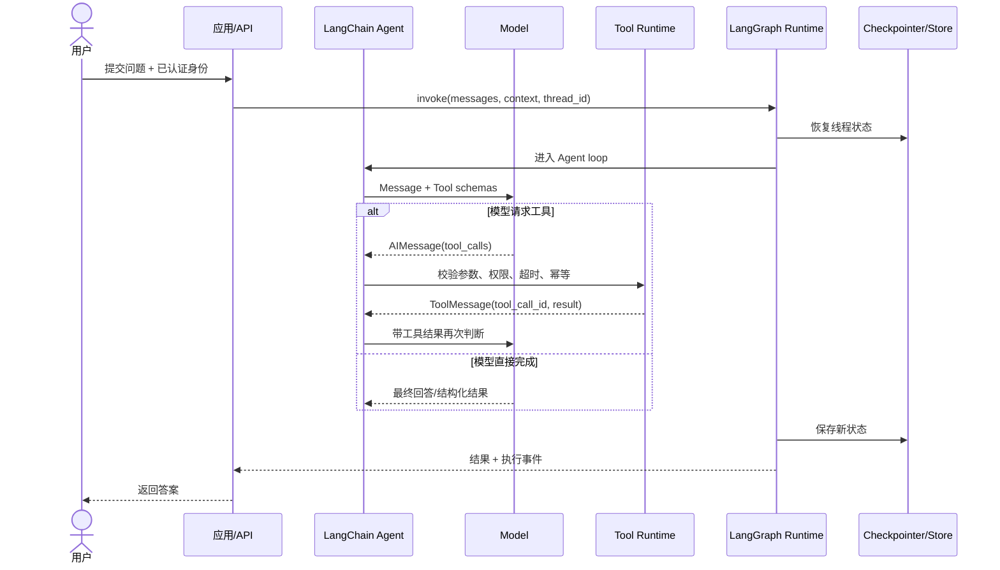

# LangChain 框架面试题：学习路线与总览

原文：[LangChain 框架面试题介绍](https://xiaolinnote.com/ai/langchain/langchain_info.html)

## 1. 这组文章真正考什么

表面上是 12 道题，底层其实只有五层能力：

1. **定位**：LangChain、LangGraph、LlamaIndex、LangChain4j 各在哪一层。
2. **组合**：Runnable 和 LCEL 如何建立确定性数据流。
3. **运行**：Agent 如何在模型与工具之间形成循环。
4. **状态**：State、Context、Checkpointer、Store 各自保存什么。
5. **生产化**：权限、重试、幂等、恢复、评测和可观测性。

只背类名会在追问中失效。更稳的方式是始终沿一次请求解释：输入如何进入系统，谁决定下一步，工具在哪里执行，状态在哪里保存，失败后怎样恢复。

## 2. 从一次请求看全局

图中有三个不能混淆的决策者：

- 模型决定“是否申请调用某个工具”。
- 宿主应用决定“是否允许并真正执行工具”。
- 图运行时决定“执行哪个节点、何时保存或恢复状态”。

## 3. 当前项目有哪些真实落点

| 理论 | 当前代码 |
| --- | --- |
| Runnable 串行/并行/分支 | [build_runnable_chain](examples/langchain_capabilities_reference.py) |
| Tool Schema 与宿主执行 | [lookup_order、ToolRegistry](examples/langchain_capabilities_reference.py) |
| 模型-工具循环 | [AgentLoop](examples/langchain_capabilities_reference.py) |
| 结构化规划与重试审计 | [Day25-Day28 LangChain Demo](../run_day25_day28_langchain_demo.py) |
| Checkpoint、DAG、Send、Command | [LangGraph 能力实现](../xiaolinnote_agent_analysis/examples/agent_capabilities_langgraph.py) |
| 短期/长期记忆作用域 | [InMemoryCheckpointer、LongTermStore](examples/langchain_capabilities_reference.py) |
| Deep Research Map-Reduce | [DeepResearchEngine](examples/langchain_capabilities_reference.py) |

## 4. 版本意识为什么是必答项

当前仓库是 0.2.x，网页讨论的是 v1。理解概念时可以贯通，调用 API 时必须分开：

| 问题 | 0.2.x 常见方式 | v1 主线 |
| --- | --- | --- |
| 固定流程 | Runnable / LCEL | Runnable / LCEL，仍适用 |
| Agent | `create_tool_calling_agent` + `AgentExecutor` | `create_agent` |
| 扩展 Agent 生命周期 | callbacks、手写 wrapper | middleware |
| 短期状态 | LangGraph checkpointer 或旧 Memory | AgentState + Checkpointer |
| 长期记忆 | 自建数据库/Store | LangGraph Store + Runtime |
| 旧 Chain | `LLMChain` 等仍常见 | 移入 `langchain-classic` |

迁移原则不是机械替换 import，而是先识别原代码属于固定 Chain、动态 Agent 还是复杂工作流，再迁到对应抽象。

## 5. 面试回答框架

遇到任何 LangChain 问题，可以按四步回答：

1. **一句话定位**：它解决哪一层的问题。
2. **执行路径**：输入、状态、模型、工具怎样流动。
3. **适用边界**：什么时候不该使用它。
4. **生产要求**：权限、幂等、超时、恢复、评测与监控。

### 示例：如何介绍 LangChain

> LangChain v1 是高层 Agent 开发框架。它用 Message、Model、Tool、Runnable 等协议隔离组件差异，用 `create_agent` 组装标准模型-工具循环，底层由 LangGraph 提供状态、路由、持久化和恢复。固定数据流仍适合 Runnable/LCEL；当业务拓扑比 Agent loop 更复杂时，再直接使用 LangGraph。

## 6. 高频面试问答

### Q1：LangChain 是否只是 Prompt 拼接库？

不是。Prompt 只是一个组件。LangChain 还统一模型消息、工具契约、结构化输出和执行接口，并提供 Agent 的高层组装方式。固定流程由 Runnable/LCEL 组合，动态工具循环由 Agent 处理。

### Q2：用了 LangChain 就不用理解 Function Calling 吗？

不行。LangChain 只是把工具 Schema、模型的 `tool_calls`、宿主执行和 `ToolMessage` 回灌封装起来。权限、参数校验、副作用与错误分类仍由应用负责。

### Q3：为什么面试中要主动说明版本？

因为 `LLMChain`、`AgentExecutor`、旧 Memory 在大量教程中仍存在，但 v1 的主线已经转向 Runnable、`create_agent`、middleware 和 LangGraph Runtime。不说明版本，正确的旧代码也可能成为错误的新项目建议。

### Q4：Agent 能跑通为什么还不能上线？

Demo 通常只证明一次正常路径。上线还要解决身份与租户隔离、危险工具审批、幂等、超时、重试预算、状态持久化、失败恢复、轨迹评测和线上 Trace。

### Q5：最小学习闭环是什么？

先运行本目录离线示例并阅读测试，再运行项目的 Day25-Day28 Demo，最后阅读已有 LangGraph 工作流。这样能依次看到组件组合、Agent loop 和状态图三个层次。
