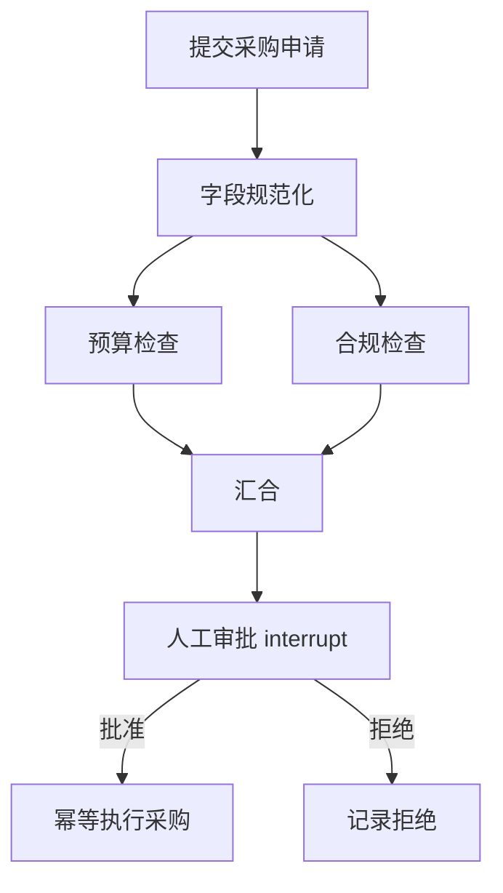
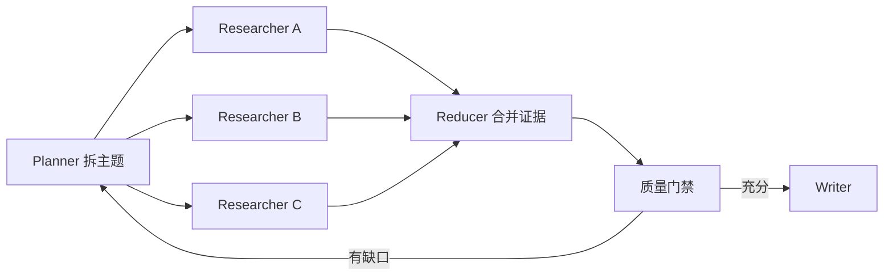

# LangGraph 优势：显式状态与可靠 Agent 工作流

原文：[LangGraph 相比 LangChain 有哪些优势？](https://xiaolinnote.com/ai/langchain/langgraph_advantages.html)

## 1. 优势不是“多一张图”

LangGraph 把复杂 Agent 运行过程变成可执行的状态机：State 保存数据，Node 执行工作，Edge/Command 决定去向，Checkpointer 保存进度。

图不是文档装饰。拓扑直接决定哪些节点并行、何时汇合、哪里暂停、恢复后从哪继续。

## 2. 把确定性规则和模型判断分开

采购流程中，模型可以理解申请理由，但金额阈值、权限和审批顺序不能由 Prompt 临场决定：



模型自主性应被放在明确边界内，而不是让 Prompt 兼任流程引擎。

## 3. Graph API 与 Functional API

| 场景 | 推荐 API | 原因 |
| --- | --- | --- |
| 分支、循环、并行汇合较多 | Graph API | State、Node、Edge 清楚可见 |
| 多 Agent 与子图 | Graph API | 路由和边界更易评审 |
| 已有过程式 Python 代码 | Functional API | 保留 `if/for`，用 task 增加持久化 |
| 线性流程加少量暂停 | Functional API | 样板更少 |

两种 API 共享运行时，也可以在外层图中调用内部 Functional 工作流。

## 4. Durable Execution 的条件

有 Checkpointer 不等于自动可靠：

```text
可靠恢复 = checkpoint + 清晰任务边界 + 可序列化状态
         + 幂等副作用 + 有界重试 + 确定的恢复策略
```

进程恢复后节点可能重新执行。外部发信、付款和建单应使用业务幂等键，不可只相信“图已经保存”。

## 5. Interrupt 与恢复

`interrupt()` 可以在节点内部暂停，保存状态并向外部返回审批载荷；之后用相同 `thread_id` 和 `Command(resume=...)` 继续。

注意：恢复通常从节点开头重新执行，而不是从 `interrupt()` 下一行继续。因此中断之前的副作用也必须幂等，中断顺序和载荷结构应保持稳定。

## 6. 并行 Map-Reduce 与 Reducer

Deep Research 常见形状：



`Send` 可按运行时产生的主题动态 fan-out；Reducer 明确多个分支如何合并列表，避免最后写入覆盖先前证据。

本目录 [DeepResearchEngine](examples/langchain_capabilities_reference.py) 使用 `ThreadPoolExecutor.map` 实现同样的教学形状；项目已有 [LangGraphDAGOrchestrator](../xiaolinnote_agent_analysis/examples/agent_capabilities_langgraph.py) 使用真实 `Send` 实现动态图并发。

## 7. 节点级故障处理

复杂流程应区分：

- Retry Policy：哪些异常可按退避重试；
- Timeout：单次尝试最多多久；
- Error Route：耗尽后去降级、补偿或人工节点；
- Parallel Recovery：成功分支不必因另一分支失败而重复付费；
- Time Travel：从历史 checkpoint 重放或分叉，不等于撤销现实副作用。

## 8. 流式输出不仅是 Token

长流程需要多层事件：

| 事件 | 面向对象 | 示例 |
| --- | --- | --- |
| messages | 用户 | 模型逐 token 输出 |
| updates | 产品 UI | 已完成 3/5 个来源 |
| custom | 业务前端 | 正在等待财务审批 |
| checkpoints/tasks | 开发运维 | 状态保存、节点失败 |
| debug | 调试人员 | 路由与内部执行细节 |

直接使用 LangGraph 时，节点与业务阶段由开发者定义，因此进度事件更容易与 UI、告警和审计对应。

## 9. 适用与不适用

适合：

- 采购、退款、理赔、合同审核等高风险流程；
- 跨小时或跨天等待外部事件；
- 并行研究、代码迁移、复杂 RAG 自纠错；
- 多 Agent 拥有独立工具、状态或团队边界；
- 需要查看和修改中间状态后重放。

不必使用：

- 单次 Prompt -> Model -> Parser；
- 只有几个工具的标准 Agent；
- 普通队列任务已经能可靠完成的确定性工作；
- 团队尚未准备维护 State、checkpoint 和恢复语义。

## 10. 面试问答

### Q1：LangGraph 的核心优势是什么？

将业务状态、拓扑和恢复边界显式化，使复杂 Agent 可以持久化、观察、暂停、恢复和节点级容错，而不只是增加一张可视化图。

### Q2：State 中为什么需要 Reducer？

多个并行节点可能更新同一字段。Reducer 定义追加、求和、合并或覆盖语义，避免并发结果互相丢失。

### Q3：Graph API 和 Functional API 如何选？

复杂拓扑和多 Agent 用 Graph API；已有过程式代码只需持久化/暂停时用 Functional API。依据表达清晰度选择，不按功能高低选择。

### Q4：Time Travel 会撤销已发送邮件吗？

不会。它操作的是状态历史和后续执行轨迹，现实世界副作用必须通过幂等、补偿或人工流程处理。

### Q5：为什么复杂流程仍可复用 LangChain Agent？

`create_agent` 返回编译图，可作为外层 StateGraph 的节点或子图。高层 Agent 负责模型-工具循环，外层图负责业务阶段与恢复。
