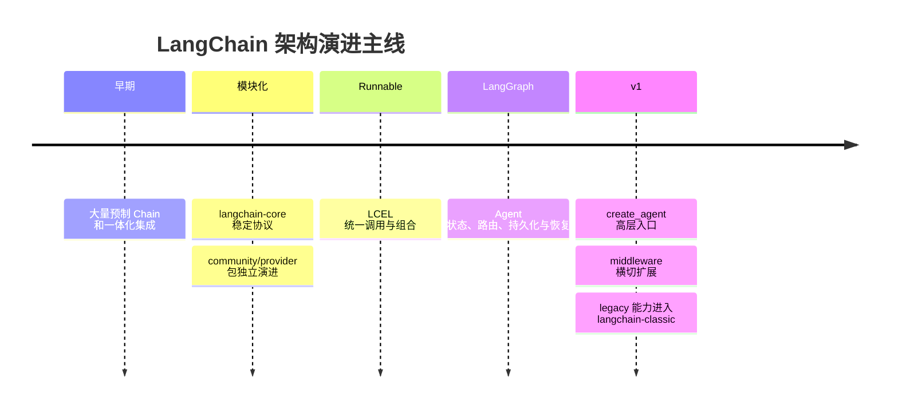
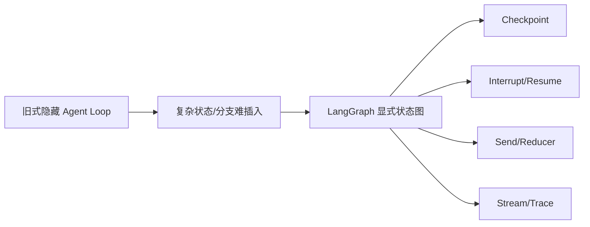
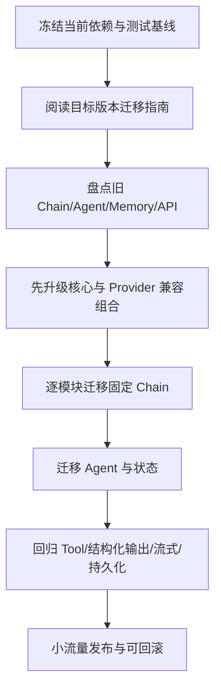

# LangChain 版本演进：架构变化与迁移清单

原文：[LangChain 大版本升级有哪些核心变化？](https://xiaolinnote.com/ai/langchain/version_evolution.html)

## 1. 不要背补丁号，要抓四条主线



共同方向是：稳定核心、拆分易变集成、统一确定性组合、把复杂 Agent 交给状态图运行时。

## 2. 为什么拆分核心与集成

不同代码有不同变化速度：

| 包/层 | 主要职责 | 变化原因 |
| --- | --- | --- |
| `langchain-core` | Message、Runnable、Tool 等协议 | 应尽量稳定 |
| `langchain` | 高层 Agent 开发能力 | 跟随主架构演进 |
| `langchain-community` | 社区第三方集成 | 外部 SDK 更新频繁 |
| `langchain-openai` 等 | 某个 Provider 适配 | 跟随厂商独立发布 |
| `langgraph` | 有状态编排与运行时 | 与 Agent 执行能力演进 |
| `langchain-classic` | 旧 Chain 与兼容能力 | 支持存量项目迁移 |

拆包降低耦合，但也意味着只升级 `langchain` 主包并不够。版本组合和依赖兼容必须一起验证。

## 3. Runnable/LCEL 带来的变化

旧方向是“每个场景一个专用 Chain 类”，新方向是“少量统一协议加组合”：

```python
# 现代固定流程的典型形状
chain = prompt | model | output_parser
result = chain.invoke({"question": "什么是 Agent？"})
```

组合结果仍是 Runnable，因此同步、异步、批量、流式、重试、fallback 和 tracing 可以沿统一接口扩展。

本项目 [build_runnable_chain](examples/langchain_capabilities_reference.py) 在当前 0.2.17 下真实运行，说明 Runnable/LCEL 并不是 v1 才出现；v1 是进一步收敛主线，而不是推翻全部已有协议。

## 4. Agent 为什么转向 LangGraph

传统执行器将模型-工具循环藏在内部，面对复杂分支、反思、审批和恢复时难以扩展。LangGraph 将循环展开成 State、Node 和 Edge，并通过 checkpoint 保存状态。



这不是 LangGraph 替换 LangChain，而是 LangChain 高层 Agent 将执行职责交给更合适的运行时。

## 5. v1 聚焦了什么

v1 的主线可以概括为：

- 新 Agent 从 `create_agent` 开始；
- 模型、Tools、system prompt、response format 在高层组装；
- middleware 处理动态 Prompt、工具过滤、重试、摘要、护栏和人工审批；
- 底层复用 LangGraph 的状态、持久化、流式和恢复；
- 旧式 Chain/Agent 能力移入 `langchain-classic`，不是全部消失。

## 6. 当前仓库的版本差距

当前 [requirements.txt](../requirements.txt) 固定：

```text
langchain==0.2.17
langchain-openai==0.1.25
langgraph==0.2.76
```

因此：

- Runnable、LCEL、Tool、Message、`StateGraph` 可以直接使用。
- [Day25-Day28 Demo](../run_day25_day28_langchain_demo.py) 使用 0.2.x 风格组件，不应硬改成网页中的 v1 import 后直接运行。
- 当前 LangChain 内部面对 Pydantic 2 会输出部分弃用提示，这属于依赖组合需要迁移验证的证据。
- 若升级 v1，应使用独立分支和完整回归，不应只修改一个版本号。

## 7. 安全迁移步骤



### 迁移前

1. 锁定 lockfile 或完整 `pip freeze`。
2. 保存当前输出、工具轨迹、延迟和 token 基线。
3. 盘点私有/内部 API 使用。
4. 找出所有有副作用的 Agent 路径。

### 迁移中

1. 固定流程优先迁为 Runnable/LCEL。
2. 标准 Tool Agent 迁向 `create_agent`。
3. 旧 Memory 按 State/Checkpointer/Store 重新划分作用域。
4. Callback 中的控制逻辑迁到 middleware；纯观测逻辑仍作为 tracing/callback。
5. 复杂业务拓扑直接建模为 LangGraph，不强塞进 middleware。

### 迁移后

1. 验证 Tool Schema 和调用 ID。
2. 验证结构化输出与 Pydantic 模型。
3. 验证同步、异步、批处理和流式行为。
4. 验证 checkpoint 恢复和用户隔离。
5. 验证重试不会重复副作用。
6. 比较质量、延迟、token 与成本基线。

## 8. 常见错误迁移方式

- 一次升级所有包，出错后无法定位。
- 只替换 import，不重新理解状态和 Memory 作用域。
- 因为旧 API “deprecated” 就在没有测试时全部删除。
- 把所有 Callback 机械改成 Middleware，混淆观察与控制。
- 只验证启动成功，不测 Tool、stream、持久化和恢复。
- 对付款等路径直接开启自动重试，却没有幂等。

## 9. 面试问答

### Q1：LangChain 大版本演进的核心是什么？

稳定核心协议、拆分第三方集成、用 Runnable/LCEL 统一固定流程、用 LangGraph 承担 Agent 运行时，并在 v1 通过 `create_agent` 与 middleware 聚焦高层开发体验。

### Q2：旧 Chain 是否被全部删除？

不是。许多旧能力迁入 `langchain-classic` 支持存量项目。新项目不再把它们作为主入口，但迁移可以渐进进行。

### Q3：升级时为什么要同时检查 Provider 包？

核心包和模型集成独立发布，消息、工具调用和结构化输出都跨越包边界。只升级主包可能形成不兼容组合。

### Q4：Pydantic 2 是最重要的升级点吗？

它对 Schema 和校验很重要，但架构面试中更应说明拆包、Runnable、LangGraph 和 v1 Agent 主线。迁移实践中则必须测试模型定义和导入路径。

### Q5：如何证明升级成功？

不仅是 import 和启动成功，还要对比工具轨迹、结构化输出、流式事件、状态恢复、质量、延迟、成本与副作用幂等。
