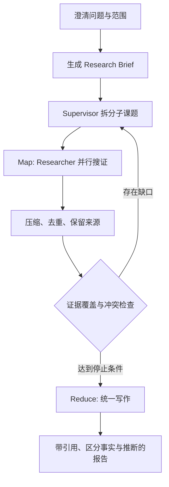
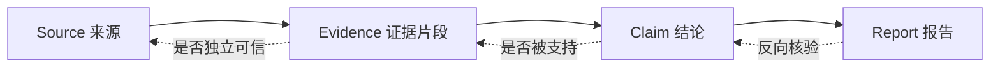

# Deep Research：Map-Reduce 搜证、质量门禁与统一写作

原文：[Deep Research 的实现逻辑和适用场景是什么？](https://xiaolinnote.com/ai/langchain/deep_research.html)

## 1. Deep Research 不是一个开关

Deep Research 是一类研究型 Agent 架构，不是 LangChain 核心包中的 `deep_research=True`。它解决的是开放问题：研究路径不固定、来源很多、需要动态补搜和证据核验。

一次搜索后让模型写长文不叫深度研究；十个 Agent 分别写一章再拼接，也不一定可靠。

## 2. 六步主流程



Research Brief 应明确目标、维度、时间范围、来源要求、交付格式和停止条件。没有 Brief，Supervisor 很容易不断扩大问题。

## 3. 为什么是 Map-Reduce 思想

### Map：隔离且并行的子课题

每个 Researcher 只处理一个相对独立主题，保留来源并输出压缩证据。好处有两个：

1. 上下文隔离，A 主题的大量网页不会干扰 B 主题。
2. 独立任务可并行，降低总等待时间。

### Reduce：统一核验和写作

Reducer 不是简单拼字符串，而要：

- 去重同源转载；
- 检查来源是否支持 claim；
- 处理时间和统计口径冲突；
- 标记证据不足；
- 统一术语、结构和引用格式。

这就是为什么更推荐“并行搜证，统一写作”，而不是“并行写章节”。

## 4. 当前项目的可运行实现

[DeepResearchEngine](examples/langchain_capabilities_reference.py) 接收两个可注入函数：

```python
engine = DeepResearchEngine(
    planner=lambda question: ["架构", "成本"],
    researcher=lambda topic: evidence_by_topic.get(topic, []),
    min_confidence=0.6,
    max_workers=4,
)
report = engine.run("如何设计研究型 Agent？")
```

执行逻辑：

1. Planner 生成并去重主题。
2. `ThreadPoolExecutor.map` 并行运行 Researcher。
3. 展平各分支 Evidence。
4. 根据来源和置信度检查覆盖。
5. 低质量证据被过滤，对应主题进入 `gaps`。
6. `_write_report` 统一输出报告和证据缺口。

这是离线教学实现，不抓取真实网页；真实项目可把 `researcher` 替换为搜索/MCP/RAG Tool，把 Planner 和 Writer 替换为模型，同时保留预算、证据和测试边界。

## 5. Evidence 应有哪些字段

最低限度：

```python
@dataclass(frozen=True)
class Evidence:
    topic: str
    claim: str
    source: str
    confidence: float
```

生产环境建议再增加：

- `source_type`：官方、论文、新闻、论坛；
- `published_at` 和 `retrieved_at`；
- `quote` 或原文片段；
- `document_id`、URL 和版本；
- `supports_or_contradicts`；
- `tenant_id` 与权限标签；
- 内容哈希，用于去重与审计。

## 6. 证据质量如何判断



来源数量多不等于独立。一百篇转载同一新闻仍只有一个原始来源。报告应区分：

- **事实**：来源直接支持；
- **推断**：由多条事实推导；
- **不确定性**：证据不足或来源冲突；
- **建议**：结合目标给出的判断，不冒充事实。

## 7. 停止条件与预算

研究成本同时受宽度和深度影响：

```text
宽度 = 并行子课题数量
深度 = 每个 Researcher 和 Supervisor 的迭代轮数
总成本 ≈ 分支数 × 每分支调用次数 × 平均 token/搜索成本
```

必须设置：

- 最大并发 Researcher；
- 每分支最大搜索/工具次数；
- Supervisor 最大补搜轮数；
- 总 token、搜索费用和时间预算；
- 最小来源质量与覆盖阈值；
- 用户取消与失败降级策略。

合理停止不是“模型说完成”，而是覆盖达到阈值、预算耗尽或新增搜索的边际收益过低。

## 8. 安全边界

外部网页和文档都是不可信输入，可能包含 Prompt Injection。建议：

1. 研究工具默认只读。
2. 把网页内容当数据，不当系统指令。
3. 搜索环境不可读取密钥和无关内部数据。
4. 下载文件做类型、大小和恶意内容检查。
5. 内部检索按用户权限过滤。
6. 高风险结论保留人工复核。
7. Trace 脱敏但保留来源和决策轨迹。

## 9. 如何评测

| 层次 | 指标示例 |
| --- | --- |
| 规划 | 子课题覆盖率、重复率、依赖合理性 |
| 检索 | 来源质量、Recall@K、独立来源数量 |
| 证据 | claim 支持率、引用正确率、冲突发现率 |
| 报告 | 完整性、一致性、事实/推断区分 |
| 工程 | 延迟、token、搜索成本、失败恢复率 |

最终报告好看不代表过程可靠。应同时评估轨迹和产物。

## 10. 适用场景

适合：竞品分析、技术路线调研、文献综述、供应商尽调、政策影响分析、内部资料与公开来源联合研究。

不适合：一次权威查询即可回答的事实、子任务强依赖无法并行的问题、来源无权限或质量极差的问题，以及报告价值低于多轮调用成本的任务。

## 11. 面试问答

### Q1：Deep Research 和普通 RAG 的区别是什么？

普通 RAG 通常执行一次或固定流程检索；Deep Research 会围绕目标动态拆题、多轮搜证、检查覆盖与冲突，并根据缺口继续研究后再统一写作。

### Q2：为什么需要子 Agent？

主要为了隔离不同主题的上下文，并让独立课题并行。不是 Agent 越多越智能；强耦合任务和简单问题不值得拆分。

### Q3：为什么不让每个 Researcher 直接写一章？

会产生重复背景、术语不统一和结论冲突。子 Agent 更适合返回压缩证据，由统一 Writer 综合全文。

### Q4：如何防止无限研究？

同时限制宽度、深度和总预算，并使用证据覆盖率、来源质量、边际收益和最大轮数作为停止条件。

### Q5：有引用是否代表报告可信？

不代表。还要验证来源是否独立可信、引用是否真的支持结论、资料是否过期、冲突是否被解释，以及高风险结论是否经过专家复核。

### Q6：Deep Research 为什么适合 LangGraph？

它天然包含动态拆分、并行 fan-out/fan-in、循环补搜、持久状态、预算和失败恢复，适合用显式图和 Reducer 建模。简单 Researcher 本身仍可用 LangChain Agent 实现。
