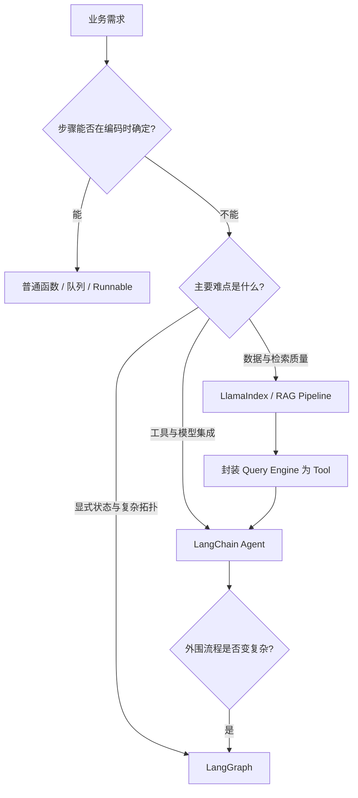
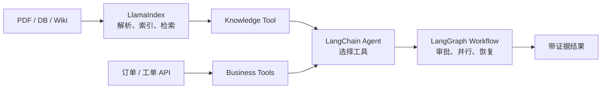

# AI Agent 开发框架：定位、组合与选型

原文：[你了解过哪些 AI Agent 开发框架？](https://xiaolinnote.com/ai/langchain/agent_frameworks.html)

## 1. 不要按“功能数量”选框架

主流框架都有模型、工具和 Agent 能力，真正差异是默认抽象瞄准哪种复杂度：

| 框架 | 优势重心 | 典型问题 |
| --- | --- | --- |
| LangChain | 模型、工具、结构化输出和 Agent 快速组装 | 如何让模型可靠使用业务能力 |
| LangGraph | 有状态流程、分支、并行、恢复、人工介入 | 如何让复杂任务可靠走完 |
| LlamaIndex | 数据接入、解析、索引、检索和上下文增强 | 如何给模型提供高质量私有数据 |
| OpenAI Agents SDK | OpenAI 生态下的轻量 Agent、handoff、guardrail | 如何快速完成供应商生态内的 Agent |
| CrewAI | 角色和任务驱动的多 Agent 协作 | 如何表达研究、写作、审核等角色分工 |
| LangChain4j | Java 风格的模型、Tool、Memory、RAG 和 AI Services | 如何把 AI 嵌入现有 JVM 系统 |

## 2. 先判断是否真的需要 Agent

例如“读取 CSV 后计算平均值并写报告”是固定流程，普通代码更便宜、更确定。只有当运行时必须根据内容选择搜索、数据库或人工处理路径时，Agent 才产生价值。

## 3. 三个框架如何组合

一个企业知识助手可以这样分层：

这不是要求每个项目都引入三套框架。只有数据层和编排层分别存在真实复杂度时，组合才值得；否则依赖、Tracing 和升级成本会大于收益。

## 4. 结合当前项目理解

- [Day25-Day28 LangChain Demo](../run_day25_day28_langchain_demo.py) 适合说明通用组件、结构化规划和 Tool 调用。
- [LangGraph DAG 实现](../xiaolinnote_agent_analysis/examples/agent_capabilities_langgraph.py) 适合说明并发、路由、检查点与反思循环。
- [Day8-Day21 RAG 脚本](../run_day18_hybrid_retrieval_comparison.py) 已覆盖数据切分、Dense/Sparse 召回、融合、重排和评测，代表“数据与检索层”的复杂度。

当前项目不依赖 LlamaIndex，因此不能声称已完成 LlamaIndex 集成；但 Day8-Day21 的处理阶段可以用来比较它将封装哪些现有逻辑。

## 5. 可操作的选型评分

对每个候选方案按 1-5 分评估：

| 维度 | 问题 |
| --- | --- |
| 集成成本 | 模型、数据库、MCP、内部 API 是否已有适配？ |
| 数据复杂度 | 是否有 PDF、表格、多版本、权限过滤和多路召回？ |
| 控制复杂度 | 是否有循环、并行、审批、补偿和跨天恢复？ |
| 团队匹配 | 团队更熟 Python、Java，还是已有工作流平台？ |
| 可测试性 | Tool、轨迹、最终结果能否分别测试？ |
| 运维成熟度 | 是否能监控 token、延迟、错误、checkpoint 与队列？ |

选型不是选最高总分，而是优先覆盖项目最大的风险。

## 6. 面试问答

### Q1：你了解哪些 Agent 框架？

建议回答三层，而不是报十个名字：LangChain 负责通用 Agent 组装，LangGraph 负责有状态执行控制，LlamaIndex 负责数据和上下文增强。再根据岗位补充 Java 的 LangChain4j、OpenAI Agents SDK 或 CrewAI。

### Q2：为什么复杂项目不直接全部使用 LangGraph？

控制越细，开发者越要自行设计 State、Reducer、节点、恢复语义和副作用边界。标准工具循环使用 LangChain 更少代码；只有业务拓扑成为主要复杂度时，下沉 LangGraph 才划算。

### Q3：LlamaIndex 能不能做 Agent？

能。它也提供 Agent 和 Workflow。说它“只能做 RAG”不准确；准确说法是它的优势重心在数据接入、索引、检索与上下文组织。

### Q4：多 Agent 一定比单 Agent 强吗？

不一定。多 Agent 增加上下文交接、错误定位、调用费用和一致性问题。只有角色需要独立工具、状态、权限、生命周期或真正可并行时，拆分才有收益。

### Q5：如何证明选型不是拍脑袋？

使用同一业务数据做小型 PoC，对比工具选择正确率、检索命中率、结构化输出成功率、延迟、成本、恢复能力和可观测性，而不是只看 GitHub Star 或组件列表。
