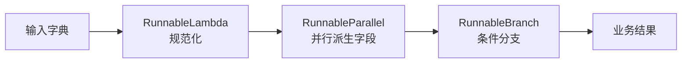
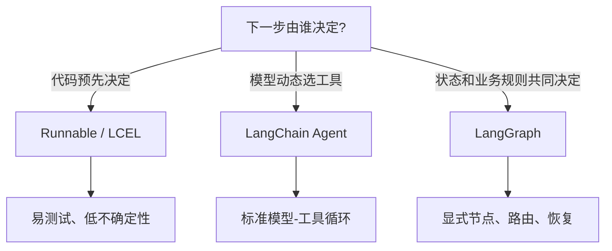

# LangChain Chain：Runnable、LCEL 与确定性数据流

原文：[如何理解 LangChain 中的 Chain？](https://xiaolinnote.com/ai/langchain/chain.html)

## 1. Chain 不是某一个类

Chain 是一种编排思想：把输入处理、Prompt、模型、检索器、解析器和业务函数按照确定的数据流连接起来。调用方只调用整体，不必手动搬运每一步的中间结果。

```text
输入 -> 清洗 -> 检索 -> Prompt -> Model -> Parser -> 业务结果
```

“确定”指拓扑由代码提前决定，不代表模型输出一定相同。即使某个节点是概率模型，下一步去哪个组件仍可由程序固定。

## 2. Runnable、LCEL、Chain 的关系

- **Runnable**：统一的可执行协议，提供 `invoke`、`ainvoke`、`batch`、`abatch`、`stream` 等入口。
- **LCEL**：声明 Runnable 如何组合的表达方式，例如 `a | b | c`。
- **Chain**：由若干步骤组成的完整数据流；现代实现通常就是组合后的 Runnable。



## 3. 当前项目中的真实实现

[build_runnable_chain](examples/langchain_capabilities_reference.py) 使用的都是实际 LangChain 类：

```python
normalize = RunnableLambda(normalize_request)
enrich = RunnableParallel(
    question=RunnableLambda(lambda value: value["question"]),
    route=RunnableLambda(classify_request),
)
chain = normalize | enrich | route
```

执行：

```python
result = build_runnable_chain().invoke({"question": "查询订单 A100"})
```

数据经历三次类型变化：

1. 原始字典被规范化为 `{"question": str}`。
2. 并行节点产生 `{"question": str, "route": str}`。
3. 分支节点增加 `answer`。

LCEL 不会自动修复类型。前一步返回字符串、后一步却读取 `value["question"]` 时，运行仍会报错。每个节点都应有清楚的输入输出契约。

## 4. 串行、并行和分支分别解决什么

### 串行 RunnableSequence

适合后一步依赖前一步结果：

```text
清洗问题 -> 构造 Prompt -> 调用模型 -> 解析 JSON
```

`a | b | c` 通常构造 `RunnableSequence`。

### 并行 RunnableParallel

适合多个任务只依赖同一份输入：

```text
文章 ─┬-> 摘要
      └-> 标题
```

结果会汇成字典。并行可以降低墙钟时间，但会增加并发请求、限流压力和瞬时成本。

### 条件 RunnableBranch

适合分支集合在编码时已知：

```text
分类结果 = order     -> 订单处理链
分类结果 = knowledge -> 检索链
其他                 -> 通用回答链
```

如果分支不是预先定义，而是模型可循环选择任意工具，问题就更接近 Agent。

## 5. 统一调用接口的实际价值

| 接口 | 用途 | 注意事项 |
| --- | --- | --- |
| `invoke` | 单条同步调用 | 最简单，但会占用当前线程 |
| `ainvoke` | 单条异步调用 | 内部 I/O 也应原生异步 |
| `batch` | 多输入批量处理 | 不等于供应商原生批处理 |
| `stream` | 流式返回 | 中间阻塞节点可能推迟首块输出 |
| `with_retry` | 临时故障重试 | 有副作用步骤必须先保证幂等 |
| `with_fallbacks` | 模型或链路降级 | 需要统一输出契约 |
| `with_config` | tags、metadata 等运行配置 | 不应放入密钥和敏感数据 |

## 6. Chain、Agent、LangGraph 怎么选



不要把所有流程塞进 Agent。确定性的数据清洗、权限检查、金额阈值和结果校验应留在代码中；模型只处理需要语义判断的部分。

## 7. 旧 API 如何理解

旧教程中的 `LLMChain`、`SequentialChain` 解决的是相同的组合问题，但每类场景都有专用类，组合与调用方式不够统一。现代方向是少量 Runnable 原语加组合；LangChain v1 已把许多旧 Chain 移到 `langchain-classic`。

维护旧项目时无需立刻重写，但新增功能应先画清输入输出，再逐段替换为 Runnable，而不是全仓库机械搜索替换。

## 8. 面试问答

### Q1：`|` 只是语法糖吗？

不只是缩短函数嵌套。它构造新的 Runnable，组合结果仍拥有统一调用、配置、批处理、流式、重试和追踪接口。真正价值是协议和可组合性。

### Q2：Chain 是否只能线性执行？

不是。`RunnableParallel` 支持并行，`RunnableBranch` 支持条件分支。Chain 的关键是拓扑预先确定，不是只能画成直线。

### Q3：调用 `stream` 就一定逐 token 输出吗？

不一定。每个中间组件都要支持相应流式语义；阻塞式转换或不支持 transform 的节点可能让后续输出等它完成。

### Q4：什么时候不用 Chain？

一个简单函数就能清晰表达时无需引入框架；当下一步由模型动态决定并可能多轮调用工具时用 Agent；当流程需要显式状态、复杂并行、暂停恢复时用 LangGraph。

### Q5：如何测试一条 Chain？

先分别测试每个节点的输入输出，再测试分支路由，最后测试整条链。模型节点应使用 fake model 或录制响应，使测试不依赖网络和随机输出。本目录测试就是这种方式。
