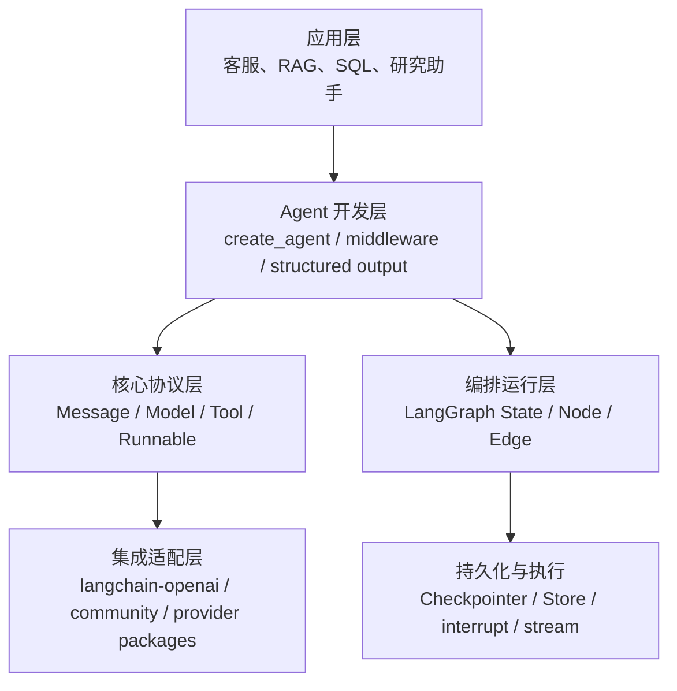
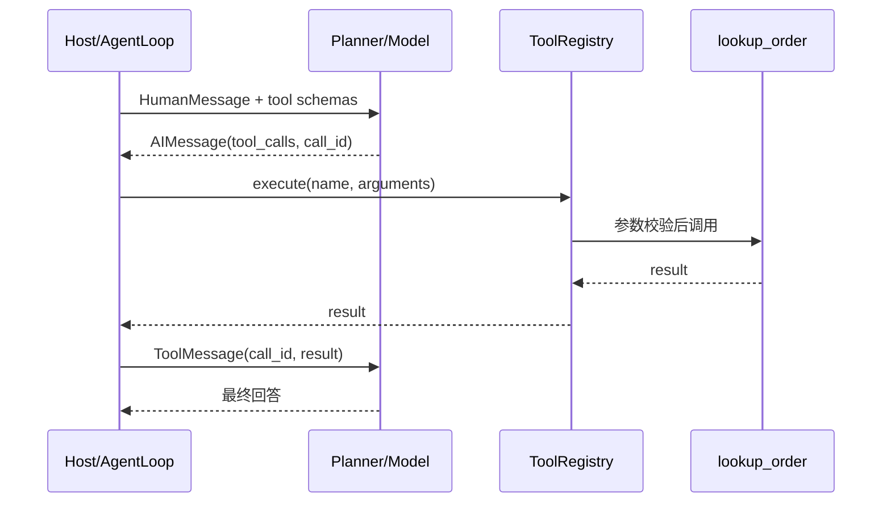
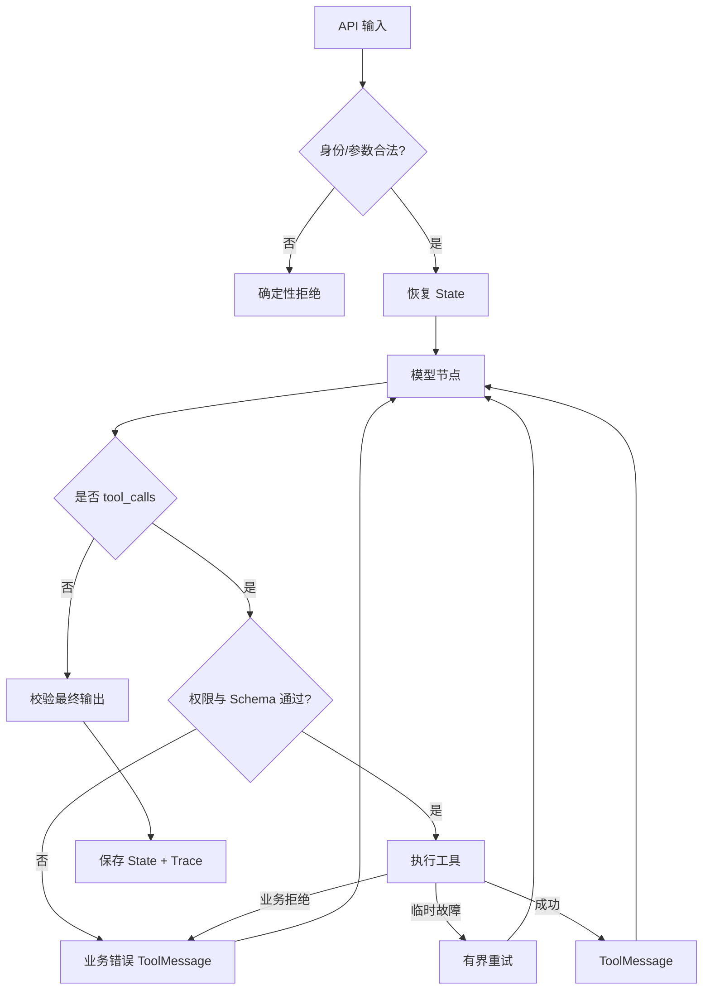

# LangChain 底层架构：协议、Agent Loop 与运行时

原文：[LangChain 的底层架构与实现原理是什么？](https://xiaolinnote.com/ai/langchain/langchain_architecture.html)

## 1. 四层架构



层次不是严格单向：模型本身也可能是 Runnable，`create_agent` 返回的编译图同样可调用。图的意义是区分职责，不是规定所有 import 的方向。

## 2. 核心协议解决什么

### Message：统一对话数据

- `HumanMessage`：用户输入。
- `AIMessage`：模型文本或 `tool_calls`。
- `ToolMessage`：工具执行结果，并通过 `tool_call_id` 对应请求。
- `SystemMessage`：系统级行为约束。

一次模型可能并行申请多个工具。调用 ID 让每条结果能准确回到原调用，不能只靠工具名称猜测。

### Tool：模型意图与业务执行的边界

Tool 同时包含两部分：

1. 模型可见的名称、描述和参数 Schema。
2. 宿主应用持有的真实函数、客户端、权限和资源。

模型只能提出调用请求，不能直接获得数据库或操作系统权限。

### Runnable：统一执行语义

Prompt、Model、Parser、Retriever 和自定义转换只要满足 Runnable 协议，就能使用相同调用方式并继续组合。这减少的是胶水代码，不是业务复杂度本身。

## 3. Agent Loop 的真实过程

[AgentLoop](examples/langchain_capabilities_reference.py) 用离线规则模型展示了完整协议：



对应代码关键点：

- `ToolRegistry.schemas()` 生成模型可理解的工具合同。
- `RuleBasedPlanner.decide()` 模拟模型决策。
- `ToolRegistry.execute()` 在宿主侧执行。
- `ToolMessage` 把结果交回模型。
- `max_rounds` 防止循环失控。

真实 `create_agent` 会把这种循环编译到 LangGraph，而不是要求业务手写 `for`。

## 4. State、Context、Store 不应混在一起

| 数据容器 | 生命周期 | 示例 | 信任来源 |
| --- | --- | --- | --- |
| State | 当前线程中持续变化 | messages、步骤、工具结果 | 图节点更新 |
| Context | 单次调用期间稳定 | user_id、tenant_id、权限、客户端 | 已认证应用注入 |
| Store | 跨线程长期保存 | 用户偏好、经验、长期事实 | 受控写入与治理 |

如果让模型填写 `user_id`，提示注入可能诱导它访问他人数据；如果把数据库连接塞进消息，既浪费 token 又泄露内部实现；如果把当前步骤当长期记忆保存，下一次会话会读到无效状态。

本目录的 [RuntimeContext、InMemoryCheckpointer、LongTermStore](examples/langchain_capabilities_reference.py) 分别演示可信上下文、线程状态和跨线程数据。

## 5. Middleware 的架构位置

Middleware 处理横切关注点，而不是取代 Tool 或图：

```text
模型调用前：动态 Prompt、历史摘要、模型选择、工具过滤
模型调用后：结构检查、安全检查、指标记录
工具调用前：权限、审批、参数增强
工具调用后：错误分类、重试、脱敏、审计
```

权限必须在业务服务再次校验。Middleware 可以提前拦截，但不能成为唯一安全边界。

## 6. LangGraph 为什么是运行时

普通 `while` 循环能做 Demo，却难以可靠支持：

- 每一步状态快照；
- 服务重启后的恢复；
- 任意节点暂停等待人工；
- 并行分支及结果合并；
- 状态历史、重放和分叉；
- 节点级重试与错误路由。

项目已有 [agent_capabilities_langgraph.py](../xiaolinnote_agent_analysis/examples/agent_capabilities_langgraph.py)，实际使用 `StateGraph`、`MemorySaver`、`Send` 和 `Command`，比伪代码更适合理解底层执行。

## 7. 一次请求的失败边界



## 8. 面试问答

### Q1：LangChain 底层只是一个 Agent `while` 循环吗？

行为表面类似，但生产运行时还要管理 State、路由、检查点、中断恢复、流式事件和并发。v1 的 `create_agent` 底层使用 LangGraph，不能只理解为循环语句。

### Q2：Message、Tool、Runnable 各解决什么？

Message 统一数据表达，Tool 定义模型意图与业务动作的边界，Runnable 统一执行和组合方式。三者共同隔离模型厂商与业务代码。

### Q3：Callback 和 Middleware 有什么差别？

Callback 更偏观察生命周期事件，例如日志和 Trace；v1 Middleware 能包装或修改模型/工具请求、响应与状态，适合行为控制。不能用日志回调替代权限逻辑。

### Q4：换 Provider 是否可以零成本？

统一协议降低代码改动，但工具调用格式、结构化输出、多模态、token 计算、限流和 Prompt 效果仍有差异，必须重新评测。

### Q5：LangChain 与 LangGraph 是否二选一？

不是。LangChain Agent 本身运行在 LangGraph 上。常见 Agent 使用高层入口；需要控制完整业务拓扑时直接使用 LangGraph，还可把原 Agent 作为节点复用。
