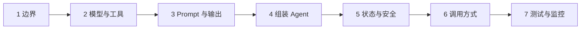
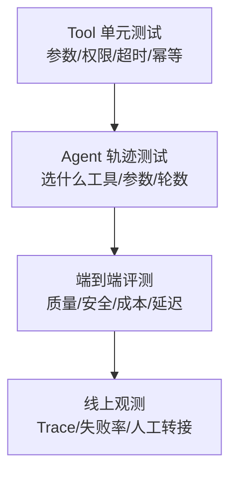

# 使用 LangChain 构建 Agent：七步工程落地法

原文：[使用 LangChain 构建 Agent 的核心步骤是什么？](https://xiaolinnote.com/ai/langchain/build_agent.html)

## 1. 七步不是 API 清单



这条路线从需求走到上线。只完成第 4 步，通常只能称为 Demo。

## 2. 第一步：明确边界与停止条件

以订单客服为例：

| 项目 | 明确定义 |
| --- | --- |
| 允许 | 查询当前用户订单、解释物流状态 |
| 禁止 | 自行退款、修改收货地址、查询他人订单 |
| 成功 | 返回答复、订单状态、是否转人工 |
| 停止 | 已回答、需要人工、达到最大轮数或预算 |
| 失败 | 工具不可用、身份不匹配、输出无法校验 |

边界决定工具、Prompt、状态字段和测试用例。不能用一句“你是有帮助的助手”代替业务定义。

## 3. 第二步：选择模型并设计小工具

模型至少要满足项目实际需要：工具调用、结构化输出、上下文长度和可接受的延迟成本。

工具应职责单一：[lookup_order](examples/langchain_capabilities_reference.py) 只读订单，不同时处理退款和通知。模型看到的 Schema 只有 `order_id` 和 `detail`；身份与权限则属于服务端上下文。

设计工具时逐项回答：

1. 名称和描述会不会与其他工具混淆？
2. 参数是否有类型、枚举、范围和必填约束？
3. 这是只读操作还是有副作用操作？
4. 谁做权限检查？
5. 是否幂等，能否安全重试？
6. 哪些错误应返回模型，哪些必须报警终止？

## 4. 第三步：约束行为与输出

System Prompt 应包含角色、事实边界、工具规则、失败策略和禁止行为。若结果进入业务系统，再使用 Pydantic 定义结构化输出：

```python
from pydantic import BaseModel, Field


class SupportReply(BaseModel):
    answer: str = Field(description="展示给用户的答复")
    order_status: str | None = None
    needs_human: bool
```

Schema 只能保证形状，不能保证事实和权限。订单状态必须来自受控 Tool，`needs_human=False` 也不能绕过真实风控。

## 5. 第四步：组装 Agent

LangChain v1 的推荐形状如下。**当前仓库 0.2.x 不能直接运行这段 v1 API**：

```python
from langchain.agents import create_agent

agent = create_agent(
    model="openai:your-model",
    tools=[lookup_order],
    system_prompt="涉及订单状态必须先查询工具；禁止猜测。",
    response_format=SupportReply,
)

result = agent.invoke(
    {"messages": [{"role": "user", "content": "订单 A100 到哪了？"}]}
)
reply = result["structured_response"]
```

当前项目可运行的等价学习入口有两个：

- [AgentLoop](examples/langchain_capabilities_reference.py)：显式展示 tool call 和 ToolMessage。
- [run_day25_day28_langchain_demo.py](../run_day25_day28_langchain_demo.py)：使用 0.2.x 的模型、Tool、结构化规划和 Callback。

## 6. 第五步：状态、安全和恢复

```text
thread_id -> Checkpointer -> 当前会话 State
tenant/user namespace -> Store -> 跨会话长期记忆
authenticated context -> Tool -> 身份、权限和依赖
```

危险操作还需要：

- 服务端授权，而非只靠 Prompt；
- 业务幂等键，防止重试重复扣款；
- 人工审批和拒绝路径；
- 审计记录，但不记录密钥和完整凭证；
- 最大轮数、总超时、token 和调用预算。

## 7. 第六步：选择交互方式

| 方式 | 场景 | 风险点 |
| --- | --- | --- |
| `invoke` | 短任务或后台作业 | 阻塞等待最终结果 |
| `ainvoke` | 异步 Web 服务、并发 I/O | 底层客户端也必须异步 |
| `stream` | 长回答、工具进度 | 事件类型和断线恢复 |
| 队列任务 | 长时间、可取消任务 | 状态持久化、幂等和 worker 重试 |

流式输出改善反馈，不会让慢工具自动变快。

## 8. 第七步：测试与监控



当前新增的 [测试文件](../tests/test_langchain_capabilities_reference.py) 不依赖网络，验证工具 Schema、可信上下文、Agent loop 和 Memory 隔离。这是第一层和第二层测试的基础。

线上至少观测：

- 模型、Prompt、Tool 版本；
- 工具选择与参数正确率；
- 单步和端到端延迟；
- token、搜索和外部 API 成本；
- 重试、超时、循环上限命中次数；
- 人工审批与转接率；
- 最终输出和引用正确率。

## 9. 上线前检查表

1. 是否有明确允许、禁止、成功和停止条件？
2. 工具是否小而清楚，参数 Schema 是否足够严格？
3. 身份和权限是否来自可信 Runtime？
4. 副作用是否幂等，危险动作是否审批？
5. Checkpointer/Store 是否持久化并按租户隔离？
6. 是否有超时、重试、并发、轮数和成本上限？
7. 是否分别测试 Tool、轨迹和最终结果？
8. 一次失败能否通过 Trace 和 checkpoint 复现？

## 10. 面试问答

### Q1：构建 Agent 的第一步为什么不是选模型？

因为任务边界决定所需能力、安全规则和成功标准。边界不清时，换更强模型只会更有能力地执行模糊目标。

### Q2：`create_agent` 之后还需要 LangGraph 吗？

标准 Agent 已经运行在 LangGraph 上。只有需要显式业务拓扑、复杂并行、任意暂停点或精细恢复边界时，才直接编写外层 `StateGraph`。

### Q3：结构化输出是否消除幻觉？

不能。它提高格式和类型可靠性，不保证字段中的事实正确。事实来源、权限和业务约束仍需要 Tool 与确定性校验。

### Q4：什么错误适合自动重试？

网络超时、限流和暂时不可用等瞬时故障。参数错误应修正参数，业务拒绝应明确返回，程序 Bug 和数据损坏应暴露并报警。有副作用的调用先保证幂等。

### Q5：Agent 测试为什么不能只比最终文本？

同样的最终文本可能来自错误工具、越权查询或偶然猜中。必须检查工具轨迹、参数、状态变更、引用、成本和停止条件。
