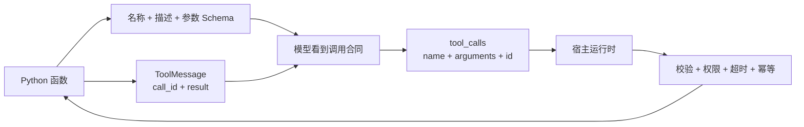

# LangChain Tool 注册：Schema、Runtime 与执行安全

原文：[在 LangChain 中，如何为 Agent 注册工具？](https://xiaolinnote.com/ai/langchain/tool_registration.html)

## 1. 注册 Tool 到底注册了什么

一个 Tool 有两个面对不同对象的部分：



模型看不到函数源码，也不应该获得底层客户端。它根据名称、描述和 Schema 选择工具并生成参数；宿主应用才真正执行代码。

## 2. 四种定义方式怎么选

| 方式 | 适合场景 | 不适合场景 |
| --- | --- | --- |
| 普通函数 | 名称、类型、docstring 已足够清楚 | 复杂约束与定制描述 |
| `@tool` | 大多数业务工具，自动推导或显式 Schema | 需要长期管理资源生命周期 |
| `StructuredTool` | 包装不可修改函数、动态组装同步/异步实现 | 简单函数不必额外包装 |
| `BaseTool` 子类 | 持有客户端、管理资源、深度定制执行 | 为一个简单计算器制造样板代码 |

原则是从简单开始：函数能说清楚就用函数，需要明确合同再用 `@tool`，需要动态组装用 `StructuredTool`，成为有生命周期的组件后才继承 `BaseTool`。

## 3. 当前项目里的实际 Tool

[lookup_order](examples/langchain_capabilities_reference.py) 使用 Pydantic Schema：

```python
class OrderQuery(BaseModel):
    order_id: str = Field(min_length=1, description="要查询的订单号")
    detail: str = Field(default="summary", description="summary 或 full")


@tool("lookup_order", args_schema=OrderQuery)
def lookup_order(order_id: str, detail: str = "summary") -> dict[str, str]:
    """查询订单状态；该工具只读，不执行退款或修改操作。"""
    ...
```

这里有三层约束：

1. `Field` 描述帮助模型填参。
2. Pydantic 在执行前检查类型和必填字段。
3. 函数内部仍校验 `detail` 的业务枚举。

Schema 不是权限系统。即使参数合法，也可能没有访问该订单的权限。

## 4. 可信参数不能暴露给模型

任务参数与可信参数必须分开：

| 参数 | 示例 | 谁提供 |
| --- | --- | --- |
| 任务参数 | order_id、城市、搜索词 | 模型从用户问题提取 |
| 可信参数 | tenant_id、user_id、role、数据库客户端 | 已认证应用运行时 |

[build_balance_tool](examples/langchain_capabilities_reference.py) 在当前 0.2.x 环境中使用闭包注入 `RuntimeContext`，模型 Schema 只包含 `account_type`。测试明确断言 Schema 中没有 `user_id`。

LangChain v1 更推荐通过 `ToolRuntime` 读取：

```python
# v1 概念示例，当前 0.2.x 环境不直接运行
@tool
def get_balance(account_type: str, runtime: ToolRuntime[UserContext]) -> str:
    user_id = runtime.context.user_id
    role = runtime.context.role
    ...
```

关键不是使用闭包还是 `ToolRuntime`，而是身份必须来自可信边界，不能由模型生成。

## 5. ToolRegistry 展示宿主职责

[ToolRegistry](examples/langchain_capabilities_reference.py) 做两件事：

- `schemas()`：给模型暴露合同。
- `execute()`：按名称找到函数并调用。

真实生产 Runtime 还应在 `execute()` 周围增加：

```text
工具白名单 -> Schema 校验 -> 身份/权限 -> 幂等检查
-> 超时/并发限制 -> 执行 -> 结果裁剪/脱敏 -> 审计
```

## 6. 错误要分类，不要统一吞掉

| 错误类型 | 示例 | 建议处理 |
| --- | --- | --- |
| 参数错误 | 日期格式错误、缺少 order_id | 返回可修正信息，让模型重填 |
| 业务拒绝 | 无权限、库存不足、订单不存在 | 当作正常业务结果，清楚说明 |
| 瞬时故障 | 超时、429、服务短暂不可用 | 有上限退避重试 |
| 程序错误 | KeyError、数据损坏、配置错误 | 终止、告警，不伪装成业务失败 |

付款、发信、建单等副作用工具即使面对瞬时故障，也不能盲目重试。应使用业务幂等键，并在不确定“上一次是否成功”时查询权威系统。

## 7. 异步工具的真实边界

把函数声明为 `async def` 并不自动提高并发。如果内部仍使用阻塞 HTTP 客户端，事件循环照样被阻塞。异步链路必须从 Agent 调用、Tool 到底层数据库/HTTP 客户端保持一致。

并行执行多个只读工具通常安全；并行执行有顺序依赖或副作用的工具，可能产生竞态和重复操作，应由业务编排明确控制。

## 8. 工具数量不是越多越好

工具描述相似、数量过多时，模型更容易选错。可按当前路由、用户权限和业务阶段动态缩小工具集合：

```text
普通用户 + 订单查询场景 -> lookup_order, search_policy
财务审核角色             -> lookup_order, approve_refund
未认证用户               -> public_help
```

动态过滤工具只减少暴露面，业务服务仍必须再次授权。

## 9. 面试问答

### Q1：`@tool` 做了什么？

它把函数名、docstring、类型注解和可选 Pydantic 模型转换为工具描述和参数 Schema，同时保留可执行函数，让运行时可以把模型的调用请求落到真实代码。

### Q2：为什么不全部继承 `BaseTool`？

复杂度不匹配。简单函数使用装饰器更清晰；只有需要持有连接、管理同步异步资源、metadata 和生命周期时，类抽象才有收益。

### Q3：参数经过 Pydantic 后是否安全？

只说明结构合法。SQL 注入、路径穿越、URL 白名单、用户权限、数据范围和业务规则仍需在执行层校验。

### Q4：工具异常要不要都返回模型？

不要。可修正参数和正常业务拒绝可以结构化返回；瞬时错误可有界重试；程序 Bug、敏感错误和数据损坏应中止并告警，避免泄露堆栈或让模型继续错误操作。

### Q5：为什么 `tool_call_id` 重要？

一轮可能并行调用多个工具。结果需要通过 ID 对应原请求，否则模型无法可靠区分哪条结果属于哪个参数组合。
