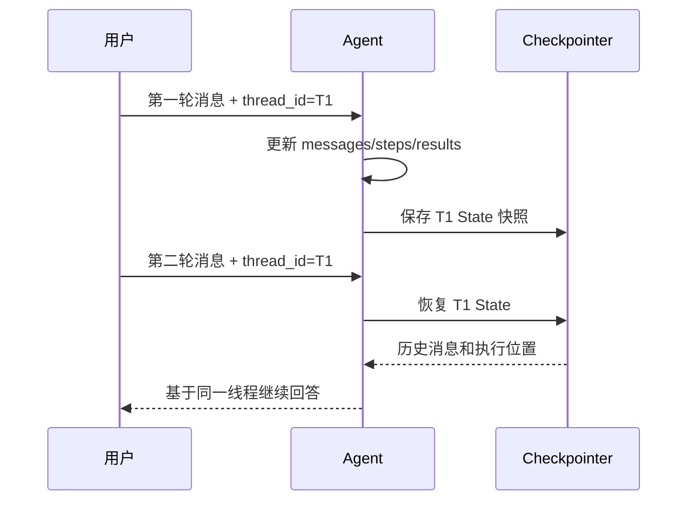
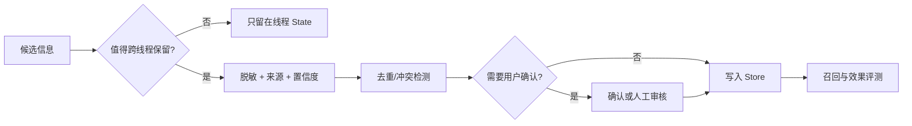

# LangChain 记忆：短期 State 与长期 Store

原文：[LangChain 如何实现短期记忆和长期记忆？](https://xiaolinnote.com/ai/langchain/memory.html)

## 1. 最短记忆公式

```text
短期记忆 = State + thread_id + Checkpointer
长期记忆 = namespace + key + Store
可信身份 = Runtime Context
```

三者作用域不同，不能因为都“能存数据”就混用。

## 2. 用生活例子理解

用户在一次旅行规划会话中说：

- “这次去杭州三天，预算 3000 元”：当前任务状态，属于短期记忆。
- “我不吃辣，以后推荐餐厅都避开”：跨会话偏好，适合长期记忆。
- `user_id=alice`：由登录系统确认的身份，属于可信 Context。
- “杭州今天下雨”：实时事实，应查询天气服务，不能长期记住后当真。

## 3. 短期记忆如何工作



本目录 [InMemoryCheckpointer](examples/langchain_capabilities_reference.py) 提供最小语义：按 `thread_id` 保存和加载消息副本。项目已有 [LangGraphMemoryWorkflow](../xiaolinnote_agent_analysis/examples/agent_capabilities_langgraph.py) 则使用真实 `MemorySaver` 保存图状态。

内存实现只适合开发测试。生产环境需要数据库型 Checkpointer，否则多实例和重启会丢状态。

## 4. 长期记忆如何组织

推荐键结构：

```text
namespace = (tenant_id, user_id, memory_type)
key       = 稳定业务标识
value     = JSON + source + timestamp + confidence
```

示例：

```python
store.put(
    ("tenant-a", "alice", "preferences"),
    "language",
    {"value": "Python", "source": "explicit-user-request"},
)
```

同一个用户换 `thread_id` 后仍能读取这个 namespace；另一个用户的 namespace 必须隔离。[LongTermStore](examples/langchain_capabilities_reference.py) 和对应测试演示了这一点。

## 5. 不是所有聊天都值得记住

长期记忆可分为：

| 类型 | 示例 | 写入策略 |
| --- | --- | --- |
| 语义事实 | 用户常用 Java | 明确表达或高置信提炼 |
| 情景经验 | 上次通过回滚解决发布故障 | 保存来源和时间，允许过期 |
| 程序性规则 | 退款前必须核验归属 | 来自权威规则，不靠聊天推断 |

不应直接长期保存：临时验证码、密钥、实时余额、未经确认的模型推断、每句闲聊以及可从权威系统实时查询的数据。

## 6. 长对话如何控制上下文

| 策略 | 改变什么 | 优点 | 风险 |
| --- | --- | --- | --- |
| 裁剪 | 本次模型输入 | 简单、保留持久状态 | 旧信息本轮不可见 |
| 删除 | 持久 State | 真正降低状态规模 | 信息不可恢复 |
| 摘要 | 用短文本替代旧消息 | 保留主要语义 | 摘要遗漏或逐轮漂移 |

不能只按“最近 10 条”机械裁剪。Tool call 与 ToolMessage 应成对保留，当前工单号、用户承诺和未完成步骤也可能比普通闲聊更重要。

## 7. 长期记忆写入流程



用户明确说“请记住”时可以实时写入；模型推断出的偏好更适合后台提炼后再写。所有记忆都应支持更正、删除和过期。

## 8. 记忆评测不能只看写入成功率

至少评估四步：

1. **候选质量**：写入的信息是否值得长期保存。
2. **召回质量**：相关问题能否找到，无关问题会不会误召回。
3. **回答增益**：注入记忆是否真的改善结果。
4. **安全隔离**：不同租户和用户是否存在串读。

一个不断写入但从不正确召回的 Store，不是记忆系统，只是增长中的数据库。

## 9. 旧 Memory API 怎么看

`ConversationBufferMemory`、`ConversationSummaryMemory` 属于旧式 Chain 时代的常见抽象。v1 主线更明确地拆为 Agent State + Checkpointer、跨线程 Store、以及负责裁剪/摘要/写入策略的 Middleware 或图节点。

## 10. 面试问答

### Q1：短期记忆和长期记忆的核心区别是什么？

不是保存时间长短，而是作用域。短期记忆属于某个执行线程和状态历史；长期记忆跨线程，以用户/租户 namespace 组织。

### Q2：Checkpointer 和 Store 能否二选一？

通常不能。前者回答“这次任务运行到哪”，后者回答“未来其他任务还要记住什么”。复杂应用会同时使用。

### Q3：把所有历史存向量库是不是长期记忆？

不是。向量库只是召回方式。长期记忆还需要价值筛选、作用域、来源、冲突处理、隐私、过期和更正机制。

### Q4：为什么 `user_id` 不能由模型填写？

它是安全主体。模型可能出错或被提示注入影响，可信身份必须由认证系统注入 Runtime Context，并在服务端授权。

### Q5：Checkpoint 能否保证副作用只执行一次？

不能。恢复时节点可能重跑。付款、发信、创建订单等操作仍需业务幂等键和执行记录。
