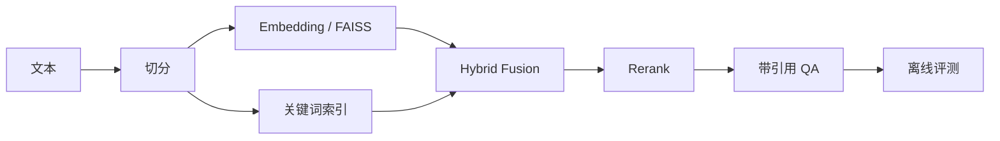
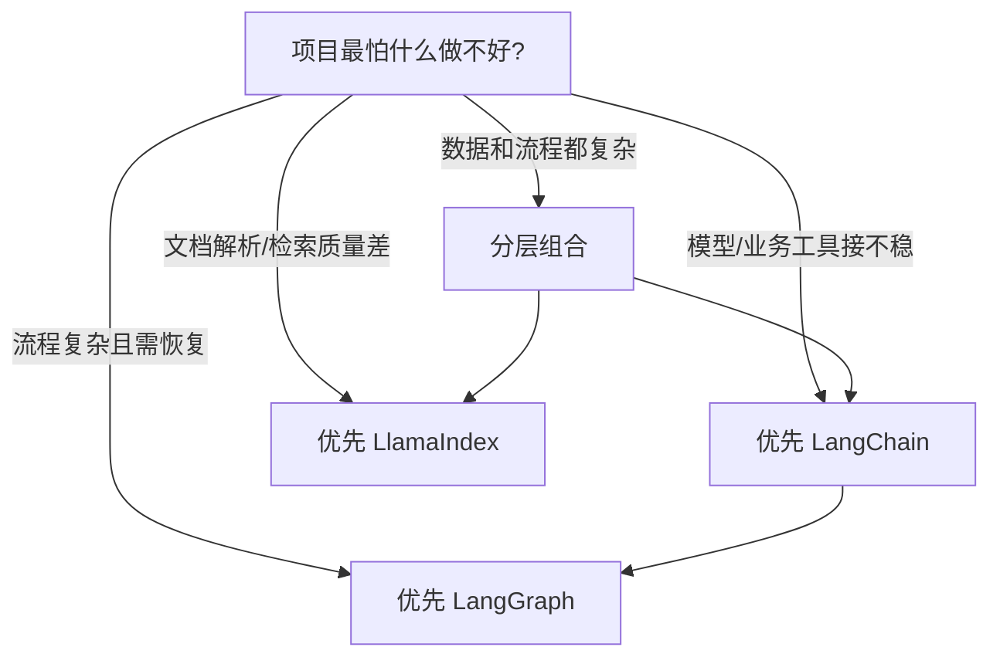

# LangChain 与 LlamaIndex：Agent 层和数据层如何选

原文：[LangChain 和 LlamaIndex 有什么区别？](https://xiaolinnote.com/ai/langchain/langchain_vs_llamaindex.html)

## 1. 先纠正过时标签

“LangChain 做 Chain，LlamaIndex 做 RAG”已经不准确。两者都能做 RAG、Tool、Agent 和 Workflow，区别是默认重心：

- LangChain 更关心如何统一模型与工具，快速组装通用 Agent。
- LlamaIndex 更关心如何把私有数据加工成高质量上下文。

## 2. 核心对比

| 维度 | LangChain | LlamaIndex |
| --- | --- | --- |
| 首要问题 | 模型与业务能力如何协作 | 数据如何进入、索引和被召回 |
| 代表抽象 | Message、Tool、Runnable、Agent、Middleware | Document、Node、Index、Retriever、Query Engine |
| 强项场景 | 工具 Agent、SQL Agent、业务助手 | 企业知识库、复杂文档、数据密集型 Agent |
| 复杂流程 | 下沉 LangGraph | Workflow 或与 LangGraph 组合 |
| 共同能力 | 模型、RAG、Tools、Agents、Observability | 模型、RAG、Tools、Agents、Workflows |

这是优势重心，不是“能/不能”的功能边界。

## 3. 对照当前项目

项目 Day8-Day21 手写了完整 RAG 演进链路：



例如 [Day18 混合召回](../run_day18_hybrid_retrieval_comparison.py) 已经实现切分、Dense/Sparse 候选、RRF 融合、重排和评测。LlamaIndex 在此处的价值不是“突然让 RAG 成立”，而是提供更成熟的数据连接器、索引、Retriever、Query Engine 和组合抽象，减少维护自定义胶水代码。

项目 [Day25-Day28 LangChain Demo](../run_day25_day28_langchain_demo.py) 则聚焦模型、结构化计划和工具执行，更接近 LangChain 的优势入口。

## 4. 选型问题应该这样问



进一步检查：

- PDF 表格、扫描件和多版本文档是否是核心难点？
- 是否需要 metadata 过滤、权限过滤、多路检索和重排？
- Agent 是否主要在调用 API、SQL、MCP 和内部服务？
- 是否需要跨小时运行、人工审批和状态恢复？
- 团队能否承担两套框架的依赖、Trace 和升级？

## 5. 两者组合的代码边界

最稳定的组合点通常是 Tool：

```python
# 概念示例：query_engine 由 LlamaIndex 数据层构建
@tool
def search_company_knowledge(question: str) -> str:
    """查询当前用户有权访问的企业知识库。"""
    return str(query_engine.query(question))


# LangChain Agent 只依赖工具合同，不管理索引内部细节
agent = create_agent(
    model=chat_model,
    tools=[search_company_knowledge, lookup_order],
)
```

生产实现还需：

- 把租户和用户权限传给 Query Engine；
- 返回文档 ID、版本和引用片段；
- 设置检索超时与候选上限；
- 对 Tool 轨迹和召回结果做统一 Trace；
- 分别评测检索命中率和最终回答质量。

## 6. 哪些情况下不要组合

- 只有几十篇简单文档，现有 Retriever 已满足质量。
- 只有两个工具，不存在复杂数据管道。
- 团队没有维护两套依赖和观测链路的能力。
- 引入第二框架只是为了“技术栈完整”，没有独立问题需要它解决。

## 7. 面试问答

### Q1：LangChain 和 LlamaIndex 的核心区别是什么？

两者能力有重叠，但设计重心不同。LangChain 偏通用 Agent 和工具集成；LlamaIndex 偏数据接入、索引、检索与上下文增强。

### Q2：LlamaIndex 是向量数据库吗？

不是。它可以连接向量数据库，但自身是数据与上下文增强框架，覆盖加载、解析、索引、检索、重排、Query Engine、Agent 和 Workflow。

### Q3：用了 LlamaIndex 是否还需要 LangChain？

不一定。只做数据问答时 LlamaIndex 可能足够；当还要统一大量业务工具或使用 LangGraph 管复杂流程时，两者才可能组合。

### Q4：两者组合的最大风险是什么？

边界不清会导致同一功能两边都做、Trace 断裂、异常重复包装和依赖升级困难。应让数据层对外暴露稳定 Tool 或服务接口。

### Q5：如何做真实选型实验？

用同一批真实文档和问题，对比解析成功率、Recall@K、引用正确率、端到端延迟、成本、权限过滤与调试体验，而不是只跑 hello world。
