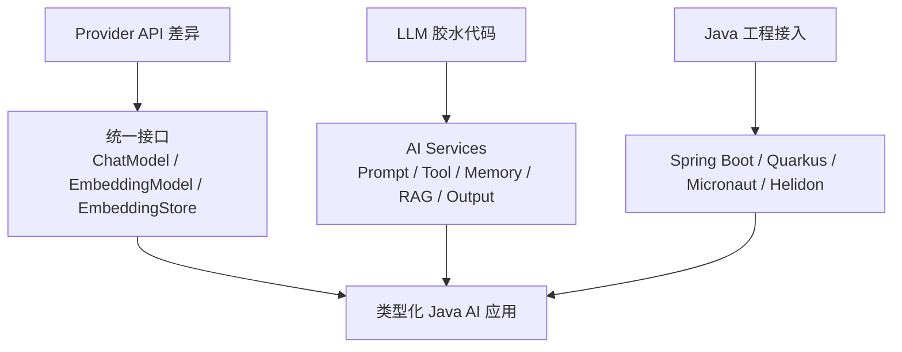
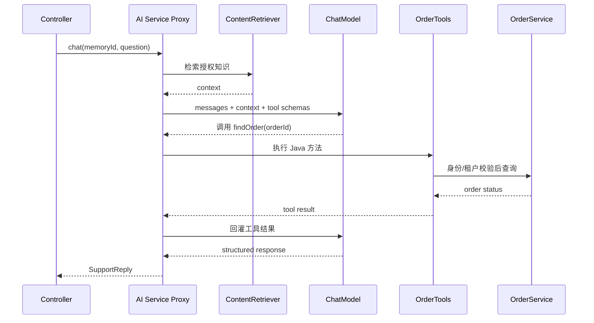

# LangChain4j：Java AI Services 的工程价值与边界

原文：[LangChain4j 主要解决了哪些问题？](https://xiaolinnote.com/ai/langchain/langchain4j.html)

## 1. 首先说准定位

LangChain4j 不是 Python LangChain 官方逐行移植的 Java 版本。它是独立演进的 JVM LLM 应用框架，使用 Java 开发者熟悉的接口、POJO、注解、类型和依赖注入组织 AI 能力。

名字相似不代表 API、内部实现和版本节奏一致。选型时应分别阅读两边官方文档。

## 2. 它解决三类问题



### 统一常见模型能力

业务代码依赖 `ChatModel`、`EmbeddingModel` 等接口，厂商集成负责适配。收益是把变化限制在适配层，但不能抹平工具调用、多模态、JSON Schema、token 和限流差异。

### AI Services 减少组装代码

开发者声明 Java 接口，框架把方法参数转为消息、执行模型和工具循环，再把结果映射到 Java 返回类型。它类似 Spring Data JPA 的声明式服务体验。

### 融入现有 JVM 工程

领域服务、权限、事务和监控已经在 Java 中时，可以直接将受控业务方法暴露为 Tool，不必额外建设 Python 微服务和跨语言 RPC。

## 3. 一个订单客服的具体代码形状

下面是基于 LangChain4j AI Services 的实现骨架。依赖版本应通过官方 BOM 固定，导入路径以选定版本为准：

```java
record SupportReply(
        String answer,
        String orderStatus,
        boolean needsHuman) {
}

interface SupportAssistant {

    @SystemMessage("""
            你是订单客服。涉及订单状态必须调用查询工具；
            禁止猜测；退款和修改请求必须转人工。
            """)
    SupportReply chat(
            @MemoryId String conversationId,
            @UserMessage String question);
}

final class OrderTools {
    private final OrderService orderService;

    OrderTools(OrderService orderService) {
        this.orderService = orderService;
    }

    @Tool("查询当前登录用户的订单状态，只读")
    String findOrder(@P("订单号") String orderId) {
        // orderService 必须根据认证上下文校验用户、租户和数据范围。
        return orderService.findOwnedOrderStatus(orderId);
    }
}

SupportAssistant assistant = AiServices.builder(SupportAssistant.class)
        .chatModel(chatModel)
        .tools(new OrderTools(orderService))
        .contentRetriever(contentRetriever)
        .chatMemoryProvider(memoryId ->
                MessageWindowChatMemory.builder()
                        .id(memoryId)
                        .maxMessages(20)
                        .chatMemoryStore(chatMemoryStore)
                        .build())
        .build();

SupportReply reply = assistant.chat(
        "conversation-1001",
        "订单 A100 到哪了？");
```

运行路径：



## 4. AI Services 自动化了什么，没自动化什么

| 自动化 | 仍由应用负责 |
| --- | --- |
| 方法参数转消息 | 认证与授权 |
| Tool Schema 和调用循环 | 租户与数据隔离 |
| 输出转 record/POJO | 事实与业务规则校验 |
| Chat Memory 注入 | 完整聊天 History 与审计 |
| Retriever 上下文增强 | 文档质量、权限过滤和 RAG 评测 |

返回对象成功反序列化只证明数据形状正确，不证明订单状态、金额或权限正确。

## 5. Chat Memory 不等于聊天档案

- **Chat Memory**：下一次送给模型的上下文窗口，可以淘汰、摘要和注入。
- **Chat History**：产品展示、合规和审计需要的完整事实记录。
- **长期用户记忆**：偏好与事实，应进入业务数据库或可检索存储。

`@MemoryId` 用于隔离会话，但同一个 ID 的并发控制、持久化和分布式锁仍是应用责任。

## 6. RAG 的两条路径

简单场景可以给 AI Service 一个 `ContentRetriever`。复杂场景需要 `RetrievalAugmentor` 组织查询改写、多路检索、融合、重排和注入。

无论哪种方式，框架都不能自动保证：

- PDF 与表格解析正确；
- chunk 策略合理；
- 召回结果具有权限；
- 引用真正支持答案；
- 老版本文档不会覆盖新制度。

## 7. 与当前仓库的关系

当前仓库的 Java 项目是普通 Spring Boot hello 示例，并没有 LangChain4j 依赖。因此本篇给出实现骨架，但不声称该 Java 示例已经编译运行。

Python 侧可运行的对照实现是 [AgentLoop 和 ToolRegistry](examples/langchain_capabilities_reference.py)：两边都遵守“模型申请调用、应用执行工具、结果回灌模型”的边界。

## 8. 什么时候适合采用

适合：

- AI 是现有 Java 业务系统的一部分；
- 需要直接复用 Spring/Quarkus 服务和权限体系；
- 要实现知识问答、客服、字段抽取、分类或受控业务 Tool；
- 团队希望沿用 Java 配置、测试和监控体系。

不一定适合：

- 只调用一次单一模型，官方 SDK 更轻；
- 深度依赖厂商刚发布的专属能力；
- 需要跨天强事务流程，只靠模型 Tool loop 不够；
- 团队已统一采用 Spring AI，需要先比较重复能力。

## 9. 面试问答

### Q1：LangChain4j 是 LangChain 的 Java 版吗？

不是官方移植。它是独立的 JVM 框架，借鉴同类 LLM 应用模式，但按 Java 的类型、接口和依赖注入习惯设计。

### Q2：AI Services 最大价值是什么？

将 Prompt、模型、Tools、Memory、RAG 和结构化输出收拢为类型化 Java 服务接口，减少消息拼装和反序列化胶水代码。

### Q3：统一接口是否意味着可无成本切换模型？

不是。接口隔离公共部分，供应商特有工具调用、多模态、JSON Schema、限流和 Prompt 效果仍要单独验证。

### Q4：Guardrail 能否代替权限系统？

不能。Guardrail 可检查输入输出，但认证、授权、资金风控和数据隔离必须由确定性业务代码承担。

### Q5：LangChain4j 和 Spring AI 怎么选？

看团队技术底座、所需集成和真实 PoC。强依赖 Spring 编程模型可优先评估 Spring AI；需要 LangChain4j 丰富组件或非 Spring JVM 环境时评估 LangChain4j。
