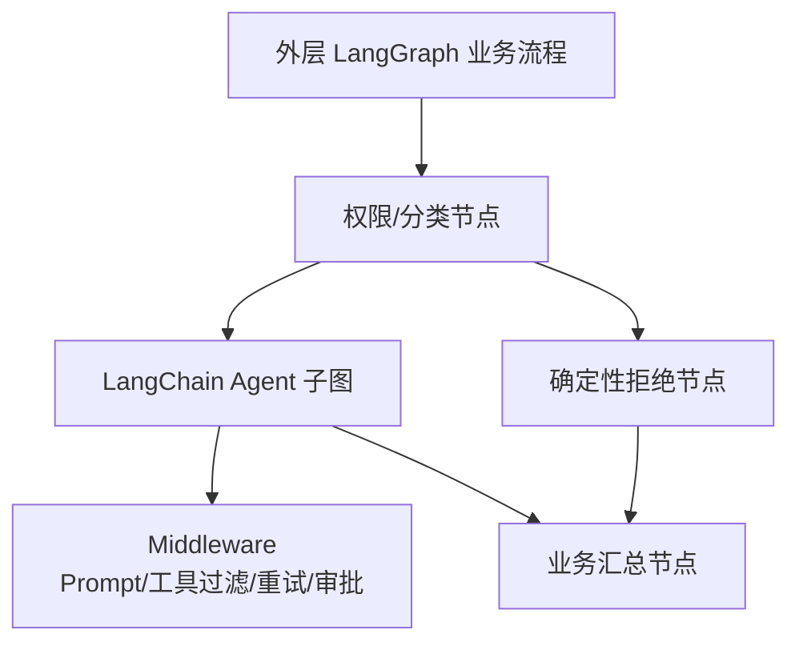
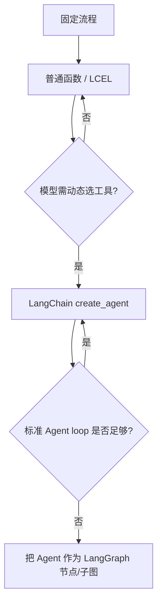

# LangChain 与 LangGraph：高层 Agent 和底层运行时

原文：[LangChain 和 LangGraph 的核心区别是什么？](https://xiaolinnote.com/ai/langchain/langchain_vs_langgraph.html)

## 1. 两者不是互斥竞品

```text
LangChain 高层 Agent API
        ↓ 编译
LangGraph 状态图与运行时
        ↓ 提供
状态、路由、检查点、中断、恢复、流式事件
```

LangChain 帮你快速得到标准 Agent；LangGraph 让你直接控制完整业务工作流。`create_agent` 本身运行在 LangGraph 上，所以“使用 LangChain 就没有状态和恢复”是错误理解。

## 2. 核心差异是控制粒度

| 维度 | LangChain Agent | 直接使用 LangGraph |
| --- | --- | --- |
| 抽象层 | 高层 Agent 开发 | 底层编排与运行时 |
| 默认拓扑 | 模型判断 -> 工具 -> 模型 | 开发者定义任意节点和边 |
| 状态 | messages 为核心，可扩展 | 完整 State Schema、Reducer、内部通道 |
| 扩展 | middleware 围绕模型/工具生命周期 | 节点、路由、Command、Send、子图 |
| 人工介入 | 常见工具审批更方便 | 任意节点可中断和恢复 |
| 适合 | 客服、查询助手、标准 Tool Agent | 审批、长流程、复杂并行、多 Agent |

## 3. LangChain 不是只能线性执行

需要区分三个东西：

1. Runnable/LCEL 可以串行、并行和条件分支。
2. LangChain Agent 本身包含条件路由与工具循环。
3. LangGraph 让整个业务拓扑成为开发者可直接设计的一等对象。

因此边界不是“能不能分支”，而是“你是否需要拥有完整拓扑控制权”。

## 4. Middleware 与图节点的区别



Middleware 适合改造标准 Agent loop，例如模型调用前摘要历史、工具调用前审批。LangGraph 节点适合表达更一般的业务阶段，例如规则引擎、人工表单、数据库写入和多个 Agent 子图。

## 5. State 设计差异

LangChain Agent 默认围绕消息状态工作，满足大多数工具循环。LangGraph 则要求你明确：

- 哪些字段是输入、输出和内部状态；
- 节点能读写哪些字段；
- 并行节点同时写列表时如何 Reducer 合并；
- 哪些状态应该 checkpoint；
- 哪些敏感数据不应进入模型消息。

自由度越大，建模责任也越大。

## 6. 当前项目中的组合方式

[run_day25_day28_langchain_demo.py](../run_day25_day28_langchain_demo.py) 使用 LangChain 组件完成规划、Tool、重试和审计。

[agent_capabilities_langgraph.py](../xiaolinnote_agent_analysis/examples/agent_capabilities_langgraph.py) 直接使用 LangGraph：

- `LangGraphMemoryWorkflow`：召回与压缩状态图；
- `LangGraphDAGOrchestrator`：通过 `Send` 并行执行就绪步骤；
- `LangGraphMultiAgentRouter`：通过 `Command` 路由与 handoff；
- `LangGraphReflectionWorkflow`：有界反思循环。

这两份代码不是重复关系：前者展示 Agent 组件组装，后者展示对运行拓扑的直接控制。

## 7. 持久化与人工介入

Checkpointer 和 Store 由 LangGraph 运行层提供，LangChain Agent 可以通过高层参数使用它们。差异仍是控制粒度：

- 标准 Tool 审批：LangChain Human-in-the-loop Middleware 更省事。
- 任意阶段补材料、多人审批、跨天等待：LangGraph `interrupt()` 更自然。
- 标准消息线程：LangChain Agent State 通常够用。
- 多类业务状态与恢复边界：直接设计 LangGraph State。

## 8. 渐进式选型



不要因为 LangGraph 更底层就默认更高级。为一个简单天气 Agent手写十几个节点，通常只会提高维护成本。

## 9. 面试问答

### Q1：LangChain 和 LangGraph 是什么关系？

LangChain v1 是高层 Agent 框架，LangGraph 是底层编排与运行时；`create_agent` 构建在 LangGraph 上。两者常组合而非替代。

### Q2：LangChain 能否做分支和循环？

能。LCEL 有并行与条件 Runnable，Agent loop 本身也有条件和循环。LangGraph 的优势是把完整业务拓扑和状态控制交给开发者。

### Q3：什么时候应该下沉 LangGraph？

当确定性规则与模型决策交替、动态并行、跨时间恢复、任意人工节点、多 Agent 或精细补偿成为主要复杂度时。

### Q4：使用 LangChain 是否也能 checkpoint？

能，因为 Agent 底层是 LangGraph。直接使用 LangGraph 的区别是可以精确设计节点和子图的保存与恢复边界。

### Q5：LangGraph 是否会自动解决副作用重复？

不会。恢复和重放可能再次执行节点，外部写操作仍需幂等键、执行记录与补偿策略。
