# LangChain 0-12 总知识图谱

这张图把 13 篇专题放进一条完整工程链路：先按业务难点选择普通函数、Runnable、Agent 或 LangGraph，再通过 Model、Message、Tool、Memory 和 Runtime 执行任务，最后以测试、追踪、恢复和反馈完成生产闭环。

读图约定：

- `[00]` 到 `[12]` 对应本目录专题编号。
- 实线表示主要调用流、数据流或执行流。
- 虚线表示依赖、影响、约束、复用或迁移关系。
- 网页主要采用 LangChain v1 语境；当前仓库采用 LangChain 0.2.x，图中会显式标出版本边界。

## 总图

```mermaid
flowchart TB
    NEED["业务需求  [00, 01, 04]<br/>目标 / 成功标准 / 停止条件<br/>权限 / 风险 / 延迟 / 成本"]

    subgraph SELECT["A. 先判断问题，再选择抽象  [00-02, 07-10]"]
        direction LR
        CONTROL{"下一步由谁决定"}
        SIMPLE["普通函数或业务工作流<br/>步骤固定且不需要 LLM 决策<br/>最便宜、稳定、容易测试"]
        FIXED["Runnable / LCEL  [02]<br/>开发时已知数据流<br/>可串行、并行和条件分支"]
        DYNAMIC["LangChain Agent  [00, 01, 04]<br/>模型运行时选择 Tool<br/>适合标准模型-工具循环"]
        STATEFUL["LangGraph  [09, 10]<br/>显式业务状态与拓扑<br/>复杂路由、恢复、审批、多 Agent"]
        DATAHEAVY["LlamaIndex  [01, 07]<br/>数据接入、解析、索引<br/>检索、重排与上下文组织"]
        JVM["LangChain4j  [01, 08]<br/>AI 能力留在 JVM 业务体系<br/>类型化 Java 接口与依赖注入"]
        OTHERS["其他 Agent 方案  [01]<br/>OpenAI Agents SDK / CrewAI<br/>AutoGen / Semantic Kernel<br/>Dify 是低代码平台而非同层库"]

        CONTROL -->|"代码和规则"| SIMPLE
        CONTROL -->|"固定组件数据流"| FIXED
        CONTROL -->|"模型动态选工具"| DYNAMIC
        CONTROL -->|"规则与模型共同控制状态"| STATEFUL
        DATAHEAVY -.->|"数据层可独立组合"| DYNAMIC
        JVM -.->|"相同工程问题，不同语言生态"| DYNAMIC
        OTHERS -.->|"按团队、模型和场景比较"| DYNAMIC
    end

    subgraph ARCH["B. LangChain 分层架构与统一协议  [00, 03, 11]"]
        direction LR
        CORE["langchain-core  [03, 11]<br/>稳定核心协议<br/>Message / Model / Tool / Runnable"]
        MESSAGE["Message  [03]<br/>HumanMessage / AIMessage / ToolMessage<br/>tool_call_id 关联请求与结果"]
        MODEL["Model  [03]<br/>Chat Model / Embedding Model<br/>厂商响应适配为统一消息"]
        PROMPT["Prompt Template  [02-04]<br/>角色 / 任务 / 上下文 / 变量<br/>运行时生成模型输入"]
        PARSER["Parser 与 Structured Output  [02-04]<br/>字符串解析 / Pydantic Schema<br/>字段合法不等于事实正确"]
        TOOLPROTO["Tool 协议  [03, 05]<br/>模型可见调用合同<br/>宿主可执行能力"]
        RUNNABLE["Runnable  [02, 03]<br/>统一执行与组合接口<br/>输入 / 输出 / Config Schema"]
        INTEGRATION["独立集成包  [03, 11]<br/>langchain-openai 等 Provider 包<br/>模型、向量库与外部服务适配"]
        HIGHLEVEL["langchain 高层能力  [03, 11]<br/>create_agent / Middleware<br/>Tools / Structured Output"]
        RUNTIME["LangGraph Runtime  [03, 09-11]<br/>状态、循环、路由、持久化<br/>中断、恢复与事件流"]
        OBSERVE["LangSmith 与可观测性  [03, 04, 09, 10]<br/>Trace / Evaluation / Studio<br/>Deployment / Agent Server"]

        CORE --> MESSAGE
        CORE --> MODEL
        CORE --> TOOLPROTO
        CORE --> RUNNABLE
        PROMPT --> MODEL
        MODEL --> MESSAGE
        MESSAGE --> PARSER
        INTEGRATION -->|"实现统一模型与存储接口"| CORE
        HIGHLEVEL -->|"使用核心协议"| CORE
        HIGHLEVEL -->|"编译并运行于"| RUNTIME
        OBSERVE -.->|"贯穿所有调用层"| RUNNABLE
        OBSERVE -.-> HIGHLEVEL
        OBSERVE -.-> RUNTIME
    end

    subgraph CHAIN["C. Chain、Runnable 与 LCEL 固定数据流  [02, 11]"]
        direction LR
        CHAINIDEA["Chain 编排思想  [02]<br/>输入处理 / Prompt / Model<br/>Retriever / Parser / 业务函数"]
        LCEL["LCEL  [02]<br/>使用 | 声明组合关系<br/>组合结果仍是 Runnable"]
        SEQUENCE["RunnableSequence<br/>A -> B -> C 串行传递"]
        PARALLEL["RunnableParallel<br/>同一输入并行执行多分支<br/>结果汇合为字典"]
        BRANCH["RunnableBranch<br/>根据已知条件选择路径"]
        ADAPTER["数据适配原语<br/>RunnableLambda / Passthrough<br/>itemgetter / 显式转换函数"]
        INVOKE["统一调用  [02]<br/>invoke / ainvoke<br/>batch / abatch<br/>stream / astream"]
        CROSS["横切能力  [02]<br/>with_config / with_retry<br/>with_fallbacks / Tags / Metadata<br/>Callbacks 与 Trace"]
        STREAMLIMIT["能力边界<br/>中间节点不支持流式时会阻塞<br/>统一接口不自动修复类型不匹配"]

        CHAINIDEA --> LCEL
        RUNNABLE -.->|"提供组合基础"| LCEL
        LCEL --> SEQUENCE
        LCEL --> PARALLEL
        LCEL --> BRANCH
        ADAPTER -->|"对齐前后步骤类型"| SEQUENCE
        SEQUENCE --> INVOKE
        PARALLEL --> INVOKE
        BRANCH --> INVOKE
        CROSS -.->|"附着于步骤或整条链"| INVOKE
        INVOKE --> STREAMLIMIT
    end

    subgraph AGENT["D. Agent 构建、Tool 合同与执行循环  [03-05]"]
        direction LR
        ABOUNDARY["步骤 1：定义边界  [04]<br/>目标 / 禁止动作 / 成功与失败<br/>停止条件 / 转人工条件"]
        ACAPABILITY["步骤 2：选择能力  [04]<br/>支持 Tool Call 与结构化输出的模型<br/>职责单一的小工具"]
        ACONTRACT["步骤 3：约束行为  [04]<br/>system_prompt / 信息边界<br/>response_format / 失败策略"]
        CREATE["步骤 4：组装 Agent  [04]<br/>v1 create_agent<br/>model + tools + prompt + response_format"]
        ASTATE["步骤 5：状态与安全  [04]<br/>Checkpointer / Store / Middleware<br/>权限 / 幂等 / 人工审批"]
        ACALL["步骤 6：交互方式  [04]<br/>同步 / 异步 / Stream<br/>超时 / 取消 / 并发限制"]
        ATEST["步骤 7：验证  [04]<br/>Tool 单测 / Agent 轨迹<br/>端到端评测 / Trace 与监控"]

        LOOPMODEL["Model Node  [03, 04]<br/>读取 Messages 与可用 Tool Schema"]
        AIMSG["AIMessage<br/>自然语言内容 + 可选 tool_calls"]
        HASTOOL{"包含 Tool Call"}
        TOOLDISPATCH["宿主 Tool Runtime  [03, 05]<br/>按名称查找并校验参数<br/>应用程序执行，不是模型执行"]
        TOOLMSG["ToolMessage<br/>工具结果 + 相同 tool_call_id"]
        FINAL["最终回复<br/>自然语言或 Structured Response"]

        TOOLCONTRACT["Tool = 两份合同  [05]<br/>模型看到 name / description / args_schema<br/>宿主持有函数、协程或客户端"]
        TOOLLEVEL["Tool 定义层级  [05]<br/>普通函数 -> @tool<br/>StructuredTool -> BaseTool<br/>Provider Tool / MCP Tool 按集成适配"]
        TASKARGS["模型可填写的任务参数<br/>关键词 / 城市 / 订单号 / 查询范围"]
        TRUSTARGS["Runtime 注入的可信参数<br/>user_id / tenant_id / role<br/>State / Context / Store / 客户端"]
        TOOLGUARD["执行安全  [04, 05]<br/>Pydantic 校验 / 最小权限<br/>超时 / 有界重试 / 幂等 / 审计<br/>参数、业务、瞬时与程序错误分类"]

        ABOUNDARY --> ACAPABILITY --> ACONTRACT --> CREATE --> ASTATE --> ACALL --> ATEST
        CREATE --> LOOPMODEL
        LOOPMODEL --> AIMSG --> HASTOOL
        HASTOOL -->|"否"| FINAL
        HASTOOL -->|"是"| TOOLDISPATCH
        TOOLCONTRACT --> TOOLDISPATCH
        TOOLLEVEL --> TOOLCONTRACT
        TASKARGS --> TOOLCONTRACT
        TRUSTARGS --> TOOLDISPATCH
        TOOLDISPATCH --> TOOLGUARD --> TOOLMSG
        TOOLMSG -->|"写回 Agent State"| LOOPMODEL
    end

    subgraph MEMORY["E. State、Context、短期记忆与长期记忆  [03, 05, 06]"]
        direction LR
        STATE["State  [03, 06]<br/>执行中持续变化的数据<br/>Messages / 当前步骤 / 工具结果"]
        CONTEXT["Context  [03, 05, 06]<br/>本次调用不变的可信依赖<br/>用户 / 租户 / 权限 / 客户端"]
        SHORT["短期记忆  [06]<br/>State + thread_id + Checkpointer<br/>属于当前会话线程"]
        CHECKPOINTER["Checkpointer  [06, 10]<br/>按 thread_id 保存状态快照<br/>支持续接、暂停与故障恢复"]
        WINDOW["长上下文治理  [06]<br/>Trim：只裁本次输入<br/>Delete：永久删除状态<br/>Summarize：压缩但可能丢细节"]
        STORE["长期 Store  [03, 06]<br/>图状态之外的跨线程数据<br/>namespace + key + JSON value"]
        NAMESPACE["隔离与检索  [06]<br/>tenant / user / memory_type<br/>精确读取或语义检索"]
        LONG["长期记忆内容  [06]<br/>用户偏好 / 稳定事实 / 历史经验<br/>不是完整聊天记录或实时业务事实"]
        WRITEPOLICY["记忆治理  [06]<br/>实时明确写入或后台提炼<br/>来源 / 时间 / 置信度 / 去重<br/>更正 / 过期 / 导出 / 删除 / 脱敏"]
        TOOLRUNTIME["ToolRuntime  [05, 06]<br/>runtime.state<br/>runtime.context<br/>runtime.store"]

        STATE --> SHORT --> CHECKPOINTER
        CHECKPOINTER -.->|"恢复相同 thread_id"| STATE
        STATE --> WINDOW
        STORE --> NAMESPACE --> LONG
        WRITEPOLICY --> STORE
        STATE --> TOOLRUNTIME
        CONTEXT --> TOOLRUNTIME
        STORE --> TOOLRUNTIME
        TOOLRUNTIME -.->|"向 Tool 提供不可见于模型的依赖"| TRUSTARGS
    end

    subgraph GRAPH["F. LangChain 与 LangGraph 的控制层关系  [09, 10]"]
        direction LR
        HIGHAGENT["LangChain 高层 Agent  [09]<br/>预构建 Model-Tool Loop<br/>以 messages 为默认状态核心<br/>通过 Middleware 扩展生命周期"]
        LOWGRAPH["LangGraph 低层运行时  [09, 10]<br/>开发者拥有完整业务拓扑<br/>步骤可以是模型、Tool 或普通函数"]
        GRAPHAPI["Graph API  [10]<br/>StateGraph / State / Node / Edge<br/>条件边 / 循环 / 输入输出 Schema"]
        FUNCTIONAL["Functional API  [10]<br/>@entrypoint / @task<br/>保留 if / for / 普通函数控制流"]
        COMMAND["控制原语  [10]<br/>Command：更新状态并改道<br/>Send：运行时动态 Fan-Out<br/>Subgraph：模块化与多 Agent"]
        REDUCER["Reducer  [09, 10]<br/>定义并行状态更新的合并语义<br/>避免后写结果覆盖前一分支"]
        DURABLE["Persistence 与 Durable Execution  [09, 10]<br/>Checkpoint / 节点任务结果<br/>长任务跨进程与跨时间恢复"]
        HITL["Human-in-the-Loop  [09, 10]<br/>interrupt 暂停并保存状态<br/>Command(resume=...) 恢复<br/>高层也可用审批 Middleware"]
        FAULT["节点级故障治理  [10]<br/>Retry Policy / Timeout / Error Handler<br/>降级 / 补偿 / 人工接管"]
        TIMETRAVEL["Time Travel  [10]<br/>从旧 Checkpoint 重放或分叉<br/>不会撤销已经发生的现实副作用"]
        STREAM["多层事件流  [09, 10]<br/>messages / values / updates / custom<br/>checkpoints / tasks / debug"]
        IDEMPOTENT["恢复前提  [09, 10]<br/>节点可能重新执行<br/>外部写操作必须有业务幂等键<br/>Checkpoint 不等于 Exactly-Once"]

        HIGHAGENT -->|"create_agent 编译为图"| LOWGRAPH
        LOWGRAPH --> GRAPHAPI
        LOWGRAPH --> FUNCTIONAL
        GRAPHAPI --> COMMAND
        COMMAND --> REDUCER
        LOWGRAPH --> DURABLE
        DURABLE --> HITL
        DURABLE --> FAULT
        DURABLE --> TIMETRAVEL
        LOWGRAPH --> STREAM
        DURABLE --> IDEMPOTENT
        HITL --> IDEMPOTENT
        FAULT --> IDEMPOTENT
    end

    subgraph ECOSYSTEM["G. 框架生态与组合边界  [01, 07, 08]"]
        direction LR
        LCFOCUS["LangChain  [01, 07]<br/>Model / Message / Tool / Agent<br/>Middleware 与广泛第三方集成<br/>重心是通用 Agent 组装"]
        LIDATA["LlamaIndex 数据链  [01, 07]<br/>Connector -> Parse -> Chunk<br/>Index -> Retrieve -> Rerank<br/>Query Engine -> Context"]
        LITOOL["稳定组合边界  [07]<br/>把 Query Engine 包装成 Tool<br/>LangChain 决定何时调用<br/>LangGraph 控制外围业务流程"]
        LC4J["LangChain4j  [08]<br/>独立 JVM 框架，不是官方移植<br/>ChatModel / EmbeddingModel / Store"]
        AISERVICE["AI Services  [08]<br/>Java Interface + Prompt + Tool<br/>Chat Memory + RAG + POJO 输出<br/>类似声明式服务代理"]
        JAVASTACK["Java 工程集成  [08]<br/>Spring Boot / Quarkus<br/>Helidon / Micronaut<br/>复用 DI、配置、测试和监控"]
        JBOUNDARY["LangChain4j 边界  [08]<br/>Chat Memory 不等于完整 History<br/>抽象不能抹平供应商全部差异<br/>Guardrails 与 Observability 需看成熟度"]

        LCFOCUS -.->|"优势重心不同但能力有交集"| LIDATA
        LIDATA --> LITOOL --> LCFOCUS
        LC4J --> AISERVICE --> JAVASTACK
        AISERVICE --> JBOUNDARY
    end

    subgraph VERSION["H. LangChain 版本演进与迁移  [11]"]
        direction LR
        EARLY["早期一体化包<br/>大量预制 Chain / Memory<br/>AgentExecutor 与集成混杂"]
        SPLIT["核心与集成拆分<br/>langchain-core 稳定协议<br/>community 与 Provider 包独立迭代"]
        COMPOSE["Runnable + LCEL<br/>从大量专用类转向<br/>少量协议与可组合原语"]
        GRAPHSHIFT["Agent Runtime 转向 LangGraph<br/>隐藏循环变成状态图<br/>获得持久化、恢复与人工介入"]
        V1["LangChain v1 主线<br/>create_agent + Middleware<br/>高层 Agent API 聚焦"]
        CLASSIC["langchain-classic<br/>承接 LLMChain / ConversationChain<br/>旧 Memory 等存量能力"]
        REPOVERSION["当前仓库版本边界<br/>langchain 0.2.17<br/>langchain-openai 0.1.25<br/>langgraph 0.2.76"]
        MIGRATION["安全迁移步骤<br/>锁依赖 -> 阅读迁移指南<br/>逐层替换 -> 回归 Tool / Stream / State<br/>隔离验证副作用 -> 灰度发布"]

        EARLY --> SPLIT --> COMPOSE --> GRAPHSHIFT --> V1
        EARLY -->|"存量兼容"| CLASSIC
        REPOVERSION -.->|"Runnable 与旧 Agent API 可运行"| COMPOSE
        REPOVERSION -.->|"v1 API 是迁移目标，不能混写运行"| V1
        V1 --> MIGRATION
        CLASSIC --> MIGRATION
    end

    subgraph RESEARCH["I. Deep Research 研究型 Agent  [10, 12]"]
        direction LR
        DRBOUNDARY["Deep Research 定位  [12]<br/>不是核心包中的一个开关<br/>open_deep_research 是参考应用<br/>Deep Agents 是更通用框架"]
        CLARIFY["1. 澄清目标与范围<br/>研究对象 / 时间范围 / 来源要求<br/>成功标准与报告格式"]
        BRIEF["2. Research Brief<br/>把模糊需求固化为研究合同"]
        SUPERVISOR["3. Supervisor<br/>拆分相对独立的子课题<br/>决定串行、并行与补搜"]
        MAP["4. Map：并行 Researcher<br/>隔离上下文，多轮调用搜索<br/>企业检索 / 数据库 / MCP Tool"]
        EVIDENCE["5. Evidence  [12]<br/>Claim / Source / URI / 时间<br/>摘要 / 置信度 / 子课题<br/>保留可追溯事实"]
        COMPRESS["证据治理<br/>压缩 / 去重 / 交叉核验<br/>区分事实、推断与不确定性"]
        GATE{"质量门禁<br/>目标覆盖是否充分<br/>来源是否独立可信<br/>引用是否支持结论<br/>冲突是否处理"}
        REDUCE["6. Reduce：统一 Writer<br/>汇总证据而非拼接子报告<br/>统一口径并生成引用"]
        REPORT["最终研究报告<br/>结论 + 证据 + 引用<br/>限制与不确定性"]
        BUDGET["宽度与深度预算  [12]<br/>并发 Researcher 数量<br/>每分支 Tool 次数 / 补搜轮数<br/>总 Token / 搜索费 / Timeout / Cancel"]
        DRSECURITY["研究安全  [12]<br/>网页是不可信输入<br/>防 Prompt Injection / 最小权限<br/>只读 Tool / 密钥隔离 / 高风险人工复核"]
        DREVAL["研究评测  [12]<br/>最终答案与执行轨迹<br/>来源覆盖 / 引用正确 / 冲突处理<br/>延迟 / 成本 / 失败恢复"]

        DRBOUNDARY --> CLARIFY --> BRIEF --> SUPERVISOR --> MAP --> EVIDENCE --> COMPRESS --> GATE
        GATE -->|"存在缺口或冲突"| SUPERVISOR
        GATE -->|"满足停止条件"| REDUCE --> REPORT
        BUDGET -.-> SUPERVISOR
        BUDGET -.-> MAP
        DRSECURITY -.-> MAP
        DRSECURITY -.-> REPORT
        REPORT --> DREVAL
    end

    subgraph PRODUCTION["J. 生产闭环  [04-06, 09, 10, 12]"]
        direction LR
        SECURITY["确定性安全边界<br/>认证 / 授权 / 租户隔离<br/>最小权限 / 审批 / 数据脱敏"]
        RELIABILITY["可靠性<br/>Timeout / Retry / Fallback / Cancel<br/>幂等 / 补偿 / 持久化 / 恢复"]
        EVALUATION["分层评测<br/>Tool 正确性 -> Agent 轨迹<br/>端到端质量 -> 线上业务指标<br/>固定数据集与版本比较"]
        TELEMETRY["可观测性<br/>模型 / Prompt / Tool / 数据版本<br/>Token / 延迟 / 成本 / 错误<br/>Trace / Event / Audit"]
        FEEDBACK["失败样本回流<br/>修正 Prompt / Tool Schema<br/>补充 Golden Set / Memory 治理<br/>调整 Graph、路由和预算"]

        SECURITY --> RELIABILITY --> EVALUATION --> TELEMETRY --> FEEDBACK
    end

    NEED --> CONTROL
    FIXED --> CHAINIDEA
    DYNAMIC --> ABOUNDARY
    STATEFUL --> LOWGRAPH
    DATAHEAVY --> LIDATA
    JVM --> LC4J

    MODEL -.-> LOOPMODEL
    MESSAGE -.-> LOOPMODEL
    TOOLPROTO -.-> TOOLCONTRACT
    RUNNABLE -.-> CREATE
    PARSER -.-> FINAL
    HIGHLEVEL -.-> CREATE
    RUNTIME -.-> LOWGRAPH
    CREATE -.-> HIGHAGENT
    ASTATE -.-> STATE
    ASTATE -.-> CONTEXT
    ASTATE -.-> STORE
    CHECKPOINTER -.-> DURABLE
    MIDDLEWARE["Middleware  [03, 04, 09, 11]<br/>动态 Prompt / Model / Tool 选择<br/>消息摘要 / Retry / Guardrail<br/>Human-in-the-Loop"]
    MIDDLEWARE -.->|"包装模型与 Tool 生命周期"| HIGHAGENT
    MIDDLEWARE -.->|"在编译图内部运行，不是独立 Runtime"| LOWGRAPH
    COMMAND -.-> MAP
    REDUCER -.-> EVIDENCE
    CHECKPOINTER -.-> SUPERVISOR
    TOOLLEVEL -.-> MAP
    LITOOL -.-> MAP
    STREAM -.-> TELEMETRY
    OBSERVE -.-> TELEMETRY
    ATEST -.-> EVALUATION
    DREVAL -.-> EVALUATION
    TOOLGUARD -.-> SECURITY
    CONTEXT -.-> SECURITY
    NAMESPACE -.-> SECURITY
    IDEMPOTENT -.-> RELIABILITY
    FAULT -.-> RELIABILITY
    WRITEPOLICY -.-> FEEDBACK
    FEEDBACK -.-> ABOUNDARY
    FEEDBACK -.-> BRIEF

    classDef entry fill:#fff4bf,stroke:#8b7500,color:#302900,stroke-width:2px;
    classDef selection fill:#eaf3ff,stroke:#34699a,color:#13293d;
    classDef architecture fill:#e9f7f7,stroke:#347d7d,color:#153838;
    classDef chain fill:#fff1e6,stroke:#a65f26,color:#4a2811;
    classDef agent fill:#eaf8ee,stroke:#3f7d4e,color:#173c22;
    classDef memory fill:#f4edff,stroke:#7451a6,color:#2f1f49;
    classDef graphLayer fill:#fcecef,stroke:#a64c62,color:#4a1e2a;
    classDef ecosystem fill:#edf5d8,stroke:#66803a,color:#293715;
    classDef version fill:#f1f1f1,stroke:#666666,color:#252525;
    classDef research fill:#eaf0ff,stroke:#4d67a5,color:#1d2d55;
    classDef production fill:#fff0f0,stroke:#9d4b4b,color:#491d1d;

    class NEED entry;
    class CONTROL,SIMPLE,FIXED,DYNAMIC,STATEFUL,DATAHEAVY,JVM,OTHERS selection;
    class CORE,MESSAGE,MODEL,PROMPT,PARSER,TOOLPROTO,RUNNABLE,INTEGRATION,HIGHLEVEL,RUNTIME,OBSERVE architecture;
    class CHAINIDEA,LCEL,SEQUENCE,PARALLEL,BRANCH,ADAPTER,INVOKE,CROSS,STREAMLIMIT chain;
    class ABOUNDARY,ACAPABILITY,ACONTRACT,CREATE,ASTATE,ACALL,ATEST,LOOPMODEL,AIMSG,HASTOOL,TOOLDISPATCH,TOOLMSG,FINAL,TOOLCONTRACT,TOOLLEVEL,TASKARGS,TRUSTARGS,TOOLGUARD agent;
    class STATE,CONTEXT,SHORT,CHECKPOINTER,WINDOW,STORE,NAMESPACE,LONG,WRITEPOLICY,TOOLRUNTIME memory;
    class HIGHAGENT,LOWGRAPH,GRAPHAPI,FUNCTIONAL,COMMAND,REDUCER,DURABLE,HITL,FAULT,TIMETRAVEL,STREAM,IDEMPOTENT,MIDDLEWARE graphLayer;
    class LCFOCUS,LIDATA,LITOOL,LC4J,AISERVICE,JAVASTACK,JBOUNDARY ecosystem;
    class EARLY,SPLIT,COMPOSE,GRAPHSHIFT,V1,CLASSIC,REPOVERSION,MIGRATION version;
    class DRBOUNDARY,CLARIFY,BRIEF,SUPERVISOR,MAP,EVIDENCE,COMPRESS,GATE,REDUCE,REPORT,BUDGET,DRSECURITY,DREVAL research;
    class SECURITY,RELIABILITY,EVALUATION,TELEMETRY,FEEDBACK production;
```

## 五条复习主线

1. **固定流程怎么组合**：`[02] Chain 思想 -> Runnable 协议 -> LCEL -> Sequence / Parallel / Branch -> invoke / batch / stream`。
2. **标准 Agent 怎么运行**：`[03-05] Message + Model + Tool Schema -> AIMessage.tool_calls -> 宿主执行 -> ToolMessage -> 模型继续判断`。
3. **状态和记忆放哪里**：`[06] 当前线程放 State + Checkpointer，可信身份放 Context，跨线程偏好放 Store`。
4. **何时下沉 LangGraph**：`[09-10] 标准 Agent Loop 不足以表达复杂业务拓扑时，直接设计 State / Node / Edge / Reducer / Interrupt / Recovery`。
5. **研究型 Agent 怎么闭环**：`[12] Clarify -> Brief -> Supervisor -> 并行 Researcher -> Evidence Gate -> 统一 Writer -> 评测与补搜`。

## 最容易混淆的关系

| 概念 | 正确关系 |
| --- | --- |
| Chain、Runnable、LCEL | Chain 是编排思想；Runnable 是统一执行协议；LCEL 是组合 Runnable 的声明式表达方式。 |
| Chain 与 Agent | Chain 的拓扑通常由代码预先确定；Agent 让模型在运行时决定是否调用 Tool 以及是否继续循环。 |
| LangChain 与 LangGraph | LangChain v1 是高层 Agent 框架，LangGraph 是低层编排运行时；`create_agent` 构建在 LangGraph 上。 |
| Middleware 与 LangGraph Node | Middleware 包装标准 Agent 的模型和 Tool 生命周期；Node/Edge 可以表达任意业务步骤和完整拓扑。 |
| Tool Schema 与权限 | Schema 帮模型选对工具、填对参数；身份、授权、租户隔离和副作用控制必须由宿主应用执行。 |
| Tool 参数与 Runtime 参数 | 搜索词、订单号等任务参数可由模型填写；user_id、role、Store、数据库客户端等可信依赖由 Runtime 注入。 |
| State、Context、Store | State 是运行中变化的数据；Context 是单次调用不变的可信依赖；Store 是跨线程长期数据。 |
| Checkpointer 与 Store | Checkpointer 按 thread_id 保存当前图状态；Store 按 namespace/key 保存跨线程偏好、事实和经验。 |
| Memory 与聊天档案 | Memory 是本次模型需要的上下文；完整聊天历史是产品与审计事实，不能只依赖可裁剪的模型记忆。 |
| Checkpoint 与 Exactly-Once | Checkpoint 能恢复执行，但节点可能重新运行；付款、发信和建单仍必须使用业务幂等键。 |
| LangChain 与 LlamaIndex | 两者都能做 Agent 和 RAG；LangChain 重心是通用 Agent 与 Tool 集成，LlamaIndex 重心是数据和检索链路。 |
| LangChain 与 LangChain4j | LangChain4j 是独立 JVM 框架，不是 Python LangChain 的官方 Java 移植或逐项翻译。 |
| Deep Research 与多次搜索 | Deep Research 是动态拆题、并行搜证、证据门禁、补搜和统一写作的工作流，不是简单增加搜索次数。 |
| Structured Output 与正确性 | Pydantic 或 JSON Schema 能约束输出形状，不能证明事实、权限或业务结论正确。 |
| Stream 与性能 | Stream 改善等待体验，不会自动缩短模型或 Tool 总耗时；中间阻塞节点还会推迟首个输出。 |

## 版本边界

| 语境 | 本图中的代表 API | 使用方式 |
| --- | --- | --- |
| 当前仓库 LangChain 0.2.x | Runnable、LCEL、`@tool`、`StructuredTool`、Message、`create_tool_calling_agent`、`AgentExecutor` | 可以结合仓库示例直接运行。 |
| 当前仓库 LangGraph 0.2.x | `StateGraph`、`Send`、`Command`、`MemorySaver` | 可以结合仓库的 LangGraph 示例直接运行。 |
| LangChain v1 主线 | `create_agent`、Middleware、`ToolRuntime`、Checkpointer、Store | 表示网页和当前官方架构方向，不能直接混入 0.2.x 示例。 |
| 存量兼容 | `LLMChain`、`ConversationChain`、旧 Memory | 理解旧项目并渐进迁移；v1 中主要进入 `langchain-classic`。 |

迁移不是批量替换 Import。需要锁定 Core、LangGraph 和 Provider 包的兼容版本，并分别回归 Tool Call、Structured Output、Stream、Checkpoint、Memory 与有副作用路径。

## 框架选型速查

| 主要难点 | 优先考虑 | 原因 |
| --- | --- | --- |
| 固定 Prompt、模型、解析器或检索数据流 | 普通函数或 Runnable/LCEL | 控制明确，测试和追踪简单。 |
| 模型需要从少量 Tools 中动态选择 | LangChain Agent | 高层接口已经提供标准 Model-Tool Loop。 |
| 多阶段业务流程、复杂并行、跨时恢复和人工审批 | LangGraph | State、拓扑、恢复边界和事件成为一等公民。 |
| 私有文档解析、索引、检索和重排最复杂 | LlamaIndex 或专业 RAG 层 | 抽象重心更接近数据与上下文问题。 |
| Java 领域服务、权限和事务已沉淀在 JVM | LangChain4j 或团队既有 Java AI 框架 | 可以复用 Java 的类型、DI、配置、测试和监控体系。 |
| 开放式、多来源、可拆分且高价值的调研 | Deep Research 架构 | 需要动态规划、证据治理、补搜和统一写作。 |

## 专题编号索引

| 编号 | 专题 |
| --- | --- |
| 00 | [LangChain 学习路线与总览](0_langchain_framework_interview_guide.md) |
| 01 | [Agent 框架定位与选型](1_agent_frameworks_selection.md) |
| 02 | [Chain、Runnable 与 LCEL](2_chain_runnable_lcel.md) |
| 03 | [LangChain 分层架构与 Agent Loop](3_langchain_layered_architecture.md) |
| 04 | [构建 Agent 的七步工程方法](4_build_agent_engineering_steps.md) |
| 05 | [Tool 注册、Runtime 与执行安全](5_tool_registration_runtime_contract.md) |
| 06 | [短期 State 与长期 Store](6_short_long_term_memory.md) |
| 07 | [LangChain 与 LlamaIndex 选型](7_langchain_vs_llamaindex_selection.md) |
| 08 | [LangChain4j 与 Java AI Services](8_langchain4j_java_ai_services.md) |
| 09 | [LangChain 与 LangGraph 控制层](9_langchain_vs_langgraph_control_layers.md) |
| 10 | [LangGraph 显式状态与可靠工作流](10_langgraph_stateful_workflow_advantages.md) |
| 11 | [LangChain 版本演进与迁移](11_langchain_version_evolution_migration.md) |
| 12 | [Deep Research、Map-Reduce 与证据治理](12_deep_research_map_reduce_evidence.md) |

这是一张概念关系图，不表示仓库已经生产实现所有 v1 能力。仓库可运行边界和对应代码请继续查看各专题的“当前项目”章节以及 [目录 README](README.md)。