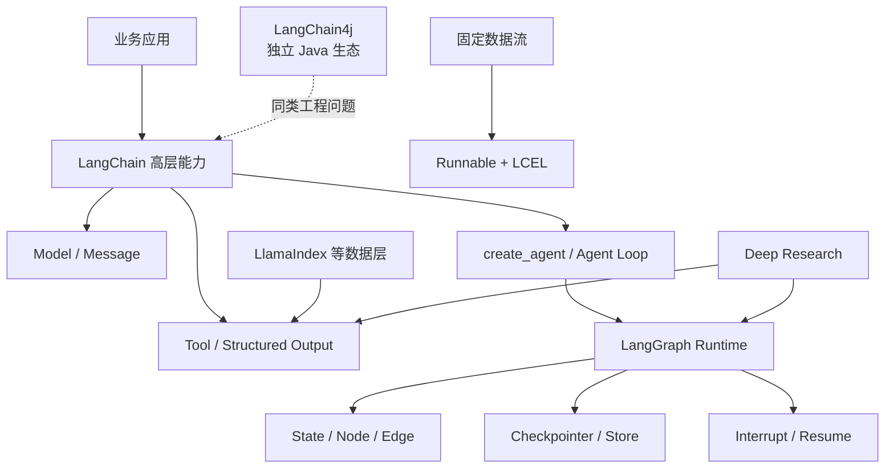

# Xiaolinnote LangChain 主题分析

本目录分析 Xiaolinnote 的 LangChain 总览与 12 篇专题文章。内容不是网页复述，而是按“理论模型 -> 当前仓库代码 -> 可运行补充实现 -> 面试追问”重新组织。

## 版本边界

网页以 **LangChain v1** 为主线；当前仓库依赖为：

```text
langchain==0.2.17
langchain-openai==0.1.25
langgraph==0.2.76
```

因此文档会同时标明两种代码语境：

| 语境 | 本目录怎么处理 |
| --- | --- |
| 当前仓库可运行代码 | 使用 0.2.x 已支持的 Runnable、LCEL、Tool、Message 和 LangGraph API |
| LangChain v1 推荐写法 | 展示 `create_agent`、Middleware、Checkpointer、Store、`ToolRuntime` 的迁移方向 |
| 旧版 API | 说明 `LLMChain`、`ConversationChain`、`AgentExecutor` 的历史作用，但不作为新项目首选 |

不要把三个版本的 API 拼在同一个可执行示例中。先确认依赖版本，再选择代码路径。

## 可运行代码

- [LangChain 核心能力参考实现](examples/langchain_capabilities_reference.py)：真实使用 LCEL、`RunnableParallel`、`RunnableBranch`、`@tool`、`StructuredTool` 和 Message，同时离线模拟 Agent loop、两类记忆与 Deep Research。
- [参考实现测试](../tests/test_langchain_capabilities_reference.py)：覆盖 Chain 分支、工具 Schema、可信上下文、Agent 闭环、记忆隔离和研究质量门禁。
- [项目现有 LangChain Demo](../run_day25_day28_langchain_demo.py)：结构化规划、工具调用、重试、审计与总结。
- [项目现有 LangGraph 实现](../xiaolinnote_agent_analysis/examples/agent_capabilities_langgraph.py)：`StateGraph`、`Send`、`Command`、`MemorySaver`、DAG、路由、反思和多 Agent。

运行离线示例：

```bash
cd /Users/zhaoyonggng/work/llm-day1
source .venv/bin/activate
python xiaolinnote_langchain_analysis/examples/langchain_capabilities_reference.py
python -m unittest tests.test_langchain_capabilities_reference -v
```

## 文档索引

| 编号 | 网页标题/功能 | 分析文件 |
| --- | --- | --- |
| 0 | LangChain 框架面试题介绍 | [学习路线与总览](0_langchain_framework_interview_guide.md) |
| 1 | 你了解过哪些 AI Agent 开发框架？ | [Agent 框架定位与选型](1_agent_frameworks_selection.md) |
| 2 | 如何理解 LangChain 中的 Chain？ | [Runnable、LCEL 与确定性数据流](2_chain_runnable_lcel.md) |
| 3 | LangChain 的底层架构与实现原理 | [分层架构与 Agent Loop](3_langchain_layered_architecture.md) |
| 4 | 使用 LangChain 构建 Agent 的核心步骤 | [七步工程落地法](4_build_agent_engineering_steps.md) |
| 5 | 如何为 Agent 注册工具 | [Tool 契约、Schema 与 Runtime](5_tool_registration_runtime_contract.md) |
| 6 | 短期记忆和长期记忆 | [Checkpointer 与 Store](6_short_long_term_memory.md) |
| 7 | LangChain 和 LlamaIndex 的区别 | [数据层与 Agent 层选型](7_langchain_vs_llamaindex_selection.md) |
| 8 | LangChain4j 解决什么问题 | [Java AI Services 工程模型](8_langchain4j_java_ai_services.md) |
| 9 | LangChain 和 LangGraph 的区别 | [高层 Agent 与底层运行时](9_langchain_vs_langgraph_control_layers.md) |
| 10 | LangGraph 的优势与适用场景 | [显式状态与可靠工作流](10_langgraph_stateful_workflow_advantages.md) |
| 11 | LangChain 大版本升级 | [架构演进与迁移清单](11_langchain_version_evolution_migration.md) |
| 12 | Deep Research 实现逻辑 | [Map-Reduce 搜证与证据治理](12_deep_research_map_reduce_evidence.md) |

## 一张图建立全局认识



## 推荐学习顺序

1. 先读 0-3，建立框架、Chain、Runnable 和分层架构。
2. 再读 4-6，把 Agent、Tool、Memory 落到工程边界。
3. 接着读 7-10，掌握选型和 LangGraph 控制粒度。
4. 最后读 11-12，理解版本迁移与研究型 Agent。

## 最重要的判断句

- 开发前已经知道每一步：优先普通函数或 Runnable/LCEL。
- 模型需要动态选择工具：使用 LangChain Agent。
- 业务需要显式状态、复杂路由、暂停恢复：直接设计 LangGraph。
- 难点主要在文档、索引和检索质量：优先评估 LlamaIndex 或专门 RAG 层。
- Java 业务能力已经沉淀在 JVM：评估 LangChain4j 或 Spring AI，不必为了 AI 强行拆 Python 服务。
