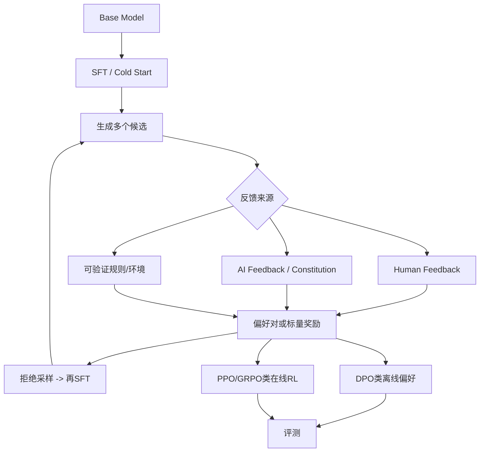

# 10. Post-Training：RLHF、DPO、GRPO、拒绝采样与反馈来源

- 原文：[SFT 之后还有哪些 Post-Training？RLHF、DPO、GRPO、拒绝采样什么关系？](https://xiaolinnote.com/ai/llm/post_training.html)
- 一句话结论：Post-Training 是基础预训练后的行为优化总称。偏好数据来源、候选生成、奖励信号和优化算法是不同维度；真实配方常把 SFT、拒绝采样、DPO/RL 和规则验证多轮组合。

## 1. 不要把所有名词放一层

- RLHF/RLAIF 描述反馈来源与流程，不唯一指定 PPO。
- PPO/GRPO 是策略优化算法族。
- DPO 是偏好对上的直接优化。
- Rejection Sampling 是生成、筛选、再 SFT。
- Rule-based Reward 可来自单测、数学答案、编译器或环境，而非人类/奖励模型。

## 2. 经典 RLHF/PPO

1. 收集同 Prompt 多回答排序。
2. 用 Pairwise Loss 训练 Reward Model。
3. Policy 在线采样回答，Reward Model 给分。
4. PPO 使用 Advantage 更新，同时用 KL 约束或 Reward Penalty 防止偏离 Reference。

网页的“4 个模型都与主模型一样大、显存固定四倍”是教学简化。Policy/Reference、Reward/Value 可共享结构、预计算、分片或不同规模；真正成本取决于实现。核心事实是在线 Rollout 与多个推理/训练组件让工程复杂。

## 3. DPO

DPO 直接使用 $(x,y_w,y_l)$，比较 Policy 相对 Reference 对 Chosen/Rejected 的概率提升。它避免显式 Reward Model 和在线 Rollout，训练像监督学习，适合已有高质量静态偏好对。

DPO 是从特定 KL-regularized RLHF 目标推导出的偏好目标，不是“与任意 PPO 过程数学完全等价”。它通常缺少在线探索，对偏好分布外行为依赖数据覆盖。

## 4. GRPO

对同一 Prompt 采样一组回答，奖励为 $r_i$，简化的组内标准化优势：

$$
A_i=\frac{r_i-\operatorname{mean}(r)}{\operatorname{std}(r)+\epsilon}
$$

这样不单独训练 State Value Critic，并配合 Policy Ratio、Clip、KL 等项更新。对答案可自动验证的数学、代码、工具环境特别有吸引力。

“省掉 Value Model 就显存减半/等于三个模型”仍取决于 Rollout、Reference、Reward 是否独立加载；GRPO 也会面临组内奖励全相同、奖励投机、采样成本和训练不稳定。

## 5. 拒绝采样和 RLAIF

拒绝采样从多个候选中保留高分答案再 SFT，简单、可审计，但受当前 Policy 候选上限和筛选器偏差限制。多轮迭代会收窄多样性，需保留真实/人工数据。

RLAIF 用 AI 产生偏好、批评或评分，降低标注成本，却可能复制教师偏见。它可以为 DPO、Reward Model、拒绝采样或 RL 提供数据，不是只与 PPO 绑定的单一算法。

## 6. 项目现状和补充代码

当前 [run_day31_sft_lora_light.py](../run_day31_sft_lora_light.py) 到 `trainer.train()` 为止，只执行 SFT。`requirements_day29_day31.txt` 包含 TRL 不代表仓库已运行 DPO/PPO/GRPO。

[llm_algorithms_reference.py](examples/llm_algorithms_reference.py) 的 `dpo_loss` 和 `grpo_advantages` 可离线验证相对概率与组内优势：Chosen 相对 Reference 改善越多，DPO Loss 越低；GRPO 优势均值为 0、方差约 1。它们没有 Policy 梯度、Clip、KL、Rollout 或 Reward Model。

## 7. 模拟面试

**Q1：Post-Training 是否只指 SFT 之后？**  
A：用法不完全统一，广义指 Base Pretraining 后的行为训练，常包含 SFT、偏好和 RL。

**Q2：RLAIF 与 DPO 能一起用吗？**  
A：可以，AI 生成 Chosen/Rejected，再用 DPO 优化；反馈来源和算法是不同维度。

**Q3：GRPO 相比 PPO 省掉什么？**  
A：不训练独立 Value/Critic，用同题组内奖励基线估计相对优势。

**Q4：拒绝采样算强化学习吗？**  
A：通常不算，核心是候选筛选后进行监督微调，没有策略梯度。

**Q5：DPO 一定比 PPO 差吗？**  
A：没有普遍结论；DPO 简单稳定，PPO/在线 RL 可探索但更复杂，取决于数据、奖励和任务。

**Q6：仓库跑过哪种 Post-Training？**  
A：实际跑过 LoRA-SFT；其他方法只有公式教学代码和文档分析。

## 8. 复习清单

- 能按反馈来源、数据、算法分层。
- 能写 GRPO 组内优势直觉。
- 不固定背“几个模型/省一半显存”。
- 如实说明项目没有偏好或 RL 训练。