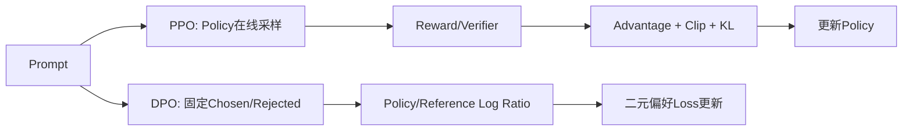

# 11. DPO 与 PPO：离线偏好优化和在线策略优化

- 原文：[大模型的 DPO 和 PPO 的区别是什么？](https://xiaolinnote.com/ai/llm/dpo_vs_ppo.html)
- 一句话结论：PPO 在 Policy 生成的在线样本上用奖励和 Advantage 做受限策略更新；DPO 在固定 Chosen/Rejected 上直接优化 Policy 相对 Reference 的概率差，工程更简单但探索与数据覆盖不同。

## 1. 共同目标

SFT 最大化示范答案似然，却没有明确比较多个“都能回答”的候选。偏好对齐希望在保持基础能力的同时，提高更有用、真实、安全回答的概率。Reference 或 KL 约束用于限制策略远离可靠起点，降低 Reward Hacking 和语言退化。

## 2. PPO 的核心

令旧策略与新策略概率比：

$$
r_t(\theta)=\frac{\pi_\theta(a_t\mid s_t)}{\pi_{old}(a_t\mid s_t)}
$$

Clipped Objective：

$$
L^{CLIP}=\mathbb{E}\left[\min\left(r_tA_t,\operatorname{clip}(r_t,1-\epsilon,1+\epsilon)A_t\right)\right]
$$

Clip 防止一次更新过大；Value/Critic 估计基线以降低 Advantage 方差；LLM RLHF 还常加入相对 Reference 的 KL 惩罚。训练需要不断生成 Rollout，成本与稳定性问题主要来自在线采样、奖励误差和多组件协调。

PPO 本身是通用 RL 算法，不等于 RLHF；RLHF 也可以使用其他 Policy Optimization。

## 3. DPO 的核心

定义相对 Reference 的偏好 Margin：

$$
z=\beta\left[\log\frac{\pi_\theta(y_w\mid x)}{\pi_{ref}(y_w\mid x)}-\log\frac{\pi_\theta(y_l\mid x)}{\pi_{ref}(y_l\mid x)}\right]
$$

$$
\mathcal{L}_{DPO}=-\log\sigma(z)
$$

它鼓励 Policy 相对 Reference 更多提升 Chosen，而不是简单让 Chosen 绝对概率大于 Rejected。Reference Log Probability 可预计算，训练时不一定要保留一整份可训练模型；工程实现因框架而异。

$\beta$ 控制偏离 Reference 的尺度。过小更新可能激进，过大可能约束过强（具体参数化解释依实现约定，必须看库文档）。

## 4. 关键差异

| 维度 | PPO/RLHF | DPO |
| --- | --- | --- |
| 数据 | Policy 在线 Rollout | 固定偏好对 |
| 奖励 | 显式 Reward/规则 | 偏好对隐式表达 |
| Advantage/Critic | 通常需要 | 不需要 |
| 探索 | 可超出静态数据 | 主要受数据覆盖限制 |
| 工程 | Rollout、多个组件、稳定性复杂 | 类监督训练，较简单 |
| 主要风险 | Reward Hacking、Collapse | 偏好噪声、分布外、过拟合 |

网页将 DPO 说成“省掉裁判”是好类比，但 DPO 并没有消除裁判工作：人类/AI 仍需产生 Chosen/Rejected，且 Reference 仍定义隐式奖励尺度。

## 5. 当前项目和参考实现

项目的 Day31 使用 `SFTTrainer`，没有 `DPOTrainer`、Reward Model、Value Head 或 Rollout Loop。因此不能声称“项目使用过 DPO/PPO”。

[llm_algorithms_reference.py](examples/llm_algorithms_reference.py) 的 `dpo_loss` 使用四个 Sequence Log Probability 和 $\beta$ 计算 Stable Softplus。测试验证 Policy 对 Chosen 的相对提升更大时 Loss 下降。它不包含 Token Mask、Length Normalization、Batch Reduction 或梯度更新。

要补成真实 DPO，需将数据转成 Prompt/Chosen/Rejected，分别计算 Policy 和冻结 Reference 的 Assistant Token Log Probability，再通过 TRL `DPOTrainer` 或自定义训练循环优化，并在事实、安全和长度偏好上回归。

## 6. 选型

- 已有可靠离线偏好对、资源有限、快速基线：DPO。
- 可自动验证、需要探索新策略、能承担 Rollout：PPO/GRPO 等 RL。
- 偏好标准变化快：先改 Judge/数据并做离线评测，不急于训练。
- 高风险安全目标：不能只依赖单一 Reward，应配规则、红队和运行时策略。

## 7. 模拟面试

**Q1：PPO 的 Clip 解决什么？**  
A：限制新旧策略概率比，避免单批高方差 Advantage 导致过大策略更新。

**Q2：DPO 为什么仍需要 Reference？**  
A：它比较 Policy 相对 Reference 的概率变化，以实现隐式 KL 约束和奖励尺度。

**Q3：DPO 完全等价于 PPO 吗？**  
A：不是。它从特定 KL 正则化偏好优化假设推导，数据和优化动态与任意 PPO 流程不同。

**Q4：DPO 为什么叫离线？**  
A：训练通常使用预先收集的固定偏好对，不要求当前 Policy 在线生成 Rollout。

**Q5：PPO 的上限一定更高吗？**  
A：在线探索提供潜力，也引入奖励偏差与不稳定；实际效果没有无条件排序。

**Q6：如何证明 DPO 改善而非只变啰嗦？**  
A：用长度分层、事实、安全、任务成功和人工盲评，并控制偏好数据的长度偏差。

## 8. 复习清单

- 能写 PPO Ratio/Clip 与 DPO Margin。
- 能区分显式奖励、隐式偏好和反馈标注。
- 知道 Reference Log Probability 可预计算。
- 不把仓库的 SFT 依赖误称 DPO 实践。