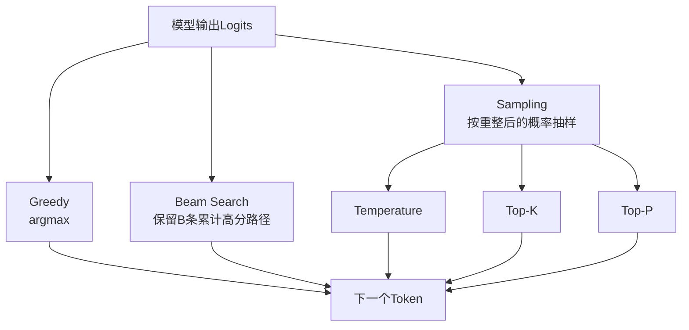

# 12. 解码策略：贪心、Beam Search、采样与任务匹配

- 原文：[大模型生成文本时的解码策略有哪些？贪心、Beam Search、采样分别什么时候用？](https://xiaolinnote.com/ai/llm/decoding_strategies.html)
- 一句话结论：模型给出下一个 Token 的条件分布，解码器决定如何搜索或采样整条序列；贪心优化当前一步，Beam Search 近似搜索高概率序列，采样保留多样性，没有一种策略对所有任务最优。

## 1. 解码的数学对象

模型在第 $t$ 步输出 Logits $z_t\in\mathbb{R}^{|V|}$，Softmax 得到：

$$
p(x_t\mid x_{<t})=\operatorname{softmax}(z_t)
$$

一条完整序列的对数概率为：

$$
\log P(x_{1:T})=\sum_{t=1}^{T}\log p(x_t\mid x_{<t})
$$

直接连乘会数值下溢，所以 Beam Search 累加 Log Probability。长序列天然累加更多负数，实际实现常加入 Length Penalty、Minimum Length、EOS、Repetition Penalty 或 No-repeat N-gram。

## 2. 贪心解码

$$
x_t=\arg\max_v p(v\mid x_{<t})
$$

优点是快、确定、便于回归；缺点是局部最优不保证整条序列概率最高，也可能进入重复模式。对严格格式输出，Greedy 能减少随机性，但不能保证 JSON、SQL 或代码合法，应配 Structured Output、Grammar 或执行校验。

`temperature=0` 在多数 API 中被特别处理为 Greedy，但数学公式 $z/T$ 在 $T=0$ 时未定义。它是 API 约定，不是对 Softmax 直接代入零。

## 3. Beam Search

每步将当前 $B$ 条路径分别扩展到词表候选，再保留累计分数最高的 $B$ 条。$B=1$ 接近 Greedy；增大 $B$ 提高搜索覆盖，也会增加 KV Cache、计算与排序成本。

Beam Search 曾广泛用于机器翻译、ASR 和摘要，但“开放式 LLM 时代完全弃用”过于绝对。它仍适用于低熵条件生成、受约束生成、候选生成与重排。开放对话常不用它，主要因为最高似然文本可能保守、重复，且多样性和计算成本不合需求。

Beam Search 并非“与 KV Cache/Flash Attention 不兼容”。框架可以为 Beam 共享初始前缀、重排 Cache，并使用优化 Kernel；只是分叉后要维护多个候选状态，内存和调度更复杂。

## 4. 采样策略

普通采样按完整分布抽 Token，可保留多样性，却可能命中长尾噪声。常见组合是先用 Temperature 改分布，再用 Top-K/Top-P 截断并重新归一化，最后抽样。不同推理库的 Processor 顺序可能不同，结果不能跨框架直接假设一致。

采样适合对话、创意和候选生成。精确推理也不一定只用 Greedy：Self-Consistency 会采样多条独立解法，再用多数答案或 Verifier 选择；其提升依赖“错误路径不高度相关”这一条件。

## 5. 推测解码不是普通解码策略

Speculative Decoding 用 Draft Model 提议多个 Token，再由 Target Model 批量验证。若接受/拒绝算法正确，它可以保持目标模型原采样分布，而不是近似为 Draft 模型分布。加速取决于接受率、Draft 成本、Batch 和硬件；不能承诺固定 2-3 倍。

它解决**执行速度**，Greedy/Top-P 等解决**从分布选 Token 的策略**，两者可以组合。

## 6. 当前项目与补充实现

[run_day34_unified_inference_api.py](../run_day34_unified_inference_api.py) 的 `generate` 实际实现：

- `temperature == 0` 时 `do_sample=False`，走 Transformers 的确定性生成。
- `temperature > 0` 时 `do_sample=True`，传入 `temperature` 和 `top_p`。
- 没有设置 `num_beams`、`top_k`、Repetition Penalty 或 Seed。

[run_day36_day38_unified_service.py](../run_day36_day38_unified_service.py) 校验 `temperature/top_p` 范围并下传给引擎，所以这两个字段不是“只写了 API Schema”。

[llm_algorithms_reference.py](examples/llm_algorithms_reference.py) 的 `sample_next_token` 和 `beam_search` 提供纯 Python 可执行版本。Beam 测试构造了一个案例：第一步 Greedy 选局部高分 Token 0，但保留两个 Beam 后，Token 1 的完整路径得分更高。

## 7. 实战决策

| 任务 | 起始策略 | 仍需配套 |
| --- | --- | --- |
| 分类、抽取、工具参数 | Greedy/低温 | Schema、枚举和运行时校验 |
| 翻译、受约束生成 | Greedy 或 Beam | Length Penalty、术语约束 |
| 普通对话 | 低到中温 Top-P | 安全、事实与重复监控 |
| 创意写作 | 中高温 Top-P | 跑偏率和用户体验评测 |
| 数学/代码推理 | Greedy 或多样采样 + Verifier | 单测、计算器、投票 |

## 8. 模拟面试

**Q1：Greedy 能找到概率最高的完整序列吗？**  
A：不能保证，它只在每一步取局部最大，后续条件分布可能让另一前缀总分更高。

**Q2：Beam Search 是随机的吗？**  
A：标准 Beam Search 是确定性近似搜索；Diverse Beam 等变体会增加多样性机制。

**Q3：为什么要累加 Log Probability？**  
A：避免许多小概率相乘下溢，并把乘积优化转成加法。

**Q4：Beam Search 与 KV Cache 不兼容吗？**  
A：兼容，但每个分叉需维护或重排缓存，显存和调度成本随 Beam 增加。

**Q5：Structured JSON 用 Greedy 就一定合法吗？**  
A：不一定，确定性不等于合法；应使用 Grammar/Schema Constrained Decoding 和解析校验。

**Q6：Speculative Decoding 会改变结果分布吗？**  
A：正确的接受/拒绝实现可以保持 Target Model 分布；草稿模型只负责提议。

## 9. 复习清单

- 能写序列 Log Probability。
- 能区分搜索、多样采样和执行加速。
- 不说 Beam 与现代 Cache/Kernels 天生不兼容。
- 能准确指出项目只实现 Greedy 与 Top-P 采样。