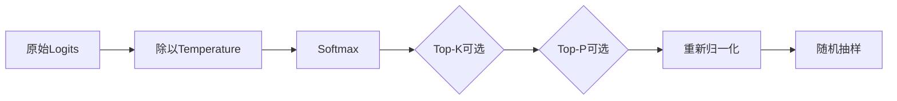

# 13. Temperature、Top-P、Top-K：概率重整、候选截断与调参

- 原文：[大模型的参数：温度值、Top-P、Top-K 分别是什么？各个场景下的最佳设置是什么？](https://xiaolinnote.com/ai/llm/temperature_top_p_top_k.html)
- 一句话结论：Temperature 改变 Logits 的相对尖锐度，Top-K 保留固定数量候选，Top-P 保留达到累计概率阈值的最小前缀；参数不存在跨模型通用“最佳值”，必须固定其他变量在业务集上逐项实验。

## 1. Temperature

$$
p_i(T)=\frac{\exp(z_i/T)}{\sum_j\exp(z_j/T)},\quad T>0
$$

- $0<T<1$：放大 Logit 差异，分布更尖。
- $T=1$：保留原分布。
- $T>1$：缩小差异，分布更平。
- API 的 $T=0$：通常是特殊分支 `argmax`，公式本身不允许除零。

Temperature 不改变 Token 排名，只改变概率间距；因此仅调温度无法移除排名很低但数量巨大的长尾，Top-K/Top-P 才负责截断。

## 2. Top-K 和 Top-P

Top-K 令非前 $K$ 名概率为零，再重新归一化。候选规模固定，计算和行为直观，但不适应每一步分布熵的变化。

Top-P/Nucleus 将 Token 按概率降序，选择满足累计概率至少为 $p$ 的最小集合：

$$
V_p=\min\left\{V':\sum_{i\in V'}p_i\ge p\right\}
$$

确定上下文中可能一个 Token 就超过阈值；开放上下文中候选可很多。实现通常至少保留一个 Token。

具体框架可能先 Top-K 再 Top-P，也可能有 Min-P、Typical-P 等 Processor。必须以框架实现和模型卡为准。

## 3. 同时设置是否“互相打架”

它们不是数学冲突，而是叠加变换：Temperature 重塑概率，Top-K/Top-P 再缩小候选集。高温 + 低 Top-P 可能先展平再强截断，效果不直观，但仍是合法配置。工程上一次主要改变一个参数，是为了可归因和降低搜索空间，而不是因为同时设置必然错误。

网页给出的 `0.0-0.2 / 0.5-0.7 / 0.8-1.2` 可作为实验起点，不能称“最佳设置”。不同模型经过不同后训练和 Logit Calibration，同一个 $T$ 的实际熵不同；提供商也可能在服务端应用额外 Sampling Policy。

## 4. 确定性并不只由 Temperature 决定

即使 $T=0$，GPU Kernel、并行归约、动态 Batch、模型版本、量化和提供商服务变化也可能导致微小差异并改变后续 Token。要做可重复评测，还应固定：

- 模型与权重版本；
- Prompt/Chat Template 与 Tokenizer；
- Seed（采样时）；
- 推理框架、dtype 和参数；
- 最大长度、Stop 条件与 Tool Schema。

## 5. 当前项目与参考代码

[run_day34_unified_inference_api.py](../run_day34_unified_inference_api.py) 只在 `temperature>0` 时向 `model.generate` 传 `temperature/top_p`；这避免 Transformers 在 `do_sample=False` 时发无效采样参数警告。[run_day36_day38_unified_service.py](../run_day36_day38_unified_service.py) 将范围限制为 $T\in[0,2]$、$p\in[0,1]$ 并透传。

项目当前没有暴露 `top_k` 和 `seed`，也没有采样参数实验报告。因此只能说“实现了温度和 Top-P 控制”，不能声称找到了最佳配置。

[llm_algorithms_reference.py](examples/llm_algorithms_reference.py) 中：

- `softmax(logits, temperature)` 使用减最大值防溢出；
- `filter_distribution` 依次应用 Top-K、Top-P 并归一化；
- `sample_next_token(..., random_value=...)` 可用固定随机数做确定性测试；
- 单元测试验证 Top-K=1 时无论抽样值如何都选择最高分 Token。

## 6. 调参实验设计

1. 建立任务分层测试集和默认参数基线。
2. 固定模型、Prompt、Seed，单独扫描 Temperature。
3. 选定温度后，再比较默认 Top-P 与少量候选值。
4. 同时记录任务成功、格式错误、重复率、事实性、延迟和输出 Token。
5. 对随机采样运行多次并报告均值/置信区间，而不是只挑最好样例。

## 7. 模拟面试

**Q1：Temperature 会改变 Token 排名吗？**  
A：正温度只按同一正数缩放 Logits，不改变排名，但改变概率间距。

**Q2：Top-P 为何比固定 Top-K 自适应？**  
A：候选数量由当前概率集中程度决定，而不是每一步固定 K 个。

**Q3：Temperature=0 是 Softmax 的合法输入吗？**  
A：不是，服务通常将其特殊解释为 Greedy/argmax。

**Q4：可以同时用 Top-K 和 Top-P 吗？**  
A：可以，候选集取叠加约束；只是调参更难归因，应按框架顺序验证。

**Q5：T=0 是否保证字节级可复现？**  
A：不绝对，硬件非确定性、模型/服务版本和量化都可能影响结果。

**Q6：项目有没有实现 Top-K？**  
A：生产引擎没有；纯 Python 参考模块实现并测试了 Top-K。

## 8. 复习清单

- 能写温度 Softmax 和 Nucleus 集合。
- 知道 T=0 是 API 特殊分支。
- 不把经验区间称为最佳值。
- 会设计单变量、多次运行的采样实验。