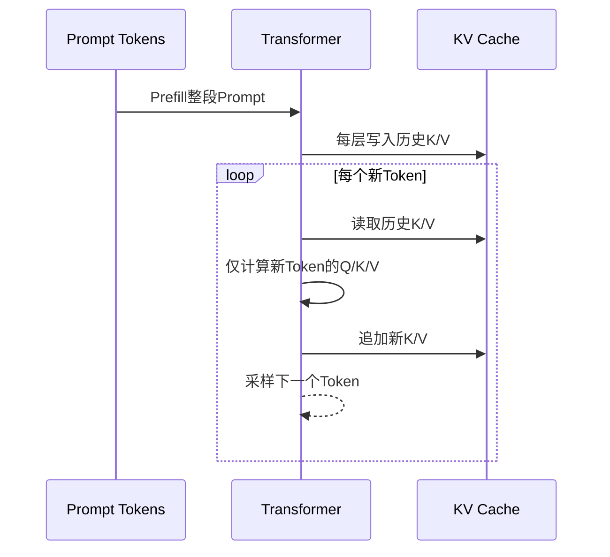

# 14. KV Cache 与 Prompt Caching：增量解码和跨请求前缀复用

- 原文：[KV Cache 是什么？Prompt Caching 的原理是什么？](https://xiaolinnote.com/ai/llm/kv_cache_prompt_caching.html)
- 一句话结论：KV Cache 在一次自回归请求内复用历史层的 Key/Value；Prefix/Prompt Caching 在兼容请求间复用相同 Token 前缀的预计算状态。二者相关，但跨请求缓存还需要匹配、生命周期、隔离和调度策略。

## 1. Prefill 与 Decode

Prefill 对长度 $N$ 的完整 Prompt 做稠密 Attention，计算约 $O(N^2)$。Decode 第 $t$ 步只为新 Token 计算投影，但 Query 仍需读取并关注约 $t$ 个历史 K/V，单步 Attention 约 $O(t)$；生成 $T$ 个 Token 累计仍有平方项。

“无 KV Cache 总复杂度一定是 $O(N^3)$”需要定义。若每一步把长度 $i$ 的完整前缀重新做标准 Attention，求和 $\sum_i O(i^2)=O(N^3)$；但不同实现和把 Prompt/输出分别计数时公式会变化。核心事实是重复计算大量历史投影和 Attention。

## 2. Cache 存什么

每一层缓存已处理 Token 的 K/V，而不是只缓存最终 Attention 输出：

$$
M_{KV}=2BLNH_{kv}d_h\times bytes
$$

缓存量与 Batch、总序列长度、层数、KV Head 和 Head Dimension 成正比。GQA/MQA 减少 $H_{kv}$，KV 量化减少 `bytes`，PagedAttention 降低分配碎片；它们解决不同因素。

Cache 不会自动保存所有中间激活用于反向传播；它面向推理。训练时通常不用同样的自回归 KV Cache 流程。

## 3. Prompt/Prefix Caching

跨请求缓存查找“最长相同 Token 前缀”，复用该前缀每层 KV，再只 Prefill 后缀。匹配单位应是**规范化后的 Token IDs + 模型状态契约**，不只字符串 Hash。有效 Key 还需包含：

- 模型/权重和 Adapter 版本；
- Tokenizer、Chat Template、位置编码配置；
- dtype/量化和可能影响状态的参数；
- 租户、权限、隐私与 Cache Scope。

“差一个字符一定 Miss”是 API 用户的安全直觉，但底层前缀树仍可命中差异点之前的较短公共前缀。不同厂商的最小长度、TTL、显式断点、价格和自动缓存策略会变化，应查当期文档。

## 4. PagedAttention 与 Radix Prefix Cache

- **PagedAttention**：将每个请求 KV 切成固定 Block，用逻辑 Block Table 映射物理显存，减少连续预分配和碎片。
- **Radix/Prefix Cache**：组织多个序列的公共 Token 前缀，使跨请求共享对应 KV Block。

两者不是互斥。现代框架能力快速演进，不能简单说“vLLM 不支持共享前缀、只有 SGLang 支持”；应按具体版本比较 Prefix Caching、调度和目标 Workload。

## 5. 安全和一致性

跨用户复用计算结果不等于向用户暴露文本，但 Cache 管理错误可能造成侧信道、错误模型版本复用或租户泄漏。敏感系统应做租户隔离、容量限制、TTL、加密/可信内存评估和审计。

动态内容应放在固定前缀后方以提高命中，但 System Policy 通常必须在用户内容之前，不能为了缓存率破坏指令层级。优化必须服从语义和安全。

## 6. 当前项目与补充实现

项目使用 Transformers `model.generate()`，底层通常默认 `use_cache=True`（取决于模型配置），但 [run_day34_unified_inference_api.py](../run_day34_unified_inference_api.py) 没有显式管理 `past_key_values`、Cache Blocks 或跨请求 Prefix Cache。

[run_day36_day38_unified_service.py](../run_day36_day38_unified_service.py) 每次构造 Prompt 后调用引擎，没有 Prompt Cache Pool 或命中指标。因此不能声称当前服务实现了 Prompt Caching。

[llm_algorithms_reference.py](examples/llm_algorithms_reference.py) 的 `PrefixCache`：

- 用 Token ID Tuple 作 Key；
- 查找最长精确前缀；
- 用 LRU 限制条目；
- 统计 Hit/Miss Rate。

测试验证 `[1,2,3]` 优先于 `[1,2]` 命中。它缓存任意教学值，不是真实每层 Tensor，也不实现 Radix Tree、分页或多租户。

## 7. 模拟面试

**Q1：为什么只缓存 K/V，不缓存 Q？**  
A：新 Token 的 Query 只在当前步使用；历史 Token 的 K/V 会被所有后续 Query 重复读取。

**Q2：KV Cache 会降低显存吗？**  
A：不会，它用线性增长的显存换重复计算减少；GQA、分页和量化再控制显存。

**Q3：Prompt Caching 与普通响应缓存一样吗？**  
A：不是，前者复用模型中间 KV 状态，后缀仍重新生成；响应缓存直接返回旧答案。

**Q4：缓存 Key 只 Hash Prompt 字符串够吗？**  
A：不够，还要绑定模型、Tokenizer/模板、Adapter、位置与租户等状态。

**Q5：PagedAttention 是否等于 Prefix Caching？**  
A：不是，前者主要管理 KV Block 分配，后者识别并共享跨请求公共前缀；可以组合。

**Q6：当前仓库是否有跨请求 KV 复用？**  
A：没有，只有底层 Transformers 可能在单次 `generate` 内使用 Cache。

## 8. 复习清单

- 能区分 Prefill、Decode 和跨请求 Prefix Cache。
- 能写 KV Cache 显存公式。
- 能区分页管理与前缀共享。
- 不把底层默认 Cache 冒充项目显式实现。