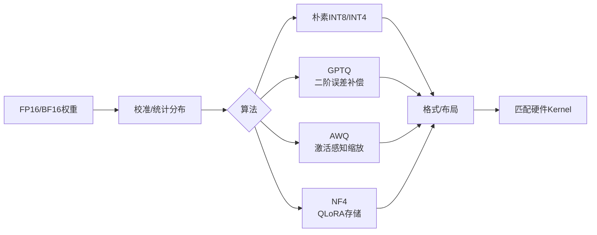

# 15. 大模型量化：INT8、INT4、GPTQ、AWQ、NF4 与 Kernel

- 原文：[大模型量化是什么？INT8/INT4/AWQ/GPTQ 怎么选？](https://xiaolinnote.com/ai/llm/quantization.html)
- 一句话结论：量化用低比特表示权重、激活或 KV Cache，以存储和带宽换误差；位宽、量化对象、粒度、校准算法、文件格式和执行 Kernel 是不同维度，必须整体匹配。

## 1. 基础线性量化

非对称量化常写为：

$$
q=\operatorname{clip}\left(\operatorname{round}(x/s)+z,q_{min},q_{max}\right)
$$

$$
\hat{x}=s(q-z)
$$

$s$ 是 Scale，$z$ 是 Zero Point。对称权重量化令 $z=0$，使用 $[-q_{max},q_{max}]$。Per-Tensor 共享一个 Scale，Per-Channel/Per-Group 使用更多 Scale，通常误差更低但元数据和 Kernel 更复杂。



## 2. 先说清量化对象

- **Weight-only**：权重低比特，激活以 FP16/BF16 计算；GPTQ/AWQ 常属于这一类。
- **Weight + Activation**：如 W8A8、FP8，需处理激活 Outlier，更依赖硬件。
- **KV Cache Quantization**：降低长上下文 Cache 显存，误差会跨后续步骤传播。
- **Optimizer/Training Quantization**：与部署权重量化不同。

“INT4 计算一定比 FP16 快 2-4 倍”不成立。若硬件无对应低比特 Tensor Core、需要频繁反量化或 Kernel/Batch 不合适，可能只省显存甚至更慢。理论 4 倍权重压缩也要扣除 Scale、Zero Point、Packing 和未量化层。

## 3. GPTQ 与 AWQ

### GPTQ

Post-Training Weight Quantization，利用校准激活形成的二阶近似，逐块/逐列量化并补偿剩余权重，使输出误差较小。优势是低比特质量和成熟生态；代价是校准、量化时间和格式/Kernel 兼容。

它不是“量化一层后把误差补偿到下一层”的简单层间传播，更准确是量化当前权重块时，按近似 Hessian 信息更新尚未量化的相关权重。

### AWQ

Activation-aware Weight Quantization 观察激活尺度，保护对输出敏感的 Weight Channels，通过等价缩放降低量化误差。网页的“1% 权重承担 99% 输出”是论文洞见的通俗化，不能作为所有模型层的固定统计。

AWQ/GPTQ 谁更快取决于 Marlin、CUTLASS、硬件、Group Size、框架和权重布局，算法名本身不决定运行速度。

## 4. NF4 与 QLoRA

NF4 是为近似正态分布权重设计的 4-bit Codebook，不等同均匀 INT4。QLoRA 将冻结的 Base 权重以 NF4 存储，计算时反量化到 BF16/FP16，并训练 LoRA。它主要解决**训练显存**，不是 AWQ/GPTQ 生产推理的直接替代。

GGUF、Safetensors 是文件/容器生态；Q4_K_M 是 llama.cpp/GGUF 的具体量化类型；AWQ/GPTQ 是算法与权重布局路线。格式与算法要分层表述。

## 5. 当前项目真实实现

[run_day31_sft_lora_light.py](../run_day31_sft_lora_light.py) 在 `--qlora` 且 CUDA 可用时创建：

```python
BitsAndBytesConfig(
    load_in_4bit=True,
    bnb_4bit_quant_type="nf4",
    bnb_4bit_use_double_quant=True,
    bnb_4bit_compute_dtype=torch.bfloat16,
)
```

这是 QLoRA 加载配置；当前 macOS/无 CUDA 会回退普通 LoRA，不能将“代码支持”说成“当前机器实跑 NF4”。

[run_day34_unified_inference_api.py](../run_day34_unified_inference_api.py) 的 `dynamic_int8` 使用 PyTorch `quantize_dynamic` 对 `Linear` 做 CPU qint8 动态量化，并限制仅 Base Model。它不是 GPTQ、AWQ 或 GPU INT8。

[run_day33_inference_acceleration_comparison.py](../run_day33_inference_acceleration_comparison.py) 尝试端到端比较动态 INT8，失败则记录 `skipped`。因此报告结果才是是否支持/加速的证据。

[llm_algorithms_reference.py](examples/llm_algorithms_reference.py) 的 `symmetric_quantize` 实现 Per-Vector 对称量化和反量化，测试验证 4-bit 范围和最大重建误差。它没有 Packing、Group Scale、校准集或低比特 Kernel。

## 6. 生产选型流程

1. 明确硬件、框架、模型架构和吞吐/延迟目标。
2. 先测 BF16/FP16 基线，再测框架成熟支持的 FP8/INT8/INT4。
3. 使用代表业务分布的校准集，而非随意文本。
4. 测权重显存、KV 显存、TTFT、TPOT、吞吐、能耗和加载时间。
5. 在数学、代码、长上下文、工具参数与安全集分别测质量。
6. 固化模型、量化配置和 Kernel 版本，防止升级漂移。

## 7. 模拟面试

**Q1：量化为什么会损失精度？**  
A：连续高精度值映射到有限离散码，反量化值与原值存在舍入和裁剪误差。

**Q2：GPTQ 的误差补偿发生在哪里？**  
A：利用近似二阶信息，在量化权重块时调整尚未量化的相关权重，不只是简单传给下一层。

**Q3：AWQ 为什么看激活？**  
A：权重对输出的敏感度取决于输入激活，激活大的通道量化误差影响通常更大。

**Q4：NF4 等于 INT4 吗？**  
A：都用 4 bit，但 NF4 是非均匀 Codebook，普通 INT4 通常指整数格点，数值语义不同。

**Q5：INT4 一定比 FP16 快吗？**  
A：不一定，必须有匹配硬件和 Kernel；否则反量化和布局转换可能抵消收益。

**Q6：当前项目跑过 AWQ/GPTQ 吗？**  
A：没有，只配置过 NF4 QLoRA 路径和 CPU Dynamic INT8。

## 8. 复习清单

- 能写量化/反量化公式。
- 能区分对象、位宽、粒度、算法、格式和 Kernel。
- 不承诺固定压缩率、加速倍数或精度损失。
- 能准确说明项目的 NF4 与 Dynamic INT8 边界。