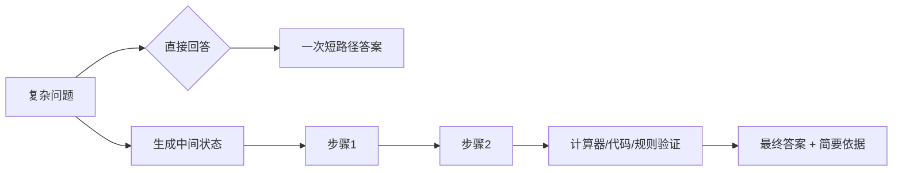

# 17. Chain-of-Thought：工作草稿、验证与 Self-Consistency

- 原文：[什么是 CoT？为啥效果好？它有什么缺点或局限性？](https://xiaolinnote.com/ai/llm/cot.html)
- 一句话结论：CoT 让模型用额外 Token 表示中间计算状态，可能改善多步任务；它不是模型真实内部机制的可靠转录，也不保证正确，生产系统应优先验证答案、工具结果和关键依据。

## 1. 为什么中间 Token 可能有帮助

自回归模型生成每个 Token 时可关注此前输出。若直接从问题跳到答案，计算深度受一次前向与少量输出限制；生成中间步骤相当于用上下文充当可读写工作区，让后续步骤条件于前面的局部结果。

CoT 也可能激活训练数据中的解题格式，并把复杂问题分解为更局部的 Token Prediction。但“输出了步骤”不等于模型拥有可验证的符号推理器；自然语言步骤可能是事后合理化或错误链。

## 2. 主要形式

- **Few-shot CoT**：给问题、推理示范和答案，模式稳定但 Prompt 长，示范错误会被模仿。
- **Zero-shot CoT**：要求分步分析，成本低但对模型和任务敏感。
- **Scratchpad/Hidden Reasoning**：模型或服务内部使用推理 Token，对外只给答案/摘要。
- **Tool-augmented Reasoning**：将算术、代码、搜索交给可验证工具，模型负责规划和解释。
- **Process Supervision**：对中间步骤而非只对最终答案提供反馈。

网页用“Few-shot 通常比 Zero-shot 稳”可作经验起点，不是普遍排序。现代 Reasoning Model 可能不需要显式提示，额外要求长 CoT 反而会干扰其训练好的策略。

## 3. Self-Consistency

对同一问题采样 $n$ 条独立路径，提取最终答案并多数投票：

$$
\hat{a}=\arg\max_a\sum_{i=1}^{n}\mathbf{1}(a_i=a)
$$

它要求答案可规范化，且错误路径不能高度相关。若模型稳定相信同一错误，投票会放大错误；开放问题也没有简单多数答案。更可靠的扩展是使用 Unit Test、Symbolic Checker、Reward Model 或外部 Verifier 对候选重排。

成本约随样本数线性增长，但并发可降低墙钟延迟；Token 和算力成本仍存在。网页中的固定 5-15 个百分点提升不是跨任务保证。

## 4. CoT 的局限

1. 额外 Token、延迟和费用。
2. 早期错误会成为后续上下文，形成错误级联。
3. 冗长步骤可能增加攻击面、敏感信息和虚假自信。
4. 简单事实/分类任务可能无收益甚至退化。
5. 可见 CoT 不一定忠实反映模型形成答案的内部原因。
6. 完整隐藏推理可能是服务商不公开的内部信号，应用不应依赖。

因此产品可展示“可核查关键步骤/引用/计算”，而非声称展示模型全部真实思维。

## 5. 当前项目怎么映射

项目没有专门比较 Direct Answer、Zero-shot CoT、Few-shot CoT 或 Self-Consistency 的脚本。[run_day25_task_orchestration.py](../run_day25_task_orchestration.py) 将计划、步骤执行和总结显式拆开，更接近**可审计工作流**，但不能称为 CoT 训练。

[run_day22_function_calling_basics.py](../run_day22_function_calling_basics.py) 把外部计算交给 Tool，再将结果回灌，比要求自然语言“算一遍”更可验证。[run_day11_kb_qa_with_citations.py](../run_day11_kb_qa_with_citations.py) 验证引用格式和原文，体现“验证产物而非相信推理叙述”。

[llm_algorithms_reference.py](examples/llm_algorithms_reference.py) 没有伪造 CoT 生成器；其采样、Beam、引用指标可用于构建候选和验证教学实验。

## 6. 可实现的实验

准备一组数学、逻辑、代码和事实题，固定模型后比较：Direct、Zero-shot CoT、Few-shot CoT、CoT + Tool、Self-Consistency。记录最终正确率、步骤可验证率、输出 Token、P95 延迟和成本。事实题应预期 CoT 收益有限，代码题用单测而非 LLM Judge 判定。

## 7. 模拟面试

**Q1：CoT 为什么可能有效？**  
A：中间 Token 充当外部工作记忆，使后续生成条件于局部计算，并激活解题模式。

**Q2：可见 CoT 能证明模型为什么这么答吗？**  
A：不能，它可能不忠实、事后合理化或直接出错，只能作为候选解释。

**Q3：Self-Consistency 为什么有效、何时失效？**  
A：独立路径若正确答案更集中，投票能降方差；错误高度相关或答案开放时会失效。

**Q4：哪些任务不应默认 CoT？**  
A：简单事实、分类、抽取和低延迟任务，额外推理可能只增加成本。

**Q5：怎样比自然语言 CoT 更可靠？**  
A：使用计算器、代码执行、检索、约束求解器或规则验证中间结果。

**Q6：当前项目跑过 Self-Consistency 吗？**  
A：没有，项目有工作流和工具验证锚点，但无多路径投票实验。

## 8. 复习清单

- 能解释 CoT 的外部工作记忆直觉。
- 不把推理文本当内部机制或事实证明。
- 能写 Self-Consistency 投票并说明相关错误。
- 准确说明项目没有 CoT 专项实验。