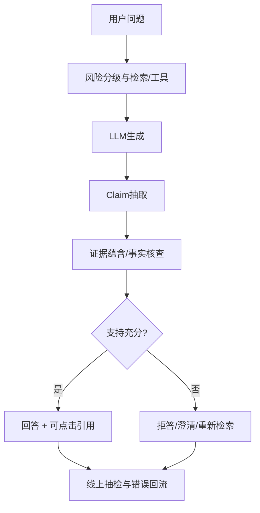

# 18. 大模型幻觉：成因、校准、Grounding 与可验证治理

- 原文：[大模型为什么会出现幻觉？怎么缓解？](https://xiaolinnote.com/ai/llm/hallucination.html)
- 一句话结论：幻觉是生成内容与来源、上下文或世界事实不一致且表达流畅的现象；成因涉及数据、目标、表示、解码和系统上下文，工程目标是按风险测量、降低并暴露不确定性，而不是承诺归零。

## 1. 先定义相对谁不一致

- **Factuality**：是否符合可验证世界事实。
- **Faithfulness/Groundedness**：是否被给定资料支持。
- **Instruction/Context Consistency**：是否违反用户约束或前文。
- **Reasoning/Execution Error**：计算或代码轨迹是否错误。

一段回答可能世界事实正确，却没有被当前资料支持；在“只能按文档回答”任务里仍是不忠实。评测必须先定义 Reference Frame，不能把所有错误都笼统叫幻觉。

## 2. 为什么会出现

### 数据与知识

训练语料有错误、冲突、过时、长尾和来源不平衡；参数化知识是分布式压缩，不是可按 Key 精确检索的数据库。即使训练数据全正确，有限容量、优化误差和组合泛化仍可能产生错误。

### 训练目标

CLM 优化训练分布下的下一个 Token 概率，不直接优化事实核验。SFT/偏好数据若奖励流畅详细而缺少拒答与事实检查，会形成“有问必答”和过度自信。

### 推理与系统

高温可增加长尾随机错误；低温只能降低抽样方差，不能修正最高概率本身错误。检索失败、坏 Chunk、引用错配、工具错误和 Prompt Injection 也会造成系统级不忠实，不能全归罪基础模型。

网页说“模型没有查询失败状态、永远输出点什么”适合解释普通续写模型，但现代系统可训练 EOS、拒答、工具错误和结构化 `insufficient_evidence`；核心仍是这些行为必须被训练和系统约束显式支持。

## 3. 三层缓解

### 训练层

高质量去重语料、知识更新、拒答/澄清样本、偏好中的事实核查、置信校准、Process/Outcome Verifier 和红队数据。闭源产品使用何种配方必须以公开报告为准，不能从表现反推内部训练细节。

### 推理层

低温减少随机长尾；Structured/Constrained Decoding 保证格式而非事实；Self-Consistency 降低部分随机推理误差；Tool/Code Execution 验证计算；要求简要依据有助审计，但 CoT 不是证明。

### 系统层

RAG、数据库和搜索提供时效证据；Citation Validator 检查来源；Claim-Evidence Entailment 判断是否真正支持；高风险回答进入人工审批。RAG 也会因召回错误、文档污染和模型忽略证据而幻觉，不是银弹。

## 4. 置信与校准

理想情况下，模型声称 80% 把握的一组问题应约 80% 正确。Expected Calibration Error 将置信分箱：

$$
ECE=\sum_b\frac{|B_b|}{n}|acc(B_b)-conf(B_b)|
$$

但生成式置信并不等于直接读取一个 Token 概率；可用答案 Log Probability、Self-evaluation、Ensemble、Verifier 或 Conformal 方法构造，且必须在目标分布校准。

[llm_algorithms_reference.py](examples/llm_algorithms_reference.py) 的 `expected_calibration_error` 实现分箱 ECE；`citation_metrics` 分开 Claim Coverage、Citation Validity 和 Grounded Claim Rate。三者分开可避免“引用很多就可信”的错觉。

## 5. 当前项目的真实治理

[run_day11_kb_qa_with_citations.py](../run_day11_kb_qa_with_citations.py) 强制回答带检索 Chunk 引用，拒绝引用未召回 Chunk 或非原文连续子串，并有界重写。[run_day16_offline_eval.py](../run_day16_offline_eval.py) 计算 Retrieval Hit、Citation Correct、Insufficient Correct 和 Citation Format Valid。

这已经覆盖“可追溯 + 信息不足拒答”的真实工程链路。但 `citation_correct` 主要按来源关键词和引用合法性判定，没有 Claim-level NLI/事实核查；检索语料本身也可能错误。因此它是缓解与测量，不是消除幻觉。

## 6. 高风险场景

医疗、法律、金融决策不能只在回答尾部加免责声明。应限制任务范围，使用权威版本化数据，强制引用和有效期，记录模型/资料版本，并让有资质人员审核。对不能可靠回答的问题，产品设计要允许拒答和转人工。

## 7. 模拟面试

**Q1：Temperature=0 为什么仍会幻觉？**  
A：Greedy 只选最高概率 Token；最高概率反映模型分布，不保证符合事实。

**Q2：事实性与忠实性有什么区别？**  
A：事实性对世界；忠实性对给定证据。事实正确但证据未支持也可能不忠实。

**Q3：RAG 能消除幻觉吗？**  
A：不能，召回、文档质量、证据使用和生成都可能失败，但它提高可追溯性并降低参数记忆依赖。

**Q4：引用存在就证明答案正确吗？**  
A：不证明，还要判断引用是否蕴含 Claim、来源是否可信和是否过时。

**Q5：ECE 衡量什么？**  
A：预测置信与实际正确率的偏差，不直接等于准确率。

**Q6：当前项目的幻觉门禁最大缺口？**  
A：缺少 Claim-level Evidence Entailment、来源可信度/时效和人工高风险审核闭环。

## 8. 复习清单

- 先定义事实性、忠实性和上下文一致性。
- 能解释低温、RAG、CoT 各自不能解决什么。
- 能写 ECE 并分开引用覆盖与正确性。
- 准确陈述 Day11/16 的能力与缺口。