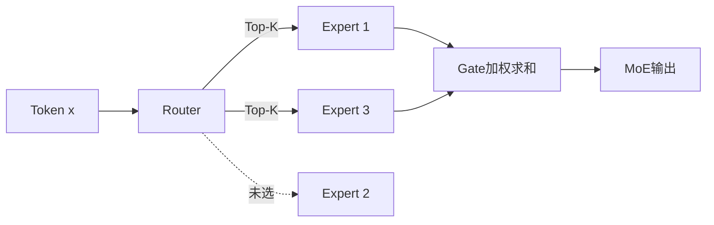

# 19. MoE：Router、稀疏专家、负载均衡和分布式通信

- 原文：[MoE 混合专家模型是什么？DeepSeek V3、Qwen 为什么用 MoE？](https://xiaolinnote.com/ai/llm/moe.html)
- 一句话结论：Sparse MoE 通常将 Transformer 的 Dense FFN 替换为多个专家，Router 为每个 Token 选择 Top-K 专家；总参数决定容量与存储，激活参数影响计算，但真实延迟还受 All-to-All、负载和 Kernel 支配。

## 1. 计算过程

对 Token 表示 $x$，Router 计算专家分数：

$$
g=\operatorname{softmax}(W_rx)
$$

选择集合 $S=\operatorname{TopK}(g)$，输出：

$$
y=\sum_{i\in S}\tilde{g}_iE_i(x)
$$

$\tilde g$ 是选中专家内重新归一化的权重。很多架构还保留 Shared Expert 或 Dense 层，不能用简单 $K/N$ 等于全模型激活比例；Attention、Embedding 和共享参数始终参与。

专家可能对语言、语法或模式产生统计专门化，但不是人工预先指定的“数学专家/代码专家”，也未必形成可解释领域边界。

## 2. 总参数、激活参数与显存

- 总参数：所有专家 + 共享模块，决定权重存储和分布式部署规模。
- 激活参数：某 Token 实际经过的共享模块 + Top-K 专家，近似影响 FLOPs。
- Activation Memory：还取决于 Batch、Sequence、Checkpointing 和中间状态。

“推理速度等于同激活参数 Dense 模型”不保证成立。MoE 需要 Token Dispatch、All-to-All、专家 Padding/Capacity 和 Combine；小 Batch 或跨节点通信下，利用率可能明显更差。显存通常需容纳所有专家，但可通过 Expert Parallel、Offload、量化和分层缓存改变物理分布。

网页列出的具体 DeepSeek/Qwen 配置应以对应模型报告为准，文档不把快速变化的版本数字当通用定义。

## 3. 专家失衡与 Capacity

Router 易偏向少数专家，造成热门 GPU 过载、冷门专家训练不足。常见机制：

- Load Balancing Auxiliary Loss；
- Router Z-loss、噪声和温度；
- 每专家 Capacity Factor 与 Token Dropping；
- Expert Choice、共享专家和偏置调节；
- 部署时复制热门专家或动态调度。

简单均衡也可能伤害质量，因为真实数据并不要求每批严格均匀。目标是在硬件负载、专家专门化与主任务之间折中。

## 4. 分布式 All-to-All

Expert Parallel 将专家放在不同设备。每层需要：按路由把 Token 发到专家 GPU -> 专家计算 -> 把输出发回原 Token 顺序。通信量与 Batch/Hidden Size/Top-K 相关，跨节点网络往往成为瓶颈。高性能系统会将通信与 Attention/FFN 计算重叠。

这也是 MoE “FLOPs 便宜但部署不简单”的核心。Dense 模型在中小规模、低延迟和简单运维场景仍有优势，MoE 不是唯一未来。

## 5. 当前项目与补充实现

项目通过 Transformers 加载指定模型；若模型类内部是 MoE，框架可能执行对应架构，但仓库没有选择 MoE 模型、配置 Expert Parallel 或观察 Router 指标，不能称作 MoE 实践。

[llm_algorithms_reference.py](examples/llm_algorithms_reference.py) 的 `MoERouter`：

- 对 Gate Logits 做 Softmax；
- 确定性选择 Top-K 并在选中专家间归一化；
- 调用专家函数并加权输出。

`moe_load_balance_loss` 用专家负载比例相对均匀分布的均方偏差作教学指标，测试验证均匀路由 Loss 为 0。真实 MoE Auxiliary Loss 常同时使用 Router Probability 与 Token Assignment，并不是这一个简化公式。

## 6. 什么时候考虑 MoE

- 预训练阶段希望在受控每 Token FLOPs 下扩大总容量。
- 有高速互联、多机并行和 Router/负载调优能力。
- 服务规模足以摊薄复杂度，并能监控 Expert Load 与 All-to-All。

若只是部署第三方模型，选 MoE 仍要比较总权重显存、通信、量化支持、并发和业务质量；只看“激活参数”会低估资源。

## 7. 模拟面试

**Q1：MoE 是多个完整模型投票吗？**  
A：Sparse Transformer MoE 通常是在层内用多个 FFN 专家，按 Token 路由，不是多个端到端模型投票。

**Q2：为什么显存看总参数、FLOPs 看激活参数？**  
A：所有专家权重通常需可访问，但每个 Token 只经过选中的专家；物理分片会改变单卡分布。

**Q3：Top-K 越小越好吗？**  
A：计算更省，但路由容量和稳健性可能下降；要在质量、负载和通信间权衡。

**Q4：负载均衡为什么不能越强越好？**  
A：强制严格均匀可能阻止合理专家专门化并干扰主任务 Loss。

**Q5：MoE 主要通信是什么？**  
A：Expert Parallel 中 Token Dispatch/Combine 的 All-to-All，跨节点常成为瓶颈。

**Q6：当前仓库跑过 MoE 吗？**  
A：没有，新增的是纯函数 Router/专家教学骨架。

## 8. 复习清单

- 能写 Top-K Gate 加权公式。
- 能区分总参数、激活参数、FLOPs 和实际延迟。
- 能解释负载与 All-to-All。
- 不把专家自动解释成固定业务领域。