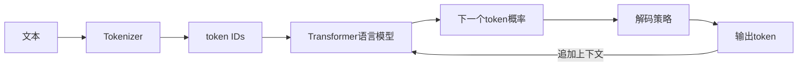

# 1. 什么是大语言模型：统一生成接口与传统 NLP 的边界

- 原文：[什么是大语言模型？和传统 NLP 模型有什么区别？](https://xiaolinnote.com/ai/llm/what_is_llm.html)
- 一句话结论：LLM 通常是在大规模语料上训练的通用语言模型，主流生成模型以自回归 next-token prediction 为核心；“大”没有统一参数阈值，关键是规模、数据、训练方法与通用迁移能力共同形成的系统属性。

## 1. 模型到底学什么

给定 token 序列 $x_{1:t}$，Decoder-only 语言模型学习：

$$
P(x_{1:T})=\prod_{t=1}^{T}P(x_t\mid x_{<t})
$$

训练使用目标 token 的负对数似然：

$$
\mathcal{L}_{CLM}=-\frac{1}{T}\sum_{t=1}^{T}\log P_\theta(x_t\mid x_{<t})
$$

模型输出的是词表上的概率分布，不是在内部执行数据库查询。翻译、分类、摘要和代码生成之所以能统一，是因为任务和约束都可以编码为上下文，答案再通过 token 续写产生。

## 2. 与传统 NLP 的真正区别

| 维度 | 传统任务系统 | 通用 LLM 系统 |
| --- | --- | --- |
| 接口 | 分类头、序列标注头、规则流水线 | Prompt/messages -> token 序列 |
| 训练 | 任务标注数据为主 | 大规模自监督预训练 + 后训练 |
| 迁移 | 常为每任务训练/适配 | Zero/Few-shot、RAG、工具或微调 |
| 输出 | 标签、跨度、分数或文本 | 主要为开放式生成，也可约束结构 |
| 风险 | 错误较易按模块定位 | 概率生成、幻觉和评测更复杂 |

网页把“传统 NLP 都是判别式”作为记忆主线，但不够严谨。机器翻译、语言模型和 Seq2Seq 很早就是生成式；BERT 也可放入 Encoder-Decoder 生成系统。更准确的差异是：LLM 将更多任务统一到通用预训练表示和生成接口，并在规模上获得更强的上下文学习与迁移。

## 3. “大”不是固定参数线

没有“超过 10B 才算 LLM”的标准。一个模型是否被称为 LLM，通常同时看参数量、训练 token、语料广度、架构、计算预算和任务泛化。小型现代模型也可能因高质量数据和蒸馏，在某些任务超过早期大模型。参数量只描述容量，不直接等于知识质量、推理正确率或产品价值。

所谓涌现也应谨慎：某些能力曲线看似跳变，可能受到 exact-match 等离散指标影响。能力随规模提升是可观察事实，但不存在所有任务共同的“神奇参数阈值”。

## 4. 当前项目如何体现

[chat_cli.py](../chat_cli.py) 是最小 LLM 应用闭环：读取 System Prompt，向 `/chat/completions` 发送 messages，获取生成文本和 token usage，再写入 JSONL。它证明应用层看到的是统一生成接口，而不是模型内部 Transformer。

[run_day34_unified_inference_api.py](../run_day34_unified_inference_api.py) 使用 Transformers 加载 Causal LM，并把基础模型和 LoRA Adapter 统一成 `UnifiedInferenceEngine`。[run_day36_day38_unified_service.py](../run_day36_day38_unified_service.py) 再将它封装为认证、限流和观测齐全的服务。

[llm_algorithms_reference.py](examples/llm_algorithms_reference.py) 的 `causal_lm_cross_entropy` 直接计算上面的负对数似然，展示训练目标；它不训练神经网络，只验证公式。

## 5. 工程上不该被“统一模型”迷惑

一个模型可以承接多任务，不代表一套配置适合所有任务。生产系统仍需按任务使用不同 Prompt、检索、工具、解码、校验甚至模型路由。对分类和抽取，专用小模型有时更快、更便宜、更可解释；LLM 是强大的通用组件，不是自动替代所有 NLP 技术。

## 6. 模拟面试

**Q1：LLM 的本质是什么？**  
A：主流生成式 LLM 是在大规模数据上训练的条件概率模型，根据上下文预测后续 token；通用能力来自架构、数据、规模和后训练的组合。

**Q2：参数超过多少才叫“大”？**  
A：没有统一阈值，应结合参数、训练 token、算力、数据广度和泛化能力描述。

**Q3：传统 NLP 都是判别式吗？**  
A：不是，早期语言模型、机器翻译和 Seq2Seq 也是生成式；主要变化是通用预训练和统一任务接口。

**Q4：模型预测下一个 token 为什么能做分类？**  
A：把标签及规则编码进 Prompt，模型生成标签 token；应用还应约束合法标签并解析校验。

**Q5：LLM 是否取代专用模型？**  
A：不必然。高吞吐、严格延迟、固定标签和端侧任务可能更适合小型专用模型。

**Q6：当前仓库训练过基础大模型吗？**  
A：没有。仓库调用云端/本地模型并做 LoRA SFT，不包含从零预训练。

## 7. 复习清单

- 能写出自回归分解和交叉熵目标。
- 能区分“统一接口”和“所有任务都用同一配置”。
- 不用参数阈值或“传统 NLP 全是判别式”作绝对定义。
- 能定位项目的调用、推理引擎和服务三层。