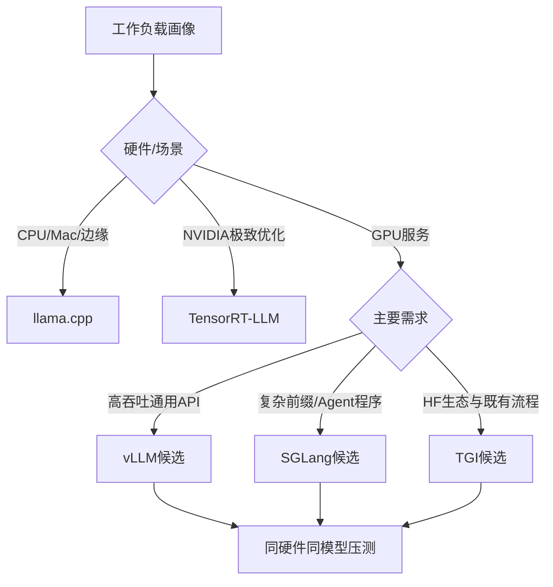

# 20. 大模型部署：vLLM、SGLang、TGI、llama.cpp 与 TensorRT-LLM

- 原文：[大模型部署有哪些主流方案？vLLM、TGI、llama.cpp、SGLang 实际项目里怎么选？](https://xiaolinnote.com/ai/llm/deployment_frameworks.html)
- 一句话结论：框架选择应由硬件、模型支持、请求长度、并发、前缀复用、量化、生态和运维共同决定；Paged KV、Prefix Cache、Continuous Batching 和低比特 Kernel 是能力维度，不应把框架固定成永不变化的标签。

## 1. 推理服务关注什么

- **TTFT**：Time To First Token，Prefill、排队和前缀命中影响大。
- **TPOT/ITL**：每输出 Token 延迟，Decode 调度和带宽影响大。
- **Throughput**：每秒请求/Token，Batch 与并发决定。
- **Goodput**：满足 SLO 的有效吞吐，比峰值吞吐更有业务意义。
- **Memory**：权重、KV、临时 Workspace 和碎片。
- **Reliability**：排队、取消、背压、超时、健康和版本发布。

## 2. 各框架定位

### vLLM

以 PagedAttention/Paged KV 管理、Continuous Batching 和 OpenAI-compatible Serving 著名，生态和模型支持广。现代版本也持续加入 Prefix Caching、Speculative Decoding、量化和 MoE，不能停留在“只分页、不共享前缀”的早期印象。

### SGLang

同时提供结构化 LLM Program/Serving Runtime，RadixAttention/Prefix Cache 对共享前缀和复杂 Agent Workload 有优势。是否快于 vLLM 取决于版本、模型、请求分布和配置，网页中的固定倍数只能作为某组 Benchmark 观察。

### TGI

Hugging Face 推理服务，优势在 Hub、Tokenizer/模型生态和生产 API 能力。框架维护状态、支持模型和性能会随日期变化，选型前应查当前 Release，而不是仅根据历史声量。

### llama.cpp

C/C++ 推理栈，GGUF、CPU/Metal/多后端和本地部署成熟。它也能提供服务和并发，不能概括为“不能做生产”；但高吞吐多卡数据中心通常有更合适的 GPU Serving Engine。

### TensorRT-LLM

针对 NVIDIA GPU 的编译和 Kernel 优化，适合固定模型/硬件追求性能。代价是转换、Build、版本矩阵和运维复杂度；性能百分比必须实测。

## 3. Paged、Prefix 与 Batching

- Paged KV：按 Block 分配，减少连续预留和内部/外部碎片。
- Continuous Batching：请求可在 Token Step 动态加入/离开，提高 GPU 利用率。
- Prefix Caching：跨请求共享完全相同 Token 前缀的 KV。
- Chunked Prefill：将超长 Prompt Prefill 切块，改善长短请求公平性。

这些能力正在跨框架融合。选型应查“当前版本是否支持目标模型 + 量化 + Feature 组合”，并运行同一压测，不应按框架名推断全部能力。

## 4. 当前项目是什么、又不是什么

[run_day34_unified_inference_api.py](../run_day34_unified_inference_api.py) 使用 Hugging Face Transformers `model.generate()` 封装 Base/Adapter 和 Dynamic INT8。[run_day36_day38_unified_service.py](../run_day36_day38_unified_service.py) 用 FastAPI 提供：认证、滑动窗口限流、结构化错误、有限重试、健康检查和聚合指标。

这是**统一教学推理服务**，不是 vLLM/TGI/SGLang/llama.cpp：

- 没有 Continuous Batching Scheduler；
- 没有 Paged KV 或 Prefix Cache；
- 没有 SSE Token Streaming；
- 没有 Tensor/Expert Parallel；
- 单进程内存限流和指标不适合多副本一致性。

[run_day33_inference_acceleration_comparison.py](../run_day33_inference_acceleration_comparison.py) 比较串行、Batch、Dynamic INT8 和多 Engine 线程并发，能做本机基线，但不是专业 Serving Framework Benchmark。

[llm_algorithms_reference.py](examples/llm_algorithms_reference.py) 的 `choose_deployment_framework` 是需求决策树：本地/无 GPU -> llama.cpp，前缀共享 -> SGLang，NVIDIA 极致 -> TensorRT-LLM，通用高并发 -> vLLM。它是教学启发式，不会安装或运行框架。

## 5. 正确压测

固定模型、精度、硬件和数据集，分别模拟短输入短输出、长 Prompt、长输出、混合长度和高前缀复用。逐步升并发，记录 TTFT/TPOT P50/P95/P99、Token Throughput、Goodput、GPU 利用率、OOM、错误和质量。预热后测试，区分 Server Queue、Tokenizer、Network 和 Model 时间。

只报“吞吐提升 4 倍”没有意义，必须给 Baseline、请求分布、SLO 和版本。

## 6. 模拟面试

**Q1：PagedAttention 主要解决什么？**  
A：KV Cache 的 Block 分配和碎片/预留浪费，不会降低 Attention 数学复杂度。

**Q2：Continuous Batching 与静态 Batch 的区别？**  
A：前者在每个调度步让请求动态进入退出，不必等整批最长请求完成。

**Q3：vLLM 一定不如 SGLang 复用前缀吗？**  
A：不能按旧印象绝对化，两者都在演进，应按当前版本和 Workload 压测。

**Q4：什么时候优先 llama.cpp？**  
A：CPU/Apple Silicon/边缘、离线隐私和 GGUF 本地场景，尤其并发不高时。

**Q5：部署评测为什么要看 Goodput？**  
A：峰值吞吐可能让尾延迟超 SLO；Goodput 只统计按时完成的有效请求。

**Q6：当前 FastAPI 服务能叫 vLLM 部署吗？**  
A：不能，它底层是 Transformers，没有 vLLM Scheduler 或 Paged KV。

## 7. 复习清单

- 能说 TTFT、TPOT、Throughput 和 Goodput。
- 能区分页、前缀复用和连续批处理。
- 不死记框架固定排名或倍数。
- 能准确描述 Day33/34/36 的教学边界。