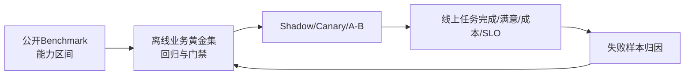

# 21. 大模型评测：Benchmark、业务黄金集、校准与线上闭环

- 原文：[大模型能力评测指标有哪些？](https://xiaolinnote.com/ai/llm/evaluation_metrics.html)
- 一句话结论：学术 Benchmark 描述能力切面，业务黄金集检验真实任务，线上指标验证用户价值；完整评测还需质量、鲁棒、安全、延迟、成本和统计不确定性，不能用一个总分决定上线。

## 1. 三层评测

### 学术能力集

- MMLU/MMLU-Pro：多学科选择题。
- GSM8K/MATH/GPQA：数学和科学推理。
- HumanEval/MBPP：函数级代码；SWE-bench Verified 更接近仓库 Issue 修复。
- Arena/MT-Bench：人类偏好或 LLM Judge 对话评测。
- Agent/Tool Bench：多轮状态、工具与环境成功率。
- Live/私有更新集：降低公开题库污染。

Benchmark 排名随 Prompt、Few-shot、CoT、采样、工具和评分协议变化。必须比较同一 Harness 配置，不只看模型卡自报。

## 2. 常用指标

### 分类

$$
Precision=\frac{TP}{TP+FP},\quad Recall=\frac{TP}{TP+FN}
$$

$$
F1=\frac{2PR}{P+R}
$$

类别不平衡时仅看 Accuracy 会误导。

### 代码 Pass@k

从 $n$ 个样本中有 $c$ 个正确，抽 $k$ 个至少一个正确的无偏估计形式：

$$
pass@k=1-\frac{\binom{n-c}{k}}{\binom{n}{k}}
$$

Pass@k 提升可能来自更多采样成本，必须同时报 $k$、Temperature 和总 Token。

### 生成/RAG/Agent

Exact Match、ROUGE/BLEU 只适合部分有参考文本任务；RAG 应测 Retrieval Recall、MRR、Citation Coverage、Faithfulness；Agent 应测任务成功、工具参数、步骤数、预算和副作用安全；开放回答可用 Rubric 人工/LLM Judge。

## 3. LLM-as-Judge 的风险

Judge 会受位置、长度、自我偏好、措辞和模型家族影响。应随机交换 A/B 顺序、隐藏模型名、使用结构化 Rubric、校准人工子集并报告一致率。高风险结论不能只靠一个 Judge。

网页建议人工抽查 10-20% 是实用起点，不是固定充分比例；抽样量取决于风险、错误率和置信区间。

## 4. 数据污染与统计

公开题可能进入预训练或微调，导致记忆而非泛化。可使用时间切分、私有题、动态生成但人工验证、近重复检测和 Canaries。业务集也要避免从训练数据复制。

评测结果应报告样本量和置信区间。比较两模型时尽量用配对样本和 Bootstrap/显著性检验；0.5 个百分点差异在 50 条样本上通常没有决策意义。

## 5. 当前项目评测能力

[run_day16_offline_eval.py](../run_day16_offline_eval.py) 在固定 JSON 评测集上输出 Markdown、CSV 和 JSONL，计算：

- `retrieval_hit_rate`；
- `citation_correct_rate`；
- `insufficient_correct_rate`；
- `citation_format_valid_rate`；
- 平均重试和 Token。

[run_day32_sft_before_after_eval.py](../run_day32_sft_before_after_eval.py) 比较 Base 与 LoRA，但评分偏关键词/格式启发式；[run_day33_inference_acceleration_comparison.py](../run_day33_inference_acceleration_comparison.py) 测吞吐而非质量。它们体现“固定输入、双写报告、前后比较”，还缺置信区间、人工校准、安全/鲁棒和线上 A/B。

[llm_algorithms_reference.py](examples/llm_algorithms_reference.py) 实现 `classification_metrics`、`pass_at_k`、`expected_calibration_error` 和引用三指标；单测给出可手算值。它不包含 Benchmark 数据或 LLM Judge。

## 6. 业务黄金集建设

1. 从真实流量按场景/风险/长度/语言分层采样。
2. 定义可操作 Rubric 和拒答边界，双人标注高风险样本。
3. 为客观任务编写 Parser、Schema、单测和事实查询。
4. 固定核心回归集，另保留滚动新鲜集防过拟合。
5. 记录每次运行的模型、Prompt、参数、工具和知识版本。
6. 上线后按失败类型回流，但防止直接污染最终 Test Set。

## 7. 模拟面试

**Q1：为什么不能只看 MMLU？**  
A：它只测多学科选择题，还可能污染，无法代表业务格式、工具、安全、延迟和成本。

**Q2：Pass@1 与 Pass@10 如何比较？**  
A：Pass@10 给十次机会，通常更高但成本也高；必须同报 $k$、采样和预算。

**Q3：LLM Judge 如何降低偏差？**  
A：盲化模型、随机交换位置、明确 Rubric、多 Judge/人工校准并报告一致率。

**Q4：业务集为什么要滚动更新？**  
A：用户分布、模型和失败模式会变化，固定集还可能被 Prompt/训练过拟合。

**Q5：离线好为什么线上可能差？**  
A：真实流量、并发、工具故障、用户行为和延迟不同，需 Shadow/A-B 和 SLO 验证。

**Q6：当前项目最成熟的评测是什么？**  
A：Day16 的 RAG 检索、引用和拒答离线闭环；仍缺统计与线上评测。

## 8. 复习清单

- 能按公开、业务、线上三层组织评测。
- 能写 F1、Pass@k 和 ECE 的含义。
- 知道 Judge、污染和小样本不确定性。
- 能区分 Day32 质量评测与 Day33 性能基准。