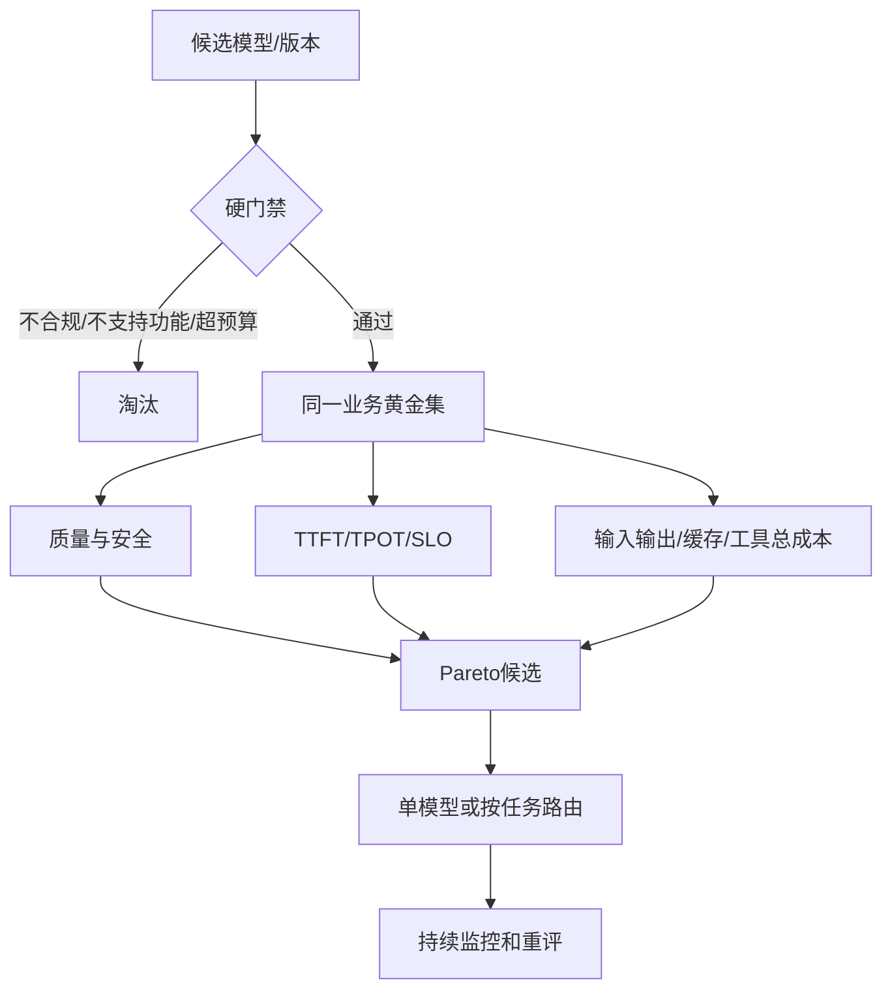

# 22. 模型选型：质量、成本、延迟、合规与动态路由

- 原文：[对比使用过哪些主流大模型？你们项目中最终选用了哪个模型？为什么？](https://xiaolinnote.com/ai/llm/model_selection.html)
- 一句话结论：模型选型是带硬门禁的多目标优化：先淘汰不满足合规、功能、SLO 和预算的候选，再在业务集上比较质量与总成本；版本变化快时，路由和可替换接口通常比押注单一品牌更稳。

## 1. 先门禁，再评分

合规、地域、数据保留、合同、可用区域、内容政策、上下文、Structured Output、Tool Use、流式和 SLA 常是硬约束。排行榜分数不能补偿一个无法合法上线或不支持关键 API 的模型。

## 2. 不要用品牌替代版本

模型能力、价格、上下文、知识截止、API 和可用区快速变化，应记录准确 Provider、Model ID、Snapshot/Date 和参数。网页的 2026 模型名及“国内/海外特长”可作为文章当时视角，不应永久固化为结论，也不能代表当前仓库实测。

尤其不能在面试中说“项目用了某闭源最新模型”，除非有调用日志、合同或评测证据。安全表达是：列出实际评测版本、数据集、时间、结果与限制。

## 3. 总成本而非 Token 单价

单请求期望成本近似：

$$
C=(T_{in}-T_{cached})p_{in}+T_{cached}p_{cache}+T_{out}p_{out}+C_{tool}+C_{retry}
$$

还应纳入工程、人审、失败重试、缓存写入、Batch、GPU 利用率和质量失败的业务损失。廉价模型若需要三次重试或产生更多人工审核，总成本可能更高。

延迟也要分 TTFT 和 TPOT。长文摘要偏 Prefill，长生成偏 Decode；同一个“平均延迟”掩盖不同瓶颈。

## 4. Model Routing

常见路由：

- 简单分类/抽取 -> 小型低成本模型；
- 严格工具/结构 -> Tool Accuracy 高的模型；
- 难推理 -> 强 Reasoning Model；
- 敏感数据 -> 合规本地/专有链路；
- 主模型失败/限流 -> 能力兼容的备用 Provider。

路由器可用规则、分类器或 LLM，但必须有 Allowlist、预算、可观测和回退。强模型兜底会增加尾延迟；不同模型的 Prompt、Tool Schema 和安全行为也需适配。

网页中的“企业级多智能体财报 RAG 最终选型”是文章示例，不是当前仓库经历。本仓库没有该财报项目和国内/海外模型对比报告。

## 5. 当前项目的实际候选

- [chat_cli.py](../chat_cli.py) 默认 `gpt-4.1-mini`，也支持通过环境变量连接 OpenAI-compatible 本地服务；这只是默认配置，不是选型结论。
- RAG 脚本常回退本地 `qwen2.5:0.5b` 等配置，用于低成本学习实验。
- [run_day31_sft_lora_light.py](../run_day31_sft_lora_light.py) 默认 `HuggingFaceTB/SmolLM2-135M-Instruct`，因为体积适合小规模 LoRA 教学，不代表生产能力最佳。
- [run_day34_unified_inference_api.py](../run_day34_unified_inference_api.py) 抽象 Base/Adapter 推理，为替换模型提供接口，但没有多 Provider 动态路由。

[xiaolinnote_tools_analysis/examples/tooling_capabilities_reference.py](../xiaolinnote_tools_analysis/examples/tooling_capabilities_reference.py) 有离线 Gateway Route/Quota/Failover；本专题 [llm_algorithms_reference.py](examples/llm_algorithms_reference.py) 的 `rank_model_candidates` 先应用 Compliance/Local/Cost/Latency 门禁，再按 Quality、Tool Accuracy、归一化 Cost/Latency 打分。测试验证最强但不合规的候选被淘汰。

评分器是教学启发式：权重主观、指标尺度需校准，也不求完整 Pareto Frontier。生产决策应展示原始指标和敏感性分析，不能只给一个神秘总分。

## 6. 选型实验表

| 维度 | 指标示例 |
| --- | --- |
| 任务质量 | 成功率、事实性、工具参数、拒答、代码单测 |
| 安全合规 | 数据地域、保留策略、审计、越权与红队通过率 |
| 性能 | TTFT/TPOT P50/P95、吞吐、上下文长度 |
| 成本 | 缓存后输入、输出、重试、工具、人审、GPU TCO |
| 运维 | SLA、限流、版本稳定、监控、Fallback 兼容 |
| 产品 | 语言、风格、多模态、用户满意与完成率 |

每个候选应在同一 Prompt/Harness 上跑；若模型需要专门 Prompt 优化，应允许公平的模型特定调优，并记录差异。

## 7. 模拟面试

**Q1：为什么先做硬门禁再加权评分？**  
A：不合规或缺关键功能不能被高能力分抵消；加权平均会掩盖不可接受项。

**Q2：最便宜的 Token 单价就是最低成本吗？**  
A：不是，还要算输出长度、缓存、重试、失败、人审、工具和工程运维。

**Q3：何时使用 Model Routing？**  
A：任务难度、隐私、功能和成本差异明显，且路由复杂度可被调用规模摊薄时。

**Q4：如何防止 Router 把难题错发小模型？**  
A：置信阈值、可验证门禁、强模型升级、失败回退和线上错误回流。

**Q5：排行榜有什么合理用途？**  
A：缩小候选和了解能力区间；最终仍需同版本业务集、性能与合规评测。

**Q6：当前仓库最终选了哪个生产模型？**  
A：没有生产选型结论；不同脚本使用云端/本地/小型 HF 默认值完成学习目标。

## 8. 复习清单

- 先做硬门禁，再看 Pareto 和加权偏好。
- 记录精确模型版本而非品牌名。
- 能计算包含缓存、重试和人审的总成本。
- 不把网页案例或脚本默认模型冒充生产选型经历。