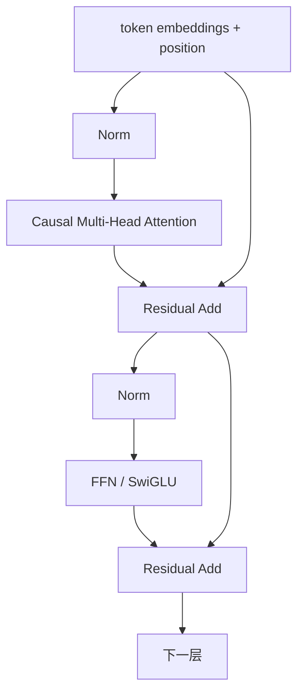

# 2. Transformer：Attention、Encoder、Decoder 与架构变体

- 原文：[讲讲 Transformer 架构基本原理？Encoder 和 Decoder 是什么？](https://xiaolinnote.com/ai/llm/transformer_architecture.html)
- 一句话结论：Transformer 用 Attention 在序列位置间建立短路径，再用逐位置 FFN 做非线性变换；Encoder、Decoder 的关键差异是注意力可见范围与训练目标，而不只是“理解”和“生成”的标签。

## 1. 一个 Transformer Block

现代 Decoder Block 通常包含归一化、因果 Self-Attention、残差、归一化、FFN/MLP 和残差。不同模型会采用 Pre-Norm、RMSNorm、SwiGLU 等变体。

Attention 的核心公式：

$$
Q=XW_Q,\quad K=XW_K,\quad V=XW_V
$$

$$
\operatorname{Attention}(Q,K,V)=\operatorname{softmax}\left(\frac{QK^\top+M}{\sqrt{d_k}}\right)V
$$

$M$ 是可见性 Mask。Decoder 的因果 Mask 将未来位置设为 $-\infty$，Softmax 后权重为 0。

## 2. 为什么除以 $\sqrt{d_k}$

若 $Q,K$ 每维均值为 0、方差约 1，点积是 $d_k$ 项之和，方差约为 $d_k$。除以 $\sqrt{d_k}$ 将方差缩回常数量级，避免 Softmax 过度饱和、梯度变小。它不是为了改变复杂度，而是为了数值尺度。

## 3. 三种架构

| 架构 | Attention 可见性 | 常见目标 | 典型用途 |
| --- | --- | --- | --- |
| Encoder-only | 双向 Self-Attention | MLM/对比学习 | 分类、检索、Embedding |
| Decoder-only | 因果 Self-Attention | CLM | 通用生成、对话、代码 |
| Encoder-Decoder | Encoder 双向；Decoder 因果 + Cross-Attention | 条件生成 | 翻译、摘要、结构转换 |

“Encoder 只理解、Decoder 只生成”是有用直觉，不是能力定律。Encoder 表示可接解码器生成；Decoder 隐状态也能用于分类。选择取决于信息流和目标函数。

## 4. 相比 RNN 改善了什么

RNN 训练沿时间步串行，远距离信息需要经过很多状态转换。Self-Attention 训练时可并行计算各位置，任意两个 token 之间的交互路径为常数层数。但它没有“彻底解决长序列”：标准 Attention 的时间和分数矩阵仍为 $O(N^2)$，位置编码、有限上下文与 Lost-in-the-Middle 仍存在。

Decoder 在**训练**时因 Teacher Forcing 可并行处理整段；在**生成**时仍必须一个 token 接一个 token 自回归解码。面试中要把两阶段分开。

## 5. 当前项目与补充代码

[run_day31_sft_lora_light.py](../run_day31_sft_lora_light.py) 通过 `AutoModelForCausalLM` 加载 Decoder-style Causal LM，架构计算由 Transformers/PyTorch 完成。项目没有手写 Transformer Block。

[llm_algorithms_reference.py](examples/llm_algorithms_reference.py) 的 `scaled_dot_product_attention` 显式完成：

1. $QK^\top/\sqrt{d_k}$；
2. 因果 Mask；
3. Softmax；
4. 权重乘 $V$。

测试验证第一个 token 看不到未来位置，并验证每行权重和为 1。这个实现只有一个 Head、没有梯度和 Batch，用于看清公式，不用于性能比较。

## 6. 常见误区

- Self-Attention 无位置编码时是置换等变，不是“交换词后每个位置输出完全不变”。
- FFN 不应简单等同“事实数据库”；知识分布在 Attention、FFN 和表示中。
- Decoder-only 是通用生成主流，不代表 Encoder/Encoder-Decoder 已淘汰。
- Cross-Attention 的 $Q$ 来自 Decoder，$K/V$ 来自 Encoder 输出。

## 7. 模拟面试

**Q1：Q/K/V 从哪里来？**  
A：由输入表示分别乘可训练投影矩阵得到；Self-Attention 三者来自同一序列，Cross-Attention 来源不同。

**Q2：为什么要因果 Mask？**  
A：训练第 $t$ 个位置时不能看到真实未来 token，否则产生信息泄漏且推理不一致。

**Q3：Transformer 训练和推理都完全并行吗？**  
A：训练整段可并行；自回归生成在 token 维度串行，只能在 Batch、Head、矩阵计算上并行。

**Q4：为什么 Decoder-only 成为通用生成主流？**  
A：CLM 接口统一、数据构造简单、可扩展性强；不是因为其他架构不能生成。

**Q5：Attention 的主要成本是什么？**  
A：Prefill 计算 $N\times N$ 分数，时间约 $O(N^2d)$；推理还要保存随长度增长的 KV Cache。

**Q6：当前项目实现了 Transformer 吗？**  
A：生产脚本依赖 Transformers；新增参考代码只实现单头公式教学版。

## 8. 复习清单

- 能画出 Block 的 Attention、FFN、残差和 Norm。
- 能解释缩放项与因果 Mask。
- 能区分三种架构和训练/解码并行性。
- 不把一个教学 Attention 当成完整 Transformer。