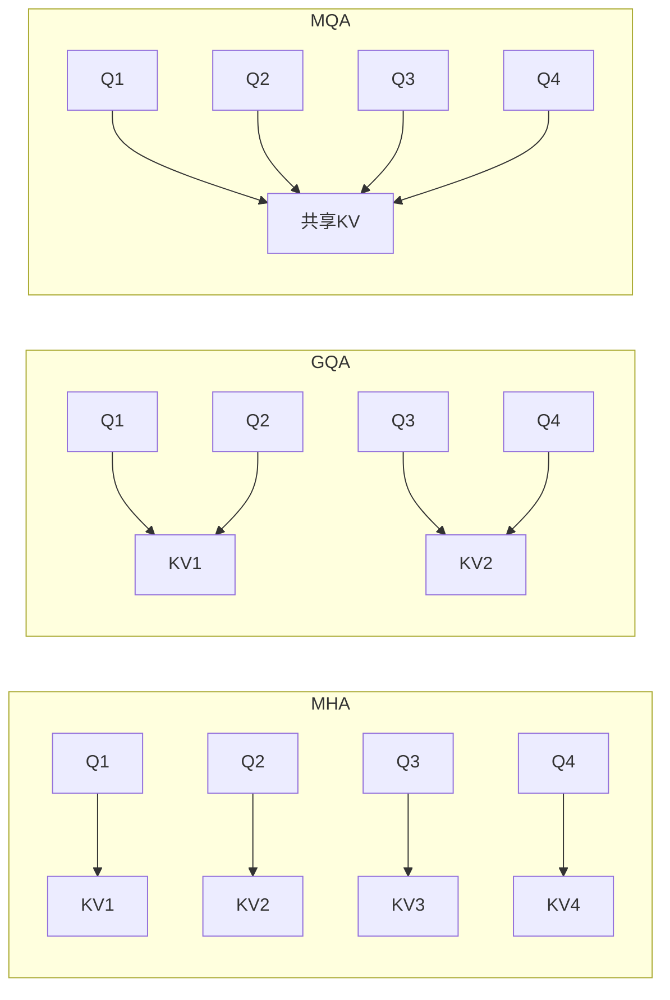
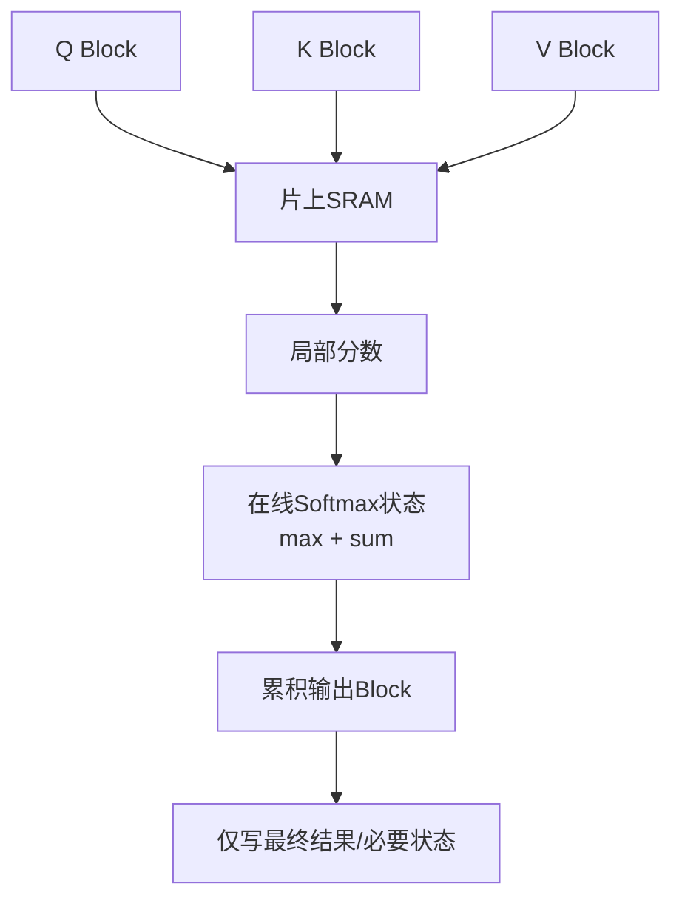

# 3. MHA、MQA、GQA 与 Flash Attention：结构和实现两类优化

- 原文：[多头注意力（MHA）有哪些局限？MQA、GQA、Flash Attention 怎么解决？](https://xiaolinnote.com/ai/llm/mha_mqa_gqa_flash_attention.html)
- 一句话结论：MHA/MQA/GQA 决定 Query Head 如何共享 K/V 参数和缓存；Flash Attention 在不改变 Attention 数学目标的前提下重排分块与访存。两类优化可以叠加。

## 1. 多头结构

设 Query Head 数为 $H_q$，KV Head 数为 $H_{kv}$：

- MHA：$H_{kv}=H_q$，每个 Query Head 有独立 K/V。
- MQA：$H_{kv}=1$，所有 Query Head 共享一套 K/V。
- GQA：$1<H_{kv}<H_q$ 且通常整除，组内共享 K/V。

GQA 是连续折中：$H_{kv}=H_q$ 退化为 MHA，$H_{kv}=1$ 退化为 MQA。表达能力差异必须按模型和任务评测，不能把网页中的固定“下降百分比”当普遍常数。

## 2. KV Cache 为什么推动 GQA

FP16/BF16 KV Cache 量级：

$$
M_{KV}=2\times B\times N\times L\times H_{kv}\times d_h\times bytes
$$

其中 2 表示 K 和 V。将 KV Head 从 32 降到 8，其他条件相同，缓存理论上降为 $1/4$。它随序列、Batch、层数线性增长。

网页用 7B/32K 得到约 17GB 是某组架构参数的估算，不适用于所有“7B”。应读取模型配置中的层数、KV Heads、Head Dim、dtype，并考虑分页、量化和框架元数据。

## 3. Flash Attention 优化什么

标准实现把完整分数矩阵和 Softmax 中间结果写到 HBM。Flash Attention 将 Q/K/V 分块放入片上 SRAM，通过 Online Softmax 维护每行最大值和归一化和，避免物化完整 $N\times N$ 中间矩阵。

它是 **IO-aware exact attention**：理论算术复杂度仍是 $O(N^2d)$，但中间激活内存从平方级显著下降，HBM 访问减少。浮点计算顺序不同会产生末位差异。“速度提升 2-4 倍”取决于 GPU、形状、dtype、Mask、版本与 Kernel，不能作为保证。

## 4. 训练和推理痛点要分开

- 训练 Prefill：完整序列并行，Attention 激活和反向传播显存突出，Flash Attention 价值大。
- 推理 Prefill：长 Prompt 仍做平方计算，可使用 Flash Attention。
- 自回归 Decode：每步只有一个/少量 Query，主要受权重与 KV 访存影响，GQA/MQA、Paged KV 和 Batch 调度更关键。

MQA/GQA 不会把标准 Attention 的 Prefill 计算从平方变线性；Flash Attention 也不会自动减少 KV Head 数。

## 5. 当前项目与参考实现

[run_day33_inference_acceleration_comparison.py](../run_day33_inference_acceleration_comparison.py) 比较 FP32、动态 INT8、Batch 和多 Engine 并发，但没有启用或对比 Flash Attention，也不读取 GQA 配置。因此不能把 Day33 报告当成这三种注意力方案的实测。

[llm_algorithms_reference.py](examples/llm_algorithms_reference.py) 提供：

- `kv_head_assignment(4, 4/2/1)` 可视化 MHA/GQA/MQA 映射。
- `estimate_kv_cache_bytes` 按真实 $H_{kv}$ 估算缓存。
- `scaled_dot_product_attention` 给出标准结果基线。

参考模块没有 CUDA/SRAM，无法实现真正 Flash Attention；生产应使用 PyTorch SDPA、FlashAttention 库或推理框架 Kernel。

## 6. 模拟面试

**Q1：GQA 和 Flash Attention 是替代关系吗？**  
A：不是。GQA 改 KV Head 结构，Flash Attention 改计算与访存实现，可以同时使用。

**Q2：MQA 为什么省 KV Cache？**  
A：所有 Query Heads 只缓存一套 K/V，缓存中 $H_{kv}$ 从 $H_q$ 变为 1。

**Q3：Flash Attention 把计算复杂度降到 $O(N)$ 吗？**  
A：没有，标准稠密 Attention 算术仍为平方级；主要降低中间内存和 HBM IO。

**Q4：为什么 Decode 常是 memory-bound？**  
A：每步只处理少量 token，却要读取大量模型权重和历史 KV，算术强度较低。

**Q5：GQA 是否必然无损？**  
A：不必然。质量取决于训练方式、KV Head 数、模型规模和任务，要用业务集验证。

**Q6：Day33 验证了 Flash Attention 吗？**  
A：没有，它验证的是模型模式、Batch 和并发的端到端耗时。

## 7. 复习清单

- 能写出 KV Cache 公式并使用 $H_{kv}$。
- 能区分结构优化、Kernel 优化和调度优化。
- 知道 Flash Attention 节省 IO 但不改变稠密计算阶数。
- 不引用固定加速/精度百分比作为普遍结论。