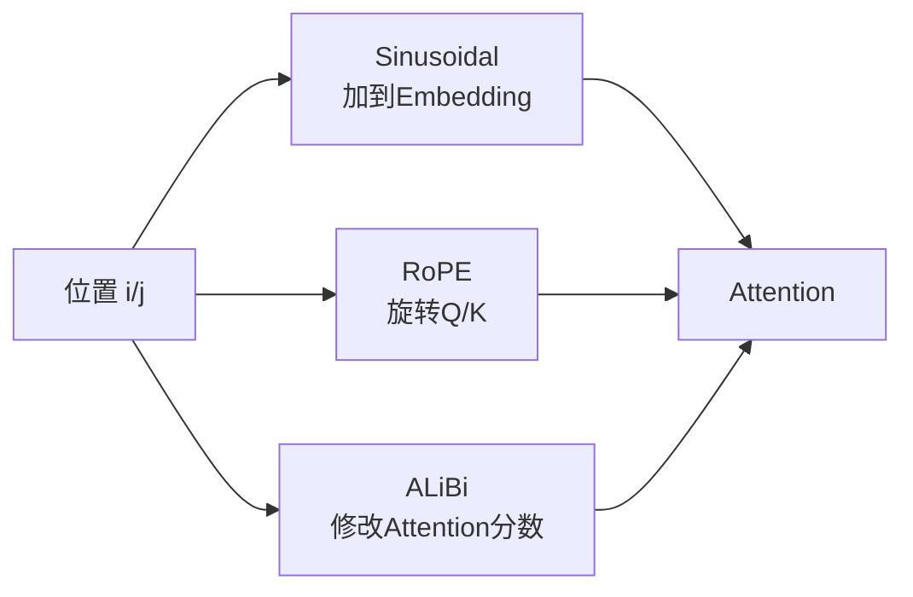

# 4. 位置编码：Sinusoidal、RoPE、ALiBi 与长上下文

- 原文：[大模型的位置编码是干什么用的？sin/cos、RoPE、ALiBi 有什么区别？](https://xiaolinnote.com/ai/llm/position_encoding.html)
- 一句话结论：无位置信息的 Self-Attention 对输入排列是置换等变的；Sinusoidal 将绝对位置加到表示，RoPE 旋转 Q/K 使点积带相对相位，ALiBi 在分数上加入距离偏置。长上下文能力仍取决于训练分布和扩展策略。

## 1. 为什么需要位置

Attention 根据内容相似度聚合，不自带“第几个 token”。若同时置换输入 token，输出也随之置换，模型无法仅凭内容区分语序。位置机制将顺序归纳偏置注入表示或分数。

网页说“我打你和你打我算出一样”是直觉化表达。更严格地说：没有位置编码时，Attention 是置换等变，不是所有位置的数值完全相同。

## 2. 三种方案

### Sinusoidal

$$
PE(pos,2i)=\sin\left(pos/10000^{2i/d}\right)
$$

$$
PE(pos,2i+1)=\cos\left(pos/10000^{2i/d}\right)
$$

固定向量加到 Token Embedding。它无可训练参数、可计算任意位置，但“公式可延长”不等于模型在未训练长度上仍可靠。

### RoPE

将 Q/K 的二维分量按位置 $m$ 旋转：

$$
R(m\theta)=\begin{bmatrix}\cos m\theta&-\sin m\theta\\\sin m\theta&\cos m\theta\end{bmatrix}
$$

旋转保持向量模长，且 $R(m)^\top R(n)=R(n-m)$，因此点积自然包含相对位置差。不同维度使用不同频率。

### ALiBi

对因果位置 $j\le i$：

$$
s_{ij}=\frac{q_i k_j^\top}{\sqrt{d_k}}-m_h(i-j)
$$

每个 Head 的斜率 $m_h$ 不同，远距离通常受到更大惩罚。它简单且不增加 Position Embedding，但局部偏置是否合适取决于任务。

## 3. RoPE 外推不是免费午餐

RoPE 原始频率在远超训练长度时会发生相位分布偏移，直接外推也会退化。Position Interpolation、NTK-aware Scaling、YaRN 等调整位置或频率，通常还配合长上下文继续训练。

因此“RoPE 天然可以从 2K 无损推到 100K”是错误的。上线需评测 Needle-in-a-Haystack、不同深度检索、多跳、排序、代码依赖和长文生成，而不只看最大可接受 token 数。

## 4. 当前项目与补充实现

项目使用的 SmolLM/Qwen 等模型由 Transformers 读取模型配置并执行其位置机制；[run_day31_sft_lora_light.py](../run_day31_sft_lora_light.py) 没有修改 RoPE 参数或做长上下文继续训练。

[llm_algorithms_reference.py](examples/llm_algorithms_reference.py) 中：

- `sinusoidal_position_encoding` 生成绝对位置向量。
- `apply_rope` 对二维分量逐对旋转，测试验证旋转前后二范数不变。
- `scaled_dot_product_attention(..., alibi_slope=...)` 在 Softmax 前施加线性距离偏置。

它只实现基本公式，不包含 RoPE Scaling、Head-specific ALiBi slope 生成或训练验证。

## 5. 与 KV Cache 的关系

RoPE 通常在 K 写入 Cache 前按其绝对位置旋转；新 Query 使用当前位置旋转，再与历史 K 点积。位置 ID、缓存截断和前缀复用必须一致，否则即使 token 相同也可能得到错误相位。位置方案与 GQA/Flash Attention 可以组合，但 Kernel 必须明确支持。

## 6. 模拟面试

**Q1：为什么普通 Attention 不知道语序？**  
A：其内容聚合对输入排列是置换等变，必须额外注入位置归纳偏置。

**Q2：RoPE 为什么表达相对位置？**  
A：位置相关旋转后的 Q/K 点积包含旋转角差，角差只依赖 $m-n$。

**Q3：RoPE 会改变向量模长吗？**  
A：理想数学旋转不会，只改变方向；有限精度会有极小数值误差。

**Q4：ALiBi 是 Position Embedding 吗？**  
A：它不生成要加到 Embedding 的向量，而是在 Attention logits 上加 Head-specific 距离偏置。

**Q5：训练 2K 后改一个 RoPE 参数就能稳定支持 100K 吗？**  
A：不能保证，通常需要合适 Scaling、长上下文训练/校准和专项评测。

**Q6：当前项目验证过长上下文外推吗？**  
A：没有，现有 SFT 最大长度默认 512，且未修改位置配置。

## 7. 复习清单

- 能写 Sinusoidal、旋转矩阵和 ALiBi 分数。
- 能用置换等变准确解释“位置盲”。
- 不把 RoPE 外推描述成天然无损。
- 知道位置 ID 必须与 KV Cache 一致。